# Mathbreakers: Glitch Rally — Game Architecture

**Status:** Released six-checkpoint reviewed-SLM vertical slice, dependency-free runtime, and complete offline content pipeline
**Audience:** Sixth-grade learners
**Delivery:** Static, single-player web game with no paid runtime service

## 1. Architectural goal

Glitch Rally turns reviewed output from the final distractor SLM into the core game
mechanic. The model proposes three convincing wrong answers, their misconception labels,
and their question-specific computations. Trusted game content supplies the question,
correct answer, and repair proof. The browser never runs the model and never decides
mathematical truth.

The authoring and gameplay boundaries are deliberately separate. Generation can fail,
be retried, or be rejected without interrupting a player's run or exposing raw output.

| Concern | Current decision |
|---|---|
| Canonical runtime | Dependency-free browser ES modules, HTML, and CSS in `game/prototype/` |
| Game logic | Pure encounter and run reducers in `game/prototype/encounter.js` |
| Rendering | Escaped HTML templates in `game/prototype/render.js` |
| Runtime content | Six-encounter `glitch-rally-v1` reviewed pack by default; three hand-authored fixtures at direct `/prototype/` |
| SLM | `unsloth/Qwen3-4B-bnb-4bit` plus `j2ampn/qwen3-4b-distractor-lora-v7`, offline only |
| Persistence | In-memory run state; no account or cloud profile |
| Hosting | `game/dist/` on any free static host, including GitHub Pages |
| Runtime cost | Zero |

There is no React application in the repository, and a React port is optional rather
than the current production plan. The canonical `npm run build` invokes a small
dependency-free Node static builder, not Vite. The remaining Vite/React/TypeScript
configuration and dependency declarations are exploratory scaffolding. Any later port
must preserve the content and reducer behavior described here.

## 2. End-to-end topology

```mermaid
flowchart LR
    subgraph Authoring["Offline authoring boundary"]
        Q["60 trusted grade-six questions"] --> B["Verified Colab bundle"]
        B --> M["Pinned Qwen3-4B + v7.1 adapter"]
        M --> R["Raw candidates + run manifest"]
        R --> V["Fail-closed deterministic validation"]
        V --> H["Hash-bound owner review"]
        H --> E["Sanitized pack export"]
    end

    subgraph Runtime["Static browser boundary"]
        E --> L["Strict approved-pack loader"]
        L --> S["Pure run and encounter reducers"]
        S --> W["View model"]
        W --> U["Escaped HTML + papercraft CSS UI"]
    end
```



Only the sanitized pack crosses the boundary. Raw responses, rejected candidates,
validation reports, review notes, reviewer aliases, model weights, credentials, and the
frozen research holdout do not belong in the static game.

## 3. Static browser runtime

The executable lives in `game/prototype/` and uses browser-native modules plus Node's
built-in test runner. `game/index.html` redirects to it with the released
`glitch-rally-v1` pack selected. It requires no application
server, package install, framework bundle, remote font, model download, API, database,
authentication, analytics, or third-party embed. A small static file server is needed
only because browsers apply module and fetch restrictions to `file://` pages.

The runtime is split into narrow layers:

- `content.js` validates prototype fixtures and strictly loads approved Python exports;
- `bootstrap.js` maps an explicit pack ID to one same-origin release file and fails
  closed if it cannot be fetched and verified;
- `encounter.js` owns pure encounter and whole-run state transitions;
- `view-model.js` derives display state and deterministic option ordering;
- `render.js` escapes every content value before producing markup;
- `runtime-effects.js` derives commit-only motion, focus targets, and live announcements;
- `app.js` boots the chosen source, binds native-button events, renders, and restores
  useful keyboard focus;
- `styles.css` supplies the responsive papercraft stage and reduced-motion behavior.

The direct three-checkpoint `/prototype/` run uses explicitly labeled hand-authored
fixtures from `sample-encounter.js`. They demonstrate fractions, decimals, and negative
numbers, but they are not SLM output and cannot pass as production-approved content.
The root launch instead selects the six checked-in, owner-reviewed SLM encounters from
`game/content/packs/glitch-rally-v1.json`.

`loadApprovedPack` is the separate release boundary. It accepts the exact Python export
shape, rejects extra or missing nested fields, verifies cross-record references and the
fixed holdout assertion, recomputes the canonical SHA-256 content hash with Web Crypto,
and deeply freezes the resulting encounters. This browser check is defense in depth; it
does not replace offline validation or owner review.

Startup makes the content source explicit:

- `/` redirects to `/prototype/?pack=glitch-rally-v1`, the reviewed SLM release;
- `/prototype/` starts only the clearly labeled hand-authored fixtures and performs no
  pack fetch;
- `/prototype/?pack=glitch-rally-v1` maps the narrow pack ID to the same-origin
  `game/content/packs/glitch-rally-v1.json` file;
- a selected pack must return directly as JSON, stay under the size limit, and pass
  `loadApprovedPack`;
- a missing, redirected, malformed, oversized, stale, or unverified selected pack shows
  a safe stop screen. It never silently falls back to prototype content.

Only the exact encounter objects returned by `loadApprovedPack` receive the in-memory
verified brand used by the view model. Setting `contentStatus: "approved"` on a clone or
fixture cannot trigger reviewed-SLM labels. Verified encounters visibly identify the
Glitch Forge as reviewed SLM content with **Glitch Forge · reviewed SLM**, **Reviewed
SLM run complete**, and **SLM-powered checkpoint** copy; prototype encounters retain
the non-SLM notice.

After commitment, every answer gate gains an explicit **True route** or **Counterfeit
route** label. Stage summaries move through **Routes open**, **Glitch engaged**, **Road
repaired**, and **Rally secured**; the UI does not use decorative “stability” points that
could imply a false score. A visual four-lane fork mirrors the same deterministically
ordered gates, and route commitment carries the car toward the lane the player actually
selected, while all nine canonical Glitch families receive stable vehicle accents.
Those road and vehicle details are decorative; the readable labels and summaries carry
the meaning.

Generated text is treated only as bounded display data and is HTML-escaped. The current
runtime renders plain readable math text; it does not use React, KaTeX, or
`dangerouslySetInnerHTML`.

## 4. Offline Glitch Forge

The Glitch Forge is fully implemented as an authoring pipeline. It never runs in a
child's browser.

### 4.1 Trusted source bank

`data/game/questions_v1.jsonl` contains 60 original sixth-grade Number questions. Each
record includes a stable `GR-NUM-*` ID, question, independently trusted correct answer,
topic, difficulty, visual tool, solver inputs, and trusted steps. The SLM is never the
authority for a question, correct answer, or repair proof.

Before generation, `src.game_content_cli prepare-batch` validates the entire bank against
the exact ordered 140-row frozen holdout receipt:

```text
record count: 140
SHA-256: 47ce1e1b85ebaae0782f0aed32fa12bb6ec0fd4498ed71c75cf3e4aff5135693
```

It rejects exact and near-duplicate holdout questions. An empty, truncated, reordered,
or substituted holdout cannot satisfy the receipt.

### 4.2 Verified generation

`src.game_colab_bundle` creates the upload bundle used by
`notebooks/generate_game_candidates_colab.ipynb`. The bundle and notebook bind generation
to:

- the final base model and adapter at resolved 40-character Hugging Face revisions;
- hashes of the bundled generator and Colab backend sources;
- deterministic decoding (`do_sample: false`, `max_new_tokens: 512`, thinking disabled);
- the validated question-batch hash and exact holdout receipt.

The backend loads the model once, resumes only from a valid matching checkpoint, writes
atomically after each question, and produces both raw candidate JSONL and a run manifest.
The manifest binds the output hash, source batch, code, models, and generation settings.

### 4.3 Fail-closed validation

`src.game_content_cli validate-candidates` revalidates the source bank and run manifest,
then rejects any candidate that violates the strict contract. The gate includes:

- strict JSON with duplicate-key, Unicode/control-character, and unexpected-field
  rejection;
- exactly three distinct counterfeits and misconception labels;
- no counterfeit numerically equivalent to the trusted answer;
- computation-to-answer binding through a bounded arithmetic evaluator;
- question grounding, supported operators, text bounds, and stable identities;
- pinned model, adapter, prompt, code, run-manifest, and holdout provenance.

Unsupported or ambiguous arithmetic fails closed. Validation reports issues; it never
repairs raw model output or partially promotes a candidate. These game-side gates do not
alter the research model or its frozen-holdout results.

### 4.4 Single-source owner review

`create-review-queue` creates one immutable review payload and one editable decision per
automatically valid candidate. `apply-reviews` accepts a decision only when it remains
bound to the candidate, validation, trusted question, and review-payload hashes.

Approval requires explicit confirmation of all four trusted assertions—question,
answer, repair steps, and holdout origin—plus a per-distractor semantic and age check,
one canonical Glitch family, and authored repair copy. Editing an approved source or
payload invalidates the decision. Rejected records and notes remain authoring artifacts.

### 4.5 Sanitized export

`export-pack` reruns the trust checks and emits a deterministic camelCase browser pack.
The export contains only approved gameplay data and non-personal reproducibility
metadata. It excludes raw responses, reviewer identity, review notes, local paths, and
secrets. Work products stay in gitignored `data/game/work/`; only an exported pack may
enter `game/content/packs/`.

## 5. Approved pack contract

The top-level release record includes:

- `schemaVersion`, `packVersion`, `createdAt`, and `validatorVersion`;
- `contentOrigin` and `questionBankSha256`;
- the exact `holdoutAssertion`;
- ordered `encounterIds`, `encounterCount`, and `encounters`;
- the fixed `glitchFamilies` registry;
- a canonical `contentHash` over the rest of the pack.

Each encounter includes trusted metadata and question content, exactly three
counterfeits, exactly three one-to-one repair choices, a `featuredCounterfeitId`, and
sanitized provenance. Both `contentStatus` and `reviewStatus` must be `approved`.

`featuredCounterfeitId` is important gameplay data. If a player chooses the correct
route, the reducer reveals that reviewed featured counterfeit—not whichever counterfeit
happens to appear first. If a player chooses a wrong route, that exact counterfeit is
revealed.

The pack hash detects stale or accidental mutation inside a trusted workspace. It is an
integrity receipt, not a digital signature and not protection against an adversary able
to rewrite both content and its unkeyed hashes.

The first release is `glitch-rally-v1`, created `2026-07-11T15:13:47Z`, with these
ordered encounters:

```text
GR-NUM-010, GR-NUM-018, GR-NUM-024,
GR-NUM-036, GR-NUM-037, GR-NUM-055
```

Its source-bank receipt is
`626565ab322b9b0e4514c39c8df1743a39b44959c0b2e337778147855166ba38`; its content
receipt is
`pack:v1:940fa8804c1376bd1bfe792348f2195d49b94ffe1ac3e7dd26b67ad4f1e532cb`.
All six encounters bind the base revision
`cad0bedfdd862093a12af478cb974ab2addd0e0a` and adapter revision
`dd30dcea2755b7a2659faa908714e31335349408`. The frozen holdout remains excluded with
the exact 140-record receipt documented above.

## 6. State and progression

`game/prototype/encounter.js` is the sole gameplay authority. Its functions are pure and
have no timers, DOM access, storage, randomness, or network calls.

An encounter moves through:

```text
choose → counterbreak → resolved
```

- `SELECT_ANSWER` records a valid selection without revealing correctness.
- `COMMIT_ANSWER` does nothing without a selection. A wrong choice reveals that exact
  counterfeit; a correct choice earns Proof Boost and reveals
  `featuredCounterfeitId`.
- `SELECT_REPAIR` records a valid repair selection.
- `COMMIT_REPAIR` increments attempts. A mismatched repair stays in Counterbreak; the
  matching repair resolves the encounter.
- `RESET` creates a clean encounter state.

The run reducer advances only from a resolved encounter, banks Proof Boost and repair
attempt totals once, completes after the final checkpoint, and supports a clean replay.
UI animation is derived from state and never determines correctness or advancement.

Answer and repair choices use stable ID-based permutations rather than source position.
The correct answer, correct repair, and featured counterfeit therefore do not gain a
consistent positional tell.

## 7. Repository layout

```text
diagnostic-distractor-slm/
├── GAME_DESIGN.md
├── GAME_ARCHITECTURE.md
├── data/
│   ├── processed/eval_heldout.jsonl       frozen research holdout; read offline only
│   └── game/
│       ├── questions_v1.jsonl             60 original trusted questions
│       ├── README.md
│       └── work/                           gitignored raw/review workspace
├── notebooks/
│   └── generate_game_candidates_colab.ipynb
├── src/
│   ├── game_candidate_generation.py       resumable deterministic generator
│   ├── game_colab_backend.py              pinned Unsloth backend
│   ├── game_colab_bundle.py               verified upload bundle
│   ├── game_content.py                    validation, review, and export contracts
│   └── game_content_cli.py                authoring command line
├── tests/                                  Python trust-pipeline tests
└── game/
    ├── index.html                          static redirect to the executable
    ├── README.md
    ├── build-static.mjs                    dependency-free release artifact builder
    ├── build-static.test.js
    ├── content/packs/                      sanitized releases only
    └── prototype/
        ├── index.html
        ├── app.js                          boot, DOM binding, render, and focus
        ├── bootstrap.js                    explicit pack selection and fail-closed fetch
        ├── runtime-effects.js              motion, focus, and announcement effects
        ├── encounter.js                    encounter and run reducers
        ├── view-model.js                   deterministic presentation model
        ├── render.js                       escaped markup renderer
        ├── content.js                      fixture and approved-pack trust boundaries
        ├── sample-encounter.js             three non-release fixtures
        ├── styles.css
        └── *.test.js                       Node unit and integration tests
```

`game/package.json` exposes the canonical dependency-free build and Node test commands.
Its Vite development scripts and React/KaTeX/Zod declarations, along with
`game/vite.config.ts`, `game/tsconfig.json`, and `game/src/test/setup.ts`, are unused
framework-era scaffolding. They do not imply that a React source tree or Vite build
exists.

## 8. Deployment and verification

`npm run build` uses only Node built-ins to assemble `game/dist/` atomically. It copies
the root redirect, the exact runtime module/asset allowlist, and release-directory JSON
whose filenames satisfy the public pack-ID contract; it excludes tests, test-only
fixtures, source tools, and authoring artifacts. Pack content is still verified by the
browser loader at boot. A free static host publishes `game/dist/`, and a rollback
republishes the previous artifact. There are no runtime secrets, and model or Hugging
Face availability cannot affect a loaded run.

The root URL opens `prototype/?pack=glitch-rally-v1`. Direct `/prototype/` intentionally
remains the illustrative hand-authored fixture. An explicit approved-pack request that
fails any fetch or trust check stops safely instead of substituting fixture content.

The earlier handoff baseline was **81 Python tests and 66 Node tests**. The 2026-07-11
convergence run passed **81/81 Python tests** and **110/110 Node tests**: 101
prototype/runtime tests plus nine static-builder tests, including nested filename cases.
These numbers are verification snapshots, not immutable test-count requirements; fresh
commands and zero failures are the release criterion.

That same automated gate produced ten runtime files plus one verified pack, parsed every
built JavaScript file successfully, compiled all seven executable Python notebook cells
(skipping one intentional Colab magic cell), loaded and deeply froze the actual release
pack, rejected a tampered copy, and passed `git diff --check`. A pure six-encounter audit
covered six correct routes, 18 counterfeit routes, and 72 repair branches. Its run totals
were 6 Proof Boosts / 6 Patch Cannon attempts for all-correct choices, 0 / 6 for
all-counterfeit choices, and 3 / 9 for the mixed route.

The final privacy/offline audit also passed: 54/54 focused security tests succeeded;
source and built packs were semantically identical; all module imports were relative;
the only runtime fetch was the same-origin pack request; and the artifact contained no
external URLs, telemetry, storage, remote assets, credentials, reviewer data, raw model
responses, or rejected candidate IDs.

Automated tests, the static responsive-rule audit, and the pure playthrough simulation do
not replace visual QA. The in-app browser connected successfully, but sandbox localhost
binding/escalation failed and direct `file://` navigation was rejected by browser URL
policy. The game therefore could not be served to that browser, so Wave 4 still needs a
real-browser check of desktop, tablet, and 320-pixel layouts; a complete six-checkpoint
run; keyboard focus; reduced and forced color modes; screenshots; animations; and console
output. No dynamic browser-QA result or screenshot is claimed by this documentation
update.

## 9. Accessibility, safety, and privacy

- Choices and actions use native buttons with visible keyboard focus.
- Targets are at least 44 pixels, with larger compact-layout targets.
- State uses text, shape, and iconography in addition to color.
- Choices remain neutral before explicit commitment.
- Status updates use a restrained live region and focus is deliberately restored after
  phase changes.
- `prefers-reduced-motion` removes travel, shake, scenery loops, and unfolding while
  preserving state meaning.
- There is no default timer or reading penalty.
- Feedback describes a mathematical strategy, never the child's ability or identity.
- One answer is evidence for one interaction, not a permanent learner diagnosis.
- There are no accounts, ads, trackers, analytics, chat, free-text collection, payments,
  or third-party embeds.

## 10. Current release boundary

The first content release has crossed the offline boundary: nineteen automatically valid
candidates received explicit decisions, six approved candidates were exported, and the
sanitized `glitch-rally-v1` pack is checked in. The root entrypoint selects that pack;
the direct prototype route continues to identify its three fixtures as hand-authored and
never implies that they came from the SLM.

Automated convergence and the final privacy/offline/repository-scope audit against these
exact bytes are complete. The only remaining release work is the blocked real-browser QA
pass. Future packs must repeat the same pinned generation, deterministic validation,
explicit review, sanitized export, static build, and browser-verification sequence.

Live generation, if ever added, remains behind the same validation and human-review
boundary. Raw output must never block a race or appear directly in a child's browser.
