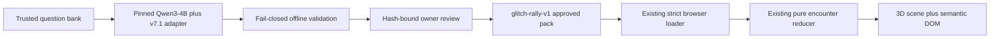
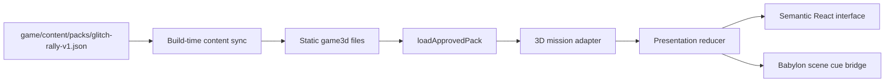

# Mathbreakers: Glitch Convoy — FINAL Product Implementation Plan

> **For agentic workers:** REQUIRED SUB-SKILL: Use superpowers:subagent-driven-development (recommended) or superpowers:executing-plans to implement this plan task-by-task. Steps use checkbox (`- [ ]`) syntax for tracking.

**Goal:** Build a polished, six-to-eight-minute desktop-browser 3D vertical slice in which reviewed output from the specialized Qwen3-4B distractor model becomes physically readable enemy behavior, the player repairs that reasoning with a nonlethal rover tool, and the final boss visibly reflects the Glitches encountered during the run.

**Architecture:** Preserve the released static `game/` experience and build a separate `game3d/` React/TypeScript/Babylon.js client. The first release loads the existing owner-reviewed `glitch-rally-v1` pack, reuses its strict validation and pure encounter logic, and requires no backend, runtime model, account, installer, or paid service. An owner-only `live-forge` extension may be added after the reviewed 3D slice passes its product, accessibility, and performance gates; every live failure falls back to reviewed content.

**Tech Stack:** React 19, TypeScript, Vite, Babylon.js, semantic HTML, optional bundled KaTeX, Vitest, Playwright, the existing browser-native approved-pack validator and reducers, Blender, glTF 2.0/GLB metallic-roughness PBR, KTX2/Basis textures, and an optional post-MVP Python/FastAPI plus local MLX/GGUF or CUDA worker.

## Global Constraints

- This file is the authoritative product and implementation plan. Where it conflicts with `docs/superpowers/plans/2026-07-11-live-adaptive-glitch-convoy.md`, `docs/superpowers/plans/2026-07-11-counterfeit-protocol-unity-product.md`, `docs/GLITCH_CONVOY_3D_ASSET_BRIEF.md`, or `docs/COUNTERFEIT_PROTOCOL_3D_ASSET_BRIEF.md`, this file wins.
- Preserve the current `game/` static release, its six approved encounters, its content hashes, and its tests. Build the new presentation under `game3d/`.
- The first shippable product is a static reviewed-content showcase. It must remain fully playable when every AI service and local model is unavailable.
- Unity, a desktop installer, packaged Python, bundled `llama.cpp`, redistributed model weights, Redis, public live inference, and Sonnet are outside the first release.
- Target modern gaming PCs and Apple Silicon MacBooks through current desktop Chrome, Edge, and Safari. WebGL2 is the required rendering baseline; WebGPU may enhance rendering but may not be required.
- Mobile phones, tablets, Chromebooks, and low-end integrated graphics are not guaranteed targets for this slice.
- The first run uses only owner-reviewed content already present in `game/content/packs/glitch-rally-v1.json`. Raw or rejected model output never reaches the client.
- The frozen 140-question research holdout remains excluded from gameplay, prompts, fallbacks, tests, and caches. Its fixed receipt remains `47ce1e1b85ebaae0782f0aed32fa12bb6ec0fd4498ed71c75cf3e4aff5135693`.
- The browser never receives model credentials, provider credentials, raw generation output, review notes, or learner-identifying data.
- A selected wrong answer is evidence about one choice in one run. The game never assigns a learner identity, diagnosis, ability label, or permanent misconception profile.
- Reading and mathematics have no default timer. Combat cannot damage or interrupt the player while the question or repair interface has focus.
- Wrong answers never remove mission progress, base rewards, access to help, or the ability to finish the run.
- Correct and wrong branches receive comparable audiovisual production value. Correct play is faster and earns a temporary Proof Boost; wrong play provides a recoverable teaching sequence without granting superior permanent rewards.
- All four answer conduits are mechanically and perceptually neutral before commitment: identical geometry, scale, distance, lighting, animation, material intensity, sound, and accessible naming.
- All readable questions, answers, computations, repair choices, and feedback live in semantic DOM. Three-dimensional screens and labels reinforce the decision but never replace the accessible interface.
- Enemy targets are nonhuman machines. The rover uses repair energy, EMP, scanning, and infrastructure tools rather than realistic firearms or gore.
- Runtime art must be original, user-provided, or commercially redistributable with source, author, license, modification, and attribution recorded in `game3d/ASSET_LICENSES.md`.
- Final art production begins only after a primitive graybox completes one correct branch and one wrong-and-repaired branch.
- Do not claim educational effectiveness, stable diagnosis, broad curriculum coverage, or general superiority over a larger language model.
- No implementation, dependency installation, download, commit, push, or deployment is authorized by the existence of this plan alone.

---

## 1. Decision Record — 2026-07-11

### Locked product decision

Build **Mathbreakers: Glitch Convoy** as a Babylon.js desktop-browser experience. Use **The Counterfeit Protocol** as the in-world sabotage system and mission name rather than as a second product.

The owner expressed no engine preference, accepts modern gaming computers and MacBooks as the target, does not require live generation for every public player, has limited implementation time, and prefers the easiest practical path. The browser-first reviewed-content slice best satisfies those constraints because the repository already contains a released web game and a complete offline content pipeline, while no Unity project or 3D client exists.

### Why this is the easiest viable direction

- A static URL or local browser build needs no installer, signing certificate, model redistribution audit, packaged Python service, platform-specific sidecar, or clean-machine launcher.
- The six owner-reviewed Qwen encounters already provide authentic SLM-generated gameplay content with deterministic validation and provenance.
- Existing pure reducers and the strict approved-pack loader can be reused instead of rebuilding mathematical truth, option ordering, repair mapping, and run completion.
- Babylon.js keeps all scene construction and behavior in reviewable source code and consumes the same portable GLB assets that a later client could reuse.
- A modern-computer target permits a richer scene than the earlier Chromebook goal without accepting desktop packaging complexity.
- The most important uncertainty is whether choosing, seeing, and repairing a misconception is fun and understandable. A reviewed graybox tests that uncertainty before live inference or final models consume the schedule.

### What survives from each proposal

From Glitch Convoy:

- browser delivery;
- the convoy route and short-run structure;
- the Proof Circuit connecting road, answer, enemy, and repair tool;
- the selected counterfeit becoming a recognizable Glitch;
- a boss assembled from Glitches observed during the run;
- accessible screen-space mathematics;
- Blender source and GLB runtime assets.

From Counterfeit Protocol:

- a civilian hover-repair rover with a nonlethal Pulse Lance;
- the opening Logic Core and four equal answer conduits;
- one modular drone chassis with misconception attachments;
- code-driven pivots and explicit sockets;
- a compact relay complex rather than an open world;
- Nia as an authored radio operator, avoiding a modeled human;
- rigorous art, collision, provenance, and performance gates.

### Staged product ladder

| Stage | Product | Required infrastructure | Status needed to advance |
|---|---|---|---|
| 1 | `reviewed-showcase` | Static browser files and approved pack | Required first release |
| 2 | `developer-replay` | Local development build and recorded branch fixtures | Required for QA and demonstrations |
| 3 | `live-forge` | Manually started local API and local/CUDA model worker | Optional owner-only extension |
| 4 | broader public product | Separate product decision, distribution plan, curriculum plan, and user research | Explicitly outside this plan |

Stages are sequential. Do not build two clients or two inference deployment paths in parallel.

---

## 2. Product Definition

### Product name

**Mathbreakers: Glitch Convoy**

### Mission and system name

**The Counterfeit Protocol** is the corrupted relay procedure that accepts plausible false calculations as valid power routes. Nia sends the player to shut it down.

### One-sentence pitch

**A specialized small model forged the wrong answers; exact checks verified them; now the player must recognize and physically repair the reasoning.**

### Player-facing fantasy

The player is a field mechanic piloting the **Proofrunner R-6**, a compact civilian hover rover equipped with a Pulse Lance. A solar relay in a desert canyon has activated the Counterfeit Protocol. Its Logic Cores route power through one trusted answer and three plausible counterfeits. Each counterfeit can reconfigure a maintenance drone into a Glitch whose shield, movement, and attack reenact that faulty computation.

The player does not defeat ignorance or punish a learner. They diagnose a machine route, recognize its visible tell, select a repair strategy, and reconnect the infrastructure.

### Primary audience

1. Portfolio and hiring reviewers evaluating the SLM, validation system, 3D engineering, and product judgment.
2. Learning-technology researchers, educators, and curriculum designers evaluating misconception visualization.
3. Supervised players around grade six who can provide usability and engagement feedback.

This slice is a portfolio-quality learning-game experiment. It is not yet a classroom platform, a validated intervention, or a mass-market PC game.

### Success definition

The first product succeeds when:

- a new player can start and finish a run in six to eight minutes;
- the complete run works offline after its static files are loaded;
- the player can describe at least one Glitch's faulty strategy and the corresponding repair;
- a reviewer can trace one approved Qwen distractor from answer to computation, Glitch family, repair, and provenance;
- both a correct-first run and a wrong-then-repaired run feel complete and visually rewarding;
- keyboard and controller users can finish without pointer-only actions;
- the representative scene meets the performance budgets in Section 13;
- no raw generation, secret, learner identity, or research holdout content enters the build.

### Honest public claims

The reviewed release may say:

> “A specialized 4B model generated the misconception-linked counterfeits in this run. Exact checks and owner review verified them before release, and each counterfeit drives a distinct 3D repair encounter.”

Only an owner demonstration that actually serves a newly verified bundle may say:

> “This encounter was generated live by the specialized 4B model and passed the executable product gate before it entered the game.”

The product must not claim that the SLM beats Sonnet generally, diagnoses a child, proves learning gains, or dynamically generates every public encounter.

---

## 3. Design Pillars

1. **Reasoning becomes machinery.** The answer, computation, misconception family, enemy module, motion tell, and repair strategy form one causal chain.
2. **Math remains the action.** The Logic Core, conduits, Proof Circuit, drone behavior, and Pulse Lance all express the mathematical decision rather than surrounding an unrelated quiz.
3. **A mistake creates a comeback.** Wrong choices reveal useful evidence and a repair path; they never end the run or reduce permanent rewards.
4. **Correct play remains exciting.** A correct route triggers the largest Verified Surge, restores infrastructure immediately, preserves Proof Boost, and still exposes a featured counterfeit pursuit so the player sees the core technology.
5. **The world is small and intentional.** One polished route, one rover, one core kit, one drone kit, and one modular boss are stronger than a thin open world.
6. **The AI is visible but not authoritative.** Qwen supplies reviewed counterfeits; trusted code and owner review supply truth; authored content supplies the repair language.
7. **Accessibility is structural.** The DOM is authoritative for readable math, focus pauses simulation, and every visual meaning has a non-color cue.

---

## 4. The Complete Six-to-Eight-Minute Run

### 4.1 Title and readiness

The title screen offers **Start mission**, **Settings**, **How the Forge works**, and **Credits**. It labels the default content source as **Reviewed SLM encounters**. It does not show a fake live-generation indicator.

Settings expose master/music/effects volume, text size, high contrast, reduced motion, camera shake, combat assist, invert aim, and input remapping guidance. Settings persist locally; answers and misconception evidence do not.

### 4.2 Garage launch

The player selects one of three material-driven rover paint presets. The scene uses this short beat to finish asset loading and shader compilation. There is no cosmetic inventory, currency, or progression system.

Nia delivers one authored radio line:

> “The relay is accepting counterfeit calculations as power routes. Open each Logic Core, trace the false path, and patch the circuit.”

### 4.3 Guided traversal

The rover travels along a compact 120–150 meter relay route. Controls provide arcade steering, acceleration, braking, and boost, but an invisible corridor prevents leaving the authored route. The controller is kinematic and assisted; it is not a tire, suspension, or rigid-body simulation.

Driving lasts approximately 15–30 seconds between cores. It provides pacing, teaches the rover silhouette, and creates a natural loading window without making the player wait at a spinner.

### 4.4 Logic Core docking

At each checkpoint, immediate threats clear and the rover eases into a fixed docking mark. Engine audio loses high frequencies, the camera moves to the Core, enemy damage is disabled, and the DOM question panel receives focus.

Four identical conduit instances surround the Core. Their labels and in-world screens mirror the DOM options, but only the DOM is required to read or select an answer.

### 4.5 Neutral decision

The player may inspect the question, trusted world context, and four neutrally styled answers without a timer. Selection is reversible until **Lock conduit** is explicitly activated.

Before commitment:

- no answer uses success/failure colors;
- no conduit animates more strongly than another;
- no option order carries semantic meaning;
- no correctness or misconception metadata appears in the DOM, accessibility tree, scene graph names, or analytics;
- combat and route movement remain paused.

### 4.6 Commitment and branch

The player commits by pressing the primary action from the DOM or by aiming at the selected conduit and firing while Focus Mode is active. Both paths dispatch the same opaque answer ID.

**Correct route:**

- the Proof Circuit completes in cyan and green;
- the Core releases a large Verified Surge;
- a visible section of the relay powers on;
- Proof Boost remains active for the next drive;
- the encounter's reviewed `featuredCounterfeitId` launches as an intercepted pursuit drone, ensuring correct players still see and repair SLM-authored reasoning.

**Counterfeit route:**

- the exact selected computation travels through the circuit as an amber/oxide diversion;
- the matching modular attachment locks onto the drone;
- the road absorbs the initial boost, but the player loses no completion, cosmetic, or help access;
- Nia describes the event, not the learner: “That route shifted the place values. Trace the module and realign it.”

### 4.7 Glitch reveal and combat beat

The selected or featured counterfeit determines the drone attachment, shield arrangement, animation, computation trace, and authored repair prompt. The combat beat lasts approximately 15–25 seconds and has no health-based failure state.

The rover performs three readable actions:

1. evade or absorb one clearly telegraphed nonlethal pulse;
2. aim the Pulse Lance at the exposed misconception module;
3. hold the scan input long enough to freeze the computation trace for inspection.

Combat Assist may steer, aim, or complete all three actions. Assistance never changes the math question or rewards.

### 4.8 Counterbreak repair

The DOM presents three reviewed repair strategies in deterministic order. The player selects the strategy that addresses the revealed computation.

An incorrect repair remains a harmless attempt, adds one focused hint, and permits another choice. A correct repair charges the Pulse Lance, replaces the faulty step with the trusted reasoning, disconnects the Glitch attachment, and restores the circuit.

### 4.9 Responsive route

The reviewed showcase uses transparent, bounded responsiveness rather than claiming full adaptive instruction:

- Checkpoint 1 is `GR-NUM-024`, Adding and Subtracting Fractions.
- If the revealed family is `fraction_forger`, Checkpoint 2 is `GR-NUM-036`, Fractions of an Amount, which recalls the family in a different context.
- If the revealed family is `operation_swapper`, Checkpoint 2 is `GR-NUM-037`, Adding and Subtracting with Decimals, which contains an Operation Swapper branch.
- If Checkpoint 1 was correct, Checkpoint 2 is `GR-NUM-037`.
- Checkpoint 3 is `GR-NUM-055`, Adding and Subtracting Negative Numbers.

This is **family-responsive encounter selection**, not proof of mastery and not a same-skill diagnostic remediation system. The optional live-forge stage owns exact same-skill targeted follow-ups.

### 4.10 Counterfeit Convoy boss

The boss is assembled from the standard drone geometry at increased scale, duplicated shield segments, and at most two modules already revealed during the run. It introduces no unseen repair rule.

The boss has two short phases. Each phase repeats a familiar visual tell, lets the player scan the corresponding computation, and fires the already learned repair. An all-correct run uses the two featured counterfeits seen during pursuit sequences, preserving a complete boss without inventing a learner weakness.

### 4.11 Field report

The closing report shows:

- three completed checkpoints;
- first-choice outcomes without a punitive score;
- the Glitch families encountered;
- the computations that appeared;
- the repair strategies used;
- whether family-responsive routing occurred;
- content provenance: reviewed SLM, model and adapter IDs, validator version, owner-review status, and holdout exclusion;
- an optional **View alternate branches** reviewer control available only after the run.

The report uses phrases such as “This strategy appeared in the selected route” and never “You have this misconception.” All session evidence disappears on reset.

---

## 5. Locked Vertical-Slice Scope

### Required product content

- one title/settings/credits front door;
- one garage paint-selection beat;
- one compact canyon relay route;
- one guided arcade hover-rover controller;
- one authored Nia radio presentation with captions and no 3D human;
- three Logic Core decisions per run;
- one Logic Core model reused at each checkpoint;
- one conduit model instanced four times per Core;
- one modular drone chassis;
- four lightweight module presentations: Fraction Plates, Operator Dial, Decimal Rails/Place-Value projection, and Sign Vanes;
- two code-driven drone behaviors: ranged orbit and shield anchor;
- one boss composition built from the drone kit;
- one visible environment-restoration sequence;
- one Proof Circuit system shared across road, Core, conduits, drone, and rover;
- three rover paint presets;
- one mission report with provenance;
- reviewed and developer-replay modes;
- keyboard, mouse, and common-controller support;
- reduced-motion, high-contrast, text-size, camera-shake, and combat-assist settings.

### Approved encounter source

The default run consumes these records from the existing reviewed pack:

| ID | Topic | Product use |
|---|---|---|
| `GR-NUM-024` | Adding and Subtracting Fractions | Fixed first checkpoint |
| `GR-NUM-036` | Fractions of an Amount | Fraction Forger response branch |
| `GR-NUM-037` | Adding and Subtracting with Decimals | Default or Operation Swapper response branch |
| `GR-NUM-055` | Adding and Subtracting Negative Numbers | Fixed third checkpoint |

`GR-NUM-010` and `GR-NUM-018` remain approved replay candidates but require no unique 3D module in the first release.

### Explicit exclusions

- Unity or a second 3D client;
- open world, procedural levels, traffic, crowds, multiple districts, or branching road geometry;
- realistic vehicle simulation, wheel colliders, deformable terrain, vehicle destruction, fuel, or crafting;
- on-foot movement or a second player controller;
- player health, lives, fail screens, grinding, XP, currencies, loot, or a garage economy;
- multiple player vehicles;
- a separate boss mesh or boss rig;
- modeled human characters, facial animation, lip sync, open-ended NPC chat, voice input, or learner free text;
- multiplayer, leaderboards, accounts, cloud saves, analytics, teacher dashboards, or longitudinal learner profiles;
- public live Qwen, public Sonnet, public GPU hosting, packaged local inference, or model-weight redistribution;
- final art for all nine approved Glitch families;
- skills beyond the existing reviewed pack in the first release;
- mobile and Chromebook optimization;
- classroom purchasing, curriculum-completeness, or learning-efficacy claims.

---

## 6. Learning, Content, and Model Boundaries

### Reviewed showcase truth path



The reviewed product adds no new mathematical authority. It reuses the already released pack and the following invariants:

- one trusted question and correct answer;
- exactly three distinct counterfeit answers;
- no counterfeit numerically equivalent to the correct answer;
- each counterfeit has a grounded computation ending in its answer;
- each counterfeit maps to one approved Glitch family and one reviewed repair;
- source question, model, adapter, generator, validator, review, and holdout receipts remain bound to the encounter;
- unapproved clones cannot acquire the loader's in-memory verified brand.

### SLM role

| Reviewed SLM field | 3D expression |
|---|---|
| Counterfeit answer | Answer conduit label and claimed machine result |
| Misconception text | Bounded post-commit explanation |
| Computation | Proof Circuit trace and scan readout |
| `glitchFamilyId` | Drone module, motion tell, shield pattern, and sound cue |
| Repair ID and explanation | Counterbreak option and Pulse Lance repair sequence |
| Provenance | Counterfeit Report and reviewer panel |

The model does not create the trusted question, correct answer, scoring, progression, or authoritative feedback.

### Evidence policy

The client may retain these values only for the current in-memory run:

- encounter ID;
- selected opaque answer ID;
- first-choice correct boolean;
- revealed family ID;
- repair attempts;
- help/combat-assist use;
- completion state.

Only visual and control settings enter `localStorage`. Resetting or reloading clears answer evidence.

### Known generation evidence

Engineering documentation must continue to state the current measured baseline honestly:

- approximately 12 seconds per item on the completed T4 run;
- 19 of 60 automatic survivors;
- 6 of 60 owner-approved releases.

The reviewed showcase does not convert those figures into a live-generation reliability claim.

---

## 7. Runtime Architecture

### 7.1 Reviewed showcase topology



The content pack remains single-source under `game/content/packs/`. A build-time sync copies the exact file into the `game3d` output only after `loadApprovedPack` accepts it. At runtime, the 3D client validates it again and receives the same WeakSet-backed verified encounter objects used by the released game.

### 7.2 Separation of authority

- The existing approved-pack loader decides whether content is verified.
- The existing encounter reducer decides answer selection, commitment, revealed counterfeit, repair attempts, Proof Boost, and completion.
- The new presentation reducer decides driving, docking, camera, reveal, combat staging, boss, and report phases.
- React owns readable math, controls, focus, announcements, and settings.
- Babylon owns scene meshes, camera, lighting, particles, material states, audio emitters, and non-authoritative in-world labels.
- Babylon never computes correctness or infers a Glitch from free text. It consumes canonical IDs emitted by the domain layer.

### 7.3 Presentation state

```ts
export type PresentationPhase =
  | "boot"
  | "garage"
  | "driving"
  | "docking"
  | "focus"
  | "committed"
  | "glitchReveal"
  | "combat"
  | "counterbreak"
  | "repair"
  | "departing"
  | "bossIntro"
  | "bossPhase"
  | "report";

export interface PresentationState {
  readonly phase: PresentationPhase;
  readonly checkpointIndex: 0 | 1 | 2;
  readonly roverPaint: "ceramic" | "oxide" | "midnight";
  readonly revealedFamilies: readonly string[];
  readonly sceneSequence: number;
  readonly reducedMotion: boolean;
  readonly combatAssist: "full" | "standard" | "minimal";
}

export type PresentationEvent =
  | { readonly type: "START"; readonly paint: PresentationState["roverPaint"] }
  | { readonly type: "ARRIVED_AT_CORE" }
  | { readonly type: "ANSWER_COMMITTED"; readonly answerId: string }
  | { readonly type: "REVEAL_FINISHED" }
  | { readonly type: "SCAN_FINISHED" }
  | { readonly type: "REPAIR_COMMITTED"; readonly repairId: string }
  | { readonly type: "REPAIR_FINISHED" }
  | { readonly type: "BOSS_PHASE_FINISHED" }
  | { readonly type: "RESET" };
```

The reducer is pure and deterministic. Scene animation completion dispatches events; scene animation cannot skip a domain transition.

### 7.4 Scene cues

State changes produce declarative scene cues:

```ts
export type SceneCue =
  | { readonly type: "loadMission" }
  | { readonly type: "setRoverPaint"; readonly paint: string }
  | { readonly type: "driveToCore"; readonly checkpoint: number }
  | { readonly type: "dockAtCore"; readonly checkpoint: number }
  | { readonly type: "highlightConduit"; readonly optionId: string | null }
  | { readonly type: "routeCircuit"; readonly outcome: "verified" | "counterfeit" }
  | { readonly type: "revealGlitch"; readonly familyId: string; readonly computation: string }
  | { readonly type: "startCombatTell"; readonly familyId: string }
  | { readonly type: "fireRepair"; readonly repairId: string }
  | { readonly type: "restoreEnvironment"; readonly checkpoint: number }
  | { readonly type: "configureBoss"; readonly familyIds: readonly string[] }
  | { readonly type: "disposeMission" };
```

Every cue is idempotent for a given `sceneSequence`. React development remounts and repeated network-free loads must not duplicate meshes, sounds, timers, or observers.

### 7.5 Shared boundary types

These names are authoritative across the work packages:

```ts
import type { Engine, Scene } from "@babylonjs/core";

export interface LegacyCounterfeit {
  readonly id: string;
  readonly answerId: string;
  readonly answer: string;
  readonly computation: string;
  readonly glitchFamilyId: string;
  readonly glitchName: string;
  readonly repairId: string;
  readonly repairExplanation: string;
}

export interface LegacyEncounter {
  readonly id: string;
  readonly featuredCounterfeitId: string;
  readonly correctAnswerId: string;
  readonly question: {
    readonly prompt: string;
    readonly topic: string;
    readonly correctAnswer: string;
    readonly roadEquation: string;
    readonly trustedSteps: readonly string[];
  };
  readonly counterfeits: readonly LegacyCounterfeit[];
  readonly repairChoices: readonly {
    readonly id: string;
    readonly label: string;
    readonly detail: string;
  }[];
  readonly provenance: Readonly<Record<string, unknown>>;
}

export interface ReviewedMission {
  readonly packVersion: "glitch-rally-v1";
  readonly contentHash: string;
  readonly encounters: readonly LegacyEncounter[];
  readonly byId: ReadonlyMap<string, LegacyEncounter>;
}

export interface ResolutionView {
  readonly firstChoiceCorrect: boolean;
  readonly familyId: string | null;
}

export interface SceneOptions {
  readonly reducedMotion: boolean;
  readonly qualityPreset: "low" | "medium" | "high";
  readonly onCueComplete: (sequence: number) => void;
  readonly onFatalError: (message: string) => void;
}

export interface SceneHandle {
  readonly engine: Engine;
  readonly scene: Scene;
  readonly dispose: () => void;
}

export interface InputFrame {
  readonly throttle: number;
  readonly steer: number;
  readonly brake: boolean;
  readonly boost: boolean;
  readonly aimX: number;
  readonly aimY: number;
  readonly primary: boolean;
}

export interface RoverSnapshot {
  readonly routeDistance: number;
  readonly routeOffset: number;
  readonly speed: number;
  readonly boost01: number;
  readonly docked: boolean;
}

export interface FieldReportView {
  readonly completedEncounterIds: readonly string[];
  readonly firstChoiceOutcomes: readonly boolean[];
  readonly revealedFamilies: readonly string[];
  readonly repairAttempts: number;
  readonly routingLabel: "fixed" | "family-responsive";
  readonly provenanceLabel: "reviewed-slm" | "live-verified" | "reviewed-fallback";
  readonly contentHash: string;
}

export interface VerifiedAssetManifest {
  readonly schemaVersion: "glitch-convoy-assets-v1";
  readonly assets: readonly AssetManifestEntry[];
}

export interface AssetManifestEntry {
  readonly id: "rover" | "logic-core-kit" | "drone-kit" | "relay-environment";
  readonly url: `/assets/${string}`;
  readonly sha256: string;
  readonly byteLength: number;
  readonly licenseId: string;
  readonly lodTriangles: readonly [number, number, number];
  readonly materials: number;
  readonly textureBytes: number;
  readonly requiredNodes: readonly string[];
}
```

Runtime validators additionally enforce ID allowlists, finite nonnegative integers, the exact SHA-256 pattern, same-origin paths, material/triangle/texture ceilings, and unique required node names.

---

## 8. Repository Map

```text
diagnostic-distractor-slm/
├── game/                                      existing released static game; preserve
│   ├── content/packs/glitch-rally-v1.json     single authoritative reviewed pack
│   └── prototype/                             reusable loader, reducer, and view model
├── game3d/
│   ├── package.json
│   ├── package-lock.json
│   ├── index.html
│   ├── vite.config.ts
│   ├── tsconfig.json
│   ├── playwright.config.ts
│   ├── ASSET_LICENSES.md
│   ├── scripts/
│   │   └── sync-approved-pack.mjs
│   ├── public/
│   │   ├── assets/
│   │   │   ├── manifest.json
│   │   │   ├── models/
│   │   │   │   ├── rover.glb
│   │   │   │   ├── logic_core_kit.glb
│   │   │   │   ├── drone_kit.glb
│   │   │   │   └── relay_environment.glb
│   │   │   ├── textures/
│   │   │   └── audio/
│   │   └── content/packs/                     generated during dev/build, not edited
│   ├── src/
│   │   ├── main.tsx
│   │   ├── App.tsx
│   │   ├── content/
│   │   │   ├── loadMission.ts
│   │   │   └── missionDirector.ts
│   │   ├── domain/
│   │   │   ├── legacyCore.d.ts
│   │   │   ├── presentationReducer.ts
│   │   │   ├── sceneCues.ts
│   │   │   └── report.ts
│   │   ├── game/
│   │   │   ├── BabylonCanvas.tsx
│   │   │   ├── createScene.ts
│   │   │   ├── SceneBridge.ts
│   │   │   ├── assets/assetManifest.ts
│   │   │   ├── vehicle/hoverRover.ts
│   │   │   ├── world/relayDistrict.ts
│   │   │   ├── core/logicCore.ts
│   │   │   ├── combat/glitchDrone.ts
│   │   │   ├── combat/boss.ts
│   │   │   └── vfx/proofCircuit.ts
│   │   ├── input/inputMap.ts
│   │   ├── ui/
│   │   │   ├── TitleScreen.tsx
│   │   │   ├── GaragePanel.tsx
│   │   │   ├── QuestionPanel.tsx
│   │   │   ├── CounterbreakPanel.tsx
│   │   │   ├── RadioCard.tsx
│   │   │   ├── SettingsPanel.tsx
│   │   │   ├── SceneSummary.tsx
│   │   │   └── FieldReport.tsx
│   │   ├── styles/tokens.css
│   │   └── test/
│   │       ├── loadMission.test.ts
│   │       ├── missionDirector.test.ts
│   │       ├── presentationReducer.test.ts
│   │       ├── sceneCues.test.ts
│   │       ├── QuestionPanel.test.tsx
│   │       ├── assetManifest.test.ts
│   │       └── completeRun.test.tsx
│   └── e2e/
│       ├── reviewed-run.spec.ts
│       ├── accessibility.spec.ts
│       └── asset-failure.spec.ts
├── art/source/
│   ├── rover.blend
│   ├── logic_core_kit.blend
│   ├── drone_kit.blend
│   └── relay_environment.blend
├── contracts/live-game/v1/                    optional live-forge extension only
├── src/live_game/                              optional live-forge extension only
├── tests/live_game/                            optional live-forge extension only
└── docs/FINAL_PRODUCT_PLAN.md
```

Large high-poly and bake files may remain in an owner-controlled art archive rather than Git. `game3d/public/assets/manifest.json` records their archive checksum and provenance.

---

## 9. Visual and Audio Direction

### World

The mission takes place in a golden-hour desert canyon containing a compact solar relay, one service route, three Logic Core docking areas, and a final basin. The technology is grounded **salvage-tech** rather than sleek military science fiction or generic neon cyberpunk.

Materials emphasize powder-coated metal, warm ceramic insulation, dark rubber, woven straps, brushed repair plates, copper bus bars, dust, faded markings, and protected energy conduits. Surface wear accumulates at service edges and lower panels rather than appearing as uniform random grunge.

### Signature: the Proof Circuit

The Proof Circuit is an infrastructure path that exists across the road, Core, conduit, drone, HUD edge, and rover tool.

- Neutral: low white-blue idle energy in all four conduits.
- Selected but uncommitted: a thin white outline and physical locator marker only.
- Verified: aligned cyan route resolving into Repair Green.
- Counterfeit: amber/oxide detour with a family-specific shape distortion.
- Repair: trusted steps travel back through the broken route and physically reconnect it.

The circuit looks like energy traveling through ceramic channels, contact pins, and braided cable. It does not appear as a floating generic hologram.

### Palette

- Basalt `#171C1E`
- Ceramic `#E7E0D3`
- Oxide `#B95635`
- Solar Amber `#F2B84B`
- Diagnostic Cyan `#58C8D0`
- Repair Green `#62A77D`

Color is always accompanied by path direction, icon, label, geometry, motion, or sound.

### Shape language

- Player and trusted machinery: forward wedges, paired parts, aligned seams, protected circuits, and coherent repetition.
- Counterfeit modules: offset centers, mismatched plates, interrupted arcs, reversed signs, and mechanisms that visibly perform the error.
- Relay infrastructure: large load-bearing shapes, exposed but serviceable connections, thick cables, sun-faded paint, and honest fasteners.

### Lighting

- one shadow-casting golden-hour directional sun;
- image-based environment lighting;
- baked or unshadowed local emission near Logic Cores;
- restrained bloom, fog, and dust;
- dark opaque/clear-coated rover cabin glazing instead of expensive layered transparency;
- no more than two real-time lights total.

### Audio

The first release needs one ambient/music loop, rover hover and boost layers, Core mechanics, conduit selection, Glitch module tells, scan, EMP, Pulse Lance, repair resolution, and UI cues.

Question focus lowers engine high frequencies and foregrounds Nia's captioned radio cue. Commitment restores impact. Each family receives one restrained mechanical signature. Repair completion resolves into one consistent tonal motif.

Voice acting is not required. Authored Nia text and a non-speech radio waveform satisfy the product scope; any future recorded line requires a caption.

---

## 10. 3D Asset Production Contract

### Four authored model families

The first release has exactly four authored runtime model families:

1. `rover.glb`
2. `logic_core_kit.glb`
3. `drone_kit.glb`
4. `relay_environment.glb`

The boss reuses the drone kit. Proof Circuit paths, beams, dust, shields, impacts, and most energy effects use Babylon meshes, particles, and shaders rather than additional high-detail models.

### Priority order

1. Meter-scale graybox rover, Core, conduit, and drone.
2. Complete primitive correct and wrong repair branches in the production camera.
3. Approve the owner's model concepts, silhouettes, and material sheet.
4. Finish rover and Logic Core LOD0 silhouettes.
5. Finish the shared drone and four lightweight module presentations.
6. Finish the minimal environment kit.
7. Bake and integrate materials, lower LODs, collision proxies, and optimization.

The owner's upcoming model descriptions may change surface design and silhouette. They may not remove the required pivots, sockets, answer neutrality, collision proxies, material limits, or performance ceilings without updating this plan.

### Geometry and texture ceilings

These values are ceilings, not targets.

| Asset | LOD0 | LOD1 | LOD2 | Runtime textures |
|---|---:|---:|---:|---|
| Rover | 45k–65k triangles | 20k–30k | 7k–12k | one 2K PBR set plus one 1K emission/mask |
| Logic Core | 25k–40k | 12k–20k | 4k–8k | shared 2K Core/conduit atlas plus 1K emission |
| One conduit | 4k–7k | 2k–3.5k | at most 1.2k | shared Core atlas |
| Drone plus one module | 15k–24k | 7k–11k | 2.5k–4k | one shared 2K kit atlas plus 1K pattern/emission mask |
| Environment | at most 120k unique authored triangles | per-piece LOD where visible | simple distant silhouettes | at most two 2K atlases; small props use 1K |
| Proof Circuit mesh | at most 2k | normally unnecessary | none | small tiling mask/noise textures |

Use a maximum of three shared materials per asset family: opaque body, emission/effect, and optional shield/glass. Paint presets and corruption states use masks and material parameters rather than unique material instances.

### Minimal rover hierarchy

```text
MB_Rover_Root
├── Body
├── Turret_Yaw
│   └── Turret_Pitch
│       └── PulseLance
├── Pod_FL_Steer
│   └── Pod_FL_Tilt
├── Pod_FR_Steer
│   └── Pod_FR_Tilt
├── Pod_RL_Tilt
├── Pod_RR_Tilt
├── Thruster_L
├── Thruster_R
├── Socket_CameraTarget
├── Socket_Aim
├── Socket_Muzzle
├── Socket_RepairBeam
├── Socket_ProofCircuit
├── Socket_Thruster_L
├── Socket_Thruster_R
├── Probe_Ground_FL
├── Probe_Ground_FR
├── Probe_Ground_RL
├── Probe_Ground_RR
├── COL_Rover_Body
└── COL_Rover_Cabin
```

### Minimal Core and conduit hierarchy

```text
MB_LogicCore_Root
├── Base
├── EnergyColumn
├── Petal_A
├── Petal_B
├── Petal_C
├── Petal_D
├── Ring_Outer_Yaw
├── Ring_Inner_Roll
├── Socket_Conduit_A
├── Socket_Conduit_B
├── Socket_Conduit_C
├── Socket_Conduit_D
├── Socket_CameraFocus
├── Socket_RepairFinale
└── Socket_BossAnchor

MB_Conduit_Root
├── Housing
├── Screen_Surface
├── Target_Plate
├── Emitter
├── Socket_Screen
├── Socket_Target
├── Socket_EnergyIn
└── Socket_Impact
```

### Minimal drone hierarchy

```text
MB_Drone_Root
├── Core
├── Optic_Yaw
│   └── Optic_Pitch
├── Fin_A
├── Fin_B
├── Fin_C
├── Fin_D
├── ShieldPivot_A
│   └── Shield_Segment_A
├── ShieldPivot_B
│   └── Shield_Segment_B
├── ShieldPivot_C
│   └── Shield_Segment_C
├── ShieldPivot_D
│   └── Shield_Segment_D
├── Socket_Module_L
├── Socket_Module_R
├── Socket_Module_Center
├── Socket_Weapon
├── Socket_Target
├── Socket_Impact
├── Socket_DeathBurst
├── COL_Drone_Core
└── COL_Drone_Shield
```

Module roots attach at local position `(0,0,0)`, rotation `(0,0,0)`, and scale `(1,1,1)`. Each module faces runtime `+Z` with `+Y` up. The boss does not receive a fourth rig.

Each moving node owns renderer children named `<Part>__LOD0`, `<Part>__LOD1`, and `<Part>__LOD2`. Pivots and sockets exist once above those children and are not duplicated per LOD.

### Module presentations

| Family ID | Physical presentation | Motion tell | Repair expression |
|---|---|---|---|
| `fraction_forger` | unequal numerator/denominator plates separated by a bright bar | plates attempt to lock despite unequal segment sizes | equalize shield segments before reconnecting |
| `operation_swapper` | rotating operator dial and swapped tool head | dial rotates to an operation different from the story action | lock the requested operation and reverse the dial |
| `decimal_drifter` | offset place-value rails and displaced optic | rails slide laterally out of alignment | align rails by place value |
| `place_value_phantom` | reuse Decimal Rails with one projected lane fading or duplicating | lane appears or disappears while digits remain | name and restore each place-value lane |
| `sign_flipper` | opposed polarity vanes | vanes rotate through one another and reverse the circuit direction | restore direction and sign |

### Blender-to-GLB contract

- Blender uses one unit per meter and its normal `+Z` world-up convention.
- Model forward points toward Blender `-Y`; export through glTF 2.0 with `+Y Up` enabled.
- Babylon creates a right-handed scene before loading assets. Runtime root transforms must appear at position `(0,0,0)`, rotation `(0,0,0)`, scale `(1,1,1)`, with gameplay forward `+Z` and up `+Y`.
- Apply rotation and scale before export. Do not deliver negative scales or corrective runtime parent rotations.
- Export selected delivery objects only. Exclude cameras, lights, high-poly bake meshes, hidden source collections, and unused materials.
- Runtime GLB is authoritative. FBX is optional archival delivery.
- Use standard glTF metallic-roughness PBR: Base Color in sRGB, tangent-space normal, ORM with AO in red/roughness in green/metallic in blue, and bounded emission/pattern masks.
- Use only exportable Principled BSDF inputs. Bake unsupported procedural nodes.
- Triangulate before final tangent and normal baking.
- Convert runtime textures to KTX2/Basis using `KHR_texture_basisu`; no runtime texture exceeds 2048 pixels on either axis.
- Use one tested geometry codec. Prefer Meshopt; use Draco only if the Babylon quarantine test proves it more reliable for the delivered asset.
- Prefer opaque materials. Restrict alpha blending to one Core chamber or shield surface where it materially improves readability.
- Collider nodes are closed simple proxies. Runtime code hides them and creates gameplay collision; fins, cables, antennas, and decorative parts receive no colliders.
- Run the Khronos glTF validator and a Babylon quarantine-viewer import before an asset enters the mission scene.

### Asset manifest contract

The `VerifiedAssetManifest` and `AssetManifestEntry` interfaces in Section 7.5 are the wire contract. The manifest generator calculates the actual SHA-256, model byte length, texture byte total, LOD triangle counts, material count, and exported node list from the delivered files. A build fails when any measured value is missing, zero where geometry is required, outside its Section 10 ceiling, or inconsistent with the checked-in manifest.

### Asset approval gates

1. Approve the owner's model descriptions, three silhouette views per hero family, palette/material sheet, and provenance terms.
2. Lock the production camera and verify meter-scale rover, Core, conduit, and drone blockouts.
3. Confirm axes, identity roots, pivots, sockets, collider proxies, answer-screen dimensions, LOD registration, and module identity attachment in the Babylon quarantine scene.
4. Complete one drive, question, commitment, Glitch reveal, Counterbreak, and repair using blockouts.
5. Approve LOD0 silhouettes at approximately 5, 15, and 45 meters before texture baking.
6. Approve one representative textured area per asset and the Proof Circuit state mapping before producing remaining maps.
7. Validate final GLBs, KTX2 textures, LOD transitions, collision, manifest metadata, file names, and licenses.
8. Measure the combined scene against all Section 13 budgets.
9. Reject final delivery for missing textures, inverted normals, broken tangents, corrective roots, visible colliders, biased conduits, unexplained LOD shifts, or incomplete provenance.

---

## 11. Accessibility, Privacy, and Child-Safety Requirements

### Input and readable math

- All meaningful controls work with keyboard, mouse, and a common XInput-style controller.
- The entire run can be completed without pointer-only aiming; full Combat Assist may aim and fire.
- Answer and repair targets are at least 48 CSS pixels high.
- Visible focus survives every phase transition and returns to a useful control after animation.
- Every math expression has readable text semantics. If KaTeX is added, it uses trusted bounded strings and retains an accessible text representation.
- A concise scene summary announces driving, docking, routes open, Glitch revealed, road repaired, boss phase, and report states.

### Motion and vision

- Reduced Motion removes camera travel, shake, aggressive FOV, circuit travel, unfolding, and nonessential particles; it replaces them with immediate state changes and short opacity transitions.
- High Contrast uses outlines, patterns, icons, and labels in addition to adjusted colors.
- Text size supports at least 100%, 125%, 150%, and 200% without covering the primary action.
- Meaning never depends only on red/green, audio, particle intensity, or spatial position.
- Flashing remains below recognized seizure-risk thresholds, and no repeated full-screen flash is used.

### Audio and captions

- Every meaning-bearing radio or sound cue has a simultaneous caption or text label.
- Master, music, and effects volumes are independently adjustable.
- The question remains fully usable with all sound muted.

### Data and privacy

- No account, learner name, email, voice, free text, advertising ID, stable analytics ID, IP log, or cross-session answer history is required.
- Only non-sensitive local settings persist.
- The static release sends no gameplay telemetry.
- The optional live owner mode uses synthetic or owner-operated sessions only until a separate privacy review authorizes broader use.

### Language

Player copy describes the observed action:

- allowed: “That route combined pieces of different sizes.”
- allowed: “The sign module reversed the direction in this computation.”
- prohibited: “You are bad at fractions.”
- prohibited: “You have a sign misconception.”
- prohibited: “You always make this mistake.”

---

## 12. Error and Degraded-State Design

### Static content failure

If the approved pack is missing, redirected, oversized, malformed, hash-invalid, stale, or rejected by `loadApprovedPack`, the 3D product stops at a clear safe screen. It does not silently load hand-authored fixtures under a reviewed-SLM label.

### Asset failure

If a nonessential environment asset fails, the game may use a documented primitive fallback. If the rover, Core, conduit, or drone kit fails, the title screen reports the missing asset and offers **Retry loading**. It does not enter a partially interactive question scene.

### WebGL or performance failure

If WebGL2 is unavailable, show a compatibility message before loading the pack. If the measured frame rate remains below 30 FPS during the warm-up scene, offer the Low preset, which reduces render scale, shadow resolution, particles, reflections, and environment density without changing question logic.

### Live-forge failure

The optional owner mode displays a bounded warm-up state. On health failure, timeout, rejected generation, or worker outage, it serves a compatible reviewed encounter and records **reviewed fallback** in the final provenance panel. Raw or partially valid output never appears.

---

## 13. Performance Budgets

### Reference targets

- Apple Silicon MacBook Air M1 or newer with 16 GB memory.
- Windows PC with 16 GB RAM and GTX 1660/RTX 2060-class graphics or better.
- 1920×1080 at the Medium preset in current Chrome and Safari; Edge joins the Windows browser matrix.

### Required budgets

- target 60 FPS; 30 FPS is the hard floor during the busiest combat or boss moment;
- normal camera: at most 600k visible triangles target and 850k hard cap;
- Logic Core close shot: at most 750k target and 950k hard cap;
- at most 90 visible draw calls target and 120 hard cap;
- at most 16 transparent or dithered draws;
- one shadow-casting directional light and at most two real-time lights total;
- at most 30 simultaneous shadow-casting renderers;
- at most 384 MB resident texture memory target and 512 MB hard cap;
- initial playable compressed asset download at most 45 MB;
- complete first mission compressed download at most 90 MB;
- no more than three ordinary active drones plus the kit-built boss;
- no uncaught browser error, repeated failed fetch, or leaked Babylon observer after a complete run and reset.

### Optimization order

When a scene misses a gate, reduce costs in this order:

1. shadow casters and shadow resolution;
2. material splits and transparent surfaces;
3. particle counts and overdraw;
4. environment density and nonessential props;
5. render scale and reflection quality;
6. LOD thresholds and distant geometry.

Do not solve a performance failure by weakening readable math, answer neutrality, content verification, or accessibility.

---

## 14. Dependency-Ordered Implementation Work Packages

This is a master product plan. During execution, Tasks 0–11 may be expanded into focused code plans, but those plans may not broaden the locked scope or change the product decisions above.

### Task 0: Preserve the Release and Scaffold the 3D Client

**Files:**

- Create: `game3d/package.json`
- Create: `game3d/package-lock.json`
- Create: `game3d/index.html`
- Create: `game3d/vite.config.ts`
- Create: `game3d/tsconfig.json`
- Create: `game3d/src/main.tsx`
- Create: `game3d/src/App.tsx`
- Create: `game3d/src/game/BabylonCanvas.tsx`
- Create: `game3d/src/game/createScene.ts`
- Create: `game3d/src/test/boot.test.tsx`

**Interfaces:**

- Produces: `createScene(canvas: HTMLCanvasElement, options: SceneOptions) -> SceneHandle`.
- Preserves: every existing `game/` test and build result.

- [ ] **Step 1: Record the existing baseline**

Run:

```bash
npm --prefix game test
npm --prefix game run check:prototype
npm --prefix game run build
```

Expected: all existing tests pass, syntax checking succeeds, and `game/dist/` builds before `game3d/` is introduced.

- [ ] **Step 2: Write the failing boot test**

```tsx
it("renders a semantic loading state before Babylon becomes ready", () => {
  render(<App />);
  expect(screen.getByRole("status")).toHaveTextContent("Preparing relay");
});
```

Run: `npm --prefix game3d test -- --run src/test/boot.test.tsx`

Expected: failure because the `game3d` package and `App` do not exist.

- [ ] **Step 3: Create the locked dependency surface**

Initialize a private package and install exact lockfile-resolved versions of React 19, React DOM 19, Babylon core, Babylon GLB loaders, Vite, TypeScript, Vitest, Testing Library, jsdom, and Playwright. Do not add XState, Redux, a physics engine, Babylon GUI, a CSS framework, a component kit, or an analytics SDK.

Required scripts:

```json
{
  "dev": "vite",
  "build": "tsc --noEmit && vite build",
  "test": "vitest",
  "test:e2e": "playwright test",
  "preview": "vite preview"
}
```

Task 1 adds the approved-content sync prefix to `dev` and `build` after the validating script exists.

- [ ] **Step 4: Add a disposable scene lifecycle**

`createScene` returns `{ engine, scene, dispose }`. `dispose` removes resize listeners, scene observers, audio nodes, timers, the scene, and the engine. React Strict Mode may mount, dispose, and remount without creating a second live render loop.

- [ ] **Step 5: Verify the scaffold**

Run:

```bash
npm --prefix game3d test -- --run src/test/boot.test.tsx
npm --prefix game3d run build
npm --prefix game test
```

Expected: the boot test passes, the new client builds, and the released game remains green.

### Task 1: Reuse the Approved Pack and Existing Encounter Core

**Files:**

- Modify: `game3d/package.json`
- Create: `game3d/scripts/sync-approved-pack.mjs`
- Create: `game3d/src/domain/legacyCore.d.ts`
- Create: `game3d/src/content/loadMission.ts`
- Create: `game3d/src/content/missionDirector.ts`
- Create: `game3d/src/test/loadMission.test.ts`
- Create: `game3d/src/test/missionDirector.test.ts`

**Interfaces:**

- Consumes: `game/prototype/content.js`, `game/prototype/encounter.js`, `game/prototype/view-model.js`, and `game/content/packs/glitch-rally-v1.json`.
- Produces: `loadReviewedMission() -> Promise<ReviewedMission>`.
- Produces: `chooseSecondEncounter(firstResolution: ResolutionView) -> "GR-NUM-036" | "GR-NUM-037"`.

- [ ] **Step 1: Write failing trust-boundary tests**

```ts
it("loads only the current verified reviewed pack", async () => {
  const mission = await loadReviewedMission();
  expect(mission.packVersion).toBe("glitch-rally-v1");
  expect(mission.byId.get("GR-NUM-024")).toBeDefined();
  expect(mission.byId.get("GR-NUM-055")).toBeDefined();
});

it("routes a revealed Fraction Forger to the reviewed family recall", () => {
  expect(chooseSecondEncounter({ firstChoiceCorrect: false, familyId: "fraction_forger" }))
    .toBe("GR-NUM-036");
});
```

Run: `npm --prefix game3d test -- --run src/test/loadMission.test.ts src/test/missionDirector.test.ts`

Expected: import failures because the mission boundary does not exist.

- [ ] **Step 2: Implement build-time content sync**

The sync script reads the root pack, imports `loadApprovedPack`, rejects the build if validation fails, creates `game3d/public/content/packs/`, and copies the exact source bytes. It must never modify the source pack or synthesize replacement content.

After the script passes its focused test, change the package scripts to:

```json
{
  "dev": "node scripts/sync-approved-pack.mjs && vite",
  "build": "node scripts/sync-approved-pack.mjs && tsc --noEmit && vite build"
}
```

- [ ] **Step 3: Implement runtime double validation**

`loadReviewedMission` fetches only `/content/packs/glitch-rally-v1.json`, rejects redirects, enforces the existing 1,000,000-byte size limit, parses JSON, calls `loadApprovedPack`, indexes the returned verified encounters by ID, and fails when any required ID is absent.

- [ ] **Step 4: Implement bounded mission routing**

Use `GR-NUM-024` first and `GR-NUM-055` third. Choose `GR-NUM-036` only for a revealed `fraction_forger`; choose `GR-NUM-037` for `operation_swapper`, correct-first play, or any other allowed first resolution. No random content selection is permitted in the first run.

- [ ] **Step 5: Verify loader parity and legacy regression**

Run:

```bash
npm --prefix game3d test -- --run src/test/loadMission.test.ts src/test/missionDirector.test.ts
npm --prefix game test
```

Expected: every trust test passes and all existing approved-pack tests remain green.

### Task 2: Add the Pure Presentation Reducer and Scene Cues

**Files:**

- Create: `game3d/src/domain/presentationReducer.ts`
- Create: `game3d/src/domain/sceneCues.ts`
- Create: `game3d/src/domain/report.ts`
- Create: `game3d/src/test/presentationReducer.test.ts`
- Create: `game3d/src/test/sceneCues.test.ts`

**Interfaces:**

- Consumes: existing `reduceRun` and `createRunViewModel` functions.
- Produces: `reducePresentation(state, event) -> PresentationState`.
- Produces: `deriveSceneCues(previous, next, encounterView) -> readonly SceneCue[]`.
- Produces: `createFieldReport(runState, provenance) -> FieldReportView`.

- [ ] **Step 1: Write full-sequence failing tests**

```ts
it("cannot enter combat before an answer is committed and revealed", () => {
  let state = createInitialPresentationState();
  state = reducePresentation(state, { type: "START", paint: "ceramic" });
  state = reducePresentation(state, { type: "ARRIVED_AT_CORE" });
  expect(state.phase).toBe("focus");
  expect(() => reducePresentation(state, { type: "REVEAL_FINISHED" })).toThrow();
});

it("replays the same event log into the same report", () => {
  expect(replayPresentation(EVENT_LOG)).toEqual(replayPresentation(EVENT_LOG));
});
```

- [ ] **Step 2: Implement exhaustive transitions**

Use a discriminated union and an exhaustive `never` check. Reject events that are invalid for the current phase. Increment `sceneSequence` only when a cue-bearing state change occurs.

- [ ] **Step 3: Implement idempotent scene-cue derivation**

The same previous state, next state, and encounter view always produce byte-equivalent cue arrays. Cues contain canonical family and repair IDs, never free-text inference rules.

- [ ] **Step 4: Implement non-diagnostic reporting**

The report includes observed branch facts and provenance but contains no mastery percentage, learner type, persistent score, or diagnosis language.

- [ ] **Step 5: Verify the domain layer**

Run: `npm --prefix game3d test -- --run src/test/presentationReducer.test.ts src/test/sceneCues.test.ts`

Expected: all valid sequences pass, invalid phase jumps throw, and deterministic replay remains identical.

### Task 3: Build the Primitive Relay Scene and Scene Bridge

**Files:**

- Create: `game3d/src/game/SceneBridge.ts`
- Create: `game3d/src/game/world/relayDistrict.ts`
- Create: `game3d/src/game/core/logicCore.ts`
- Create: `game3d/src/game/vfx/proofCircuit.ts`
- Create: `game3d/src/test/sceneBridge.test.ts`

**Interfaces:**

- Consumes: `readonly SceneCue[]`.
- Produces: `SceneBridge.apply(cues, sequence) -> Promise<void>`.
- Produces: primitive implementations of rover spawn, three docking points, Core, four conduits, drone anchor, boss basin, and circuit routes.

- [ ] **Step 1: Write a duplicate-cue failing test**

```ts
it("applies one cue sequence exactly once", async () => {
  await bridge.apply(CUES, 4);
  await bridge.apply(CUES, 4);
  expect(adapter.callsForSequence(4)).toHaveLength(CUES.length);
});
```

- [ ] **Step 2: Construct the complete primitive route**

Use boxes, cylinders, planes, and tubes for the relay road, canyon walls, three Core stations, four equal conduits, player rover, drone, and final basin. Establish production scale and camera framing before custom assets exist.

- [ ] **Step 3: Implement one scene-owned animation queue**

The bridge serializes cue execution, supports immediate reduced-motion completion, ignores a previously completed sequence, and cancels pending animation safely on disposal.

- [ ] **Step 4: Implement Proof Circuit state changes**

Use one shared route graph with neutral, selected, verified, counterfeit, and repair states. Before commitment, the four branches share the same intensity, speed, and material.

- [ ] **Step 5: Verify construction and disposal**

Run: `npm --prefix game3d test -- --run src/test/sceneBridge.test.ts`

Expected: scene counts remain stable after repeated cues and a full dispose/remount cycle.

### Task 4: Implement the Guided Hover-Rover Controller

**Files:**

- Create: `game3d/src/input/inputMap.ts`
- Create: `game3d/src/game/vehicle/hoverRover.ts`
- Create: `game3d/src/test/hoverRover.test.ts`

**Interfaces:**

- Produces: `HoverRoverController.update(input, deltaSeconds, route) -> RoverSnapshot`.
- Consumes: keyboard, gamepad, and assist settings through a normalized `InputFrame`.

- [ ] **Step 1: Write deterministic movement tests**

```ts
it("stays inside the authored route corridor", () => {
  const result = simulateRover({ steer: 1, throttle: 1 }, 600);
  expect(result.routeOffset).toBeLessThanOrEqual(ROUTE_HALF_WIDTH);
});

it("freezes movement while focus owns input", () => {
  expect(stepFocusedRover(MOVING_SNAPSHOT)).toEqual(MOVING_SNAPSHOT);
});
```

- [ ] **Step 2: Implement kinematic arcade movement**

Support throttle, brake/reverse, steering, boost, route confinement, gentle hover bob, visual pod tilt, and a spring chase camera. Do not add a physics engine, wheel simulation, crash damage, or rollover.

- [ ] **Step 3: Implement assisted docking**

Within the Core approach volume, blend to a deterministic docking transform and transfer focus only after the rover settles. Reduced motion snaps the camera without removing the semantic state announcement.

- [ ] **Step 4: Normalize input**

Map WASD/arrow keys, Space or Shift boost, controller left stick, triggers, south-face primary action, east-face back, and start/pause. Ignore gameplay input while a DOM control owns question focus.

- [ ] **Step 5: Verify controller independence**

Run: `npm --prefix game3d test -- --run src/test/hoverRover.test.ts`

Expected: keyboard and controller produce the same normalized movement snapshots, route bounds hold, and focus freezes movement.

### Task 5: Build the Accessible Logic Core Decision

**Files:**

- Create: `game3d/src/ui/QuestionPanel.tsx`
- Create: `game3d/src/ui/SceneSummary.tsx`
- Create: `game3d/src/game/core/logicCore.ts`
- Create: `game3d/src/test/QuestionPanel.test.tsx`

**Interfaces:**

- Consumes: the existing verified `createEncounterViewModel` output.
- Produces: answer selection and `Lock conduit` actions using opaque IDs.
- Produces: matching neutral conduit presentation through scene cues.

- [ ] **Step 1: Write no-leak and accessibility tests**

```tsx
it("keeps every option neutral before commitment", () => {
  render(<QuestionPanel view={CHOOSING_VIEW} />);
  expect(screen.queryByText(/true route|counterfeit|misconception/i)).not.toBeInTheDocument();
  expect(screen.getAllByRole("radio")).toHaveLength(4);
});

it("requires explicit commitment", async () => {
  await user.click(screen.getByRole("radio", { name: "4/12" }));
  expect(onCommit).not.toHaveBeenCalled();
  await user.click(screen.getByRole("button", { name: "Lock conduit" }));
  expect(onCommit).toHaveBeenCalledTimes(1);
});
```

- [ ] **Step 2: Implement semantic DOM first**

Use a fieldset/radiogroup, visible labels, a separate commit button, live status region, and deterministic focus restoration. Do not put essential math inside the canvas.

- [ ] **Step 3: Mirror selection without correctness cues**

The selected conduit receives a white locator outline and stable icon. All conduit energy, sound, and motion remain equal until commitment.

- [ ] **Step 4: Add nonvisual scene summaries**

Summaries announce Core docking, four routes open, selected route, commitment, revealed Glitch, repaired route, and departure without narrating decorative geometry.

- [ ] **Step 5: Verify the complete Focus Mode**

Run: `npm --prefix game3d test -- --run src/test/QuestionPanel.test.tsx`

Expected: keyboard and controller navigation work, answer metadata does not leak, and selection remains reversible until commitment.

### Task 6: Implement Glitch Reveal, Scan, Counterbreak, and Repair

**Files:**

- Create: `game3d/src/game/combat/glitchDrone.ts`
- Create: `game3d/src/ui/CounterbreakPanel.tsx`
- Create: `game3d/src/ui/RadioCard.tsx`
- Create: `game3d/src/test/counterbreak.test.tsx`

**Interfaces:**

- Consumes: canonical `glitchFamilyId`, computation, repair IDs, and the existing encounter view.
- Produces: one family configuration, one telegraphed combat beat, and one retryable reviewed repair interaction.

- [ ] **Step 1: Write exact-family mapping tests**

```ts
it.each([
  ["fraction_forger", "fractionPlates"],
  ["operation_swapper", "operatorDial"],
  ["decimal_drifter", "decimalRails"],
  ["place_value_phantom", "placeValueProjection"],
  ["sign_flipper", "signVanes"],
])("maps %s to its authored presentation", (familyId, moduleId) => {
  expect(getGlitchPresentation(familyId).moduleId).toBe(moduleId);
});
```

- [ ] **Step 2: Implement allowlisted visual configurations**

Each supported family defines module ID, shield pattern, anticipation motion, attack route, scan camera, caption, and repair effect. Unknown families fail before combat rather than selecting a generic misleading module.

- [ ] **Step 3: Implement no-fail combat staging**

Run a bounded orbit or shield-anchor tell, allow the player to aim/scan, and advance automatically under Full Assist. The sequence has no health bar, life loss, or restart condition.

- [ ] **Step 4: Reuse the reviewed repair reducer**

Render exactly the approved repair options. An incorrect attempt shows the existing focused feedback and retains access to every choice. A correct attempt fires the scene repair cue and advances.

- [ ] **Step 5: Verify correct and counterfeit routes**

Run: `npm --prefix game3d test -- --run src/test/counterbreak.test.tsx`

Expected: correct play reveals `featuredCounterfeitId`, wrong play reveals the exact selected counterfeit, and both paths reach repair without losing mission progress.

### Task 7: Add the Responsive Route, Boss, and Field Report

**Files:**

- Create: `game3d/src/game/combat/boss.ts`
- Create: `game3d/src/ui/FieldReport.tsx`
- Create: `game3d/src/test/completeRun.test.tsx`

**Interfaces:**

- Consumes: the session's ordered revealed-family list and verified pack provenance.
- Produces: `chooseBossFamilies(revealed) -> readonly [string, string]`.
- Produces: a complete resettable run and reviewer alternate-branch view.

- [ ] **Step 1: Write three complete-run tests**

Cover all-correct, first-answer-wrong with a correct repair, and one incorrect repair attempt before recovery. Assert the second encounter branch, boss families, report language, provenance, and reset state.

- [ ] **Step 2: Implement bounded boss selection**

Choose at most two already revealed supported families in stable first-seen order. If only one family exists, pair it with the first featured counterfeit family shown during correct play. Never introduce an unseen module.

- [ ] **Step 3: Implement two short boss phases**

Reuse the standard drone controller, existing module tells, duplicated shield segments, and existing repairs. Do not add boss-only mathematics or a new content contract.

- [ ] **Step 4: Implement the Counterfeit Report**

Show factual run evidence, reviewed SLM provenance, model/adapter identifiers, validator version, owner review, and holdout exclusion. Alternate branches become viewable only after completion and do not mutate the completed report.

- [ ] **Step 5: Verify end-to-end reducer behavior**

Run: `npm --prefix game3d test -- --run src/test/completeRun.test.tsx`

Expected: all three runs reach the report, no route is blocked by a wrong answer, and reset clears session evidence while preserving settings.

### Task 8: Add the Asset Manifest and Quarantine Pipeline

**Files:**

- Create: `game3d/public/assets/manifest.json`
- Create: `game3d/src/game/assets/assetManifest.ts`
- Create: `game3d/src/test/assetManifest.test.ts`
- Create: `game3d/ASSET_LICENSES.md`

**Interfaces:**

- Produces: `loadAssetManifest() -> Promise<VerifiedAssetManifest>`.
- Produces: node, material, LOD, size, hash, and license checks before mission construction.

- [ ] **Step 1: Write failing manifest tests**

Test missing SHA-256, repeated asset ID, path traversal, remote URL, excessive materials, excessive triangles, missing required node, unknown license, and payload over budget.

- [ ] **Step 2: Implement a strict same-origin manifest**

Allow only `/assets/` URLs, lowercase hexadecimal hashes, unique IDs, recorded licenses, numeric budgets, and explicit required node arrays. Extra fields fail closed.

- [ ] **Step 3: Build a quarantine scene**

Load one asset family at a time and report root transform, bounds, node names, materials, textures, animations, LODs, and collider nodes. Hide collider meshes and reject corrective parent transforms.

- [ ] **Step 4: Record provenance**

For every asset, record creator, source, retrieval or creation date, license, permitted commercial use, modification, attribution, and source archive checksum.

- [ ] **Step 5: Verify primitive fallback policy**

Essential hero assets block mission start on failure. Only nonessential environment dressing may use a documented primitive fallback.

### Task 9: Integrate Final Models, Materials, VFX, and Audio

**Files:**

- Create: `art/source/rover.blend`
- Create: `art/source/logic_core_kit.blend`
- Create: `art/source/drone_kit.blend`
- Create: `art/source/relay_environment.blend`
- Create: optimized files under `game3d/public/assets/`
- Modify: the game modules created in Tasks 3–8

**Interfaces:**

- Replaces primitive render roots without changing domain IDs, transforms, sockets, collision ownership, or cue contracts.

- [ ] **Step 1: Approve user-directed silhouettes and material language**

Review front, side, rear, and gameplay-camera silhouettes for the rover, Logic Core, conduit, and drone. Confirm originality and the Section 10 hierarchy before detailed modeling.

- [ ] **Step 2: Replace one family at a time**

Integrate rover, then Core/conduit, then drone, then environment. After each replacement, run the complete correct and wrong branches and compare bounds, camera, sockets, draw calls, and memory against the primitive baseline.

- [ ] **Step 3: Add the Proof Circuit and family tells**

Implement neutral, selected, verified, counterfeit, scan, and repair circuit states plus each supported family motion. Reduced Motion must produce the same state information without travel or shake.

- [ ] **Step 4: Add the minimum audio set**

Integrate the ambient loop, rover, Core, conduit, module, scan, EMP, Pulse Lance, repair, and UI cues with captions for meaning-bearing events.

- [ ] **Step 5: Run asset acceptance**

Require successful glTF validation, quarantine import, LOD changes, collision tests, texture checks, provenance audit, combined-scene budgets, and browser console inspection before declaring art complete.

### Task 10: Complete Settings, Accessibility, and Resilience

**Files:**

- Create: `game3d/src/ui/TitleScreen.tsx`
- Create: `game3d/src/ui/GaragePanel.tsx`
- Create: `game3d/src/ui/SettingsPanel.tsx`
- Create: `game3d/src/styles/tokens.css`
- Create: `game3d/e2e/accessibility.spec.ts`
- Create: `game3d/e2e/asset-failure.spec.ts`

**Interfaces:**

- Produces: settings schema and local persistence containing no answer evidence.
- Produces: full keyboard/controller/reduced-motion/high-contrast completion paths.

- [ ] **Step 1: Write settings and persistence tests**

Assert defaults, schema migration, invalid-value recovery, and the exact allowed stored keys. Attempting to store encounter IDs, answers, families, or repair attempts must fail.

- [ ] **Step 2: Implement all required settings**

Add audio groups, text scale, high contrast, reduced motion, camera shake, invert aim, and combat assist. Apply settings before mission asset warm-up.

- [ ] **Step 3: Implement focus and announcements**

Test focus entry and exit for title, garage, question, counterbreak, pause, report, and reset. Add concise live-region messages and ensure canvas focus never traps keyboard navigation.

- [ ] **Step 4: Implement safe failure screens**

Cover WebGL2 unavailable, pack rejection, essential asset failure, and sustained low frame rate. Each screen explains the problem and offers only actions that can actually recover.

- [ ] **Step 5: Run automated accessibility checks and manual paths**

Complete one keyboard-only, controller-only, 200% text, high-contrast, reduced-motion, all-muted, and Full Assist run.

### Task 11: Performance, Browser QA, and Static Release

**Files:**

- Create: `game3d/e2e/reviewed-run.spec.ts`
- Create: `docs/GLITCH_CONVOY_RELEASE_CHECKLIST.md`
- Modify: `game3d/vite.config.ts`
- Modify: root `README.md` only after the new build passes release gates

**Interfaces:**

- Produces: a static `game3d/dist/` artifact and recorded acceptance evidence.

- [ ] **Step 1: Automate complete public paths**

Playwright covers title, settings, garage, correct branch, wrong branch, repair retry, responsive second encounter, boss, report, alternate branch view, reset, malformed pack, and missing essential asset.

- [ ] **Step 2: Measure performance**

Record average frame rate, 1% low, worst main-thread stall, visible triangles, draw calls, texture memory estimate, asset payload, shader compilation, and scene-reset leaks on the reference MacBook and Windows PC.

- [ ] **Step 3: Run the full verification matrix**

Run:

```bash
.venv/bin/python -m unittest discover -s tests -p 'test_*.py'
npm --prefix game test
npm --prefix game run build
npm --prefix game3d test -- --run
npm --prefix game3d run build
npm --prefix game3d run test:e2e
```

Expected: every suite passes, both browser products build, and no existing research or game regression appears.

- [ ] **Step 4: Audit the static artifact**

Verify that `game3d/dist/` contains no secret, raw generation, rejected candidate, review note, reviewer identity, frozen holdout data, model weight, local path, source `.blend`, or developer-only fixture.

- [ ] **Step 5: Approve the reviewed release**

Require product, content, accessibility, asset-license, browser, and performance gates. Update the root README only after the artifact satisfies them.

### Task 12: Add Optional Owner-Only Live Forge

**Gate:** Begin only after Task 11 passes and only if live generation remains valuable enough to justify the added work.

**Files:**

- Create: `contracts/live-game/v1/prepared-encounter.schema.json`
- Create: `contracts/live-game/v1/answer-result.schema.json`
- Create: `src/live_game/contracts.py`
- Create: `src/live_game/blueprints.py`
- Create: `src/live_game/solver.py`
- Create: `src/live_game/distractor_gate.py`
- Create: `src/live_game/cache.py`
- Create: `src/live_game/api.py`
- Create: `tests/live_game/`
- Create: `game3d/src/api/liveForgeClient.ts`
- Create: `game3d/src/content/liveEncounterAdapter.ts`

**Interfaces:**

- Exposes: `POST /v1/sessions`, `GET /v1/sessions/{id}/next`, `POST /v1/sessions/{id}/encounters/{id}/answers`, and health endpoints.
- Produces: the same internal encounter view consumed by the presentation reducer.
- Preserves: reviewed fallback and complete static play when the service is absent.

- [ ] **Step 1: Freeze sealed prepare/commit contracts**

Prepared responses contain only question, neutral options, presentation metadata, encounter ID, and generation mode. Correctness, trusted steps, selected computation, misconception ID, and repair content remain sealed until the opaque option ID is committed.

- [ ] **Step 2: Reuse exact arithmetic and implement the fail-closed gate**

Accept only complete three-item outputs with distinct non-equivalent answers, grounded computations, and one unique executable allowlisted misconception per answer. Reject the complete candidate on any issue. Do not repair, splice, or ask another model to correct the set.

- [ ] **Step 3: Add a manually operated provider**

Support one recorded provider for tests and one manually started local MLX/GGUF or existing CUDA worker. Do not package the worker, model, or Python service into the public artifact.

- [ ] **Step 4: Add reviewed fallback**

Every timeout, rejection, model outage, or queue miss resolves to compatible reviewed content. The UI records live versus reviewed fallback only in the post-run report.

- [ ] **Step 5: Prove the mode before demonstrating it**

Require zero raw leaks, zero invalid public records, revalidation of every served bundle, reviewed fallback under one second, commit resolution without a model call, and an honest latency/acceptance report. If the converted runtime fails to match the existing 19-of-60 strict survivor baseline, keep the reviewed showcase as the product and use the proven offline pipeline for new releases.

Sonnet remains excluded. A future bounded story experiment requires its own owner decision and is not part of Task 12.

---

## 15. Milestones and Stop/Go Gates

Effort ranges are focused engineering estimates and exclude the owner's review time and final custom-model iteration.

| Milestone | Focused effort | Required evidence |
|---|---:|---|
| Scope and architecture freeze | 0.5–1 day | This plan approved; no competing engine work |
| Reviewed content bridge | 1–2 days cumulative | Approved pack loads through the existing validator; legacy tests remain green |
| Primitive complete loop | 3–5 days cumulative | Drive, Core, correct branch, wrong branch, repair, and report work with primitives |
| Complete reviewed graybox | 5–8 days cumulative | Three checkpoints, response branch, boss, keyboard/controller, and settings work |
| Convincing portfolio build | 1–3 weeks cumulative | Approved models, VFX, audio, accessibility, provenance, and performance gates |
| Owner Live Forge | additional 3–7 focused days | One newly verified encounter appears; every failure falls back safely |

### Stop after the primitive loop if

- the question still feels like an unrelated popup despite Logic Core staging;
- players cannot connect the computation to the module behavior and repair;
- correct play feels substantially less rewarding than wrong play;
- guided driving and Counterbreak do not add enough value over the existing 2D release;
- the scene cannot hold 30 FPS on the reference MacBook with primitives.

### Stop final art expansion if

- the owner has not approved silhouettes and provenance;
- the quarantine scene fails pivots, sockets, scale, answer neutrality, or collision;
- one rover, Core kit, and drone kit cannot meet the complete mission payload and frame budgets;
- extra families require another full enemy rig or unique boss asset.

### Stop live-forge work if

- the reviewed version already communicates the model contribution adequately;
- local setup consumes more demonstration time than it saves;
- acceptance or latency fails the stated gate;
- the fallback becomes the normal path and live mode adds no visible product value.

---

## 16. Principal Risks and Mitigations

| Risk | Evidence | Mitigation |
|---|---|---|
| Questions feel detached from play | Action pauses for a multiple-choice decision | Use dedicated Logic Cores, visible conduits, world-grounded quantities, one Proof Circuit, docking, and immediate physical resolution |
| Wrong answers look more rewarding | Wrong branches expose novel Glitch content | Give correct play the largest surge, restoration, and Proof Boost; still show a featured pursuit; grant no extra permanent reward for mistakes |
| The SLM looks ornamental | Executable procedures could generate some wrong values directly | Show the real reviewed answer, label, computation, receipts, and owner review; make the computation drive the specific visual tell; keep claims narrow |
| Final art consumes the schedule | Existing briefs describe many assets and LODs | Cap production at four GLB families, one drone rig, no human, no unique boss, and require a complete primitive loop first |
| Browser performance collapses | Realistic-stylized PBR, particles, and repeated machinery are expensive | Enforce ceilings, instance repeated meshes, use KTX2 and LODs, minimize transparency/shadows, and test the combined scene after each asset |
| Responsive routing is overstated | The approved pack is small and not an exact adaptive curriculum | Call it family-responsive selection, show the actual rule, reset evidence per run, and reserve same-skill targeting for optional live mode |
| Live generation is unreliable | Current evidence is approximately 12 seconds/item and 19/60 automatic survivors | Keep it out of the required release, precompute reviewed content, and gate owner-only live mode behind strict fallback |
| Two clients split effort | Both Babylon and Unity plans exist | This plan authorizes only `game3d/`; Unity work requires a separate future product decision |
| Asset rights are unclear | Generated, kitbashed, or downloaded content may have mixed provenance | Require manifest, source disclosure, license audit, quarantine, and rejection of unclear or franchise-derived assets |

---

## 17. Final Acceptance Checklist

### Product

- [ ] A new player can finish the run in six to eight minutes.
- [ ] Correct and wrong branches both reach a satisfying repair and boss.
- [ ] The second encounter follows the documented reviewed branch rule.
- [ ] The boss uses only previously revealed modules.
- [ ] Reset clears run evidence and retains only settings.

### Content and model integrity

- [ ] The exact released pack passes the existing strict loader at build and runtime.
- [ ] The existing pack source, content hash, review, model, adapter, validator, and holdout receipts remain unchanged.
- [ ] No raw or rejected model output enters the build.
- [ ] Correct play reveals the reviewed featured counterfeit; wrong play reveals the exact selected counterfeit.
- [ ] Public copy says reviewed SLM rather than live generation.

### Accessibility and safety

- [ ] Keyboard and controller complete the entire run.
- [ ] Every question and repair is semantic DOM with visible focus.
- [ ] Reduced Motion, High Contrast, 200% text, all-muted audio, and Full Assist remain complete.
- [ ] Four conduits remain neutral before commitment.
- [ ] No wrong answer removes progress or base rewards.
- [ ] No language diagnoses or labels the player.
- [ ] Meaning is never conveyed only by color, sound, or motion.

### 3D and art

- [ ] All runtime models pass glTF validation and the Babylon quarantine scene.
- [ ] Roots import at identity and every required pivot, socket, LOD, and collider exists.
- [ ] No visible collision mesh, missing texture, inverted normal, broken tangent, or corrective root appears.
- [ ] The rover, Core, conduits, drone, and modules remain readable at the production camera distances.
- [ ] Asset provenance and licenses are complete.

### Performance and release

- [ ] Medium preset targets 60 FPS and never remains below 30 FPS on both reference platforms.
- [ ] Triangle, draw-call, transparency, light, shadow, texture-memory, and payload budgets pass.
- [ ] A full run and reset leave no observer, timer, audio, mesh, or engine leak.
- [ ] Chrome, Edge, and Safari complete the supported matrix.
- [ ] Browser console and network logs contain no uncaught error or repeated failure.
- [ ] The static artifact contains no credential, model weight, holdout data, raw output, review note, learner data, source art, or local path.

---

## 18. Owner Decisions Now Resolved

- **Primary objective:** a convincing, manageable showcase rather than an immediate commercial platform.
- **Engine:** Babylon.js browser client.
- **Hardware:** modern gaming PCs and Apple Silicon MacBooks.
- **Public content:** reviewed SLM encounters; live generation is not required for every player.
- **Owner effort:** minimize packaging, infrastructure, and duplicated client work.
- **First inference strategy:** no runtime inference requirement.
- **First story strategy:** authored Nia and repair copy; no Sonnet dependency.
- **3D strategy:** graybox first, four model families, one modular enemy rig, GLB delivery.
- **Next owner input:** visual descriptions and references for the rover, Logic Core/conduit kit, modular drone, and relay environment within the technical limits of Section 10.

The next planning change should update the relevant asset descriptions in this file after those model ideas are approved; it should not create a third competing product direction.
