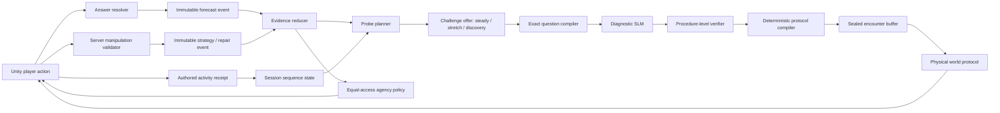

# Counterfeit Protocol Competence Engine Integration Plan

> **For agentic workers:** REQUIRED SUB-SKILL: Use superpowers:subagent-driven-development (recommended) or superpowers:executing-plans to implement this plan task-by-task. Steps use checkbox (`- [ ]`) syntax for tracking.

**Goal:** Integrate Robert White's competence/effectance principles with the diagnostic-distractor SLM so Counterfeit Protocol turns verified mathematical rules into manipulable world effects, treats answers as evidence rather than grades, records discriminating and changed-context observations without mastery claims, and grants new agency instead of points.

**Architecture:** Insert a deterministic Competence Engine between answer resolution and encounter selection. It stores a session-local event log, converts one selected counterfeit into a temporary hypothesis, chooses a question that separates that hypothesis from rival bugs, schedules cue-free transfer, and grants a world affordance only after evidence. The SLM continues to propose distractors, Sonnet continues to select bounded language/story variants, and Unity makes each verified rule physically observable and repairable.

**Tech Stack:** Existing Counterfeit Protocol Unity `6000.3.11f1` plan, C#, Unity Test Framework, Python 3, FastAPI, Pydantic, exact `Fraction`/`Decimal` math, immutable JSON Schema v1 contracts frozen before implementation, local SQLite sealed-encounter cache, and the existing Qwen3-4B/llama.cpp serving boundary.

## Global Constraints

- This plan is an amendment to `docs/superpowers/plans/2026-07-11-counterfeit-protocol-unity-product.md` and must be applied before that plan's Task 1 freezes contracts.
- Planning approval does not authorize implementation, installations, downloads, API calls, commits, pushes, or deployment.
- Replace “correct answer grants EMP/Proof Boost” with world behavior that visibly follows the trusted rule.
- Replace “wrong answer strengthens combat” with a coherent, reversible machine protocol that supplies evidence and a repair opportunity.
- Replace the second repair MCQ with direct manipulation of an authored mathematical representation.
- One wrong answer creates `needs_check`, never a diagnosis.
- One correct answer creates one observation, never mastery.
- A valid causal strategy or repair action grants the same portable agency with or without instructional support; evidence quality affects only what the system may infer, never access or reward.
- Deterministic code—not the SLM and not Sonnet—chooses probes, challenge offers, evidence transitions, transfer timing, and unlocks.
- The SLM proposes three diagnostic options for a verified blueprint. It does not select the next branch.
- Sonnet may select bounded story and tone variants. It receives no event log and does not choose follow-up intent.
- Correct-key interpretability is required: reject a blueprint if any allowlisted buggy procedure reaches its correct answer.
- Diagnosticity is required: a confirmatory probe must make the target bug produce a unique wrong result distinct from the nearest confound and the key.
- Harder mathematics uses equal or calmer presentation load; combat never intensifies during deliberation.
- Response speed is not competence evidence.
- Accessibility accommodations never reduce evidence quality.
- Help, retries, steady routes, and stretch routes provide equal campaign progress and no reward penalty.
- No child-facing first-try count, accuracy score, grade, streak, mastery badge, weakness label, or hidden ability rating.
- The first slice keeps evidence in memory or session-local SQLite with expiry and reset; it creates no cross-session learner profile.
- The vertical slice demonstrates one diagnostic probe, one physical repair, one delayed changed-context observation, one agency unlock, one optional quiet-workbench interval, and one evidence-driven boss phase.

---

## Superseded Master-Plan Decisions

| Master-plan decision | Competence Engine replacement |
|---|---|
| Correct releases `verified_emp` and grants Proof Boost | Trusted rule executes and repairs the world; no math-linked damage advantage |
| Counterfeit activates a stronger enemy modifier | Counterfeit instantiates an inspectable protocol with equal final progress |
| Immediate explanation then same-skill check | Observe trace, manipulate repair, interleave, then cue-free transfer |
| Sonnet returns `FollowupIntent` | Deterministic `ProbePlanner` returns `ProbeRequest`; Sonnet supplies story variants only |
| Evidence states `unseen / needs_check / recovered` | Immutable events plus explicit hypothesis, repair, and transfer states |
| Mission summary exposes first-try and recovery counts | Summary exposes systems repaired, strategies used, rules observed, and effects unlocked |
| Boss activates observed “weaknesses” | Player chooses among previously observed protocols and diagnoses unknown machines |
| Driving hides generation latency | Driving manipulates repaired systems and includes optional quiet experimentation |

---

## Updated Runtime Topology



---

## Repository Additions

```text
contracts/live-game/v1/
├── observation-event.schema.json
├── difficulty-vector.schema.json
├── misconception-track.schema.json
├── skill-track.schema.json
├── session-evidence.schema.json
├── probe-request.schema.json
├── challenge-offer.schema.json
├── challenge-selection.schema.json
├── support-request.schema.json
├── support-receipt.schema.json
├── activity-completion.schema.json
├── activity-result.schema.json
├── agency-unlock.schema.json
├── resolved-protocol.schema.json
├── feedback-card.schema.json
├── manipulation-spec.schema.json
├── manipulation-submission.schema.json
├── manipulation-result.schema.json
└── fixtures/competence/

services/counterfeit_forge/app/
├── evidence.py
├── probes.py
├── challenge.py
├── unlocks.py
└── orchestrator.py                 existing planned file; consume the four modules

services/counterfeit_forge/tests/
├── test_evidence.py
├── test_probes.py
├── test_challenge.py
├── test_unlocks.py
└── test_competence_flow.py

unity/CounterfeitProtocol/Assets/_Game/Scripts/
├── Competence/
│   ├── CompetenceContracts.cs
│   ├── EffectanceEncounterController.cs
│   ├── ChallengeOfferPresenter.cs
│   ├── AgencyUnlockController.cs
│   └── ProtocolWorkbench.cs
├── Manipulation/
│   └── FractionLatticeController.cs
├── World/
│   ├── WorldProtocolEffect.cs
│   ├── RelayRestorationController.cs
│   ├── RepairedDroneCompanion.cs
│   └── InterveningActivityGate.cs
└── Ui/
    ├── EvidenceSummaryPresenter.cs
    ├── StrategyPromptPresenter.cs
    └── TransferNoticePresenter.cs

unity/CounterfeitProtocol/Assets/_Game/Tests/
├── EditMode/Competence/
└── PlayMode/Competence/
```

---

### Task 1: Freeze Evidence, Probe, Challenge, and Unlock Contracts

**Files:**
- Create: `contracts/live-game/v1/observation-event.schema.json`
- Create: `contracts/live-game/v1/difficulty-vector.schema.json`
- Create: `contracts/live-game/v1/misconception-track.schema.json`
- Create: `contracts/live-game/v1/skill-track.schema.json`
- Create: `contracts/live-game/v1/session-evidence.schema.json`
- Create: `contracts/live-game/v1/probe-request.schema.json`
- Create: `contracts/live-game/v1/challenge-offer.schema.json`
- Create: `contracts/live-game/v1/challenge-selection.schema.json`
- Create: `contracts/live-game/v1/support-request.schema.json`
- Create: `contracts/live-game/v1/support-receipt.schema.json`
- Create: `contracts/live-game/v1/activity-completion.schema.json`
- Create: `contracts/live-game/v1/activity-result.schema.json`
- Create: `contracts/live-game/v1/agency-unlock.schema.json`
- Create: `contracts/live-game/v1/resolved-protocol.schema.json`
- Create: `contracts/live-game/v1/feedback-card.schema.json`
- Create: `contracts/live-game/v1/manipulation-spec.schema.json`
- Create: `contracts/live-game/v1/manipulation-submission.schema.json`
- Create: `contracts/live-game/v1/manipulation-result.schema.json`
- Modify planned: `services/counterfeit_forge/app/contracts.py`
- Modify planned: `services/counterfeit_forge/tests/test_contracts.py`
- Modify planned: `unity/CounterfeitProtocol/Assets/_Game/Scripts/Api/LiveContracts.cs`
- Modify planned: `unity/CounterfeitProtocol/Assets/_Game/Tests/EditMode/LiveContractTests.cs`

**Interfaces:**
- Server-only types: `ObservationEvent`, `MisconceptionTrack`, `SkillTrack`, `SessionEvidence`, and `ProbeRequest`; Unity never submits or constructs them.
- Cross-process types with identical camelCase JSON in Python and C#: `DifficultyVector`, `ChallengeOffer`, `ChallengeSelection`, `SupportRequest`, `SupportReceipt`, `ActivityCompletion`, `ActivityResult`, `AgencyUnlock`, `ResolvedProtocol`, `FeedbackCard`, `ManipulationSpec`, `ManipulationSubmission`, and `ManipulationResult`.
- Separates a procedure hypothesis (`MisconceptionTrack`) from evidence of effective action (`SkillTrack`) so a correct-route player can earn the same agency unlock without first making an error.

- [ ] **Step 1: Add failing Python contract tests**

```python
def test_one_event_carries_evidence_not_a_diagnosis():
    event = ObservationEvent.model_validate(PRIMARY_COUNTERFEIT_EVENT)
    assert event.probe_kind == "primary"
    assert event.stage == "forecast"
    assert event.misconception_id == "fraction_add_denominators"
    assert "diagnosis" not in event.model_fields


def test_accessibility_is_not_evidence_quality():
    assert "accessibility_mode" not in ObservationEvent.model_fields
    assert "input_device" not in ObservationEvent.model_fields


def test_transfer_probe_can_exist_without_a_misconception_target():
    request = ProbeRequest.model_validate(CORRECT_ROUTE_TRANSFER_REQUEST)
    assert request.kind == "near_transfer"
    assert request.target_misconception_id is None
```

- [ ] **Step 2: Run and verify RED**

Run: `.venv/bin/python -m unittest services.counterfeit_forge.tests.test_contracts -v`

Expected: import or attribute failures for the eight new contract types.

- [ ] **Step 3: Implement exact Pydantic types**

```python
ProbeKind = Literal["primary", "confirmatory", "near_transfer", "far_transfer"]
EventStage = Literal["forecast", "strategy_check", "repair"]
EvidenceQuality = Literal[
    "independent", "strategy_tool", "hinted", "worked_step", "answer_revealed", "cued"
]
MisconceptionStatus = Literal[
    "unseen", "needs_check", "check_deferred", "repeated_pattern", "not_repeated",
    "repairing", "resurfaced",
]
SkillStatus = Literal["unseen", "observed", "transfer_pending", "transfer_observed"]
ChallengeKind = Literal["steady", "stretch", "discovery"]
StrategyId = Literal["equalize", "align_places", "trace_direction"]
ChangedDimension = Literal["operands", "story", "representation", "operation_form"]


class DifficultyVector(StrictContract):
    math_level: int = Field(ge=1, le=4)
    operand_complexity: int = Field(ge=1, le=4)
    step_count: int = Field(ge=1, le=4)
    representation_novelty: int = Field(ge=0, le=2)
    instructional_scaffold: int = Field(ge=0, le=3)
    presentation_load: Literal["calm", "standard"]


class ObservationEvent(StrictContract):
    schema_version: Literal["observation-event-v1"]
    event_id: Annotated[str, Field(pattern=r"^evt_[a-z0-9]{20}$")]
    session_id: SessionId
    ordinal: int = Field(ge=0)
    encounter_id: EncounterId
    probe_id: Annotated[str, Field(pattern=r"^prb_[a-z0-9]{20}$")] | None
    blueprint_id: Annotated[str, Field(pattern=r"^bp_[a-z0-9]{20}$")]
    skill_id: SkillId
    probe_kind: ProbeKind
    stage: EventStage
    result: Literal["correct", "counterfeit"]
    misconception_id: MisconceptionId | None
    probe_target_misconception_id: MisconceptionId | None
    action_target_misconception_id: MisconceptionId | None
    strategy_id: StrategyId | None
    evidence_quality: EvidenceQuality
    operand_signature: Sha256Hex
    context_id: Annotated[str, Field(pattern=r"^[a-z0-9]+(?:_[a-z0-9]+)*$")]
    representation_id: Literal["symbolic", "fraction_lattice", "place_value_rail", "number_line"]
    operation_form_id: Literal["direct_expression", "missing_part", "comparison", "world_action"]
    difficulty: DifficultyVector


class MisconceptionTrack(StrictContract):
    misconception_id: MisconceptionId
    status: MisconceptionStatus
    primary_wrong_events: tuple[str, ...]
    confirmatory_wrong_events: tuple[str, ...]
    repair_success_events: tuple[str, ...]
    distinct_operand_signatures: tuple[Sha256Hex, ...]
    distinct_context_ids: tuple[str, ...]
    last_event_ordinal: int | None


class SkillTrack(StrictContract):
    skill_id: SkillId
    status: SkillStatus
    primary_correct_events: tuple[str, ...]
    strategy_evidence_events: tuple[str, ...]
    transfer_success_events: tuple[str, ...]
    distinct_operand_signatures: tuple[Sha256Hex, ...]
    distinct_context_ids: tuple[str, ...]
    last_event_ordinal: int | None
```

- [ ] **Step 4: Implement exact request and unlock types**

```python
class ProbeRequest(StrictContract):
    schema_version: Literal["probe-request-v1"]
    probe_id: Annotated[str, Field(pattern=r"^prb_[a-z0-9]{20}$")]
    kind: Literal["confirmatory", "near_transfer", "far_transfer"]
    skill_id: SkillId
    target_misconception_id: MisconceptionId | None
    math_level_min: int = Field(ge=1, le=4)
    math_level_max: int = Field(ge=1, le=4)
    must_change_all: tuple[ChangedDimension, ...]
    must_change_one_of: tuple[ChangedDimension, ...]
    avoid_operand_signatures: tuple[Sha256Hex, ...]
    avoid_context_ids: tuple[str, ...]
    avoid_representation_ids: tuple[
        Literal["symbolic", "fraction_lattice", "place_value_rail", "number_line"], ...
    ]
    avoid_operation_form_ids: tuple[
        Literal["direct_expression", "missing_part", "comparison", "world_action"], ...
    ]
    min_intervening_activities: int = Field(ge=0, le=8)
    cue_policy: Literal["hidden_until_commit"]


class ChallengeOffer(StrictContract):
    schema_version: Literal["challenge-offer-v1"]
    offer_id: Annotated[str, Field(pattern=r"^off_[a-z0-9]{20}$")]
    probe_id: Annotated[str, Field(pattern=r"^prb_[a-z0-9]{20}$")]
    kind: ChallengeKind
    skill_id: SkillId
    difficulty: DifficultyVector
    changed_dimensions: tuple[ChangedDimension, ...]
    support_level: int = Field(ge=0, le=3)
    player_label: Literal["Steady route", "Stretch route", "Discovery route"]
    preview_copy: str = Field(min_length=1, max_length=100)
    equal_progress: Literal[True]


class ChallengeSelection(StrictContract):
    schema_version: Literal["challenge-selection-v1"]
    selection_id: Annotated[str, Field(pattern=r"^sel_[a-z0-9]{20}$")]
    probe_id: Annotated[str, Field(pattern=r"^prb_[a-z0-9]{20}$")]
    offer_id: Annotated[str, Field(pattern=r"^off_[a-z0-9]{20}$")]


class SupportRequest(StrictContract):
    schema_version: Literal["support-request-v1"]
    request_id: Annotated[str, Field(pattern=r"^sup_[a-z0-9]{20}$")]
    encounter_id: EncounterId
    support_kind: Literal["strategy_model", "hint", "worked_step", "answer_reveal"]


class SupportReceipt(StrictContract):
    schema_version: Literal["support-receipt-v1"]
    request_id: Annotated[str, Field(pattern=r"^sup_[a-z0-9]{20}$")]
    support_kind: Literal["strategy_model", "hint", "worked_step", "answer_reveal"]
    content_variant_id: Annotated[str, Field(pattern=r"^[a-z0-9]+(?:_[a-z0-9]+)*$")]
    resulting_evidence_quality: Literal[
        "strategy_tool", "hinted", "worked_step", "answer_revealed", "cued"
    ]


class ActivityCompletion(StrictContract):
    schema_version: Literal["activity-completion-v1"]
    submission_id: Annotated[str, Field(pattern=r"^act_[a-z0-9]{20}$")]
    activity_id: Literal["relay_drive_loop", "containment_patrol", "workbench_visit"]


class ActivityResult(StrictContract):
    schema_version: Literal["activity-result-v1"]
    submission_id: Annotated[str, Field(pattern=r"^act_[a-z0-9]{20}$")]
    accepted: bool
    challenge_offers: tuple[ChallengeOffer, ...]


class AgencyUnlock(StrictContract):
    schema_version: Literal["agency-unlock-v1"]
    unlock_id: Annotated[str, Field(pattern=r"^unl_[a-z0-9]{20}$")]
    ability_id: Literal["equalizer", "aligner", "polarity_anchor"]
    evidence_event_ids: tuple[str, ...]
    player_copy: str = Field(min_length=1, max_length=120)


class FractionLatticeSpec(StrictContract):
    schema_version: Literal["manipulation-spec-v1"]
    kind: Literal["fraction_lattice"]
    spec_id: Annotated[str, Field(pattern=r"^man_[a-z0-9]{20}$")]
    left_numerator: int
    left_denominator: int = Field(ge=1)
    right_numerator: int
    right_denominator: int = Field(ge=1)
    operation: Literal["add", "subtract"]
    result_numerator: int
    result_denominator: int = Field(ge=1)


class DecimalRailSpec(StrictContract):
    schema_version: Literal["manipulation-spec-v1"]
    kind: Literal["decimal_rail"]
    spec_id: Annotated[str, Field(pattern=r"^man_[a-z0-9]{20}$")]
    left_scaled_integer: int
    left_scale: int = Field(ge=0, le=2)
    right_scaled_integer: int
    right_scale: int = Field(ge=0, le=2)
    operation: Literal["add", "subtract"]
    result_scaled_integer: int
    result_scale: int = Field(ge=0, le=2)


class PolarityBridgeSpec(StrictContract):
    schema_version: Literal["manipulation-spec-v1"]
    kind: Literal["polarity_bridge"]
    spec_id: Annotated[str, Field(pattern=r"^man_[a-z0-9]{20}$")]
    start: int
    delta: int
    operation: Literal["add", "subtract"]
    result: int


ManipulationSpec = Annotated[
    FractionLatticeSpec | DecimalRailSpec | PolarityBridgeSpec,
    Field(discriminator="kind"),
]


class FeedbackCard(StrictContract):
    schema_version: Literal["feedback-card-v1"]
    observed_action: str = Field(min_length=1, max_length=100)
    why_it_changed_the_system: str = Field(min_length=1, max_length=140)
    next_strategy: str = Field(min_length=1, max_length=120)


class CausalChainSpec(StrictContract):
    requested_action_id: Annotated[str, Field(pattern=r"^[a-z0-9]+(?:_[a-z0-9]+)*$")]
    executed_rule_id: Annotated[str, Field(pattern=r"^[a-z0-9]+(?:_[a-z0-9]+)*$")]
    observed_effect_id: Annotated[str, Field(pattern=r"^[a-z0-9]+(?:_[a-z0-9]+)*$")]
    component_to_change_id: Annotated[str, Field(pattern=r"^[a-z0-9]+(?:_[a-z0-9]+)*$")]


class ResolvedProtocol(StrictContract):
    schema_version: Literal["resolved-protocol-v1"]
    protocol_id: Literal[
        "trusted_execute", "decimal_align_whole_digits", "decimal_ignore_place_value",
        "decimal_operation_swap", "fraction_add_denominators",
        "fraction_ignore_common_denominator", "fraction_multiply_instead_of_add",
        "integer_drop_negative", "integer_add_absolute_values", "integer_reverse_difference",
    ]
    outcome: Literal["trusted", "counterfeit"]
    skill_id: SkillId
    misconception_id: MisconceptionId | None
    trace_step_ids: tuple[Annotated[str, Field(pattern=r"^[a-z0-9]+(?:_[a-z0-9]+)*$")], ...]
    causal_chain: CausalChainSpec
    manipulation: ManipulationSpec
    feedback: FeedbackCard

    @model_validator(mode="after")
    def protocol_is_compatible(self):
        if self.outcome == "trusted":
            if self.protocol_id != "trusted_execute" or self.misconception_id is not None:
                raise ValueError("trusted protocol cannot carry a counterfeit")
        else:
            if self.protocol_id == "trusted_execute" or self.protocol_id != self.misconception_id:
                raise ValueError("counterfeit protocol must equal its verified misconception")
            misconception_skill = {
                "decimal_align_whole_digits": "decimal_add_subtract",
                "decimal_ignore_place_value": "decimal_add_subtract",
                "decimal_operation_swap": "decimal_add_subtract",
                "fraction_add_denominators": "fraction_add",
                "fraction_ignore_common_denominator": "fraction_add",
                "fraction_multiply_instead_of_add": "fraction_add",
                "integer_drop_negative": "integer_add_subtract",
                "integer_add_absolute_values": "integer_add_subtract",
                "integer_reverse_difference": "integer_add_subtract",
            }[self.misconception_id]
            if self.skill_id != misconception_skill:
                raise ValueError("counterfeit and skill disagree")
        expected_kind = {
            "fraction_add": "fraction_lattice",
            "decimal_add_subtract": "decimal_rail",
            "integer_add_subtract": "polarity_bridge",
        }[self.skill_id]
        if self.manipulation.kind != expected_kind:
            raise ValueError("skill and manipulation kind disagree")
        return self


class FractionLatticeState(StrictContract):
    kind: Literal["fraction_lattice"]
    result_numerator: int
    result_denominator: int = Field(ge=1)
    common_unit_denominator: int = Field(ge=1)


class DecimalRailState(StrictContract):
    kind: Literal["decimal_rail"]
    result_scaled_integer: int
    result_scale: int = Field(ge=0, le=2)


class PolarityBridgeState(StrictContract):
    kind: Literal["polarity_bridge"]
    result: int


ManipulationState = Annotated[
    FractionLatticeState | DecimalRailState | PolarityBridgeState,
    Field(discriminator="kind"),
]


class ManipulationSubmission(StrictContract):
    schema_version: Literal["manipulation-submission-v1"]
    submission_id: Annotated[str, Field(pattern=r"^sub_[a-z0-9]{20}$")]
    spec_id: Annotated[str, Field(pattern=r"^man_[a-z0-9]{20}$")]
    attempt_kind: Literal["strategy_check", "repair"]
    strategy_id: StrategyId
    causal_chain: CausalChainSpec
    final_state: ManipulationState


class ManipulationResult(StrictContract):
    schema_version: Literal["manipulation-result-v1"]
    submission_id: Annotated[str, Field(pattern=r"^sub_[a-z0-9]{20}$")]
    valid: bool
    feedback: FeedbackCard
    recorded_event_id: Annotated[str, Field(pattern=r"^evt_[a-z0-9]{20}$")] | None
    recorded_evidence_quality: EvidenceQuality | None
    challenge_offers: tuple[ChallengeOffer, ...]
    agency_unlocks: tuple[AgencyUnlock, ...]


class SessionEvidence(StrictContract):
    schema_version: Literal["session-evidence-v1"]
    session_id: SessionId
    events: tuple[ObservationEvent, ...]
    skill_tracks: tuple[SkillTrack, ...]
    misconception_tracks: tuple[MisconceptionTrack, ...]
    unlocks: tuple[AgencyUnlock, ...]
    closed_reason: Literal["expired", "reset"] | None
```

Add model validators with these exact invariants: a correct event has no
`misconception_id`; a counterfeit event has one; only events whose `stage` is
`strategy_check` or `repair` may carry `strategy_id`; repair-stage events require
`action_target_misconception_id`, copied from the selected sealed counterfeit rather
than the probe's hypothesis; non-repair stages have no action target; confirmatory requests require
`target_misconception_id`; transfer events and requests may omit their target; primary
events have no `probe_id`, while confirmatory and transfer events require the exact
active `probe_id`; only a `forecast` event may be counterfeit; and every unlock receipt references at least
one server-validated strategy-check or repair event from the same skill track. Transfer
events never add, remove, or improve an agency reward. A
`ManipulationSubmission` contains no client-asserted validity or evidence quality; the
server compares its discriminated final state and named causal-chain fields with the sealed
`ManipulationSpec` and `ResolvedProtocol`, derives support usage from the session's
server-recorded support calls, and alone constructs the resulting `ObservationEvent`.
An invalid result has no recorded event, offers, or unlocks.

Freeze this support mapping in both schema fixtures and tests: no support call →
`independent`; offer/support level `1` or `strategy_model` → `strategy_tool`; level `2`
or `hint` → `hinted`; level `3` or `worked_step` → `worked_step`; `answer_reveal` →
`answer_revealed`; any precommit disclosure of the rule relationship → `cued`. When
more than one applies, use the least independent quality. Accessibility settings and
input accommodations are absent from this mapping.

`ObservationEvent.ordinal` and `CompletedActivity.activity_ordinal` come from one
session-local monotonic counter. Gaps in evidence ordinals are valid because an authored
activity may occupy the intervening ordinal; wall-clock time is never used.

Validate probe change policies exactly: confirmatory requests require only `operands`;
near transfer requires `operands` and `story`; far transfer requires `operands` plus at
least one of `representation` or `operation_form`. Reject duplicate change dimensions,
an execution whose exact context/representation/form violates its avoid lists, and any
blueprint whose receipts differ from its selected execution.

For v1, confirmatory requests require a non-null `target_misconception_id`, while near
and far transfer requests require it to be null. Transfer measures the skill procedure,
not whether one earlier counterfeit reappears; a future targeted-transfer design needs a
new schema and reviewed fallback matrix.

Freeze these server-only selection types before the probe compiler consumes them:

```python
@dataclass(frozen=True)
class ChallengeExecutionSpec:
    probe_request: ProbeRequest
    offer_id: str
    difficulty: DifficultyVector
    changed_dimensions: tuple[ChangedDimension, ...]
    support_level: int
    blueprint_seed: int
    context_id: str
    representation_id: Literal["symbolic", "fraction_lattice", "place_value_rail", "number_line"]
    operation_form_id: Literal["direct_expression", "missing_part", "comparison", "world_action"]
    fallback_encounter_id: EncounterId


@dataclass(frozen=True)
class ChallengePlan:
    public_offers: tuple[ChallengeOffer, ChallengeOffer, ChallengeOffer]
    executions: tuple[ChallengeExecutionSpec, ChallengeExecutionSpec, ChallengeExecutionSpec]
    recommended_offer_id: str


@dataclass(frozen=True)
class SessionChallengeState:
    active_executions: tuple[ChallengeExecutionSpec, ...]
    consumed_probe_ids: tuple[str, ...]
    selection_results: tuple[tuple[str, ChallengeExecutionSpec], ...]


@dataclass(frozen=True)
class CompletedActivity:
    activity_id: str
    activity_ordinal: int


@dataclass(frozen=True)
class SessionSequenceState:
    completed_activities: tuple[CompletedActivity, ...]
    submission_results: tuple[tuple[str, ActivityResult], ...]
```

- [ ] **Step 5: Replace the superseded master v1 answer contracts before freezing them**

Delete `CombatEffectId`, `verified_emp`, and `FollowupIntent`. Replace
`VerifiedDistractor.combat_effect_id` and `SealedOption.combat_effect_id` with the
allowlisted counterfeit `protocol_id`. Replace the master's scalar-difficulty request,
blueprint, session-create, sealed-option, and sealed-encounter definitions with these
v1 shapes so the reducer's receipts actually exist:

```python
class SessionCreate(StrictContract):
    schema_version: Literal["session-create-v1"]
    requested_skill_id: SkillId
    combat_assist: Literal["full", "standard", "minimal"]
    starting_challenge: Literal["steady", "standard", "stretch"]


class DirectorRequest(StrictContract):
    schema_version: Literal["director-request-v1"]
    session_id: SessionId
    skill_id: SkillId
    difficulty: DifficultyVector
    probe_id: Annotated[str, Field(pattern=r"^prb_[a-z0-9]{20}$")] | None
    probe_kind: ProbeKind
    target_misconception_id: MisconceptionId | None
    seed: int = Field(ge=0, le=2_147_483_647)
    world_state_id: Literal["relay_damaged", "relay_contested", "relay_repairing"]


class QuestionBlueprint(StrictContract):
    schema_version: Literal["question-blueprint-v1"]
    blueprint_id: Annotated[str, Field(pattern=r"^bp_[a-z0-9]{20}$")]
    probe_id: Annotated[str, Field(pattern=r"^prb_[a-z0-9]{20}$")] | None
    probe_kind: ProbeKind
    target_misconception_id: MisconceptionId | None
    skill_id: SkillId
    template_id: str = Field(pattern=r"^[a-z0-9]+(?:_[a-z0-9]+)*$")
    seed: int = Field(ge=0, le=2_147_483_647)
    operands: dict[str, int | str]
    operand_signature: Sha256Hex
    context_id: Annotated[str, Field(pattern=r"^[a-z0-9]+(?:_[a-z0-9]+)*$")]
    representation_id: Literal["symbolic", "fraction_lattice", "place_value_rail", "number_line"]
    operation_form_id: Literal["direct_expression", "missing_part", "comparison", "world_action"]
    canonical_prompt: str = Field(min_length=1, max_length=500)
    exact_answer: str = Field(min_length=1, max_length=64)
    trusted_steps: tuple[Annotated[str, Field(min_length=1, max_length=240)], ...]
    topic: str = Field(min_length=1, max_length=120)
    difficulty: DifficultyVector
    solver_version: Literal["number-solver-v1"]
    question_fingerprint: Annotated[str, Field(pattern=r"^question:v1:[0-9a-f]{64}$")]


class SealedOption(StrictContract):
    id: Annotated[str, Field(pattern=r"^opt_[a-z0-9]{16}$")]
    display: str = Field(min_length=1, max_length=64)
    correct: bool
    selected_evidence: SelectedEvidence | None
    resolved_protocol: ResolvedProtocol


class SealedEncounter(StrictContract):
    encounter_id: EncounterId
    blueprint: QuestionBlueprint
    question: PublicQuestion
    options: tuple[SealedOption, SealedOption, SealedOption, SealedOption]
    model_receipt_sha256: Sha256Hex
    generation_mode: Literal["live-verified", "cached-verified"]
```

Map `starting_challenge` to immutable initial vectors in one tested table:
`steady=(1,1,1,0,2,"calm")`, `standard=(2,2,1,0,1,"standard")`, and
`stretch=(3,3,2,1,0,"calm")` in `DifficultyVector` field order. There is no competing
internal `1–3` scalar; later adaptations change at most one vector dimension at a time.

Replace the master `AnswerResult` with:

```python
class AnswerResult(StrictContract):
    schema_version: Literal["answer-result-v1"]
    encounter_id: EncounterId
    correct: bool
    selected_display: str = Field(min_length=1, max_length=64)
    selected_evidence: SelectedEvidence | None
    resolved_protocol: ResolvedProtocol
    npc_line: str | None = Field(default=None, max_length=120)
    trusted_answer: str = Field(min_length=1, max_length=64)
    trusted_steps: tuple[Annotated[str, Field(min_length=1, max_length=240)], ...]

    @model_validator(mode="after")
    def outcome_matches_protocol(self):
        if self.correct:
            if self.selected_evidence is not None or self.resolved_protocol.outcome != "trusted":
                raise ValueError("trusted outcome cannot expose counterfeit evidence")
        elif self.selected_evidence is None or self.resolved_protocol.outcome != "counterfeit":
            raise ValueError("counterfeit outcome requires selected evidence")
        return self


class MissionSummary(StrictContract):
    schema_version: Literal["mission-summary-v1"]
    systems_repaired: tuple[
        Literal["coolant_relay", "signal_bridge", "convoy_bay"], ...
    ]
    strategies_used: tuple[StrategyId, ...]
    glitch_families_observed: tuple[GlitchFamilyId, ...]
    agency_ability_ids: tuple[Literal["equalizer", "aligner", "polarity_anchor"], ...]
```

The sealed server record retains the mapping from every opaque option to its immutable
`ResolvedProtocol`; Unity receives only the selected protocol after commitment. No v1
schema or fixture may contain `verified_emp`, Proof Boost, combat damage, or
`FollowupIntent`. Require primary blueprints to have no probe ID, confirmatory/transfer
blueprints to carry the active probe ID, confirmatory targets to be non-null, and every
`SealedOption`'s correct flag/evidence/protocol outcome to agree. Freeze this
`MissionSummary` now; `first_try_correct_count` and `recovered_count` never enter a v1
child contract.

- [ ] **Step 6: Add C# DTOs and golden fixtures**

Require Newtonsoft `MissingMemberHandling.Error`, explicit enum parsing,
`mathLevelMin <= mathLevelMax`, one or more changed dimensions for stretch/discovery,
and `equalProgress == true`. Generate C# DTOs only for cross-process types; evidence
events, tracks, and `SessionEvidence` stay server-side. Golden public fixtures must cover
both a correct-route manipulation response and a repaired-counterfeit response; Python
fixtures additionally cover both internal track shapes.

- [ ] **Step 7: Verify GREEN in Python and Unity**

Run the master plan's Python contract suite and Unity EditMode contract suite. Expected: all old and new v1 fixtures pass; unknown fields and invalid invariants fail.

---

### Task 2: Implement the Pure Session Evidence Reducer

**Files:**
- Create: `services/counterfeit_forge/app/evidence.py`
- Create: `services/counterfeit_forge/tests/test_evidence.py`

**Interfaces:**
- Produces: `EvidenceReducer.apply(state: SessionEvidence, event: ObservationEvent) -> SessionEvidence`.
- Produces: deterministic track transitions without time, model, database, or network access.

- [ ] **Step 1: Write transition tests**

```python
def test_one_wrong_primary_only_needs_check():
    state = reducer.apply(empty_state(), primary_wrong("fraction_add_denominators"))
    assert state.misconception_track("fraction_add_denominators").status == "needs_check"
    assert state.unlocks == ()


def test_different_probe_error_does_not_confirm_first_hypothesis():
    state = reducer.apply(needs_check("fraction_add_denominators"), confirmatory_wrong("fraction_multiply_instead_of_add"))
    assert state.misconception_track("fraction_add_denominators").status == "not_repeated"
    assert state.misconception_track("fraction_multiply_instead_of_add").status == "needs_check"


def test_correct_probe_closes_the_target_hypothesis():
    state = reducer.apply(needs_check(TARGET), confirmatory_correct(target=TARGET))
    assert state.misconception_track(TARGET).status == "not_repeated"


def test_cued_correct_probe_does_not_clear_the_hypothesis():
    state = reducer.apply(
        needs_check(TARGET),
        confirmatory_correct(target=TARGET, quality="cued"),
    )
    assert state.misconception_track(TARGET).status == "check_deferred"


def test_repair_targets_selected_counterfeit_not_original_probe_target():
    probed = reducer.apply(
        needs_check("fraction_add_denominators"),
        confirmatory_wrong("fraction_multiply_instead_of_add"),
    )
    repaired = reducer.apply(
        probed,
        repair_correct(action_target="fraction_multiply_instead_of_add"),
    )
    assert repaired.misconception_track("fraction_add_denominators").status == "not_repeated"
    assert repaired.misconception_track("fraction_multiply_instead_of_add").repair_success_events


def test_guided_repair_schedules_transfer_without_claiming_it():
    state = reducer.apply(needs_check(TARGET), repair_correct(action_target=TARGET, quality="hinted"))
    assert state.misconception_track(TARGET).status == "needs_check"
    assert state.skill_track("fraction_add").status == "transfer_pending"


def test_correct_forecast_needs_a_strategy_action_before_transfer():
    observed = reducer.apply(empty_state(), primary_correct(skill="fraction_add"))
    assert observed.skill_track("fraction_add").status == "observed"
    pending = reducer.apply(observed, strategy_check_correct("equalize"))
    assert pending.skill_track("fraction_add").status == "transfer_pending"
```

- [ ] **Step 2: Verify RED**

Run: `.venv/bin/python -m unittest services.counterfeit_forge.tests.test_evidence -v`

- [ ] **Step 3: Implement immutable transitions**

- One wrong primary `forecast` creates `needs_check` only on its misconception track.
- The same independently selected misconception on a distinct confirmatory `forecast` changes `needs_check | check_deferred → repeated_pattern`. Hinted, worked-step, answer-revealed, or precommit-cued events never strengthen a misconception inference.
- An independent correct confirmatory `forecast` changes its `probe_target_misconception_id` from `needs_check | check_deferred → not_repeated`. Hinted, worked-step, answer-revealed, strategy-tool, or cued confirmation records the event and changes `needs_check → check_deferred` or keeps it deferred without resolving the hypothesis.
- An independent different wrong confirmatory `forecast` changes the target to `not_repeated` and creates `needs_check` for the selected counterfeit; it never confirms both. A non-independent result changes no rival track and changes the original to `check_deferred`.
- A successful `repair` stage records strategy evidence on `action_target_misconception_id`. It changes that track `repeated_pattern | resurfaced → repairing`, but leaves `needs_check` as a hypothesis because guided success cannot prove the original error was stable. It never repairs the original probe target when the player selected a different counterfeit.
- A correct primary `forecast` changes the skill track `unseen → observed`; it changes no misconception track.
- A valid causal `strategy_check` after a trusted primary, or a valid `repair` after a primary counterfeit, changes the skill track to `transfer_pending` regardless of instructional support. The reducer schedules later evidence; the separate equal-access policy grants agency from this causal action without using evidence quality as a reward gate.
- A correct near/far-transfer forecast alone cannot advance the skill track: the matching server-validated `strategy_check` must also succeed. If that action is independent or skill-allowlisted `strategy_tool` and cue-free, near transfer requires changed operands plus context, while far transfer requires changed operands plus representation or operation form. Only then does the skill track change `transfer_pending → transfer_observed`.
- A counterfeit transfer forecast creates or resurfaces the selected misconception hypothesis; its subsequent repair leaves the skill track pending. It never revokes an existing session ability.

- [ ] **Step 4: Reject invalid event sequences**

The reducer rejects a mismatched `session_id`, non-monotonic ordinal, repeated event ID,
`counterfeit` without misconception, `correct` with selected misconception, non-forecast
counterfeit events, repair stages without an action target, transfer lacking a changed dimension,
and events when `closed_reason` is set. Before constructing the event, the orchestrator
must verify that `encounter_id`, `blueprint_id`, and `probe_id` belong to the active
sealed session record and that the probe kind/target match; those receipts are not
trusted from Unity. Session TTL code sets `closed_reason="expired"` before calling the
pure reducer; the reducer itself never reads a clock.

- [ ] **Step 5: Verify deterministic replay**

Replay the same event tuple twice and require byte-identical `model_dump_json(by_alias=True)` output.

Run: `.venv/bin/python -m unittest services.counterfeit_forge.tests.test_evidence -v`

Expected: all transition, invalid-sequence, and deterministic-replay tests pass.

---

### Task 3: Build Discriminating Diagnostic Probes

**Files:**
- Create: `services/counterfeit_forge/app/probes.py`
- Modify planned: `services/counterfeit_forge/app/math_kernel.py`
- Modify planned: `services/counterfeit_forge/app/validation.py`
- Create: `services/counterfeit_forge/app/protocols.py`
- Create: `services/counterfeit_forge/tests/test_probes.py`
- Create: `services/counterfeit_forge/tests/test_protocols.py`
- Create: `services/counterfeit_forge/scripts/benchmark_targeted_probes.py`

**Interfaces:**
- Produces: `ProbePlanner.plan(state, sequence_state, last_resolution, seed) -> ProbeRequest | None`.
- Produces: `compile_probe(execution: ChallengeExecutionSpec) -> QuestionBlueprint`; compilation consumes the selected offer's exact difficulty, changed dimensions, support policy, and blueprint seed rather than the unresolved request.
- Produces: `ProtocolCompiler.compile(blueprint: QuestionBlueprint, option: VerifiedDistractor | None) -> ResolvedProtocol`; `None` compiles the trusted option, while a verified option compiles its allowlisted counterfeit.

- [ ] **Step 1: Write diagnosticity tests**

```python
def test_confirmatory_probe_separates_target_from_nearest_confound():
    request = confirmatory_request("fraction_add_denominators")
    execution = selected_execution(request, kind="steady", blueprint_seed=41)
    blueprint = compile_probe(execution)
    outputs = evaluate_allowlisted_bugs(blueprint, registry=PRODUCT_SERVING_RULES_V1)
    assert outputs["fraction_add_denominators"] != blueprint.exact_answer
    assert len(outputs.values()) == len(set(outputs.values()))
    assert blueprint.operand_signature not in request.avoid_operand_signatures
    if "story" in request.must_change_all:
        assert blueprint.context_id not in request.avoid_context_ids
    if "representation" in execution.changed_dimensions:
        assert blueprint.representation_id not in request.avoid_representation_ids
    if "operation_form" in execution.changed_dimensions:
        assert blueprint.operation_form_id not in request.avoid_operation_form_ids
```

Run: `.venv/bin/python -m unittest services.counterfeit_forge.tests.test_probes -v`

Expected before implementation: import failure for `ProbePlanner` or failing diagnosticity assertions.

- [ ] **Step 2: Add correct-key interpretability tests**

For every supported seed, reject the blueprint when any allowlisted buggy procedure equals the key, when the target bug does not surface, or when two included bugs collide. `PRODUCT_SERVING_RULES_V1` is the independently unit-tested, versioned product registry used by both the serving gate and physical protocol mapping—not the training-label registry or an SLM-generated procedure. Include its version/hash in the sealed cache key.

- [ ] **Step 3: Implement probe priority**

1. confirm an active `needs_check` hypothesis;
2. reconsider `check_deferred` only after at least one authored activity has a shared session ordinal greater than the supported confirmation event; never serve the same diagnostic check immediately again;
3. schedule transfer for a `SkillTrack(status="transfer_pending")` only when the required count of authored activities have a shared session ordinal greater than its latest strategy event; this request may have no misconception target;
4. return `None` so normal progression resumes.

There is no `ProbeRequest(kind="repair")`. Every counterfeit executes and is repaired by
the typed in-encounter manipulation flow before the next MCQ is planned; a second repair
question would violate the core design.

- [ ] **Step 4: Implement changed-dimension rules**

- Confirmatory: `must_change_all=("operands",)`, empty `must_change_one_of`, and zero intervening activities.
- Near transfer: `must_change_all=("operands", "story")`, empty `must_change_one_of`, at least one intervening activity, and no precommit Glitch cue.
- Far transfer: `must_change_all=("operands",)`, `must_change_one_of=("representation", "operation_form")`, at least two intervening activities, and no precommit Glitch cue.

Populate all four avoid lists from prior events. `ChallengeExecutionSpec` selects exact
context, representation, and operation-form IDs before compilation; `compile_probe`
rejects an execution if a required dimension still appears in its corresponding avoid
list or if none of the `must_change_one_of` dimensions changed. A story change is a new
`context_id`; an operation-form change is never inferred from prose.

- [ ] **Step 5: Bind the SLM target acceptance gate**

The SLM receives its unchanged question/correct/topic contract. When
`target_misconception_id` is non-null, the product verifier accepts the probe only when
one of the three complete-set distractors maps uniquely to that target. If not, reject
the whole set and try a new blueprint or matching owner-reviewed cache record. A
v1 transfer request always has a null target and uses the normal full-set gate.
Never splice a deterministic option into an SLM set, and do not describe rejection
sampling as demonstrated target control by the model.

- [ ] **Step 6: Compile sealed physical protocols**

Build `ResolvedProtocol` only from the exact blueprint, trusted solver output, and
`PRODUCT_SERVING_RULES_V1`. Each registry entry supplies the protocol ID, compatible
skill, causal-chain IDs, manipulation-spec factory, allowed strategies, and canonical
`FeedbackCard` facts. The SLM's free-form misconception label and computation remain
review evidence; they never choose physical IDs, scene targets, strategies, or child
feedback. Compile all four options before constructing `SealedEncounter`, run every
cross-field validator, and reject the complete encounter on any failure.

Run: `.venv/bin/python -m unittest services.counterfeit_forge.tests.test_protocols -v`

Expected before implementation: import failure for `ProtocolCompiler` or failing trusted/counterfeit mapping tests; after implementation, every product rule compiles deterministically and incompatible skill/spec pairs fail.

- [ ] **Step 7: Benchmark targeted yield**

Run 50 generated probes per approved procedure ID. Report full-set acceptance and target-inclusion rates. Stop live targeted generation for any procedure below a `25%` target-inclusion acceptance floor; use reviewed cache or plan a separately evaluated control adapter.

Run: `.venv/bin/python -m unittest services.counterfeit_forge.tests.test_probes -v`

Expected: all probe, changed-dimension, serving-rule, and target-gate tests pass.

Run: `.venv/bin/python -m unittest services.counterfeit_forge.tests.test_protocols -v`

Expected: all trusted and counterfeit protocol-construction tests pass.

Run: `.venv/bin/python -m services.counterfeit_forge.scripts.benchmark_targeted_probes --per-procedure 50 --output artifacts/game/targeted-probe-benchmark.json`

Expected: report is written with one explicit live/cache eligibility decision per approved procedure; the command exits nonzero if any enabled-live procedure is below the floor.

---

### Task 4: Implement Transparent Challenge Offers

**Files:**
- Create: `services/counterfeit_forge/app/challenge.py`
- Create: `services/counterfeit_forge/tests/test_challenge.py`
- Create: `unity/CounterfeitProtocol/Assets/_Game/Scripts/Competence/ChallengeOfferPresenter.cs`
- Create: `unity/CounterfeitProtocol/Assets/_Game/Tests/EditMode/Competence/ChallengeOfferTests.cs`
- Create: `unity/CounterfeitProtocol/Assets/_Game/Tests/PlayMode/Competence/ChallengeOfferPlayModeTests.cs`

**Interfaces:**
- Produces: `ChallengeDirector.offer(state, required_probe, seed) -> ChallengePlan` containing three public offers plus three exact server-only executions.
- Each `ChallengeExecutionSpec` retains its probe, offer, difficulty, changed dimensions, support, seed, context, representation, and operation form; the orchestrator stores all three in `SessionChallengeState.active_executions` before returning `ChallengePlan.public_offers`.
- Produces: `ChallengeDirector.select(challenge_state, selection: ChallengeSelection) -> ChallengeExecutionSpec`. Repeating the same `selection_id` returns the byte-identical stored result; a new selection for an already-consumed probe is rejected.
- Consumes: explicit player choice; does not infer anxiety, motivation, or ability.

The selection endpoint compiles or queues the resolved execution and returns the
existing `NextEncounterResponse`: `ready` with its sealed encounter when cache/buffer is
ready, or `generating` with bounded `retry_after_ms`. Repeating `selection_id` returns
the same execution's current response; it never chooses a new seed or offer.

- [ ] **Step 1: Write offer invariants**

Require exactly one steady, one stretch, and one discovery offer bound to the same required probe and learning target with equal progress. Every execution preserves `must_change_all` and satisfies `must_change_one_of`; steady adds no novelty beyond that probe policy, stretch adds exactly one additional dimension, and discovery uses one unfamiliar representation with a safe introductory scaffold. Store offer state outside `SessionEvidence`; reject an expired, cross-session, or mismatched-probe selection and reject a different second selection after consumption.

Require `recommended_offer_id` to match exactly one public offer and one execution; recommendation changes prefetch order only, never reward or availability.

Run: `.venv/bin/python -m unittest services.counterfeit_forge.tests.test_challenge -v`

Expected before implementation: import failure for `ChallengeDirector` or failing offer-invariant assertions.

- [ ] **Step 2: Implement evidence rules**

- Two independent successes: set `ChallengePlan.recommended_offer_id` to stretch, changing one additional dimension beyond the required probe policy.
- Mixed evidence: recommend steady with a changed story.
- Counterfeit or heavy instructional support: recommend steady and offer a manipulable model.
- Harder math: force `presentation_load="calm"`.
- Player request “clearer model”: increase scaffold without reducing progress.
- Player request “stranger version”: add one novelty dimension beyond the probe's mandatory changes without adding time pressure.

- [ ] **Step 3: Prove response time is unused**

The module accepts no duration, timestamp, frame rate, input device, or reading-speed field. Add a contract test asserting those names are absent.

- [ ] **Step 4: Implement Unity presentation**

Show three route labels and their world/presentation difference in plain language. For a confirmatory or transfer probe, hide the mathematical relationship, skill label, Glitch family, and target change until after commitment. If the player explicitly requests that relationship or a pre-answer model, serve it but mark the later event `cued`, making it ineligible for an independent transfer observation while leaving agency and progress unchanged. Do not show numerical difficulty, confidence, mastery, or a recommendation reason based on inferred ability.

- [ ] **Step 5: Implement explicit selection**

Unity posts `ChallengeSelection` to the session service. The service resolves the selected offer to an exact `DifficultyVector`, changed-dimension policy, and support level before blueprint compilation. Generated text cannot alter any of those fields.

- [ ] **Step 6: Define the three-offer buffering policy**

At offer creation, deterministically compile and store one `ChallengeExecutionSpec` per
offer. Use the two-item live buffer for the execution named by
`ChallengePlan.recommended_offer_id` plus one seeded alternate. Every selectable offer must also have a compatible owner-reviewed sealed
cache record. If the player chooses the unbuffered offer, return its matching cache
record in under one second and label provenance honestly; never block on three live SLM
calls, swap the target, or remove an offer because generation is slow.

Partition the static cache by skill, probe kind, target (including null), challenge kind,
full `DifficultyVector`, support policy, product-rule hash, solver version, validator
version, and serving-artifact hash. Each record carries its own operand signature,
context, representation, and operation-form receipts. At runtime, filter that partition
against the current request's avoid lists and change policies. Select one compatible
fallback first, copy its deterministic blueprint seed/context/representation/form into
the `ChallengeExecutionSpec`, and bind its encounter ID as `fallback_encounter_id`; the
live attempt and fallback therefore honor the same execution. Do not expose the offer
set unless one such record exists for each current execution; otherwise offer one
authored normal-progression route instead of a choice the system cannot honor.

- [ ] **Step 7: Verify equal progress**

Unity PlayMode tests complete all three offer kinds and assert identical mission-advance and cosmetic availability behavior.

Run: `.venv/bin/python -m unittest services.counterfeit_forge.tests.test_challenge -v`

Expected: all offer, readiness, selection-idempotency, privacy-field, and equal-policy tests pass.

Run: `/Applications/Unity/Hub/Editor/6000.3.11f1/Unity.app/Contents/MacOS/Unity -batchmode -nographics -quit -projectPath "$PWD/unity/CounterfeitProtocol" -runTests -testPlatform EditMode -testFilter CounterfeitProtocol.Tests.Competence.ChallengeOfferTests -testResults /tmp/challenge-offer-tests.xml -logFile -`

Run: `/Applications/Unity/Hub/Editor/6000.3.11f1/Unity.app/Contents/MacOS/Unity -batchmode -nographics -quit -projectPath "$PWD/unity/CounterfeitProtocol" -runTests -testPlatform PlayMode -testFilter CounterfeitProtocol.Tests.Competence.ChallengeOfferPlayModeTests -testResults /tmp/challenge-offer-playmode.xml -logFile -`

Expected: both Unity commands exit `0`; both XML files contain zero failed tests, including mission-advance and cosmetic equality across all offer kinds.

---

### Task 5: Grant Equal Agency After Causal Action

**Files:**
- Create: `services/counterfeit_forge/app/unlocks.py`
- Create: `services/counterfeit_forge/tests/test_unlocks.py`
- Create: `unity/CounterfeitProtocol/Assets/_Game/Scripts/Competence/AgencyUnlockController.cs`
- Create: `unity/CounterfeitProtocol/Assets/_Game/Scripts/World/RepairedDroneCompanion.cs`
- Create: `unity/CounterfeitProtocol/Assets/_Game/Tests/PlayMode/Competence/AgencyUnlockTests.cs`

**Interfaces:**
- Produces: `UnlockPolicy.evaluate(before, after) -> tuple[AgencyUnlock, ...]`.
- Maps: valid fraction causal action → `equalizer`; valid decimal causal action → `aligner`; valid integer causal action → `polarity_anchor`. Only `equalizer` is an owner-showcase acceptance requirement; the other enum values reserve contract compatibility for separately planned expansion.

- [ ] **Step 1: Write no-false-unlock tests**

No portable agency unlock after an answer selection alone, an invalid manipulation, or a mismatched sealed spec. Add positive tests proving a valid trusted-route strategy check and a valid counterfeit repair unlock the same ability, and that `independent`, `strategy_tool`, `hinted`, `worked_step`, and `answer_revealed` support histories produce identical access.

Run: `.venv/bin/python -m unittest services.counterfeit_forge.tests.test_unlocks -v`

Expected before implementation: import failure for `UnlockPolicy` or failing no-false-unlock assertions.

- [ ] **Step 2: Implement equal-access rule**

Grant one session ability after the first server-validated causal `strategy_check` or
`repair` for that skill, regardless of `EvidenceQuality`. Store that action event ID in
`AgencyUnlock`. Transfer remains a later learning observation and never controls access,
cosmetics, audiovisual payoff, or campaign progress. This makes the ability a tool for
continued practice, not a badge claiming competence.

Accessibility presentation, alternate input, text-to-speech, larger targets, high contrast, reduced motion, manipulable models, hints, worked steps, and answer reveals never reduce access. They still retain distinct evidence qualities so reviewer claims remain honest.

- [ ] **Step 3: Implement functional effects**

- Every completed trusted strategy action or counterfeit repair recruits the companion and makes its portable world action freely selectable. Correct and recovery branches receive the same animation, access, and timing.
- Equalizer: divides authored bridge/energy objects into equal controllable segments.
- Aligner: synchronizes authored lane/platform nodes on a shared place-value rail.
- Polarity Anchor: reverses and locks authored push/pull field nodes.

Effects act only on allowlisted scene components; generated text cannot name prefabs, methods, or targets.

- [ ] **Step 4: Write factual player copy**

Use “The Equalizer is online. It can now control matching segment nodes.” Do not imply the unlock proves transfer, mastery, expertise, or fixed ability.

- [ ] **Step 5: Verify reset and expiry**

Session reset and expiry remove session abilities; accessibility and core traversal remain available. A later counterfeit schedules more support but never revokes an ability already earned during the active session.

Run: `.venv/bin/python -m unittest services.counterfeit_forge.tests.test_unlocks -v`

Expected: all positive, negative, idempotency, reset, and no-revocation tests pass.

Run: `/Applications/Unity/Hub/Editor/6000.3.11f1/Unity.app/Contents/MacOS/Unity -batchmode -nographics -quit -projectPath "$PWD/unity/CounterfeitProtocol" -runTests -testPlatform PlayMode -testFilter CounterfeitProtocol.Tests.Competence.AgencyUnlockTests -testResults /tmp/agency-unlock-tests.xml -logFile -`

Expected: Unity exits `0`; the XML contains zero failed tests.

---

### Task 6: Remove Sonnet from Adaptation and Update the Orchestrator

**Files:**
- Modify planned: `services/counterfeit_forge/app/providers/director.py`
- Modify planned: `services/counterfeit_forge/app/providers/template_director.py`
- Modify planned: `services/counterfeit_forge/app/providers/truefoundry_director.py`
- Modify planned: `services/counterfeit_forge/app/orchestrator.py`
- Modify planned: `services/counterfeit_forge/app/api.py`
- Create: `services/counterfeit_forge/scripts/seed_competence_fallbacks.py`
- Create: `services/counterfeit_forge/tests/test_competence_flow.py`
- Create: `services/counterfeit_forge/tests/test_competence_cache.py`

**Interfaces:**
- Sonnet produces: `StorySkin` and an optional nonmathematical `npc_line` only.
- Deterministic modules produce: `ProbeRequest`, `ChallengeOffer`, and `AgencyUnlock`.
- API additionally produces: `POST /v1/sessions/{session_id}/challenges/select` consuming one `ChallengeSelection`.
- API additionally produces: `POST /v1/sessions/{session_id}/encounters/{encounter_id}/support` consuming `SupportRequest` and returning `SupportReceipt`.
- API additionally produces: `POST /v1/sessions/{session_id}/encounters/{encounter_id}/manipulations` consuming `ManipulationSubmission` and returning `ManipulationResult`.
- API additionally produces: `POST /v1/sessions/{session_id}/activities/complete` consuming `ActivityCompletion` and returning `ActivityResult`.
- Server-only validator returns `ValidatedManipulation(valid: bool, resolution: ResolvedProtocol, stage: Literal["strategy_check", "repair"], evidence_quality: EvidenceQuality)` from sealed state; it is never deserialized from Unity.

- [ ] **Step 1: Delete `DirectorProvider.create_followup` from the planned interface**

Remove `FollowupIntent` from Sonnet request/response snapshots. Deterministic code builds the follow-up mathematics and freezes all operands; Sonnet may make that fixed probe feel on-the-spot by choosing a bounded world problem, Nia setup, and post-action tone around nonnumeric placeholders. Reject a provider response containing skill, misconception, difficulty, probe, evidence, answer, strategy, or unlock fields beyond the enumerated story-skin input.

Run: `.venv/bin/python -m unittest services.counterfeit_forge.tests.test_competence_flow -v`

Expected before implementation: endpoint/import failures and failing transaction assertions.

- [ ] **Step 2: Record the forecast transaction at answer commitment**

```python
resolution = resolve_committed_option(session, sealed_encounter, answer_request)
event = build_forecast_event(session, sealed_encounter, resolution)
before = session.evidence
after = EvidenceReducer.apply(before, event)
persist_forecast_and_evidence_atomically(session, resolution, event, after)
answer_result = build_answer_result(resolution)
```

Do not plan the next probe or evaluate an unlock yet. The required trusted-route causal
check or counterfeit repair has not happened, so offers computed here would be stale.

- [ ] **Step 3: Keep answer resolution AI-free**

Commit returns the selected verified evidence, `ResolvedProtocol`, and canonical
`FeedbackCard`. It performs no SLM or Sonnet call and stays below the master plan's
`100 ms` service target.

- [ ] **Step 4: Record support use server-side**

`POST .../support` verifies that the encounter is active, stores the highest applicable
support level idempotently by `request_id`, and returns the authored content variant plus
its resulting evidence quality. Official Unity UI displays instructional support only
after this response. Accessibility settings never call this endpoint and never enter
the evidence record.

- [ ] **Step 5: Validate manipulation and plan atomically**

```python
validated = validate_manipulation(session, sealed_encounter, submission)
if not validated.valid:
    return invalid_manipulation_result(submission, validated.resolution.feedback)
before = session.evidence
event = build_server_action_event(session, sealed_encounter, validated)
after = EvidenceReducer.apply(before, event)
unlocks = UnlockPolicy.evaluate(before, after)
final_evidence = append_new_unlocks_idempotently(after, unlocks)
probe = ProbePlanner.plan(
    final_evidence, session.sequence_state, validated.resolution, session.next_seed()
)
challenge_plan = ChallengeDirector.offer(final_evidence, probe, session.next_seed()) if probe else None
offers = challenge_plan.public_offers if challenge_plan else ()
executions = challenge_plan.executions if challenge_plan else ()
challenge_state = store_active_executions(session.challenge_state, executions)
persist_action_evidence_unlocks_and_offers_atomically(
    session, event, final_evidence, unlocks, challenge_state
)
return build_manipulation_result(submission, event, unlocks, offers)
```

Validate final-state arithmetic, named causal-chain fields, strategy compatibility, active
encounter/probe receipts, support calls, and idempotency from sealed server state. Unity
cannot manufacture validity, evidence quality, an event, an offer, or an unlock. For a
repair, copy `probe_target_misconception_id` from the blueprint and
`action_target_misconception_id` from `validated.resolution.misconception_id`; never
substitute one for the other.

- [ ] **Step 6: Record an authored intervening activity and replan**

Implement the activity replanning hook before prefetching:

```python
sequence_state = record_authored_activity_idempotently(session, completion)
probe = ProbePlanner.plan(
    session.evidence, sequence_state, session.last_resolution, session.next_seed()
)
challenge_plan = ChallengeDirector.offer(
    session.evidence, probe, session.next_seed()
) if probe else None
challenge_state = store_active_executions(
    session.challenge_state,
    challenge_plan.executions if challenge_plan else (),
)
persist_activity_and_challenges_atomically(session, sequence_state, challenge_state)
return ActivityResult(
    submission_id=completion.submission_id,
    accepted=True,
    challenge_offers=challenge_plan.public_offers if challenge_plan else (),
)
```

Accept a completion only when it matches the next authored mission gate. Allocate its
ordinal from the same monotonically increasing session sequence used by
`ObservationEvent.ordinal`, but store no duration, route trace, speed, or device
telemetry. This endpoint is the only mechanism that satisfies
`min_intervening_activities`; driving time alone is never guessed from a clock.

- [ ] **Step 7: Prefetch the evidence-required branch**

Seed and owner-review the fraction-slice fallback matrix before enabling route choice:
for each of three fraction misconception targets, create steady/stretch/discovery
confirmatory records with two disjoint operand/context variants (`18`); create
steady/stretch/discovery null-target near-transfer records with two disjoint variants
(`6`); and keep two reviewed primary records, for a minimum of `26` sealed bundles.
Every record carries its static partition key plus its own runtime compatibility
receipts. The two variants belong to each static partition; current avoid lists are
applied only when selecting a record. Far transfer remains disabled
until a separately reviewed matrix exists.

Run: `.venv/bin/python -m services.counterfeit_forge.scripts.seed_competence_fallbacks --mode generate --skill fraction_add --output data/game/competence_fallbacks.pending.jsonl --report artifacts/game/competence-fallback-candidates.json`

Expected: exactly the required static partition matrix is present with at least two
disjoint variants per partition; every record has `reviewer_decision="pending"` and is
ineligible for serving.

The owner or designated mathematics reviewer then inspects every sealed bundle blind to
its intended label and writes a separate
`data/game/competence_fallbacks.reviewed.jsonl` containing explicit `approved` or
`rejected` decisions, reviewer rubric version, and notes. Generation code never fills
those fields.

Run: `.venv/bin/python -m services.counterfeit_forge.scripts.seed_competence_fallbacks --mode validate-reviewed --input data/game/competence_fallbacks.reviewed.jsonl --output data/game/competence_fallbacks.jsonl --report artifacts/game/competence-fallback-review.json`

Expected: the command exits nonzero for pending/missing review, collisions, stale rule
hashes, missing static partitions, or insufficient approved variants; only approved
records enter the serving file.

Prioritize the recommended `ChallengeExecutionSpec` in the two-item buffer. Use a matching
reviewed sealed encounter if live target-inclusion misses the deadline. The player never
waits on raw generation and never sees a different target silently substituted.

- [ ] **Step 8: Verify privacy snapshots**

Assert Sonnet receives no session ID, event ID, answer history, operand signature, evidence quality, challenge selection, or unlock. Assert shared cache records contain no `ObservationEvent` or `SessionEvidence`.

Run: `.venv/bin/python -m unittest services.counterfeit_forge.tests.test_competence_flow services.counterfeit_forge.tests.test_competence_cache -v`

Expected: answer, support, manipulation, authored-activity replanning, challenge-selection, rollback, idempotency, persistence, cache-readiness, and Sonnet privacy tests all pass.

---

### Task 7: Replace Logic-Core Quiz Outcomes with the Effectance Encounter

**Files:**
- Create: `unity/CounterfeitProtocol/Assets/_Game/Scripts/Competence/EffectanceEncounterController.cs`
- Create: `unity/CounterfeitProtocol/Assets/_Game/Scripts/Competence/CausalChainController.cs`
- Create: `unity/CounterfeitProtocol/Assets/_Game/Scripts/World/WorldProtocolEffect.cs`
- Create: `unity/CounterfeitProtocol/Assets/_Game/Scripts/World/RelayRestorationController.cs`
- Create: `unity/CounterfeitProtocol/Assets/_Game/Scripts/World/InterveningActivityGate.cs`
- Create: `unity/CounterfeitProtocol/Assets/_Game/Scripts/Ui/StrategyPromptPresenter.cs`
- Create: `unity/CounterfeitProtocol/Assets/_Game/Tests/PlayMode/Competence/EffectanceEncounterTests.cs`

**Interfaces:**
- Consumes: prepared neutral options and selected verified protocol.
- Produces states: `approach → forecast → execute → inspect → manipulate → rerun → resolved`.
- Produces: a `ManipulationSubmission` that binds requested world action, executed rule, observed effect, component-to-change, mathematical final state, and strategy ID; snapping or repeated guessing alone cannot create strategy evidence.

- [ ] **Step 1: Write state-transition tests**

Require explicit commitment, neutral precommit state, no damage/progress difference between trusted and counterfeit routes, inspect before explanation, a causal strategy action on both routes, manipulation before counterfeit rerun, and identical final mission progress. Verify random snapping produces a server-rejected submission and no recorded evidence event.

Run: `/Applications/Unity/Hub/Editor/6000.3.11f1/Unity.app/Contents/MacOS/Unity -batchmode -nographics -quit -projectPath "$PWD/unity/CounterfeitProtocol" -runTests -testPlatform PlayMode -testFilter CounterfeitProtocol.Tests.Competence.EffectanceEncounterTests -testResults /tmp/effectance-red.xml -logFile -`

Expected before implementation: compile failure for `EffectanceEncounterController` or failing state-transition tests.

- [ ] **Step 2: Implement trusted execution**

The selected trusted route causes the relay to execute the verified correct behavior and visibly restores its connected system. Before the server records skill evidence, the player performs one brief causal proof action using the same representation: align the operative place values, demonstrate equivalent fraction units, or trace the signed movement. Help is always available, and final mission progress does not depend on evidence quality. The route does not fire an EMP, multiply damage, or award Proof Boost.

- [ ] **Step 3: Implement counterfeit execution**

The selected counterfeit maps only through its allowlisted `misconceptionId` to an authored physical protocol. The machine executes the canonical computation and becomes inspectable. No health, reward, route access, or completion penalty occurs.

- [ ] **Step 4: Implement inspect-before-tell**

Show operands, transformation, and result as a service trace. The player then reconstructs `requested action → rule used → observed effect` and identifies the component to preserve or change. Offer `Inspect trace`, `Try a repair`, and `Show a clearer model`. After the attempt, always render the canonical two-line closure—what the rule did and the reusable next strategy—even if snapping or trial-and-error reached a valid physical state. Sonnet may add a separate bounded character line but cannot replace these facts.

- [ ] **Step 5: Implement rerun and restoration**

Post `ManipulationSubmission` and wait for the server-authoritative result. After a valid response, rerun the same inputs, show the changed output, and restore the world system. The response contains the server-created strategy-check or repair event receipt, support-derived evidence quality, fresh offers, and unlocks; Unity never constructs an `ObservationEvent`.

- [ ] **Step 6: Submit the authored activity receipt**

Place one `InterveningActivityGate` after the repaired relay on a short driving/containment beat. It posts its allowlisted `ActivityCompletion` once, retries idempotently with the same submission ID, and presents any returned challenge offers only after the activity finishes. It sends no elapsed time, speed, route, collisions, or input telemetry.

Run: `/Applications/Unity/Hub/Editor/6000.3.11f1/Unity.app/Contents/MacOS/Unity -batchmode -nographics -quit -projectPath "$PWD/unity/CounterfeitProtocol" -runTests -testPlatform PlayMode -testFilter CounterfeitProtocol.Tests.Competence.EffectanceEncounterTests -testResults /tmp/effectance-green.xml -logFile -`

Expected: Unity exits `0`; the XML contains zero failed tests across trusted, counterfeit, support, invalid-submission, and equal-progress paths.

---

### Task 8: Build the First Physical Mathematical Manipulation

**Files:**
- Create: `unity/CounterfeitProtocol/Assets/_Game/Scripts/Manipulation/FractionLatticeController.cs`
- Create: `unity/CounterfeitProtocol/Assets/_Game/Tests/EditMode/Competence/ManipulationRuleTests.cs`
- Create: `unity/CounterfeitProtocol/Assets/_Game/Tests/PlayMode/Competence/ManipulationFlowTests.cs`

**Interfaces:**
- Consumes: exact authored `ManipulationSpec` compiled from the blueprint, never generated prose.
- Unity produces: `ManipulationSubmission` containing named causal-chain fields, strategy ID, and final mathematical state, but no validity or evidence claim.
- Server produces: `ManipulationResult` after exact validation against the sealed spec and server-recorded support use.

- [ ] **Step 1: Implement the fraction lattice**

Allow the player to place fraction quantities on a shared cell grid, subdivide pieces to a common unit, then combine or separate them. Validate exact rational equivalence; reject visually aligned but mathematically unequal cells.

Run: `/Applications/Unity/Hub/Editor/6000.3.11f1/Unity.app/Contents/MacOS/Unity -batchmode -nographics -quit -projectPath "$PWD/unity/CounterfeitProtocol" -runTests -testPlatform EditMode -testFilter CounterfeitProtocol.Tests.Competence.ManipulationRuleTests -testResults /tmp/fraction-lattice-red.xml -logFile -`

Expected before implementation: compile failure for `FractionLatticeController` or failing exact-rational assertions.

- [ ] **Step 2: Bind exact causal-chain output**

Create the requested-action, rule-used, observed-effect, and component-to-change tiles from `FractionLatticeSpec` and the selected sealed protocol. No generated prose or Unity snap location decides correctness. Submit the mathematical state and tile IDs to the server; only a valid `ManipulationResult` can create evidence.

- [ ] **Step 3: Accept multiple valid methods**

Where two action sequences produce the same trusted mathematical state, accept both and record the resulting strategy ID. Do not require one animation order when the mathematics permits motor-equivalent solutions.

- [ ] **Step 4: Verify accessibility**

Every manipulation works with keyboard and controller, has semantic focus order, text alternatives, large targets, high contrast, reduced motion, undo, reset, and `Show a clearer model`. Accessibility use does not lower evidence quality.

- [ ] **Step 5: Hold the expansion scope gate**

The first owner showcase uses three fraction-addition encounters: primary, discriminating probe, and changed-context transfer. Do not implement `DecimalRailController` or `PolarityBridgeController` in this plan. After the fraction loop passes Task 12's portfolio gates, write separate implementation plans for decimal and integer manipulation using the already frozen discriminated `ManipulationSpec` contract. Behind the Forge may demonstrate the SLM's broader verified benchmark without pretending those world interactions are finished.

Run: `/Applications/Unity/Hub/Editor/6000.3.11f1/Unity.app/Contents/MacOS/Unity -batchmode -nographics -quit -projectPath "$PWD/unity/CounterfeitProtocol" -runTests -testPlatform EditMode -testFilter CounterfeitProtocol.Tests.Competence.ManipulationRuleTests -testResults /tmp/fraction-lattice-edit.xml -logFile -`

Run: `/Applications/Unity/Hub/Editor/6000.3.11f1/Unity.app/Contents/MacOS/Unity -batchmode -nographics -quit -projectPath "$PWD/unity/CounterfeitProtocol" -runTests -testPlatform PlayMode -testFilter CounterfeitProtocol.Tests.Competence.ManipulationFlowTests -testResults /tmp/fraction-lattice-play.xml -logFile -`

Expected: both Unity commands exit `0`; both XML files contain zero failed tests.

---

### Task 9: Build the Protocol Workbench and Quiet Interval

**Files:**
- Create: `unity/CounterfeitProtocol/Assets/_Game/Scripts/Competence/ProtocolWorkbench.cs`
- Create: `unity/CounterfeitProtocol/Assets/_Game/Scenes/ProtocolWorkbench.unity`
- Create: `unity/CounterfeitProtocol/Assets/_Game/Tests/PlayMode/Competence/ProtocolWorkbenchTests.cs`

**Interfaces:**
- Consumes: previously observed, session-local sealed protocol IDs and repaired companion abilities.
- Produces: optional local manipulation only. The first slice does not convert free play into diagnostic evidence; playtest observers may record voluntary use on a de-identified rubric.

- [ ] **Step 1: Build a skippable quiet space**

Show no objective marker, collectible trail, generated dialogue, completion bar, or timer until the player manipulates something or requests `Show suggestions`. Keep Exit and Help visible from the first frame. If the player does nothing, no interruption fires for at least 20 seconds; this is an absence of pressure, not a mandatory delay.

Run: `/Applications/Unity/Hub/Editor/6000.3.11f1/Unity.app/Contents/MacOS/Unity -batchmode -nographics -quit -projectPath "$PWD/unity/CounterfeitProtocol" -runTests -testPlatform PlayMode -testFilter CounterfeitProtocol.Tests.Competence.ProtocolWorkbenchTests -testResults /tmp/workbench-red.xml -logFile -`

Expected before implementation: compile failure for `ProtocolWorkbench` or failing quiet-space assertions.

- [ ] **Step 2: Add bounded experiments**

Let the player load an observed protocol, change allowlisted inputs, forecast its output, run it, and reset it. The machine's effect must be immediate and reversible.

- [ ] **Step 3: Separate play from assessment**

Free experiments do not confirm or refute a misconception or skill track and emit no `ObservationEvent`. If a later product wants a formal independent-use challenge, it requires a separate typed request, validation, privacy review, and implementation plan rather than being inferred from Workshop behavior.

- [ ] **Step 4: Verify no coercion**

Leaving immediately gives identical campaign progress, cosmetics, and access. No NPC expresses disappointment and no reminder fires during the quiet interval.

Run: `/Applications/Unity/Hub/Editor/6000.3.11f1/Unity.app/Contents/MacOS/Unity -batchmode -nographics -quit -projectPath "$PWD/unity/CounterfeitProtocol" -runTests -testPlatform PlayMode -testFilter CounterfeitProtocol.Tests.Competence.ProtocolWorkbenchTests -testResults /tmp/workbench-green.xml -logFile -`

Expected: Unity exits `0`; the XML contains zero failed tests for immediate exit, uninterrupted quiet, free-play non-evidence, and equal access.

---

### Task 10: Redesign Nia, Mission Summary, and Reviewer Report

**Files:**
- Modify planned: `unity/CounterfeitProtocol/Assets/_Game/Scripts/Npc/`
- Create: `unity/CounterfeitProtocol/Assets/_Game/Scripts/Ui/EvidenceSummaryPresenter.cs`
- Create: `unity/CounterfeitProtocol/Assets/_Game/Scripts/Ui/TransferNoticePresenter.cs`
- Modify planned: `contracts/live-game/v1/mission-summary.schema.json`
- Modify planned: `services/counterfeit_forge/app/contracts.py`
- Create: `unity/CounterfeitProtocol/Assets/_Game/Tests/PlayMode/Competence/EvidenceCopyTests.cs`

**Interfaces:**
- Child mission summary exposes effects and strategies, never accuracy or inferred weakness.
- Owner Counterfeit Report may show provenance and event-level evidence in an explicitly adult/reviewer surface.

- [ ] **Step 1: Implement the already-frozen `MissionSummary`**

Render the Task 1 v1 fields exactly. Derive strategies and abilities from
server receipts, not client counters. Developer test reports may compute branch counts
locally, but `first_try_correct_count`, `recovered_count`, accuracy, and inferred
weakness never enter the public response or child UI.

Run: `/Applications/Unity/Hub/Editor/6000.3.11f1/Unity.app/Contents/MacOS/Unity -batchmode -nographics -quit -projectPath "$PWD/unity/CounterfeitProtocol" -runTests -testPlatform PlayMode -testFilter CounterfeitProtocol.Tests.Competence.EvidenceCopyTests -testResults /tmp/evidence-copy-red.xml -logFile -`

Expected before implementation: compile failure for `EvidenceSummaryPresenter` or failing banned-copy assertions.

- [ ] **Step 2: Implement evidence-focused NPC copy**

Use “The eighths now share one rail,” “That repair held when the inputs changed,” and “Want the trace or another test?” Reject intelligence praise, disappointment, diagnosis certainty, generic correctness praise, and mastery language.

- [ ] **Step 3: Make adaptation visible and optional**

Before a confirmatory or transfer encounter, say only that the route is a new system test and honestly preview its world/presentation conditions. Reveal “This used the same underlying rule with different inputs” after commitment. Offer `Test it`, `Choose another route`, and `Show a model`; choosing a pre-answer model records `cued` evidence and schedules another uncued opportunity rather than reducing progress or rewards.

- [ ] **Step 4: Keep reviewer evidence separate**

Behind a build-flagged owner/reviewer mode, show SLM live/cache provenance, target-inclusion result, automatic gate, event sequence, diagnostic separation, and unlock receipt. It may show the escaped raw SLM proposal beside canonicalized output only when developer audit capture was enabled and the record contains no learner data. Never ship this panel in a child build, show raw Sonnet text or credentials, or present the report as a grade.

Run: `.venv/bin/python -m unittest services.counterfeit_forge.tests.test_contracts -v`

Run: `/Applications/Unity/Hub/Editor/6000.3.11f1/Unity.app/Contents/MacOS/Unity -batchmode -nographics -quit -projectPath "$PWD/unity/CounterfeitProtocol" -runTests -testPlatform PlayMode -testFilter CounterfeitProtocol.Tests.Competence.EvidenceCopyTests -testResults /tmp/evidence-copy-green.xml -logFile -`

Expected: Python contracts pass; Unity exits `0`; the XML contains zero failed tests and the child-build fixture contains none of the banned fields or phrases.

---

### Task 11: Replace the Health-Bar Boss with a Diagnostic Convoy

**Files:**
- Create: `unity/CounterfeitProtocol/Assets/_Game/Scripts/Competence/DiagnosticConvoyController.cs`
- Create: `unity/CounterfeitProtocol/Assets/_Game/Tests/PlayMode/Competence/DiagnosticConvoyTests.cs`
- Modify planned: boss prefab under `unity/CounterfeitProtocol/Assets/_Game/Prefabs/Drones/`

**Interfaces:**
- Consumes: up to three previously observed protocol families and preverified diagnostic inputs.
- Produces: player-chosen test input, visible output, protocol identification, repair-bay routing, and equal completion.

- [ ] **Step 1: Compose only taught tells**

Select protocols the player has observed; preview their visual tells; let the player choose phase order. Boss selection never claims these are the player's weaknesses.

Run: `/Applications/Unity/Hub/Editor/6000.3.11f1/Unity.app/Contents/MacOS/Unity -batchmode -nographics -quit -projectPath "$PWD/unity/CounterfeitProtocol" -runTests -testPlatform PlayMode -testFilter CounterfeitProtocol.Tests.Competence.DiagnosticConvoyTests -testResults /tmp/diagnostic-convoy-red.xml -logFile -`

Expected before implementation: compile failure for `DiagnosticConvoyController` or failing protocol-selection assertions.

- [ ] **Step 2: Replace health with unresolved protocols**

Each convoy drone runs one unknown allowlisted protocol. The player chooses an input that separates possible rules, observes output, predicts the next effect, and routes the drone into the matching repair bay.

- [ ] **Step 3: Preserve combat movement without math punishment**

Driving, tethering, and Pulse Lance positioning contain the machines. Incorrect protocol identification resets the current probe and reveals more evidence; it does not remove campaign progress, earned ability, or a life.

- [ ] **Step 4: Exclude sole-transfer claims**

Boss success may contribute recognition/repair evidence but cannot be the only event that changes a skill track to `transfer_observed` because the tell is deliberately familiar.

Run: `/Applications/Unity/Hub/Editor/6000.3.11f1/Unity.app/Contents/MacOS/Unity -batchmode -nographics -quit -projectPath "$PWD/unity/CounterfeitProtocol" -runTests -testPlatform PlayMode -testFilter CounterfeitProtocol.Tests.Competence.DiagnosticConvoyTests -testResults /tmp/diagnostic-convoy-green.xml -logFile -`

Expected: Unity exits `0`; the XML contains zero failed tests for taught tells, chosen inputs, no health punishment, equal completion, and no sole-transfer advancement.

---

### Task 12: Validate Learning, Effectance, and False Efficacy Separately

**Files:**
- Create: `docs/COUNTERFEIT_PROTOCOL_COMPETENCE_PLAYTEST.md`
- Create: `services/counterfeit_forge/tests/test_competence_flow.py`
- Create: `unity/CounterfeitProtocol/Assets/_Game/Tests/PlayMode/Competence/FullCompetenceRunTests.cs`

**Interfaces:**
- Produces: automated integrity evidence, sixth-grade think-aloud protocol, effectance/autonomy observations, and a false-efficacy comparison.

- [ ] **Step 1: Run automated invariants**

Require zero correct-key bug collisions, zero ambiguous target mappings, zero hidden precommit cues, deterministic evidence replay, no unlock before a valid causal action, identical access across evidence qualities and answer branches, no Sonnet adaptation data, and complete session deletion.

Run: `.venv/bin/python -m unittest services.counterfeit_forge.tests.test_competence_flow -v`

Run: `/Applications/Unity/Hub/Editor/6000.3.11f1/Unity.app/Contents/MacOS/Unity -batchmode -nographics -quit -projectPath "$PWD/unity/CounterfeitProtocol" -runTests -testPlatform PlayMode -testFilter CounterfeitProtocol.Tests.Competence.FullCompetenceRunTests -testResults /tmp/full-competence-run.xml -logFile -`

Expected: Python passes all end-to-end invariants; Unity exits `0`; the XML contains zero failed tests.

- [ ] **Step 2: Run think-aloud prompts**

With parental consent and no retained names, run an initial `5–8` learner usability round. Ask: “What did that route do?”, “Why did it fail?”, “What should change?”, “How did your repair change the machine?”, “Was the later setup connected?”, and “What would happen with new inputs?” Score each response `0=absent`, `1=partial`, or `2=effect/rule/strategy stated correctly` using a rubric written before observing sessions.

- [ ] **Step 3: Require blind expert diagnostic review**

Have at least three grade `5–7` mathematics educators independently review every fallback bundle and a random sample of at least `30` live-accepted bundles without seeing intended labels. They map each distractor to a procedure and rate plausibility, distinctness, age appropriateness, and feedback actionability on `1–5` scales. Block a bundle on any arithmetic/ambiguity finding; require at least `90%` majority agreement with intended procedure across distractors and median ratings of at least `4` before `reviewed-learning` use. Report all disagreements rather than averaging them away.

- [ ] **Step 4: Measure learning and motivation separately**

Learning: causal explanation, strategy selection, delayed changed-context performance, and correct-key false positives.

Motivation: perceived control, voluntary independent world-tool/workbench use, route choice, help use, pressure/tension, and re-engagement after a counterfeit.

- [ ] **Step 5: Compute the false-efficacy check**

Compare perceived competence/confidence with delayed cue-free transfer. If the game raises confidence or spectacle ratings without improving causal explanation and transfer, treat the build as motivationally impressive but educationally unsuccessful.

- [ ] **Step 6: Apply portfolio and child-ready go/no-go gates**

Use two matched, explicitly non-assessment prototype encounters so every participant
experiences one trusted route and one recovery route in counterbalanced order; do not
compare naturally self-selected correct/wrong subgroups. Call the mechanism ready for a
larger pilot only if all automated invariants pass, at least `80%` of participants score
`2` on both observed-effect and next-strategy prompts by the end, at least `80%` rate
their willingness to continue after the two branches within one point on a five-point
scale, and there are zero critical reports of shame, punishment, or being personally
diagnosed. Treat misses as redesign signals, not learner failures. These small-sample
gates establish usability and causal clarity only—not learning efficacy or statistical
branch equivalence.

- [ ] **Step 7: Gate any educational-effect claim behind a comparative study**

Before saying the game *causes learning*, preregister a comparison against a content-matched non-diagnostic practice condition. Use isomorphic pretest, immediate post-test, novel-representation transfer, and delayed retention at approximately seven days; score strategy and explanation separately from answer accuracy. Use pilot variance to run and publish an `alpha=.05`, `power=.80` sample-size calculation, define exclusions and missing-data handling in advance, and report perceived efficacy separately. Until that study passes, use only the portfolio claim that the system generates verified interactive misconception protocols and records within-session transfer observations.

Run: `test -s docs/COUNTERFEIT_PROTOCOL_COMPETENCE_PLAYTEST.md`

Expected: exit `0`; the document contains the scoring rubric, consent/privacy procedure, expert-review form, preregistration boundary, go/no-go calculations, and result-report template before the first learner session.

---

## Updated Vertical-Slice Acceptance

The competence-integrated owner showcase is complete only when it demonstrates:

- one live or cached verified SLM counterfeit that becomes a physical machine protocol;
- one wrong selection recorded only as `needs_check`;
- one question whose operands distinguish the selected bug from its nearest confound;
- one direct fraction-lattice manipulation that changes the world system;
- one unrelated activity between repair and transfer;
- one cue-free changed-context transfer event;
- one causal-action-bound functional rover/drone ability with identical access across support levels;
- one steady/stretch/discovery route choice with equal progress;
- one optional workbench interval that can remain unprompted for at least 20 seconds but responds immediately to player interaction or exit;
- one Nia exchange that reports evidence without praise or diagnosis;
- one diagnostic-convoy phase with no health-bar math punishment;
- one child summary without accuracy/first-try counts;
- one reviewer report showing SLM provenance, diagnosticity, and transfer receipt.

## Execution Order Relative to the Master Plan

1. Apply this plan's Task 1 while executing master Task 1 contracts.
2. Execute this plan's Tasks 2–6 alongside master Tasks 2, 4, 5, and 6.
3. Execute this plan's Tasks 7–11 after the master Unity graybox and rover controller pass.
4. Execute this plan's Task 12 as part of the master child-safety and public-beta gates.

Do not implement the master plan's `verified_emp`, Proof Boost, Sonnet `FollowupIntent`, three-state evidence reducer, first-try mission summary, or health-bar Logic Core boss and then retrofit them. The competence contracts replace those decisions before code exists.
