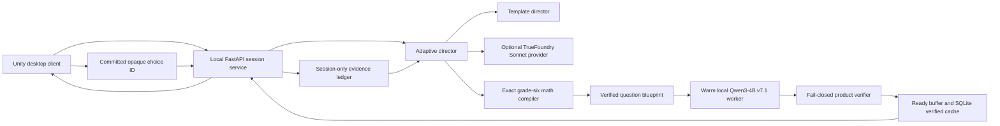

# Counterfeit Protocol Unity Master Product Plan

> **For agentic workers:** REQUIRED SUB-SKILL: Use superpowers:subagent-driven-development (recommended) or superpowers:executing-plans to implement this plan task-by-task. Steps use checkbox (`- [ ]`) syntax for tracking.

> **Controlling amendment (2026-07-11):** Implement
> [`2026-07-11-counterfeit-protocol-competence-engine.md`](./2026-07-11-counterfeit-protocol-competence-engine.md)
> before this plan's Task 1 freezes contracts. If any requirement in this master plan
> conflicts with that amendment, the Competence Engine amendment controls. The product
> rationale is recorded in
> [`../../COUNTERFEIT_PROTOCOL_COMPETENCE_SYNTHESIS.md`](../../COUNTERFEIT_PROTOCOL_COMPETENCE_SYNTHESIS.md).

The amendment explicitly supersedes these original decisions wherever they still appear
later in this document:

| Superseded decision | Controlling replacement |
|---|---|
| Correct answers emit `verified_emp` or grant Proof Boost | The trusted rule produces a legible world effect; math never grants a damage advantage |
| Wrong answers strengthen an enemy | The selected counterfeit runs as a coherent, reversible protocol with equal final progress |
| A second repair MCQ | Direct manipulation of the mathematical representation, followed by a rerun |
| Sonnet chooses `FollowupIntent` | Deterministic `ProbePlanner` chooses `ProbeRequest`; Sonnet supplies bounded story/tone only |
| Evidence is only `unseen / needs_check / recovered` | Immutable observations reduce into hypothesis, repair, and delayed-transfer states |
| Child summaries show first-try/recovery counts | Child summaries show systems repaired, strategies used, protocols observed, and effects unlocked |
| A health-bar boss activates inferred weaknesses | A diagnostic convoy asks the player to choose test inputs and separate unknown protocols |
| Driving primarily hides generation latency | Driving supports manipulation, exploration, and optional quiet experimentation |
| Cache coverage is keyed only by target and difficulty band | Competence fallbacks must cover exact probe, route, changed-dimension, support, and prior-receipt compatibility before an offer is shown |

**Goal:** Build a product-quality, downloadable Unity vertical slice in which a converted
serving artifact of the final Qwen3-4B v7.1 adapter generates live counterfeits that pass
procedure-level product safety checks, those counterfeits become inspectable physical
rules, and a deterministic Competence Engine turns a validated causal repair into new
player agency while recording later changed-context evidence separately. A bounded optional Sonnet director supplies story framing and
child-friendly tone without becoming the mathematical or adaptive authority.

**Architecture:** A Unity 6 URP desktop client talks only to a local FastAPI session
service. The service compiles exact grade-six questions, calls a persistent local
Qwen3-4B worker, rejects unsafe or inconsistent output, and maintains a verified
encounter buffer. A deterministic evidence reducer, probe planner, transfer scheduler,
challenge director, and unlock policy control adaptation; an optional server-side
TrueFoundry provider returns bounded story and tone variants only. Unity executes each
verified rule as a forecastable, manipulable world protocol. The existing research code
and released 2D game remain unchanged reference boundaries.

**Tech Stack:** Unity `6000.3.11f1`, Universal Render Pipeline, C#, Unity Input System,
Cinemachine, Newtonsoft JSON, Python 3, FastAPI/Pydantic, SQLite, `llama.cpp` Metal
runtime with a merged `Q4_K_M` GGUF, existing TrueFoundry OpenAI-compatible gateway,
Blender, Unity Test Framework, Python `unittest`, and JSON Schema fixtures.

## Global Constraints

- Planning approval does not authorize implementation, package installation, model or
  asset downloads, API calls, commits, pushes, or public deployment.
- Do not modify the final model, research datasets, frozen 140-record holdout,
  `PROJECT_CONTEXT.md`, `dataset_sample.jsonl`, or historical evaluation results.
- Product-side verification must be described as a serving safety layer around an
  unchanged trained adapter and a separately benchmarked converted serving artifact,
  never as an improvement to the model's reported research score.
- Raw SLM or Sonnet output never reaches the Unity client or player.
- Sonnet never decides mathematical truth, creates distractors, diagnoses the child, or
  generates executable game instructions.
- The downloadable client must not contain `TFY_API_KEY`, `HF_TOKEN`, or any other
  provider credential.
- One wrong response is one temporary practice signal, not a permanent learner label.
- No child free text, voice, name, account, advertising identifier, stable analytics ID,
  or cross-session profile enters the vertical slice.
- Math is untimed; combat pauses during question reading and answer commitment.
- Combat targets nonhuman machines and uses repair/energy tools without gore.
- The first shippable mission is one compact location, one rover, one NPC, two drone
  behaviors, one boss composition, and three dynamic encounters.
- Live generation in the first slice is limited to the benchmark-approved grade-six
  Number subset: decimal addition/subtraction, fraction addition, and
  integer addition/subtraction. Other skills remain human-reviewed cache content until
  their automatic semantic gate independently passes.
- Use only original or commercially redistributable assets; record source, author,
  license, modification, and required attribution before import.
- Do not commit model weights or marketplace assets to Git.
- No commit or push is allowed unless the owner separately authorizes it during
  execution.

---

## 1. Locked product direction

### Experience

**Mathbreakers: Counterfeit Protocol** is a single-player third-person combat-rover
game. Engineer NPC Nia sends the player into a cinematic desert relay complex. The
player drives, boosts, uses a Pulse Lance and tether as diagnostic tools, contains hover
drones, and exposes Logic Cores. Each core pauses pressure and presents one trusted
outcome plus three verified SLM-created counterfeit outcomes. The chosen rule executes
physically; the player inspects its trace, manipulates the faulty representation, reruns
the repaired machine, and gains the same convoy companion/world-control ability whether
or not help was used. A later cue-free changed-context action is recorded as evidence;
it does not gate access or claim mastery.

### Why the rover is the scope-efficient choice

- Driving and fighting share one controller, camera, health system, animation set, and
  hero model.
- Hover pods use readable code-driven articulation rather than wheel-collider tuning.
- Drone opponents avoid humanoid locomotion, facial animation, gore, and melee systems.
- Nia can be a high-quality radio/hologram performance without a modeled human or lip
  sync.
- One contained relay station can receive dense lighting, materials, VFX, audio, and
  restoration states instead of spreading effort across an empty open world.

### Public product modes

| Mode | Audience | SLM | Sonnet | Cost and distribution |
|---|---|---|---|---|
| Owner showcase | Local Mac demo | Live local GGUF | Existing TrueFoundry via local `.env` | No shipped secret; owner-operated |
| Public Live Forge beta | Supported desktop hardware | Bundled local GGUF and `llama.cpp` sidecar | Template director by default; optional owner-hosted proxy | Multi-gigabyte download, no GPU hosting bill |
| Public teaser/fallback | Browser or unsupported desktop | Previously verified SLM encounters | Authored templates | Static hosting; current 2D release remains available |

The first full Live Forge beta is downloadable. The zero-dollar milestone is an owner
showcase followed by a clearly labeled unsigned closed hardware alpha; a frictionless
macOS public release requires Developer ID signing/notarization or a funded alternative,
and a broad game-business launch should include a tested Windows build. A dependable
public cloud GPU is explicitly not part of the zero-dollar milestone. Before
redistributing the converted model, audit the base, adapter, tokenizer, `llama.cpp`, and
included asset licenses and preserve their notices. The existing browser game remains
the immediate public teaser while packaging and platform coverage mature.

### Vertical-slice acceptance

The approved slice is an `8–10` minute mission with:

- one approximately `150 m × 150 m` relay-station map;
- one Aegis R4 rover with drive, reverse, boost, aim, Pulse Lance, and shield;
- one Nia radio/hologram presentation;
- two drone behaviors and one boss configuration assembled from the same kit;
- three dynamic Logic Core encounters;
- at least one demonstrated wrong-answer hypothesis, discriminating probe, direct
  physical repair with equal-access agency unlock, and separate interleaved cue-free
  changed-context observation;
- one visible environment restoration;
- three cosmetic paint presets;
- one post-mission Protocol Workbench showing systems repaired, strategies used,
  protocols observed, effects unlocked, and live-versus-cache provenance without
  first-try or accuracy counts;
- one polished front door: title, continue/start, settings, accessibility, credits,
  Forge warm-up status, recoverable service error, mission summary, and replay;
- complete keyboard/controller navigation, captions, text scaling, high contrast,
  reduced camera motion, and separate combat/math difficulty controls.

---

## 2. Runtime topology



The service returns a `PreparedEncounter` containing neutral public choices. It retains
the correct choice, procedure-level misconception, computation, trusted steps, and raw
provider records server-side. `POST /answers` resolves one opaque choice and then returns
bounded `SelectedEvidence`: the verified computation and canonical authored explanation
for a counterfeit, plus the trusted answer and steps when the encounter resolves. The
SLM's defining show-the-work evidence is hidden before commitment, not hidden forever.

### Generation policy

1. Select a supported skill, difficulty, world skin, and optional practice target.
2. Compile operands, exact answer, and trusted steps with rational arithmetic.
3. Optionally ask Sonnet for a bounded `StorySkin` containing no mathematical values.
4. Render the trusted question from the blueprint and approved story skin.
5. Send the current model contract—question, correct answer, topic—to the converted
   serving artifact of the unchanged trained adapter.
6. Strictly validate all three distractors as a unit.
7. Require every accepted distractor to match one distinct allowlisted procedure-level
   misconception, canonical explanation, combat effect, and authored repair mechanism.
8. Place the sealed encounter in the ready buffer.
9. If the live deadline expires or validation fails, serve one matching verified SLM
   cache record in under one second.

The previous production run accepted `19/60` candidates automatically and owner-approved
`6/60`; raw generation cannot be placed on the critical input path. The initial spike
must measure converted-model acceptance and latency on the M4 rather than assuming the
Colab rate transfers.

Sonnet receives no session ID or answer history. In the owner showcase only, a wrong
answer may send the canonical `skill_id`, `misconception_id`, and world-skin enum through
the local TrueFoundry provider for a tone rewrite. Public zero-cost mode uses authored
local explanations. Any future public proxy requires explicit disclosure of that
anonymous answer-derived signal, vendor retention review, authentication, quota, and a
short one-attempt deadline.

---

## 3. Repository map

```text
contracts/live-game/v1/
├── session-create.schema.json
├── session-created.schema.json
├── director-request.schema.json
├── question-blueprint.schema.json
├── story-skin.schema.json
├── prepared-encounter.schema.json
├── next-encounter.schema.json
├── answer-request.schema.json
├── answer-result.schema.json
├── mission-summary.schema.json
├── health-response.schema.json
├── api-error.schema.json
├── sidecar-launch.schema.json
├── shutdown-request.schema.json
├── shutdown-accepted.schema.json
└── fixtures/

services/counterfeit_forge/
├── requirements-live.in
├── requirements-live.lock
├── CounterfeitForge.spec
├── app/
│   ├── __init__.py
│   ├── api.py
│   ├── config.py
│   ├── contracts.py
│   ├── math_kernel.py
│   ├── misconceptions.py
│   ├── misconception_registry.py
│   ├── validation.py
│   ├── orchestrator.py
│   ├── cache.py
│   ├── evidence.py
│   ├── launcher.py
│   └── providers/
│       ├── __init__.py
│       ├── distractor.py
│       ├── llama_cpp.py
│       ├── recorded.py
│       ├── director.py
│       ├── template_director.py
│       └── truefoundry_director.py
├── scripts/
│   ├── benchmark_live_model.py
│   └── seed_verified_cache.py
└── tests/
    ├── test_contracts.py
    ├── test_math_kernel.py
    ├── test_misconceptions.py
    ├── test_validation.py
    ├── test_orchestrator.py
    ├── test_api.py
    └── fixtures/

game/live-harness/
├── index.html
├── app.js
├── live-adapter.js
└── live-adapter.test.js

unity/CounterfeitProtocol/
├── Assets/_Game/
│   ├── Art/
│   ├── Audio/
│   ├── Data/
│   ├── Editor/
│   ├── Prefabs/
│   ├── Scenes/
│   ├── Scripts/
│   │   ├── Api/
│   │   ├── Combat/
│   │   ├── Encounters/
│   │   ├── Input/
│   │   ├── Npc/
│   │   ├── Rover/
│   │   ├── Session/
│   │   └── Ui/
│   ├── Settings/
│   └── Tests/
│       ├── EditMode/
│       └── PlayMode/
├── Packages/
└── ProjectSettings/

models/                         gitignored runtime weights only
docs/COUNTERFEIT_PROTOCOL_3D_ASSET_BRIEF.md
docs/THIRD_PARTY_ASSETS.md
```

The new service may import `src.prompts`, `src.consistency`, and immutable model IDs
through one adapter. It must not edit those modules or import the training-only buggy
procedure registry as runtime game authority.

---

## 4. Shared contracts

Use these stable public names in Python, JSON Schema, and C#:

```python
from typing import Annotated, Literal

from pydantic import BaseModel, ConfigDict, Field, model_validator


def to_camel(value: str) -> str:
    head, *tail = value.split("_")
    return head + "".join(part.capitalize() for part in tail)


class StrictContract(BaseModel):
    model_config = ConfigDict(
        alias_generator=to_camel,
        extra="forbid",
        populate_by_name=True,
    )


SkillId = Literal[
    "decimal_add_subtract",
    "fraction_add",
    "integer_add_subtract",
]
MisconceptionId = Literal[
    "decimal_align_whole_digits",
    "decimal_ignore_place_value",
    "decimal_operation_swap",
    "fraction_add_denominators",
    "fraction_ignore_common_denominator",
    "fraction_multiply_instead_of_add",
    "integer_drop_negative",
    "integer_add_absolute_values",
    "integer_reverse_difference",
]
GlitchFamilyId = Literal[
    "decimal_drifter",
    "place_value_phantom",
    "operation_swapper",
    "fraction_forger",
    "sign_flipper",
]
CombatEffectId = Literal[
    "verified_emp",
    "decimal_drift",
    "place_shift",
    "operation_swap",
    "fraction_split",
    "sign_invert",
]
SessionId = Annotated[str, Field(pattern=r"^ses_[a-z0-9]{20}$")]
EncounterId = Annotated[str, Field(pattern=r"^enc_[a-z0-9]{20}$")]
Sha256Hex = Annotated[str, Field(pattern=r"^[0-9a-f]{64}$")]


class PublicQuestion(StrictContract):
    prompt: str = Field(min_length=1, max_length=500)
    skill_id: SkillId
    topic: str = Field(min_length=1, max_length=120)


class PublicOption(StrictContract):
    id: str = Field(pattern=r"^opt_[a-z0-9]{16}$")
    display: str = Field(min_length=1, max_length=64)


class DirectorRequest(StrictContract):
    schema_version: Literal["director-request-v1"]
    session_id: SessionId
    skill_id: SkillId
    difficulty: int = Field(ge=1, le=3)
    target_misconception_id: MisconceptionId | None
    seed: int = Field(ge=0, le=2_147_483_647)
    world_state_id: Literal["relay_damaged", "relay_contested", "relay_repairing"]


class QuestionBlueprint(StrictContract):
    schema_version: Literal["question-blueprint-v1"]
    skill_id: SkillId
    template_id: str = Field(pattern=r"^[a-z0-9]+(?:_[a-z0-9]+)*$")
    seed: int = Field(ge=0, le=2_147_483_647)
    operands: dict[str, int | str]
    canonical_prompt: str = Field(min_length=1, max_length=500)
    exact_answer: str = Field(min_length=1, max_length=64)
    trusted_steps: tuple[Annotated[str, Field(min_length=1, max_length=240)], ...]
    topic: str = Field(min_length=1, max_length=120)
    difficulty: int = Field(ge=1, le=3)
    solver_version: Literal["number-solver-v1"]
    question_fingerprint: Annotated[str, Field(pattern=r"^question:v1:[0-9a-f]{64}$")]


class StorySkin(StrictContract):
    schema_version: Literal["story-skin-v1"]
    skin_id: Literal["relay_charge", "coolant_flow", "signal_array"]
    npc_id: Literal["nia"]
    intro_variant_id: Literal[
        "relay_losing_power", "coolant_unstable", "signal_corrupted",
    ]
    quantity_noun_id: Literal["charge", "coolant", "signal_strength"]
    outro_variant_id: Literal[
        "choose_safe_conduit", "stabilize_core", "restore_route",
    ]


class FollowupIntent(StrictContract):
    schema_version: Literal["followup-intent-v1"]
    skill_id: SkillId
    target_misconception_id: MisconceptionId | None
    difficulty_delta: Literal[-1, 0, 1]
    world_state_id: Literal["relay_damaged", "relay_contested", "relay_repairing"]


class VerifiedDistractor(StrictContract):
    answer: str = Field(min_length=1, max_length=64)
    slm_misconception: str = Field(min_length=3, max_length=240)
    computation: str = Field(min_length=3, max_length=320)
    misconception_id: MisconceptionId
    glitch_family_id: GlitchFamilyId
    combat_effect_id: CombatEffectId


class VerifiedDistractorSet(StrictContract):
    distractors: tuple[
        VerifiedDistractor,
        VerifiedDistractor,
        VerifiedDistractor,
    ]
    model_receipt_sha256: Sha256Hex


class PreparedEncounter(StrictContract):
    schema_version: Literal["prepared-encounter-v1"]
    encounter_id: EncounterId
    question: PublicQuestion
    options: tuple[PublicOption, PublicOption, PublicOption, PublicOption]
    generation_mode: Literal["live-verified", "cached-verified"]


class AnswerRequest(StrictContract):
    schema_version: Literal["answer-request-v1"]
    submission_id: Annotated[str, Field(pattern=r"^sub_[a-z0-9]{20}$")]
    option_id: Annotated[str, Field(pattern=r"^opt_[a-z0-9]{16}$")]


class SelectedEvidence(StrictContract):
    misconception_id: MisconceptionId
    verified_computation: str = Field(min_length=3, max_length=320)
    canonical_explanation: str = Field(min_length=1, max_length=180)
    skill_label: str = Field(min_length=1, max_length=80)


class AnswerResult(StrictContract):
    schema_version: Literal["answer-result-v1"]
    encounter_id: EncounterId
    correct: bool
    selected_display: str = Field(min_length=1, max_length=64)
    selected_evidence: SelectedEvidence | None
    npc_encouragement: str | None = Field(default=None, max_length=120)
    repair_prompt: str = Field(min_length=1, max_length=180)
    combat_effect_id: CombatEffectId
    practice_skill_id: SkillId
    trusted_answer: str = Field(min_length=1, max_length=64)
    trusted_steps: tuple[Annotated[str, Field(min_length=1, max_length=240)], ...]

    @model_validator(mode="after")
    def outcome_matches_evidence(self):
        if self.correct:
            if self.selected_evidence is not None or self.combat_effect_id != "verified_emp":
                raise ValueError("correct outcomes use verified_emp and no misconception")
        elif self.selected_evidence is None or self.combat_effect_id == "verified_emp":
            raise ValueError("counterfeit outcomes require selected evidence")
        return self


class SealedOption(StrictContract):
    id: Annotated[str, Field(pattern=r"^opt_[a-z0-9]{16}$")]
    display: str = Field(min_length=1, max_length=64)
    correct: bool
    misconception_id: MisconceptionId | None
    slm_misconception: str | None
    computation: str | None
    repair_prompt: str = Field(min_length=1, max_length=180)
    combat_effect_id: CombatEffectId


class SealedEncounter(StrictContract):
    encounter_id: EncounterId
    question: PublicQuestion
    options: tuple[SealedOption, SealedOption, SealedOption, SealedOption]
    trusted_steps: tuple[str, ...]
    question_fingerprint: str
    model_receipt_sha256: Sha256Hex
    generation_mode: Literal["live-verified", "cached-verified"]


class SessionCreate(StrictContract):
    schema_version: Literal["session-create-v1"]
    requested_skill_id: SkillId
    combat_assist: Literal["full", "standard", "minimal"]
    math_difficulty: Literal[1, 2, 3]


class SessionCreated(StrictContract):
    schema_version: Literal["session-created-v1"]
    session_id: SessionId
    expires_at_utc: Annotated[
        str,
        Field(pattern=r"^\d{4}-\d{2}-\d{2}T\d{2}:\d{2}:\d{2}Z$"),
    ]
    forge_mode: Literal["live-local", "cache-only"]


class NextEncounterResponse(StrictContract):
    schema_version: Literal["next-encounter-v1"]
    state: Literal["warming", "generating", "ready", "exhausted"]
    retry_after_ms: int | None = Field(default=None, ge=100, le=5_000)
    encounter: PreparedEncounter | None

    @model_validator(mode="after")
    def state_matches_payload(self):
        if self.state == "ready":
            if self.encounter is None or self.retry_after_ms is not None:
                raise ValueError("ready requires one encounter and no retry delay")
        elif self.state in {"warming", "generating"}:
            if self.encounter is not None or self.retry_after_ms is None:
                raise ValueError("pending state requires a retry delay and no encounter")
        elif self.encounter is not None or self.retry_after_ms is not None:
            raise ValueError("exhausted contains neither encounter nor retry delay")
        return self


class HealthResponse(StrictContract):
    schema_version: Literal["health-response-v1"]
    live: bool
    ready: bool
    model_loaded: bool
    ready_buffer_count: int = Field(ge=0, le=8)
    mode: Literal["live-local", "cache-only"]


class ApiError(StrictContract):
    schema_version: Literal["api-error-v1"]
    code: Literal[
        "bad_request", "unauthorized", "not_found", "conflict",
        "not_ready", "service_unavailable",
    ]
    safe_message: str = Field(min_length=1, max_length=160)
    retryable: bool


class MissionSummary(StrictContract):
    schema_version: Literal["mission-summary-v1"]
    completed_encounters: int = Field(ge=0, le=3)
    live_verified_count: int = Field(ge=0, le=3)
    cached_verified_count: int = Field(ge=0, le=3)
    first_try_correct_count: int = Field(ge=0, le=3)
    recovered_count: int = Field(ge=0, le=3)

    @model_validator(mode="after")
    def counts_are_consistent(self):
        if self.live_verified_count + self.cached_verified_count != self.completed_encounters:
            raise ValueError("live plus cached must equal completed")
        if self.first_try_correct_count > self.completed_encounters:
            raise ValueError("first-try count exceeds completed")
        if self.recovered_count > self.completed_encounters:
            raise ValueError("recovered count exceeds completed")
        return self


class SidecarLaunch(StrictContract):
    schema_version: Literal["sidecar-launch-v1"]
    forge_port: int = Field(ge=49_152, le=65_535)
    one_run_bearer_token: Annotated[
        str,
        Field(pattern=r"^[A-Za-z0-9_-]{43,86}$"),
    ]
    unity_parent_pid: int = Field(gt=0)


class ShutdownRequest(StrictContract):
    schema_version: Literal["shutdown-request-v1"]
    unity_parent_pid: int = Field(gt=0)


class ShutdownAccepted(StrictContract):
    schema_version: Literal["shutdown-accepted-v1"]
    accepted: Literal[True]
```

All HTTP JSON uses the camelCase aliases. Python uses the snake_case attributes. Unity
uses the exact camelCase JSON names. `target_misconception_id` changes the next trusted
question template and operand distribution; it is not added to the current SLM prompt,
because the final model has not demonstrated reliable requested-misconception control.

The corresponding C# DTOs preserve the same JSON names:

```csharp
[JsonObject(MemberSerialization.OptIn)]
public sealed class PreparedEncounterDto
{
    [JsonProperty("schemaVersion", Required = Required.Always)]
    public string SchemaVersion { get; set; }
    [JsonProperty("encounterId", Required = Required.Always)]
    public string EncounterId { get; set; }
    [JsonProperty("question", Required = Required.Always)]
    public PublicQuestionDto Question { get; set; }
    [JsonProperty("options", Required = Required.Always)]
    public PublicOptionDto[] Options { get; set; }
    [JsonProperty("generationMode", Required = Required.Always)]
    public string GenerationMode { get; set; }
}

[JsonObject(MemberSerialization.OptIn)]
public sealed class AnswerResultDto
{
    [JsonProperty("schemaVersion", Required = Required.Always)]
    public string SchemaVersion { get; set; }
    [JsonProperty("encounterId", Required = Required.Always)]
    public string EncounterId { get; set; }
    [JsonProperty("correct", Required = Required.Always)]
    public bool Correct { get; set; }
    [JsonProperty("selectedDisplay", Required = Required.Always)]
    public string SelectedDisplay { get; set; }
    [JsonProperty("selectedEvidence", Required = Required.AllowNull)]
    public SelectedEvidenceDto SelectedEvidence { get; set; }
    [JsonProperty("npcEncouragement", Required = Required.AllowNull)]
    public string NpcEncouragement { get; set; }
    [JsonProperty("repairPrompt", Required = Required.Always)]
    public string RepairPrompt { get; set; }
    [JsonProperty("combatEffectId", Required = Required.Always)]
    public string CombatEffectId { get; set; }
    [JsonProperty("practiceSkillId", Required = Required.Always)]
    public string PracticeSkillId { get; set; }
    [JsonProperty("trustedAnswer", Required = Required.Always)]
    public string TrustedAnswer { get; set; }
    [JsonProperty("trustedSteps", Required = Required.Always)]
    public string[] TrustedSteps { get; set; }
}
```

Every Unity DTO uses Newtonsoft JSON with `MissingMemberHandling.Error`, required
properties, enum converters that reject unknown values, and an explicit `Validate()`
method for patterns, bounds, four unique option IDs, and outcome invariants. Do not use
`JsonUtility`; it silently ignores unknown members and cannot enforce the shared trust
contract. Golden-fixture tests serialize Python with `model_dump(by_alias=True)` and
require Unity to reject every Python-negative fixture.

Public options contain only `id` and `display`. Before commitment, correctness,
misconception, computation, repair binding, provenance, and raw text remain in an
internal `SealedEncounter`. After commitment, `AnswerResult` releases only the bounded
verified evidence for the selected option; raw provider text and unselected option
diagnoses never cross the boundary.

---

## 5. Dependency-ordered work packages

This master plan locks product boundaries and dependency order. After owner review, split
it into four executable TDD plans—live intelligence, Unity graybox, end-to-end
integration, and public packaging—with exact source-file implementations and test code.
Do not execute broad wildcard steps directly from this master document.

### Task 0: Create the minimal Unity test skeleton

**Files:**
- Create: `unity/CounterfeitProtocol/Packages/manifest.json`
- Create: `unity/CounterfeitProtocol/Packages/packages-lock.json`
- Create: `unity/CounterfeitProtocol/ProjectSettings/ProjectVersion.txt`
- Create: `unity/CounterfeitProtocol/Assets/_Game/Tests/EditMode/EditMode.asmdef`
- Create: `unity/CounterfeitProtocol/Assets/_Game/Tests/PlayMode/PlayMode.asmdef`
- Create: `unity/CounterfeitProtocol/Assets/_Game/Tests/EditMode/ProjectBootTests.cs`

**Interfaces:**
- Produces: a clean Unity `6000.3.11f1` project capable of running strict JSON contract
  tests before gameplay scenes exist.

- [ ] Pin only URP, Input System, Cinemachine, Newtonsoft JSON, and Unity Test Framework
  packages compatible with the installed editor; preserve the resolved lock file.
- [ ] Write one failing EditMode boot test that requires the expected Unity version,
  `_Game` assembly boundary, and Newtonsoft strict serializer settings.
- [ ] Run:

  ```bash
  "/Applications/Unity/Hub/Editor/6000.3.11f1/Unity.app/Contents/MacOS/Unity" \
    -batchmode -nographics \
    -projectPath unity/CounterfeitProtocol \
    -runTests -testPlatform EditMode \
    -testResults /tmp/counterfeit-protocol-editmode.xml \
    -logFile /tmp/counterfeit-protocol-unity.log -quit
  ```

  Expected: the intentionally failing boot assertion appears in the test result, while
  package import and script compilation complete without errors.
- [ ] Add the minimal project constants and strict serializer wrapper, rerun the same
  command, and require zero failures before Task 1.

### Task 1: Freeze cross-runtime contracts

**Files:**
- Create the 15 exact schema files listed in Section 3 under `contracts/live-game/v1/`.
- Create: `contracts/live-game/v1/fixtures/session-created.valid.json`
- Create: `contracts/live-game/v1/fixtures/encounter-live.valid.json`
- Create: `contracts/live-game/v1/fixtures/encounter-cached.valid.json`
- Create: `contracts/live-game/v1/fixtures/answer-correct.valid.json`
- Create: `contracts/live-game/v1/fixtures/answer-counterfeit.valid.json`
- Create: `contracts/live-game/v1/fixtures/next-pending.valid.json`
- Create: `contracts/live-game/v1/fixtures/unknown-field.invalid.json`
- Create: `contracts/live-game/v1/fixtures/duplicate-option.invalid.json`
- Create: `services/counterfeit_forge/app/contracts.py`
- Create: `services/counterfeit_forge/tests/test_contracts.py`
- Create: `unity/CounterfeitProtocol/Assets/_Game/Scripts/Api/LiveContracts.cs`
- Create: `unity/CounterfeitProtocol/Assets/_Game/Tests/EditMode/LiveContractTests.cs`

**Interfaces:**
- Consumes: the exact class names and field contracts in Section 4.
- Produces: schema-valid fixtures accepted identically by Pydantic and Unity.

- [ ] Write failing Python tests that reject an extra field, missing schema version,
  repeated option ID, non-four-option encounter, and an `AnswerResult` over the display
  limits.
- [ ] Run:

  ```bash
  .venv/bin/python -m unittest discover -s services/counterfeit_forge/tests -p 'test_contracts.py' -v
  ```

  Expected: failures because the models and schemas do not exist.
- [ ] Implement strict Pydantic models with `extra="forbid"`, bounded strings, exact
  four-option validation, and lowercase opaque ID patterns.
- [ ] Add the exact valid/invalid golden fixtures listed above. Serialize Python fixtures
  with `model_dump(by_alias=True)`.
- [ ] Write Unity EditMode tests using Newtonsoft JSON with
  `MissingMemberHandling.Error`; deserialize every valid public fixture, run explicit
  DTO validation, reserialize the same public values, and reject every invalid fixture.
- [ ] Run the Python contract suite and Unity EditMode contract suite; require zero
  failures before another workstream consumes the contract.

### Task 2: Build the exact question compiler

**Files:**
- Create: `services/counterfeit_forge/app/math_kernel.py`
- Create: `services/counterfeit_forge/tests/test_math_kernel.py`
- Create: `services/counterfeit_forge/tests/fixtures/question_blueprints.json`

**Interfaces:**
- Consumes: `DirectorRequest`.
- Produces: `QuestionBlueprint` with canonical prompt, exact answer, trusted steps,
  operands, topic, difficulty, and `question_fingerprint`.

- [ ] Write failing property-style tests across fixed seeds for the initial live subset:
  decimal addition/subtraction, fraction addition, and integer
  addition/subtraction.
- [ ] Require every compiled answer to equal an independently evaluated trusted final
  step and every prompt quantity to be grounded in the operand record. Load the exact
  ordered frozen holdout and require `140` records with SHA-256
  `47ce1e1b85ebaae0782f0aed32fa12bb6ec0fd4498ed71c75cf3e4aff5135693` before running
  both exact-fingerprint and near-duplicate exclusion. A truncated, reordered, or
  substituted holdout fails before any question compiles.
- [ ] Implement generation with `fractions.Fraction`, `decimal.Decimal`, and the bounded
  solver patterns already proven in `src.game_content`; never use Python `eval`.
- [ ] Add deterministic difficulty bounds and reject any seed that produces an equivalent
  duplicate, zero denominator, or unsupported notation. `StorySkin` contains no numeric
  quantities and therefore is not part of numeric grounding.
- [ ] Run the full fixed-seed suite twice and assert byte-identical serialized blueprints.

### Task 3: Export the trained adapter into a converted serving artifact

**Files:**
- Create: `notebooks/export_counterfeit_protocol_gguf_colab.ipynb`
- Create: `data/game/live_runtime/reference_questions_v1.jsonl`
- Create: `data/game/live_runtime/reference_manifest_v1.json`
- Create: `services/counterfeit_forge/model_manifest.schema.json`
- Create: `services/counterfeit_forge/tests/test_model_manifest.py`
- Root-integration modify: `.gitignore` to exclude `models/`, `*.gguf`, benchmark raw
  outputs, and local SQLite cache files; the live-intelligence lane does not edit this
  shared root file.

**Interfaces:**
- Consumes: training base `unsloth/Qwen3-4B-bnb-4bit` revision
  `cad0bedfdd862093a12af478cb974ab2addd0e0a`, adapter
  `j2ampn/qwen3-4b-distractor-lora-v7` revision
  `dd30dcea2755b7a2659faa908714e31335349408`, and the exact compatible full-precision
  base identity proven from adapter/base metadata before merge.
- Produces: a hash-bound merged-BF16 then `Q4_K_M` GGUF serving derivative plus manifest
  and a pinned Apple-arm64 `llama-server`; it does not replace the research artifact.

- [ ] Write a failing manifest test requiring model ID, adapter ID, both immutable
  training revisions, full-precision export base ID/revision, BF16 merge dtype,
  `Q4_K_M`, tokenizer hash, chat-template hash, GGUF SHA-256, exporter source hash,
  Unsloth/converter/`llama.cpp` commits, prompt version, and license identifiers.
- [ ] Create the Colab export notebook so it verifies the adapter configuration and
  tokenizer provenance, refuses an unproven full-precision base lineage, merges in BF16,
  exports exactly `Q4_K_M`, hashes the result, and downloads only the GGUF, source
  reference outputs, and their manifests. The notebook must not claim output equivalence
  before regression testing.
- [ ] Before quantization, run the source Unsloth adapter deterministically over the
  exact 20-record non-holdout `reference_questions_v1.jsonl`. Download
  `data/game/work/live_runtime_source_outputs_v1.jsonl` plus a manifest binding question
  hash, output hash, source backend hash, prompt hash, model/adapter revisions, tokenizer
  hash, chat-template hash, and generation parameters. Keep raw outputs gitignored; keep
  the non-sensitive receipt in `reference_manifest_v1.json`.
- [ ] Owner action after plan approval: run the notebook and place the downloaded GGUF
  under gitignored `models/counterfeit-protocol/`.
- [ ] Acquire or build `llama-server` for Apple arm64 from the exact manifest commit,
  record its binary SHA-256 and license, and reject an unpinned package-manager binary.
- [ ] Run it with Metal acceleration, loopback-only binding, an independent ephemeral API
  key known only to the Forge service, no CORS wildcard, deterministic decoding, and the
  minimum measured context. Apply the Qwen chat template with thinking disabled; reject
  any completion containing `<think>` or `</think>` in the raw-provider boundary.
- [ ] Run a five-prompt conversion smoke solely to prove load, template, deterministic
  repeatability, and clean JSON transport. Task 4 owns quality/acceptance benchmarking
  after the actual product verifier exists.

### Task 4: Implement the SLM provider and fail-closed verifier

**Files:**
- Create: `services/counterfeit_forge/app/providers/distractor.py`
- Create: `services/counterfeit_forge/app/providers/llama_cpp.py`
- Create: `services/counterfeit_forge/app/providers/recorded.py`
- Create: `services/counterfeit_forge/app/misconceptions.py`
- Create: `services/counterfeit_forge/app/validation.py`
- Create: `services/counterfeit_forge/scripts/benchmark_live_model.py`
- Create: `services/counterfeit_forge/tests/test_misconceptions.py`
- Create: `services/counterfeit_forge/tests/test_validation.py`

**Interfaces:**
- Consumes: verified `QuestionBlueprint` and a `DistractorProvider` returning exact raw
  completion text.
- Produces: `VerifiedDistractorSet` only after the complete three-item response passes.

- [ ] Define `DistractorProvider.generate(question, correct, topic) -> str`; provide a
  recorded test provider and a timeout-bounded `llama.cpp` provider.
- [ ] Write failing tests for duplicate JSON keys, prose around JSON, extra fields, wrong
  count, equivalent values, repeated values, repeated labels, ungrounded operands,
  computation mismatch, correct-answer collision, unsupported characters, and oversized
  fields.
- [ ] Reuse immutable prompt construction and bounded computation parsing through a
  narrow adapter; do not change `src.prompts` or `src.consistency`.
- [ ] Implement a product-only `map_misconception(blueprint, parsed_computation)` that
  returns one exact procedure-level `MisconceptionId`, its broader `GlitchFamilyId`, and
  `CombatEffectId` only when the computation AST demonstrates that supported
  transformation. Treat the SLM's free-form label as secondary evidence and require it
  to agree with the canonical procedure through an explicit tested vocabulary; a broad
  family match is insufficient. Do not import `src.buggy_procedures`; duplicate only the
  minimal independently tested serving rules needed for the three approved live skills.
- [ ] Reject label/trace contradiction, multiple overlapping procedure matches, answers
  with implausible unit or magnitude for the blueprint, inconsistent answer formatting,
  obvious outlier/tell formatting, contextual nonsense, or three procedures that are not
  pedagogically distinct. Skills whose semantic checks cannot be made deterministic are
  human-reviewed cache-only content.
- [ ] Reject the complete set when any distractor fails. Do not ask Sonnet to repair it,
  silently substitute a deterministic distractor, or merge partial outputs from
  different provenance records.
- [ ] Map accepted outputs to allowlisted combat effects only after arithmetic validation.
  Unsupported mappings return `None` and force another generation or cache fallback.
- [ ] Run mutation tests over each protected field and confirm every mutated record is
  rejected before serialization to a public contract.
- [ ] Compare the converted runtime with source-runtime reference outputs on the same
  20-question corpus. Do not proceed if strict acceptance drops by more than `5`
  percentage points, thinking text appears, or a new safety failure is observed. The
  quantized model may choose different valid distractors, so compare contract metrics
  and independently validate each output rather than requiring byte- or answer-level
  identity.
- [ ] Run a 50-generation owner-showcase smoke. Require `0` invalid public records,
  strict full-set acceptance of at least `25%`, p95 warm generation no slower than
  `30 s`, first verified item within `60 s`, simulated two-item ready-buffer hit rate of
  at least `90%`, and verified-cache retrieval under `250 ms`.
- [ ] Reserve the 500-generation soak for closed/public alpha approval. Require `0` raw
  leaks, `0` invalid public records, at least `95%` ready-buffer hit rate over scripted
  missions, and published p50/p95 acceptance, retry, token, and latency results.

### Task 5: Add bounded story and remediation directors

**Files:**
- Create: `services/counterfeit_forge/app/providers/director.py`
- Create: `services/counterfeit_forge/app/providers/template_director.py`
- Create: `services/counterfeit_forge/app/providers/truefoundry_director.py`
- Create: `services/counterfeit_forge/tests/test_director.py`

**Interfaces:**
- Consumes: allowed skill/world enums. Owner-showcase tone rewriting may additionally
  consume only canonical `skill_id` and `misconception_id`, without session ID, question,
  answer, history, or raw model text.
- Produces: `StorySkin` and `FollowupIntent`; neither type contains mathematical truth.

- [ ] Define `DirectorProvider.create_story(intent) -> StorySkin` and
  `create_followup(signal) -> FollowupIntent`.
- [ ] Write tests proving the template provider needs no credential and always emits
  approved bounded copy.
- [ ] Write injected-client tests proving the TrueFoundry provider sends no name, raw IP,
  stable device ID, answer history, free text, or provider secret in output.
- [ ] Use a service-specific client with one request attempt and a `3 s` total deadline;
  do not reuse the research client's six-attempt exponential retry policy on a gameplay
  path.
- [ ] Constrain Sonnet to enumerated `skin_id`, `npc_id`, `skill_id`, difficulty delta,
  and authored story/explanation variant IDs. The only free generated field is optional
  `npc_encouragement`; reject digits, arithmetic operators, spelled-out cardinal/ordinal
  number words, unsupported skill language, or text over `120` characters.
- [ ] Apply a language gate banning blame, fixed-ability claims, diagnosis certainty,
  insults, fear, purchases, external links, and instructions unrelated to the game.
- [ ] Use authored canonical procedure explanations as immutable mathematical content.
  Sonnet may select an authored explanation variant and emit a separate nonmathematical
  encouragement line, but it may not paraphrase or invent the explanation, repair
  strategy, skill target, computation, or follow-up mathematics.
- [ ] Fall back synchronously to the template provider on missing credential, timeout,
  invalid JSON, rejected language, or provider failure.

### Task 6: Build the session orchestrator, cache, and API

**Files:**
- Create: `services/counterfeit_forge/app/cache.py`
- Create: `services/counterfeit_forge/app/evidence.py`
- Create: `services/counterfeit_forge/app/orchestrator.py`
- Create: `services/counterfeit_forge/app/api.py`
- Create: `services/counterfeit_forge/app/launcher.py`
- Create: `services/counterfeit_forge/tests/test_orchestrator.py`
- Create: `services/counterfeit_forge/tests/test_api.py`

**Interfaces:**
- Produces:
  - `POST /v1/sessions`
  - `GET /v1/sessions/{session_id}/next`
  - `POST /v1/sessions/{session_id}/encounters/{encounter_id}/answers`
  - `GET /v1/sessions/{session_id}/summary`
  - `GET /v1/health/live`
  - `GET /v1/health/ready`
  - `POST /v1/control/shutdown`

- [ ] Write tests for session expiry, two-item ready buffering, live timeout, cache
  fallback, idempotent `submission_id`, repeated submissions, unknown IDs, stale
  encounters, no-key Sonnet operation, and service restart.
- [ ] Store sealed encounters and verified-cache records in local SQLite; store raw
  provider output only in a developer audit directory disabled in public builds.
- [ ] Cache only complete `SealedEncounter` records. Key compatibility by question
  fingerprint, skill, difficulty, target procedure-level misconception, GGUF SHA-256,
  prompt version, solver version, validator version, and product misconception-rule
  version. Recompute the record hash and revalidate every compatibility key on load.
- [ ] Implement `seed_verified_cache.py` and create a human-reviewed public fallback
  minimum of two encounters for each of nine supported procedure IDs at each of two
  difficulty bands: `36` sealed encounters. The owner showcase may start with six
  reviewed cache encounters, but it cannot be called public-ready coverage.
- [ ] Attempt to migrate the six existing approved encounters through the new exact
  blueprint, procedure-level mapping, serving-rule version, and sealed-cache schema.
  Keep only compatible records; generate, validate, and owner-review replacements for
  every missing showcase/public cache slot. Prior approval alone does not bypass the new
  compatibility gate.
- [ ] Keep temporary evidence as `unseen`, `needs_check`, or `recovered`. A first wrong
  choice may schedule one same-skill check but never writes a lasting diagnosis.
- [ ] Resolve committed answers without an AI call so local response time remains below
  `100 ms` outside deliberate presentation animation.
- [ ] Prioritize one targeted follow-up after a wrong answer; hide generation behind the
  authored `15–25` second comeback combat beat and use a verified matching cache record
  if the deadline expires.
- [ ] Bind the service to loopback by default and require the one-run bearer token on
  every endpoint except liveness. Public remote mode requires exact-origin
  CORS, TLS termination, bounded rate limits, and a server-owned Sonnet credential.
- [ ] Define one process owner: Unity chooses an unused Forge loopback port and one-run
  URL-safe bearer token, then starts the packaged Forge executable with the exact
  `SidecarLaunch` values as process arguments. Forge chooses a separate loopback port
  and API key for `llama-server`,
  starts and health-checks that private child, and never exposes its key to Unity. Forge
  accepts authenticated `ShutdownRequest` only when its `unity_parent_pid` matches the
  launch record, returns `ShutdownAccepted`, terminates `llama-server`, and then exits;
  it also exits when the recorded parent disappears. Owner-development mode may start
  services manually; public mode may not require a system Python installation.

### Task 7: Create the live 2D contract harness

**Files:**
- Create: `game/live-harness/index.html`
- Create: `game/live-harness/app.js`
- Create: `game/live-harness/live-adapter.js`
- Create: `game/live-harness/live-adapter.test.js`

**Interfaces:**
- Consumes: only public session API contracts.
- Produces: a developer-only accessible surface for validating live/cached encounters,
  answer resolution, feedback, and follow-up scheduling before Unity integration.

- [ ] Write adapter tests using golden public fixtures before rendering code.
- [ ] Render `generationMode`, question, neutral options, selected outcome, repair copy,
  and next-ready status; never render raw provider output or hidden answer metadata.
- [ ] Preserve the released `game/prototype/` and `glitch-rally-v1` behavior unchanged.
- [ ] Run the complete existing 110-test Node suite plus live-harness tests after every
  harness change.

### Task 8: Build the testable Unity graybox scene shell

**Files:**
- Create: `unity/CounterfeitProtocol/Assets/_Game/Editor/BootstrapProject.cs`
- Create: `unity/CounterfeitProtocol/Assets/_Game/Scenes/Bootstrap.unity`
- Create: `unity/CounterfeitProtocol/Assets/_Game/Scenes/RelayStation.unity`
- Create: Unity EditMode and PlayMode test assemblies under `Assets/_Game/Tests/`.

**Interfaces:**
- Produces: an Apple-Silicon URP project that opens without missing packages and can
  generate its graybox scene deterministically through an Editor command.

- [ ] Write EditMode tests for project constants, layers, tags, input action names,
  quality presets, scene names, and required spawn-point identifiers.
- [ ] Implement `BootstrapProject.BuildGraybox()` to create the lighting rig, terrain,
  relay arena, camera, spawn points, Logic Core positions, drone flight volumes, and test
  objects from primitives.
- [ ] Configure two quality levels with a `60 FPS` target on the owner M4 and a `30 FPS`
  minimum low preset; benchmark rather than claiming those rates from editor feel.
- [ ] Run batch EditMode and PlayMode tests through the exact installed Unity executable
  and require a clean editor log before committing any art dependency to the scene.

### Task 9: Implement rover driving and nonhuman combat

**Files:**
- Create C# under `Assets/_Game/Scripts/Rover/`, `Combat/`, and `Input/`.
- Create EditMode tests under `Assets/_Game/Tests/EditMode/Gameplay/` and PlayMode tests
  under `Assets/_Game/Tests/PlayMode/Gameplay/`.
- Root integration creates production prefabs under `Assets/_Game/Prefabs/Rover/` and
  `Prefabs/Drones/` from reviewed components and nested art `VisualRoot` objects.

**Interfaces:**
- Produces: `RoverMotor`, `RoverAim`, `PulseLance`, `Shield`, `DroneBrain`, and
  `CombatArena` components whose public commands are independent of answer logic.

- [ ] Test acceleration, braking, reverse, boost cooldown, slope limits, hover-pod visual
  alignment, aim clamps, hit validation, shield regeneration, pause/resume, and input
  remapping before art integration.
- [ ] Use an arcade rigidbody/ground-probe rover rather than wheel colliders, realistic
  tire simulation, or general destruction physics.
- [ ] Implement two drone behaviors from one state machine: ranged orbit and shield
  anchor. The boss combines both with the active misconception modifier.
- [ ] Pause enemy damage, projectile simulation, and combat clocks during Focus Mode;
  retain camera/UI navigation and accessibility controls.
- [ ] Drive animation and VFX from explicit state events so reduced-motion mode can
  remove shake, aggressive FOV, flashes, and long travel without changing game state.

### Task 10: Integrate Logic Cores, adaptive outcomes, and NPC presentation

**Files:**
- Create C# under `Assets/_Game/Scripts/Api/`, `Encounters/`, `Session/`, `Npc/`, and
  `Ui/`.
- Create PlayMode integration tests under `Assets/_Game/Tests/PlayMode/Integration/`
  using a recorded local service fixture.
- Root integration creates the production Logic Core, conduit, HUD, Counterfeit Report,
  and Nia hologram prefabs after component review.

**Interfaces:**
- Consumes: `PreparedEncounterDto` and `AnswerResultDto`.
- Produces: deterministic Focus Mode and combat outcomes keyed by `combatEffectId`.

- [ ] Test service unavailable, loading, live, cached, wrong, correct, remediation,
  replay, duplicate submission, and malformed response states before network code.
- [ ] Use `UnityWebRequest` through one `LiveGameClient` with bounded timeouts and no
  embedded credentials.
- [ ] Add `ForgeProcessManager` for packaged builds. It accepts only the ephemeral
  loopback configuration it creates, starts Forge with the selected port/token, waits
  separately for liveness and readiness, reports a clear recoverable error, and invokes
  authenticated shutdown during normal exit or crash recovery; it never starts
  `llama-server` directly, reads `.env`, or reads a provider credential.
- [ ] Display math in a large screen-space panel synchronized with equal world-space
  conduits; never rely on distant diegetic text alone.
- [ ] Require explicit selection and commitment. No option receives correctness color,
  animation, ordering, audio, or accessible-label cues before commitment.
- [ ] Map allowlisted combat effects to authored behavior parameters; generated text
  never selects a component, prefab path, shader, animation clip, or executable action.
- [ ] Present feedback as “This choice matches a strategy that…” and schedule a later
  check without calling the learner a type or reducing earned progress.
- [ ] Build the complete product shell around the mission: title, garage/warm-up,
  settings, accessibility, pause, service-recovery, mission summary, Counterfeit Report,
  credits, and replay. Persist only local settings and cosmetic choices, with one clear
  reset action; do not persist learner evidence across sessions.

### Task 11: Integrate bespoke and licensed art safely

**Files:**
- Use: `docs/COUNTERFEIT_PROTOCOL_3D_ASSET_BRIEF.md`
- Create: `docs/THIRD_PARTY_ASSETS.md`
- Create bespoke runtime art only under
  `unity/CounterfeitProtocol/Assets/_Game/Art/Bespoke/`.
- Create licensed runtime art only under
  `unity/CounterfeitProtocol/Assets/_Game/Art/ThirdParty/`.
- Create project shaders/materials only under
  `unity/CounterfeitProtocol/Assets/_Game/Art/ProjectMaterials/`.

**Interfaces:**
- Produces: the approved rover, Logic Core, drones, environment, materials, VFX, audio,
  and documented license manifest without changing gameplay contracts.

- [ ] Obtain owner approval for the rover and Logic Core briefs before generating,
  commissioning, or downloading 3D assets.
- [ ] Keep custom art off the owner-showcase critical path. Use a license-cleared
  placeholder/kitbash in the graybox and first local showcase if the Aegis R4 or Logic
  Core is not delivered; require the approved bespoke hero assets only before marketing
  the build as the polished public product.
- [ ] Record URL, creator, exact license, retrieval date, permitted commercial use,
  redistribution limits, modifications, and attribution for every external item.
- [ ] Reject NC, ND, editorial-only, unclear, extracted, franchise-derived, or
  engine-incompatible assets.
- [ ] Import each asset into a quarantine scene, verify scale/pivots/LODs/materials,
  profile it, and only then reference it from production prefabs.
- [ ] Finish one coherent visual language: grounded industrial materials, golden-hour
  canyon lighting, teal verified energy, amber/coral counterfeit energy, readable
  silhouettes, restrained bloom, dust, fog, EMP, shield, and repair effects.

### Task 12: Complete product, child-safety, and public-beta gates

**Files:**
- Create: `docs/COUNTERFEIT_PROTOCOL_PRIVACY.md`
- Create: `docs/COUNTERFEIT_PROTOCOL_MODEL_LICENSES.md`
- Create: `docs/COUNTERFEIT_PROTOCOL_PUBLIC_BETA.md`
- Create: `services/counterfeit_forge/CounterfeitForge.spec`
- Create: Unity build profiles and automated smoke-test fixtures.

**Interfaces:**
- Produces: an owner showcase build and a separately configured downloadable public beta.

- [ ] Run Python, Node, Unity EditMode, Unity PlayMode, contract, 500-generation soak,
  privacy, license, and package-content gates from clean environments.
- [ ] Verify the built player contains no provider credential, raw generation log,
  research holdout, rejected candidate, local path, source question bank, or developer
  service configuration.
- [ ] Test keyboard and controller end-to-end; captions; scalable text; high contrast;
  color-independent states; reduced shake, flashing, and motion; combat assist; math
  difficulty independence; pause; and clean reset.
- [ ] Profile the owner M4 at target resolution and publish measured quality settings,
  model warm-up time, inference latency, memory use, and disk size.
- [ ] Run a continuous `10` minute representative mission while Unity and inference
  share Metal/unified memory. Compare full GPU offload, partial GPU offload, and bounded
  CPU-thread modes. At `1920×1080` medium, require normal-play target `60 FPS`, generation
  1% low at least `30 FPS`, no frame stall above `250 ms`, no sustained red memory
  pressure or process termination, p95 warm generation at most `30 s`, and ready-buffer
  hit rate at least `90%` for the owner showcase (`95%` for public alpha).
- [ ] Audit model and asset redistribution licenses before bundling the GGUF. If a
  license prevents redistribution, the beta downloads the pinned artifact after explicit
  notice instead of silently bundling it.
- [ ] If the model is downloaded after installation, require explicit consent, exact
  pinned URL and SHA-256, license notice, disk-space preflight, resumable partial
  download, progress/cancel UI, atomic final placement, hash verification, retry, and a
  fully playable verified-cache fallback after failure.
- [ ] Package the Python service as a platform-specific sidecar, bundle the matching
  `llama-server` binary and license notices, and test first launch, model discovery,
  dynamic port selection, one-run authentication, clean shutdown, crash recovery, and
  offline template mode on a machine without Python or developer tools installed.
- [ ] Keep public Sonnet disabled unless an owner-controlled proxy has authentication,
  rate limits, usage caps, privacy terms, monitoring, and budget approval. Never proxy
  the TrueFoundry credential from the client.
- [ ] Treat the no-cost Mac artifact as an unsigned closed technical alpha with explicit
  Gatekeeper instructions. Do not call it a frictionless public product until Developer
  ID signing/notarization or a funded distribution path exists. Test a Windows x64 build
  and matching sidecars before the broader business beta; retain the static reviewed
  game as the immediate browser teaser/fallback.

---

## 6. Parallel ownership after approval

Once Task 1 contracts are frozen, use four non-overlapping lanes:

| Lane | Writable scope | Deliverable |
|---|---|---|
| Live intelligence | `services/counterfeit_forge/**`, export notebook | Warm model, question compiler, validation, cache, API |
| Unity gameplay | `unity/CounterfeitProtocol/Assets/_Game/Scripts/**` except frozen DTOs, `Tests/EditMode/Gameplay/**`, `Tests/PlayMode/Gameplay/**`, `Tests/PlayMode/Integration/**` | Rover, combat, Logic Core state, API client |
| Art and audio | `unity/CounterfeitProtocol/Assets/_Game/Art/**`, `Audio/**`, `docs/THIRD_PARTY_ASSETS.md` | VisualRoot models, materials, VFX, sound, license records; no functional prefabs/scenes |
| Root integration | Contracts, `.gitignore`, frozen DTOs, Unity packages/settings/scenes/editor bootstrap, functional prefab assembly, `game/live-harness/**`, plans, release docs | Contract convergence and acceptance gates |

No lane edits another lane's files. Root is the sole writer for scenes and functional
prefabs; art supplies nested `VisualRoot` objects only. Large `.blend` and bake sources
stay in the private art archive described by the asset brief.

## 7. Milestones and stop/go gates

| Milestone | Estimated focused effort | Gate |
|---|---:|---|
| Live intelligence spike | `2–4` days | Converted serving artifact passes semantic verifier, measured quality/latency, no raw leak |
| Reviewed fallback cache | `0.5–1` day for six showcase items; `2–4` days for 36 public items | New schema/procedure compatibility and explicit owner review |
| Functional Unity graybox | `4–6` working days cumulative | Rover, drone, Nia, core, correct/wrong branches work with recorded API |
| Convincing local showcase | `7–12` working days cumulative | Three encounters, live/cache disclosure, targeted later check, boss, restoration |
| Visually polished slice | `2–3` weeks cumulative | Coherent assets, lighting, VFX, audio, accessibility, combined-runtime performance |
| Closed downloadable alpha | `+1–2` weeks | Sidecars, clean-machine packaging, licenses, privacy, crash/failure recovery |
| Public Live Forge beta | approximately `4–8` weeks total | Windows/Mac coverage, signing/distribution decision, supported-hardware evidence |

These estimates exclude the external creation time for custom rover, Logic Core, and
drone assets. Graybox gameplay proceeds in parallel; the polished milestone assumes the
approved rover and Logic Core arrive before final art integration.

Stop 3D production after the graybox if the converted model cannot maintain a verified
ready buffer on the target machine. The safe alternatives are a larger preverified SLM
cache, a manually operated showcase runtime, or funded hosted inference—not bypassing
validation.

## 8. Explicit exclusions from the first product slice

- Open world, procedural level generation, traffic, crowds, or multiple districts.
- Separate on-foot and vehicle controllers.
- Photorealistic humans, open-ended NPC chat, facial performance capture, or lip sync.
- Full vehicle simulation, deformable terrain, destructible buildings, or crafting.
- Multiplayer, leaderboards, accounts, cloud saves, teacher dashboards, or analytics.
- Voice input, learner-authored prompts, identifying data, session IDs, or raw answer
  history sent to Sonnet. The owner showcase may send only the disclosed anonymous
  canonical skill/misconception enums described in Section 2; public default does not.
- Public cloud SLM hosting without a funded capacity plan.
- Runtime fine-tuning or changing the final research adapter.
- Claims that one selected answer proves a stable misconception or ability level.

## 9. Owner review checklist before execution

- [ ] Approve the Counterfeit Protocol rover-combat direction and realistic sci-fi relay
  visual identity.
- [ ] Approve Unity desktop-first with a static/browser teaser fallback.
- [ ] Approve a local bundled SLM for supported public desktop hardware, subject to
  license audit and measured requirements.
- [ ] Approve Sonnet as optional story/remediation support with templates as the public
  zero-cost default.
- [ ] Approve the strict product verifier while keeping research claims unchanged.
- [ ] Approve or annotate the Aegis R4 and Logic Core production briefs before any 3D
  asset acquisition.
- [ ] Choose whether the first public beta targets Apple Silicon only or waits for a
  tested Windows runtime as well.
