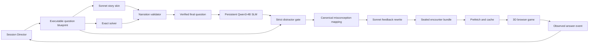

# Mathbreakers: Glitch Convoy Live Adaptive 3D Pivot Implementation Plan

> **For agentic workers:** REQUIRED SUB-SKILL: Use superpowers:subagent-driven-development (recommended) or superpowers:executing-plans to implement this plan task-by-task. Steps use checkbox (`- [ ]`) syntax for tracking.

**Goal:** Build a browser-playable, realistic-stylized 3D vehicle-combat vertical slice in which live, verified questions are narrated in world context, the tuned Qwen3-4B SLM generates diagnostic distractors, a selected wrong answer becomes a misconception-specific enemy, and the next encounter adapts to that evidence.

**Architecture:** Preserve the released static game as a reference and build a separate `game3d/` client plus `src/live_game/` orchestration service. Code owns mathematical truth, Sonnet supplies bounded story and age-appropriate wording, the SLM proposes distractors, and a fail-closed executable gate decides what can become gameplay. Generation is asynchronous and buffered so model latency never becomes a quiz loading screen.

**Tech Stack:** Python 3.11+, FastAPI, Pydantic v2, existing exact-arithmetic and buggy-procedure modules, Redis-compatible cache with an in-memory development implementation, local Apple-Silicon inference through a benchmark-selected MLX/GGUF runtime, later persistent CUDA inference using the published Qwen3-4B base and v7.1 LoRA, existing OpenAI-compatible TrueFoundry/Sonnet gateway, React 19, TypeScript, Vite, Babylon.js, XState, Vitest, Playwright, Blender, glTF 2.0, KTX2 textures, and bundled KaTeX.

## Global Constraints

- The first slice remains inside the model's trained middle-school **Number** taxonomy; it does not claim all of sixth-grade math.
- The browser never receives model/API credentials and never loads the 4B model.
- Sonnet never decides the correct answer. Code constructs a structured blueprint and recomputes the answer with exact arithmetic before and after narration.
- Raw SLM text never reaches the browser. Only a sealed bundle that passes every automatic gate may be served.
- A generation is rejected unless it has exactly three distinct numeric distractors, none equivalent to the correct answer, with grounded computations and unique executable misconception mappings.
- Player-facing feedback describes one observed choice. It never states that a child “has” a misconception or assigns a learner identity.
- A wrong answer cannot remove progression, rewards, or access to help. Reading and math decisions have no default timer.
- The frozen 140-question research holdout is excluded from prompts, caches, fallbacks, tests, and gameplay.
- Preserve the current `game/` static release and its tests. The pivot is built under `game3d/` until it independently clears release gates.
- The first client is browser-first Babylon.js. Unity 6 URP remains a later presentation client only if downloadable desktop fidelity becomes more important than browser and Chromebook reach.
- Initial art scope is one district, one player vehicle, three NPCs, three canonical Glitch enemy families, one convoy boss, and one 8–12 minute run.
- The 3D asset monetary budget is zero. Runtime art must be original in-house work, user-provided work, or redistributable free/CC0 content recorded in `game3d/ASSET_LICENSES.md`.
- The first release is a portfolio experiment designed so its contracts, privacy model, validation, and accessibility can mature into a child-ready product.
- Existing TrueFoundry/Sonnet access is authorized for live gameplay, but credentials remain server-side and runtime cost/limits must be measured before public release.
- `live-forge` is the explicitly labeled portfolio mode; `reviewed-learning` is the future learner mode and serves only owner-reviewed or deterministically canonicalized bundles.
- Gateway request logging may remain enabled only for synthetic development sessions. Disable it or document approved provider retention before any real learner event is transmitted.
- Curriculum defaults to US Common Core grade-six Number skills where they overlap the trained SLM and executable misconception families; model capability and safe validation determine the first playable subset.
- The first dynamic skill set is limited to executable numeric families that achieve the benchmark gates in Task 8. Unsupported or low-yield topics use reviewed cached encounters.
- Current baseline evidence must remain visible in engineering docs: approximately 12 seconds per item on the completed T4 run, 19/60 automatic survivors, and 6/60 owner-approved releases.

---

## Decision Record — 2026-07-11

- **Engine:** Babylon.js wins the first slice. Unity's editor, animation, particles, and native performance are stronger, but the same zero-budget art would not automatically look better. Babylon preserves a shareable browser link, native accessible math overlays, smaller deployment, easier Python API integration, and the existing web toolchain.
- **Portability:** all authoritative learning logic stays in Python; all client messages are versioned JSON; source art stays in Blender; runtime art exports as standard GLB metallic-roughness PBR; vehicle and enemy tuning stays in JSON. A later Unity client can reuse those assets and contracts.
- **Product maturity:** build the portfolio experience first, but retain the child-safe language, no-free-text NPC interaction, exact validation, data minimization, failure fallback, and accessibility gates required for a future production path.
- **Art funding:** spend no money on assets. Prioritize custom modeling effort on the player vehicle and Glitch silhouette kit; use procedural terrain, CC0 surface materials, instanced modular scenery, and shared rigs everywhere else.
- **AI access:** use the authorized Sonnet gateway for bounded story and feedback. Do not assume that API access includes a GPU for the SLM; GPU hosting is a separate deployment decision.

---

## Product Direction Locked by This Plan

### The game: Mathbreakers — Glitch Convoy

The player is a field mechanic driving a rugged electric rally vehicle through a grounded solar-industrial canyon. NPC crews request repairs whose quantities come from the current world state. Equations are not floating decorations: they are luminous control circuits embedded in roads, shields, cranes, and power relays.

At a mission gate, four answer channels route power. A correct channel charges the player's repair system. A selected wrong answer materializes as the exact Glitch encoded by that SLM distractor. The enemy reenacts the faulty computation through its shield or weapon pattern; the player identifies the repair strategy and completes a custom follow-up to overload it. Driving, radio dialogue, reveals, and combat staging provide useful generation time without penalizing reading.

### Why this direction

- It preserves the strongest existing idea: the chosen distractor becomes a visible enemy with a specific tell.
- One vehicle controller handles traversal and combat, avoiding the cost of separate driving and on-foot systems.
- A compact authored district can look polished; an open world would spread the same effort too thin.
- The boss can recombine misconceptions actually observed in the run, making adaptation visible rather than hidden in a dashboard.
- It gives the SLM three unmistakable jobs: forge the options, define the enemy's reasoning, and choose the branch the game practices next.

### Core run

1. **Garage boot:** choose one of three visual vehicle kits while the server warms and prepares encounter 1.
2. **NPC contract:** a fixed NPC voice card plus Sonnet-authored bounded dialogue introduces a world-grounded quantity problem.
3. **Drive:** 20–40 seconds of traversal while the next encounter and all likely remediation branches prefetch.
4. **Decision gate:** motion slows; a DOM math panel presents four neutral answers with no time limit.
5. **Commit:** the player explicitly locks one answer.
6. **Glitch combat:** the selected misconception becomes an enemy attack; the computation is revealed as evidence.
7. **Repair brief:** two short lines explain the action and name the skill to practice.
8. **Adaptive counterstrike:** a same-skill, different-values question includes the same tempting misconception. Success triggers the strongest combat payoff.
9. **Convoy boss:** two or three observed Glitches return as recognizable phases.
10. **Field report:** show evidence from this run, strategies that worked, and a “Behind the Forge” provenance view for reviewers.

### Visual direction

- **Subject:** a grade-six diagnostic math game whose single job is to make invisible reasoning physically legible.
- **Aesthetic:** sunlit salvage-tech rally, not neon cyberpunk and not classroom papercraft. Use dust, ceramic insulation, brushed metal, fabric straps, painted repair marks, and readable mechanical silhouettes.
- **Signature:** the **Proof Circuit**, a physical energy route running through road, enemy, HUD, and repair weapon. A misconception visibly reroutes it; a correct strategy reconnects it.
- **Palette:** Basalt `#171C1E`, Ceramic `#E7E0D3`, Oxide `#B95635`, Solar Amber `#F2B84B`, Diagnostic Cyan `#58C8D0`, Repair Green `#62A77D`.
- **Typography:** bundled Barlow Condensed for rally headings, Atkinson Hyperlegible for questions and feedback, and IBM Plex Mono for computations.
- **Aesthetic risk:** make math traces look like practical service diagrams physically projected onto machinery, rather than generic holographic UI.
- **Asset rule:** one coherent PBR environment/vehicle kit is preferable to many unrelated free models. Custom Glitch identity comes from authored attachments, materials, VFX, and animation layered on three shared vehicle/drone rigs.

---

## End-to-End Runtime



Sonnet is deliberately outside the truth path. It may select a scenario, fill bounded story slots, and rewrite a verified misconception for a child. The exact operands, operation, answer, trusted proof, and executable misconception values come from code.

### Required live bundle contract

```json
{
  "schemaVersion": "live-encounter-v1",
  "encounterId": "enc_01J00000000000000000000000",
  "sessionSeed": 174203,
  "question": {
    "prompt": "Mara's relay is 3/4 charged and gains 1/8 of a full charge. What fraction is charged now?",
    "topic": "Adding and Subtracting Fractions",
    "skillId": "fraction_add_unlike_denominators",
    "difficulty": 2,
    "visualModel": "fraction_strip"
  },
  "options": [
    {"id": "opt_a", "display": "7/8"},
    {"id": "opt_b", "display": "4/12"},
    {"id": "opt_c", "display": "3/32"},
    {"id": "opt_d", "display": "5/8"}
  ],
  "sealedResolution": {
    "correctOptionId": "opt_a",
    "counterfeits": {
      "opt_b": {
        "misconceptionId": "frac_add_num_den",
        "familyId": "fraction_forger",
        "verifiedComputation": "(3 + 1)/(4 + 8) = 4/12",
        "feedback": {
          "whatHappened": "That route combined pieces that are different sizes.",
          "nextMove": "Rename both fractions with equal-sized pieces before adding.",
          "skillLabel": "Add fractions with unlike denominators"
        }
      }
    }
  },
  "provenance": {
    "blueprintVersion": "number-blueprints-v1",
    "slmAdapter": "j2ampn/qwen3-4b-distractor-lora-v7",
    "validatorVersion": "live-gate-v1",
    "generatedAtUtc": "2026-07-11T18:00:00Z",
    "source": "live-verified"
  }
}
```

The API strips `sealedResolution` from the preparation response. It returns the matching resolution only after `POST /v1/sessions/{session_id}/encounters/{encounter_id}/commit`, so correctness and feedback cannot leak through the DOM before commitment.

---

## File Structure

```text
diagnostic-distractor-slm/
├── contracts/
│   ├── live-encounter-v1.schema.json
│   ├── live-session-v1.schema.json
│   └── fixtures/live-encounter-v1.json
├── requirements-live.txt
├── requirements-local.in
├── requirements-local.lock
├── requirements-gpu.txt
├── src/live_game/
│   ├── __init__.py
│   ├── contracts.py                 Pydantic request, blueprint, bundle, and event types
│   ├── curriculum.py                supported skills and canonical misconception metadata
│   ├── blueprints.py                seeded operand generation and follow-up construction
│   ├── solver.py                    exact trusted answer and proof generation
│   ├── story.py                     bounded Sonnet story-skin interface and validation
│   ├── slm_client.py                injected SLM client and HTTP implementation
│   ├── slm_worker.py                runtime-neutral inference endpoint and receipts
│   ├── slm_worker_local.py          benchmark-selected MLX/GGUF process adapter
│   ├── slm_worker_cuda.py           persistent Unsloth CUDA lifecycle
│   ├── distractor_gate.py           strict parsing and executable misconception mapping
│   ├── feedback.py                  bounded child-facing feedback rewrite and fallback copy
│   ├── composer.py                  sealed encounter assembly and deterministic option order
│   ├── mastery.py                   evidence updates without permanent diagnosis
│   ├── director.py                  next-skill and targeted-branch selection
│   ├── cache.py                     memory and Redis-compatible encounter cache
│   ├── prefetch.py                  branch jobs, deadlines, and circuit breaker
│   ├── api.py                       FastAPI session, prepare, commit, and health routes
│   └── settings.py                  environment-only endpoints, model IDs, and deadlines
├── tests/live_game/
│   ├── test_contracts.py
│   ├── test_blueprints.py
│   ├── test_story.py
│   ├── test_slm_client.py
│   ├── test_slm_runtime_parity.py
│   ├── test_distractor_gate.py
│   ├── test_feedback.py
│   ├── test_composer.py
│   ├── test_director.py
│   ├── test_api.py
│   └── test_pipeline_benchmark.py
├── scripts/
│   ├── prepare_local_slm.py
│   ├── benchmark_slm_runtime.py
│   ├── benchmark_live_pipeline.py
│   └── export_live_acceptance_report.py
├── game3d/
│   ├── package.json
│   ├── vite.config.ts
│   ├── tsconfig.json
│   ├── public/assets/manifest.json
│   └── src/
│       ├── main.tsx
│       ├── App.tsx
│       ├── api/client.ts
│       ├── domain/contracts.ts
│       ├── domain/encounterMachine.ts
│       ├── domain/sessionStore.ts
│       ├── game/EngineCanvas.tsx
│       ├── game/createScene.ts
│       ├── game/vehicle/vehicleController.ts
│       ├── game/world/convoyDistrict.ts
│       ├── game/npcs/npcDirector.ts
│       ├── game/combat/combatDirector.ts
│       ├── game/combat/glitchRegistry.ts
│       ├── game/vfx/proofCircuit.ts
│       ├── ui/QuestionPanel.tsx
│       ├── ui/RepairBrief.tsx
│       ├── ui/FieldReport.tsx
│       ├── ui/LoadingFallback.tsx
│       ├── styles/tokens.css
│       └── test/
│           ├── contracts.test.ts
│           ├── encounterMachine.test.ts
│           ├── QuestionPanel.test.tsx
│           └── generatedFlow.test.tsx
└── deployment/
    ├── api.Dockerfile
    ├── slm-worker.Dockerfile
    ├── compose.dev.yml
    └── README.md
```

---

### Task 1: Freeze Cross-Language Contracts

**Files:**
- Create: `contracts/live-encounter-v1.schema.json`
- Create: `contracts/live-session-v1.schema.json`
- Create: `contracts/fixtures/live-encounter-v1.json`
- Create: `requirements-live.txt`
- Create: `src/live_game/contracts.py`
- Create: `tests/live_game/test_contracts.py`
- Create: `game3d/src/domain/contracts.ts`
- Create: `game3d/src/test/contracts.test.ts`

**Interfaces:**
- Produces: `SessionMode`, `QuestionBlueprint`, `StorySkin`, `GeneratedDistractor`, `VerifiedCounterfeit`, `EncounterBundle`, `PreparedEncounter`, `EncounterResolution`, `ObservationEvent`, and `SessionState`.
- Produces: JSON Schema literals `live-encounter-v1` and `live-session-v1` shared by Python and TypeScript tests.

- [ ] **Step 1: Write the Python contract test**

```python
def test_fixture_round_trips_without_exposing_resolution():
    bundle = EncounterBundle.model_validate_json(FIXTURE.read_text())
    prepared = bundle.to_prepared()
    assert prepared.schema_version == "prepared-encounter-v1"
    assert not hasattr(prepared, "sealed_resolution")
    assert len(prepared.options) == 4
```

- [ ] **Step 2: Run the focused test and verify RED**

Run: `.venv/bin/python -m pytest tests/live_game/test_contracts.py -q`

Expected: import failure because `src.live_game.contracts` does not exist.

- [ ] **Step 3: Implement strict Pydantic types and JSON Schemas**

Use `ConfigDict(extra="forbid", frozen=True, alias_generator=to_camel, populate_by_name=True)` on every wire type so Python snake-case and JSON/TypeScript camel-case stay consistent. Represent numeric display answers as bounded strings, IDs as anchored patterns, and feedback with these exact limits: `what_happened` 1–160, `next_move` 1–160, `skill_label` 1–80. Put `fastapi`, `pydantic>=2`, `httpx`, `uvicorn`, `redis`, and `pytest` in `requirements-live.txt`; do not add GPU packages to the research `requirements.txt`.

- [ ] **Step 4: Add the matching TypeScript union types**

```ts
export type EncounterPhase =
  | "driving"
  | "decision"
  | "committed"
  | "counterbreak"
  | "resolved";

export type SessionMode = "live-forge" | "reviewed-learning";

export interface PreparedEncounter {
  schemaVersion: "prepared-encounter-v1";
  encounterId: string;
  question: QuestionView;
  options: readonly AnswerOption[];
  npc: NpcBeat;
}
```

- [ ] **Step 5: Verify both languages**

Run: `.venv/bin/python -m pytest tests/live_game/test_contracts.py -q`

Run: `cd game3d && npm test -- --run src/test/contracts.test.ts`

Expected: both fixture-contract suites pass.

---

### Task 2: Build Executable Question Blueprints

**Files:**
- Create: `src/live_game/curriculum.py`
- Create: `src/live_game/blueprints.py`
- Create: `src/live_game/solver.py`
- Create: `tests/live_game/test_blueprints.py`

**Interfaces:**
- Consumes: `src.buggy_procedures.FAMILIES`, `REGISTRY`, and exact `Fraction` arithmetic.
- Produces: `create_blueprint(skill_id: str, seed: int, target_misconception_id: str | None) -> QuestionBlueprint`.
- Produces: `solve_blueprint(blueprint: QuestionBlueprint) -> TrustedSolution`.

- [ ] **Step 1: Write failing deterministic and uniqueness tests**

```python
def test_targeted_blueprint_is_deterministic_and_discriminating():
    first = create_blueprint("fraction_add", 41, "frac_add_num_den")
    second = create_blueprint("fraction_add", 41, "frac_add_num_den")
    assert first == second
    values = executable_wrong_values(first)
    assert values["frac_add_num_den"] != first.correct_value
    assert len(values.values()) == len(set(values.values()))
```

- [ ] **Step 2: Verify RED**

Run: `.venv/bin/python -m pytest tests/live_game/test_blueprints.py -q`

Expected: import failure for `src.live_game.blueprints`.

- [ ] **Step 3: Implement a seeded rejection sampler**

Generate operands through the existing family generators. Reject any blueprint where the correct answer collides with a registered bug, two registered bugs collide, the target bug is unavailable, the answer magnitude exceeds the display bounds, or the trusted proof needs more than four steps.

- [ ] **Step 4: Add initial supported skill records**

Start with `fraction_add`, `decimal_mul`, `dec_addsub`, `neg_add`, `order_of_ops`, and `round_dp`. Each record must specify trained topic, visual model, difficulty bounds, story action, and canonical Glitch family.

- [ ] **Step 5: Verify 1,000 seeds per supported family**

Run: `.venv/bin/python -m pytest tests/live_game/test_blueprints.py -q`

Expected: every emitted blueprint is solvable, discriminating, reproducible, and holdout-independent.

---

### Task 3: Add Bounded Sonnet Story Skins

**Files:**
- Create: `src/live_game/story.py`
- Create: `src/live_game/settings.py`
- Create: `tests/live_game/test_story.py`
- Modify: `src/tfy_client.py`

**Interfaces:**
- Produces: `StoryWriter.write(blueprint, npc_voice, world_state, deadline_s) -> StorySkin`.
- Produces: `render_question(blueprint, story_skin) -> str`.
- Keeps: the existing research `chat(...)` behavior unchanged; live calls use a separate bounded `chat_with_deadline(...)` path.

- [ ] **Step 1: Write failing tests with a fake gateway**

```python
def test_story_cannot_change_math_or_add_numbers():
    skin = StorySkin(
        intro="Mara reroutes the canyon relay.",
        quantity_noun="battery charge",
        unit="full charge",
        outro="Choose the safe power route.",
    )
    prompt = render_question(FRACTION_BLUEPRINT, skin)
    assert extract_numeric_tokens(prompt) == FRACTION_BLUEPRINT.required_numeric_tokens
```

- [ ] **Step 2: Verify RED**

Run: `.venv/bin/python -m pytest tests/live_game/test_story.py -q`

- [ ] **Step 3: Implement the structured story prompt**

Sonnet returns only `intro`, `quantity_noun`, `unit`, and `outro`. Numeric values, operation verbs, and the final question sentence are rendered by code. Reject control characters, markup, extra numeric tokens, unsupported units, reading level above the configured bound, or a response outside field limits.

- [ ] **Step 4: Add short gameplay deadlines**

Use one initial call and one retry within a total 4-second deadline. Do not use the research client's six-attempt exponential backoff for gameplay. On timeout or invalid output, select a deterministic authored skin keyed by NPC and skill.

- [ ] **Step 5: Verify the fallback path**

Run: `.venv/bin/python -m pytest tests/live_game/test_story.py -q`

Expected: malformed, slow, and extra-number responses all produce a safe deterministic skin without blocking.

---

### Task 4: Prove a $0 Local SLM Runtime and Preserve the Hosted Worker Contract

**Files:**
- Create: `src/live_game/slm_client.py`
- Create: `src/live_game/slm_worker.py`
- Create: `src/live_game/slm_worker_local.py`
- Create: `src/live_game/slm_worker_cuda.py`
- Create: `tests/live_game/test_slm_client.py`
- Create: `tests/live_game/test_slm_runtime_parity.py`
- Create: `requirements-local.in`
- Create: `requirements-local.lock`
- Create: `requirements-gpu.txt`
- Create: `scripts/prepare_local_slm.py`
- Create: `scripts/benchmark_slm_runtime.py`
- Create: `deployment/slm-worker.Dockerfile`

**Interfaces:**
- Produces: `SlmClient.generate(question: str, correct: str, topic: str, policy: GenerationPolicy) -> RawSlmCandidate`.
- Exposes: `POST /internal/v1/distractors`, `GET /internal/health/live`, and `GET /internal/health/ready`.
- Loads: immutable base and adapter revisions already recorded in the released pack.
- Keeps: the same HTTP request, response, and provenance contract for local Metal and hosted CUDA workers.

- [ ] **Step 1: Write fake-server client tests**

```python
async def test_client_rejects_mismatched_model_receipt(fake_http):
    fake_http.respond_json({"adapterRevision": "0" * 40, "rawResponse": "{}"})
    with pytest.raises(SlmProtocolError, match="adapter revision"):
        await client.generate(QUESTION, "7/8", TOPIC, GenerationPolicy.primary())
```

- [ ] **Step 2: Implement the CPU-testable client and sealed worker receipt**

The client sends only question, correct answer, topic, request ID, seed, and generation policy. The worker returns the exact raw response plus base, adapter, prompt, decoding, and worker-version receipts.

- [ ] **Step 3: Build the local conversion and receipt path**

`scripts/prepare_local_slm.py` downloads the public base and adapter at their pinned revisions, verifies both receipts, and creates a 4-bit Apple-Silicon artifact without committing weights. Resolve `mlx-lm` and its dependencies from `requirements-local.in` into `requirements-local.lock`; if the PEFT adapter cannot fuse with output parity, run the equivalent pinned llama.cpp GGUF conversion and record that tool commit in the artifact receipt.

- [ ] **Step 4: Benchmark local output parity before accepting the runtime**

Run: `.venv/bin/python scripts/benchmark_slm_runtime.py --questions data/game/questions_v1.jsonl --items 60 --report data/game/work/local-runtime-parity-v1.json`

Required result: the converted runtime preserves the exact prompt and chat template, thinking-disabled behavior, all three output fields, and at least the existing 19/60 strict automatic survivor count. Report exact-output agreement, acceptance yield, p50, p95, maximum latency, memory, and artifact size. If neither MLX nor GGUF meets the survivor floor, keep CUDA as the only live SLM path.

- [ ] **Step 5: Implement one-load worker startup**

The local adapter launches the benchmark-selected Metal runtime and exposes the shared worker API on `127.0.0.1`. The CUDA adapter reuses the existing Unsloth/PEFT load path, loads once at process startup, calls `FastLanguageModel.for_inference`, places generation behind a bounded queue, and rejects requests until readiness is true. Create `requirements-gpu.txt` with exactly `-r requirements-live.txt` and `unsloth==2026.7.1`, matching the verified Colab bundle. Record all resolved runtime versions in readiness receipts.

- [ ] **Step 6: Define two runtime policies without changing research evaluation**

`primary` uses deterministic decoding. `diversified` uses a recorded low-temperature seed only after a new question variant is created; it never retries identical deterministic input. Store the policy in provenance so game results cannot be confused with frozen research metrics.

- [ ] **Step 7: Verify shared contracts, then benchmark hosted CUDA when approved**

Run: `.venv/bin/python -m pytest tests/live_game/test_slm_client.py -q`

Run locally: `.venv/bin/python scripts/benchmark_live_pipeline.py --stage slm --items 100 --concurrency 1`

Run after GPU-host approval: `.venv/bin/python scripts/benchmark_live_pipeline.py --stage slm --items 100 --concurrency 2`

Expected: zero protocol mismatches; each benchmark report includes runtime kind, artifact receipt, cold start, warm p50, warm p95, tokens/second, queue wait, and memory.

---

### Task 5: Build the Fail-Closed Distractor and Semantic Gate

**Files:**
- Create: `src/live_game/distractor_gate.py`
- Create: `tests/live_game/test_distractor_gate.py`
- Modify: `src/buggy_procedures.py`

**Interfaces:**
- Produces: `verify_candidate(blueprint, raw_candidate) -> VerifiedDistractorSet`.
- Produces: `canonical_computation(blueprint, misconception_id) -> str`.
- Reuses: `strict_parse_distractors`, `computation_consistent`, and executable registry procedures.

- [ ] **Step 1: Write adversarial failing tests**

Cover correct-answer collision, equivalent fractions, duplicate answers, duplicate semantic bugs, fabricated operands, computation/answer mismatch, an answer matching two bug procedures, an unknown answer, and a label that contradicts the unique executable mapping.

- [ ] **Step 2: Verify RED**

Run: `.venv/bin/python -m pytest tests/live_game/test_distractor_gate.py -q`

- [ ] **Step 3: Expose read-only executable helpers**

Add public helpers that list misconceptions for one family and evaluate one misconception against explicit operands. Preserve every existing dataset-generation result and run the legacy byte-identity tests after the change.

- [ ] **Step 4: Implement value-based canonical mapping**

For each distractor, require exactly one registered misconception in the blueprint family to produce the same exact `Fraction`. Require its free-text label to pass the misconception spec's curated action/object term rules and reject conflicting operation terms. Use the registry's canonical name and computation for player-facing content; preserve the SLM's raw label and computation only in server-side provenance. If the blueprint targets a misconception, require the verified three-item set to contain that exact ID.

- [ ] **Step 5: Implement all-or-nothing acceptance**

Accept only three uniquely mapped misconceptions with distinct exact values. Reject the entire candidate set on any issue. Do not repair, splice, or silently replace one SLM output in the accepted set.

- [ ] **Step 6: Verify gate and research regressions**

Run: `.venv/bin/python -m pytest tests/live_game/test_distractor_gate.py -q`

Run: `.venv/bin/python -m unittest discover -s tests -p 'test_*.py'`

Expected: adversarial tests pass and the existing research/game suite remains green.

---

### Task 6: Compose Feedback and Sealed Encounters

**Files:**
- Create: `src/live_game/feedback.py`
- Create: `src/live_game/composer.py`
- Create: `tests/live_game/test_feedback.py`
- Create: `tests/live_game/test_composer.py`

**Interfaces:**
- Produces: `FeedbackWriter.write(counterfeit, trusted_solution, deadline_s) -> FeedbackCard`.
- Produces: `compose_encounter(blueprint, story, verified_set, feedback_by_id) -> EncounterBundle`.

- [ ] **Step 1: Write feedback safety tests**

```python
@pytest.mark.parametrize("phrase", ["you are bad", "you always", "you have a misconception"])
def test_feedback_rejects_identity_language(phrase):
    with pytest.raises(FeedbackSafetyError):
        validate_feedback({"whatHappened": phrase, "nextMove": "Try again.", "skillLabel": "Fractions"})
```

- [ ] **Step 2: Implement canonical fallback copy first**

Every supported misconception ID receives authored `what_happened`, `next_move`, and `skill_label` templates. This is the always-available truth source.

- [ ] **Step 3: Add optional Sonnet rewriting**

Sonnet may shorten and vary the canonical copy but must preserve the action and strategy IDs. Validate length, blame language, unsupported math claims, answer leakage, and required concept terms. Any disagreement returns the authored copy.

- [ ] **Step 4: Assemble and hash the bundle**

Use deterministic option ordering from encounter ID, include model/validator/blueprint receipts, and hash the canonical JSON. `to_prepared()` omits the resolution; `resolve(option_id)` returns only the selected branch plus the trusted result.

- [ ] **Step 5: Verify immediate feedback**

Run: `.venv/bin/python -m pytest tests/live_game/test_feedback.py tests/live_game/test_composer.py -q`

Expected: resolving an encounter performs no model or Sonnet call.

---

### Task 7: Add the Evidence-Based Adaptive Director

**Files:**
- Create: `src/live_game/mastery.py`
- Create: `src/live_game/director.py`
- Create: `tests/live_game/test_director.py`

**Interfaces:**
- Produces: `record_observation(state, event) -> SessionState`.
- Produces: `choose_next_blueprint(state, last_resolution, seed) -> BlueprintRequest`.

- [ ] **Step 1: Write sequence tests**

```python
def test_one_wrong_answer_creates_practice_not_diagnosis():
    state = record_observation(EMPTY_STATE, wrong("frac_add_num_den"))
    request = choose_next_blueprint(state, LAST_RESOLUTION, seed=9)
    assert request.target_misconception_id == "frac_add_num_den"
    assert state.repeated_patterns == ()
```

Also prove: a correct targeted follow-up lowers concern; two separated repeats create a `repeated_pattern` evidence record; help use affects difficulty but never blocks rewards; and the boss selects at most three observed families.

- [ ] **Step 2: Implement small transparent evidence updates**

Track attempts, first-try correctness, help used, targeted follow-up result, count, and recency per skill and misconception ID. Do not infer a hidden psychological learner type.

- [ ] **Step 3: Implement next-encounter rules**

- Wrong primary answer: same skill, new values, simpler or equal difficulty, selected misconception targeted.
- Correct remediation: return to the planned progression and retain a low-confidence observation.
- Wrong remediation: show authored instruction, then another scaffolded item.
- Correct primary answer: increase difficulty after two supported successes or interleave a related skill.

- [ ] **Step 4: Verify deterministic replay**

Run: `.venv/bin/python -m pytest tests/live_game/test_director.py -q`

Expected: the same event log and seed produce the same sequence.

---

### Task 8: Implement Prefetch, Cache, API, and the Headless Go/No-Go Gate

**Files:**
- Create: `src/live_game/cache.py`
- Create: `src/live_game/prefetch.py`
- Create: `src/live_game/api.py`
- Create: `tests/live_game/test_api.py`
- Create: `tests/live_game/test_pipeline_benchmark.py`
- Create: `scripts/benchmark_live_pipeline.py`
- Create: `scripts/export_live_acceptance_report.py`

**Interfaces:**
- Exposes: `POST /v1/sessions`, `GET /v1/sessions/{id}/next`, `POST /v1/sessions/{id}/encounters/{id}/commit`, `GET /health/live`, and `GET /health/ready`.
- Produces: branch-prefetch jobs for correct, distractor 1, distractor 2, and distractor 3.

- [ ] **Step 1: Write API tests with fake Sonnet and SLM services**

Prove that prepare omits sealed resolution, commit returns only the selected resolution, repeated commit is idempotent, cross-session IDs fail, timeouts use a validated cache entry, no cache miss serves raw generation, and `reviewed-learning` rejects any bundle lacking a human-review or deterministic-canonicalization receipt.

- [ ] **Step 2: Implement a two-level cache**

Use memory in development and Redis-compatible storage in deployment. Key by schema, skill, difficulty, target misconception, blueprint version, model revision, and validator version. Cache only sealed verified bundles.

- [ ] **Step 3: Implement branch prefetch**

After serving a primary encounter, enqueue four possible next bundles. Prioritize the three misconception branches while the player reads and drives. Cancel obsolete low-priority work after commitment without discarding already verified cache results.

- [ ] **Step 4: Implement circuit breakers**

Use explicit queue, Sonnet, SLM, and total-pipeline deadlines. After bounded failure, select a reviewed cached bundle for the requested skill/target. If no matching bundle exists, select a safe same-skill reviewed encounter and mark adaptation as degraded in server logs, never in child-facing blame language.

- [ ] **Step 5: Run the headless benchmark before 3D production**

Run: `.venv/bin/python scripts/benchmark_live_pipeline.py --items 500 --concurrency 4 --report data/game/work/live-benchmark-v1.json`

Required gates:

- 100% of served bundles pass the full gate when revalidated from stored provenance.
- 0 raw or partially validated SLM outputs are served.
- At least 95% of commits return precomputed feedback in under 250 ms server time.
- At least 90% of requested targeted branches are ready before the simulated 25-second decision window ends.
- Every miss resolves to a reviewed cache entry within 1 second.
- Automatic SLM set acceptance and end-to-end latency are reported honestly; no minimum acceptance claim is invented.

- [ ] **Step 6: Make the go/no-go decision**

Do not begin Task 9 unless all safety/fallback gates pass. If targeted branch readiness misses its gate, first benchmark a faster GPU, shorter output limit, constrained decoding, or a game-control adapter that emits canonical misconception IDs.

---

### Task 9: Build the 3D Graybox and Accessible Math Overlay

**Files:**
- Create: `game3d/package.json`
- Create: `game3d/vite.config.ts`
- Create: `game3d/tsconfig.json`
- Create: `game3d/src/main.tsx`
- Create: `game3d/src/App.tsx`
- Create: `game3d/src/api/client.ts`
- Create: `game3d/src/domain/encounterMachine.ts`
- Create: `game3d/src/game/EngineCanvas.tsx`
- Create: `game3d/src/game/createScene.ts`
- Create: `game3d/src/ui/QuestionPanel.tsx`
- Create: `game3d/src/styles/tokens.css`
- Create: `game3d/src/test/encounterMachine.test.ts`
- Create: `game3d/src/test/QuestionPanel.test.tsx`

**Interfaces:**
- Consumes: prepared encounter and commit resolution APIs.
- Produces: `driving → decision → committed → counterbreak → resolved` XState machine events.

- [ ] **Step 1: Write state-machine and no-leak tests**

```ts
expect(decisionState.context.resolution).toBeUndefined();
expect(screen.queryByText(/misconception/i)).not.toBeInTheDocument();
```

- [ ] **Step 2: Scaffold React, Babylon.js, XState, KaTeX, and tests**

Keep the equation/question UI in semantic DOM over the canvas. Babylon owns world, camera, vehicle, enemies, particles, and lighting; it does not render the readable MCQ.

- [ ] **Step 3: Build one graybox loop**

Use primitives for one road segment, one NPC marker, one vehicle, four gate channels, and one enemy. The live API must drive the visible question and exact selected branch.

- [ ] **Step 4: Preserve accessibility from the first slice**

Provide keyboard and controller navigation, visible focus, 48-pixel targets, reduced-motion mode, neutral pre-commit choices, a concise nonvisual scene summary, and pause-on-question behavior.

- [ ] **Step 5: Verify**

Run: `cd game3d && npm test -- --run`

Run: `cd game3d && npm run build`

Expected: graybox flow passes and builds without importing anything from the old static runtime.

---

### Task 10: Add Vehicle Combat, NPCs, Three Glitches, and the Boss

**Files:**
- Create: `game3d/src/game/vehicle/vehicleController.ts`
- Create: `game3d/src/game/world/convoyDistrict.ts`
- Create: `game3d/src/game/npcs/npcDirector.ts`
- Create: `game3d/src/game/combat/combatDirector.ts`
- Create: `game3d/src/game/combat/glitchRegistry.ts`
- Create: `game3d/src/game/vfx/proofCircuit.ts`
- Create: `game3d/src/ui/RepairBrief.tsx`
- Create: `game3d/src/ui/FieldReport.tsx`
- Create: `game3d/src/test/generatedFlow.test.tsx`

**Interfaces:**
- Consumes: canonical family IDs and verified computations from commit resolutions.
- Produces: family-specific visual configuration and deterministic combat beats.

- [ ] **Step 1: Implement one shared arcade vehicle controller**

Use speed, steering, drift assist, brake, and boost. Combat reuses the same controls; there is no on-foot mode. Input suspends when the decision panel has focus.

- [ ] **Step 2: Implement three family tells**

- `fraction_forger`: unequal shield plates lock together; repair equalizes segments.
- `decimal_drifter`: target lanes shift by place value; repair aligns them.
- `operation_swapper`: weapon modules rotate to the wrong operation; repair locks the story action.

The mathematical mapping comes from server IDs; client visuals never infer correctness from generated text.

- [ ] **Step 3: Implement NPC voice cards**

Create three authored personalities with allowed vocabulary, emotional range, and mission domains. Sonnet supplies bounded lines inside those cards; it does not create open chat.

- [ ] **Step 4: Implement the adaptive convoy boss**

Select up to three repeated or recent observed family IDs from the session response. Each phase reuses an already taught tell and never introduces an unseen repair rule.

- [ ] **Step 5: Add reviewer-facing provenance**

The Field Report shows which prompts were dynamic, that distractors came from the v7.1 SLM, which automatic gates accepted them, and which next question was targeted. Keep this panel optional and separate from the child's feedback.

- [ ] **Step 6: Verify a complete mixed run**

Run: `cd game3d && npm test -- --run src/test/generatedFlow.test.tsx`

Expected: one correct primary branch, one wrong primary branch, its targeted follow-up, and boss family selection all match the server event log.

---

### Task 11: Art, Audio, Motion, and Performance Production

**Files:**
- Create: `game3d/public/assets/manifest.json`
- Create: `game3d/ASSET_LICENSES.md`
- Modify: `game3d/src/game/world/convoyDistrict.ts`
- Modify: `game3d/src/game/vehicle/vehicleController.ts`
- Modify: `game3d/src/game/combat/glitchRegistry.ts`
- Modify: `game3d/src/game/vfx/proofCircuit.ts`
- Modify: `game3d/src/styles/tokens.css`

**Interfaces:**
- Consumes: one licensed coherent environment/vehicle pack plus custom Glitch attachments.
- Produces: optimized glTF assets with explicit license, source, size, texture, and LOD metadata.

- [ ] **Step 1: Approve an asset manifest before downloading assets**

The manifest must contain one player vehicle, one environment kit, three shared enemy rigs, three NPCs, one VFX pack, one ambient/music pack, and one vehicle sound pack. Record license and redistribution rights for every item.

- [ ] **Step 2: Establish budgets**

- Initial compressed download: at most 80 MB.
- Peak texture memory on target school laptop: at most 512 MB.
- No 4K texture in the browser slice; use 1K/2K KTX2.
- At most two real-time shadow-casting lights.
- Target 60 FPS on the reference laptop and never below 30 FPS during the benchmark combat scene.

- [ ] **Step 3: Apply the Proof Circuit signature**

One animated circuit links road, chosen option, enemy shield, and repair weapon. Motion order is anticipation → route travel → Glitch reveal → trace playback → repair discharge → physical settle. Reduced-motion mode replaces travel with immediate state changes and a short opacity transition.

- [ ] **Step 4: Add audio hierarchy**

Question reading mutes engine high frequencies, commitment restores impact, the computation trace has three restrained mechanical cues, and repair success resolves to one recognizable tonal motif. Captions or text labels accompany meaning-bearing audio.

- [ ] **Step 5: Run visual and performance QA**

Capture desktop, tablet, and narrow-layout evidence; test keyboard, controller, touch, reduced motion, forced colors for the DOM layer, scene-summary updates, and console/network errors. Record frame time, draw calls, triangles, texture memory, and bundle size.

---

### Task 12: Deploy, Observe, and Playtest Safely

**Files:**
- Create: `deployment/api.Dockerfile`
- Create: `deployment/compose.dev.yml`
- Create: `deployment/README.md`
- Create: `game3d/src/ui/LoadingFallback.tsx`
- Create: `docs/LIVE_GAME_OPERATIONS.md`
- Create: `docs/LIVE_GAME_PLAYTEST.md`

**Interfaces:**
- Deploys: static `game3d` client, CPU orchestration API, persistent GPU SLM worker, and private cache.
- Records: non-PII operational metrics and opt-in playtest observations.

- [ ] **Step 1: Keep secrets server-side**

Document `TFY_BASE_URL`, `TFY_MODEL`, `TFY_API_KEY`, `SLM_WORKER_URL`, model revisions, cache URL, and internal auth token as server environment values. The Vite build receives only the public API base URL.

- [ ] **Step 2: Add operational metrics**

Record request IDs, stage latency, gate rejection code, cache hit, degraded fallback, model receipt, and branch readiness. Do not log child names, open text, full IP addresses, or stable cross-session identifiers. Override the current TrueFoundry logging header for learner mode; startup fails closed if learner mode cannot prove that provider logging is disabled or governed by approved retention terms.

- [ ] **Step 3: Add graceful states**

Warmup shows the garage and authored NPC radio. A generation outage serves a verified cached mission. If both live generation and cache are unavailable, the game offers the existing reviewed six-encounter release instead of showing raw or empty content.

- [ ] **Step 4: Run sixth-grade playtests**

Test whether players can explain why an option was wrong, recognize the repeated Glitch tell, understand that the follow-up is connected, and remain engaged during traversal. Separate learning observations from graphics preference.

- [ ] **Step 5: Pass the release gate**

Require backend adversarial tests, 500-item acceptance replay, API load test, browser matrix, asset-license audit, accessibility pass, privacy review, complete mixed run, failure injection, and a recorded reviewer-mode demo of the live SLM-to-adaptation chain.

---

## Remaining Owner Decision Before Public Deployment

The only material unresolved cost decision is SLM compute. Existing Sonnet access does not host Qwen3-4B. Development first benchmarks a local Apple-Silicon MLX/GGUF conversion and the existing free-Colab CUDA path; a continuously available public demo will eventually need an approved GPU host or a provider credit allocation. Do not create a paid GPU service without explicit cost approval.

## What the Owner Does Not Need to Do Now

- Do not manually hunt for the Qwen base, LoRA adapter, or another language model. The local-runtime preparation or GPU deployment script will pull and pin the existing public artifacts; allow several gigabytes of disk/network transfer when that task begins.
- Do not download random 3D models. Follow `docs/GLITCH_CONVOY_3D_ASSET_BRIEF.md`, then approve each free source and license before it enters the repository.
- Do not retrain the SLM before the headless benchmark. First measure constrained live yield. A game-control adapter becomes justified only if the targeted-branch gate fails.
- Do not replace the current static game. It remains the safe fallback and a useful before/after comparison.

## Honest Showcase Claim

The finished slice should claim: **“A specialized 4B model generates misconception-linked wrong answers that drive live adaptive gameplay, while exact solvers and executable checks keep the experience trustworthy.”**

It should not claim that the SLM beats Sonnet overall. The repository shows a strong specialized structure and a meaningful small-model result, while Sonnet remains stronger on semantic consistency. The game is most compelling when it demonstrates complementary roles: Sonnet supplies flexible world language, the SLM supplies diagnostic counterfeits, and deterministic code supplies truth.
