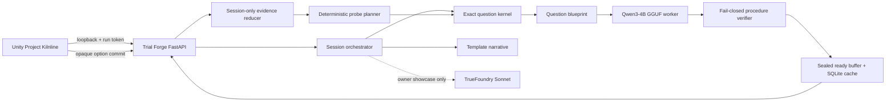

# Project Kilnline Original Math-Fighter Implementation Plan

> **For agentic workers:** REQUIRED SUB-SKILL: Use superpowers:subagent-driven-development (recommended) or superpowers:executing-plans to implement this plan task-by-task. Steps use checkbox (`- [ ]`) syntax for tracking.

> **IP review copy:** Only the integration owner, independent reviewer, and counsel use this document directly. Task 0 must produce a reference-free execution copy before production work is delegated; production implementers work only from that copy.

**Goal:** Build a polished, downloadable Unity vertical slice of an original 2.5D martial-arts RPG in which the final Qwen3-4B distractor SLM selects live, verified wrong-answer routes that shape each duel's featured protocol presentation and adaptive teaching path.

**Architecture:** A fixed-tick Unity combat simulation remains completely independent of math and model serving. A packaged loopback FastAPI service creates exact middle-school Number questions, asks a parity-tested local GGUF derivative of the released final adapter for three distractors, rejects every unverified set, and gives Unity only sealed public choices; a session-only evidence reducer schedules a later discriminating or transfer probe. Optional Sonnet supplies bounded story or tone variants in the owner showcase, never mathematical truth, distractors, diagnosis, adaptation, or executable combat behavior.

**Tech Stack:** Unity `6000.3.11f1`, URP, C#, Input System, uGUI/TextMeshPro, Newtonsoft JSON, Unity Test Framework, Blender, Python 3, FastAPI/Pydantic, SQLite, `llama.cpp` Metal with a merged `Q4_K_M` GGUF, the released `j2ampn/qwen3-4b-distractor-lora-v7` adapter, and optional TrueFoundry/Sonnet for owner-only bounded narrative.

## Global Constraints

- This document is planning only. It does not authorize implementation, package/model/asset downloads, API calls, commits, pushes, or deployment.
- Preserve `PROJECT_CONTEXT.md`, the frozen 140-item holdout, all released datasets, historical predictions, and evaluation claims.
- A literal or near-perfect Shadow Fight 2 clone is rejected. If that remains the requirement, stop until counsel confirms a written license covers the specific copyrighted works, marks, audiovisual material, modification rights, platforms, territories, term, distribution, and marketing uses contemplated.
- Borrow only genre-level ideas: side-view one-on-one combat, rounds, common martial-arts actions, general progression, and bosses.
- Create an original title, characters, silhouettes, rig, animation timing, move set, camera, arenas, UI, icons, menus, story, progression, economy, VFX, music, and audio.
- Never extract, trace, rotoscope, decompile, imitate, or import material from Shadow Fight 2 or any other game.
- `Project Kilnline` is a non-public repository codename and `Prism Circuit` is an internal art-direction label. Neither may appear in bundle IDs, executables, title screens, screenshots, trailers, websites, or store metadata. Task 0 must screen an external-name candidate and record its counsel status, or every build remains owner-only under `Diagnostic Fighter Prototype`.
- Raw Qwen or Sonnet output never reaches a child or Unity.
- The SLM proposes three wrong outcomes, computations, and misconception descriptions. Deterministic code owns the question, correct answer, trusted steps, safety validation, procedure mapping, probe selection, and all gameplay authority.
- One response is one temporary observation, never a learner diagnosis.
- Wrong and correct routes provide equal campaign progress, rewards, health opportunity, and unlock eligibility.
- Immediate retry always appears beside any quiz-based comeback. Correctness never determines whether an offered comeback completes.
- Math is untimed; the combat simulation is stopped while reading and committing an answer.
- No account, child name, birthday, chat, free text, voice, location, advertising ID, cross-session learner profile, ad, loot box, streak pressure, or paid advantage enters the slice.
- The downloadable client contains no `TFY_API_KEY`, `HF_TOKEN`, provider secret, frozen holdout, reviewer identity, raw response, or local development path.
- The first live subset is limited to exact numeric middle-school Number / sixth-grade-readiness and intervention practice with procedure-level gates: decimal addition/subtraction, fraction addition, and negative-number addition/subtraction. A selected jurisdiction/standard and educator review are required before a stronger grade-alignment claim.
- The final research score remains the reported approximately 60% judged consistency. Product verification is a serving safety boundary, not an improved model score.
- The packaged service imports nothing under research `src/`. Preserve `src/buggy_procedures.py`, `src/consistency.py`, and the Glitch Rally-specific `src/game_content.py` as research/offline boundaries. Product-local strict parsing and exact arithmetic are independently tested; development-only parity tests compare prompt/taxonomy hashes without packaging research modules.
- Model weights, generated raw output, Unity `Library/`, marketplace source archives, and provider logs remain gitignored.
- Every third-party, bespoke, commissioned, or AI-assisted asset requires provenance before import: creator, source references, tools/models and terms, prompts when applicable, rights assignment/license, permitted use, modification, attribution, no-franchise-reference attestation, and archive/source hash. Named-franchise, named-living-artist, and sound-alike prompts or briefs are forbidden.

---

## 1. Decision and feasibility

### Product verdict

| Option | Verdict | Reason |
|---|---|---|
| Near-perfect Shadow Fight 2 clone with new characters | **Do not build** | High copyright/trade-dress, store-copycat, brand, and product-differentiation risk |
| One-for-one replacement of ads with required quizzes | **Do not build** | Makes math feel like the new advertisement and leaves the SLM bolted onto someone else's loop |
| Original 2.5D martial-arts RPG using broad genre conventions | **Technically feasible; not distribution-cleared** | Preserves the appealing duel/progression loop while giving the SLM a distinctive purpose; Gate IP-1, title, asset-rights, and applicable counsel review still control release |
| Full Shadow Fight 2-sized campaign | **Not a first release** | Animation, AI, equipment, bosses, balance, environments, and content volume are a multi-year target |

The proposed ceramic-tech direction, under the non-public codename **Project Kilnline**, places a fully lit combat automaton in a nonlethal tournament of malfunctioning protocols. The SLM's verified distractors become three coherent **counterforms**: distinct audiovisual protocol identities and visible computation rules that the player learns to read, repair, and later recognize with changed numbers.

### Signature identity

- Full-color glazed ceramic armor, woven cobalt underlayers, brass mechanisms, and emissive seams; never flat-black silhouette fighters.
- Slight three-quarter perspective and a bright Solar Kiln Observatory arena; no painterly sunset, pagoda, bamboo, parchment, dojo copy, ninja imagery, or shadow-puppet treatment.
- A unique `Tempo / Counterform` combat pillar: readable parries build three deterministic Tempo segments that can be spent on one Resonance technique, while the verified SLM set supplies the featured presentation protocol for the following duel phase.
- Combat shards freeze in space and assemble into the four-option math lattice. The same shards replay the selected computation after commitment.
- Nonlethal sporting outcomes: a defeated construct kneels, disengages, or is recalled. No gore, fatalities, or humiliation.
- A branching repair circuit replaces copied maps, shops, energy gates, premium gems, or ad cadence.

### Why players voluntarily do the math

The math is short, calm, causally connected to the next fight, and never a toll:

1. **Curiosity:** the SLM's verified three-route set creates the protocol deck for the next opponent, and one featured route is chosen before the player answers.
2. **Fair spectacle:** correct, wrong, Not sure, and Reveal all lead to the same preselected featured Counterform; deliberate mistakes cannot unlock cooler combat.
3. **Mastery:** the player can recognize a protocol's visual rule and the reliable mathematical method when it returns in a changed context.
4. **Freshness:** the local SLM creates new plausible wrong routes for exact questions instead of replaying one fixed quiz bank.
5. **Expression:** repair and changed-context evidence unlock cosmetic palettes, entrance poses, and optional techniques—not permission to continue.
6. **Trust:** no timer, grade, accuracy shame, streak, energy meter, or paywall is attached.

### Ten-minute vertical-slice loop

| Time | Player experience | Model activity |
|---:|---|---|
| `0:00–0:45` | Title, accessibility quick settings, 30-second movement tutorial | Service warms; cache is immediately ready |
| `0:45–2:10` | Tutorial duel | No inference starts; use the live card prepared at title or verified cache |
| `2:10–2:45` | Required story-integrated Protocol Read; help/reveal available | Four sealed choices: trusted key + three verified SLM distractors |
| `2:45–4:25` | Rival duel using the preselected featured Counterform | Featured rule comes from the verified SLM set and is independent of correctness |
| `4:25–5:00` | Short traversal/customization pause | Targeted probe is fetched from buffer or cache |
| `5:00–5:35` | Changed-context Protocol Read | Deterministic probe planner tests the temporary hypothesis |
| `5:35–8:40` | Two-phase boss duel | No inference starts if it harms combat frame pacing |
| `8:40–9:20` | Optional Focus Trial or immediate full reward | Optional live-generated replay variation |
| `9:20–10:00` | Results, cosmetic choice, Behind the Forge | Shows live/cache counts without raw output or child scoring |

Rules:

- Every mission has exactly two core reads: the second is targeted diagnostic practice after an eligible wrong response and changed-context skill transfer after an eligible correct response.
- One global optional-trial budget permits either one Focus Trial or one Analyze & Resume interaction, never both; total displayed MCQs remain at most three.
- Never show two MCQs consecutively.
- The required story reads complete on correct, wrong, help, or reveal; correctness changes feedback and later practice only.
- A post-loss screen offers equal-weight `Retry round now` and `Analyze & Resume`. The latter completes the revive regardless of correctness.
- Analyze & Resume, Focus, Help, Reveal, and Not sure are practice-only and never schedule another trial or update a misconception hypothesis.
- Forced post-battle ads, ad-doubling, energy refills, randomized chests, and their quiz substitutes do not exist.

### First release scope

- One Solar Kiln Observatory arena with calm, energized, and boss lighting states.
- One modular humanoid rig producing the player, two rivals, and one boss appearance.
- One unarmed/resonator-bracer style.
- Movement, light chain, heavy palm, front kick, low kick, roundhouse, sweep, guard/parry, dodge, hit reactions, knockdown, and recovery.
- Three fights, one required Protocol Read, one adaptive follow-up, optional post-fight Focus Trial, and optional quiz comeback.
- Three parametric exact-math families, each with four deterministic context/representation variants, for 12 authored source variants total.
- Twelve reviewed cache trials for the owner demo; at least 36 before public alpha.
- Title, route choice, combat HUD, trial, feedback, revive, results, settings/accessibility, credits, and Behind the Forge screens.
- Three cosmetic palettes.

Explicitly excluded: shop, equipment inventory, weapon catalog, campaign map, multiple arenas, multiplayer, accounts, cloud profile, ads, purchases, fatalities, open world, procedural 3D generation, voice chat, or unverified generated content.

---

## 2. Originality firewall and hard release gate

### Clean-room production rule

Production implementers receive a reference-free production brief derived from this plan. Reference-comparison materials and the sections that name the benchmark are restricted to an independent reviewer and counsel. No production ticket, art prompt, animation brief, temporary asset, filename, source comment, or metadata may contain the benchmark title or captures. Art and animation reference comes from self-recorded movement, real-world ceramics/observatories, and multiple independently licensed sources.

### Gate IP-1 — Originality and Release Clearance

The build may not enter public alpha unless all items pass:

- The implementation specification contains only genre-level mechanics and original systems; no requirement says “same as Shadow Fight 2,” “clone,” or directs a worker to a reference capture.
- Title, logo, lore, roster, stages, visual grammar, UI, combat cadence, progression, audio identity, animation library, and post-battle flow are original.
- No code, asset, capture, trace, rotoscope, animation data, audio, text, level layout, or extracted data from the reference entered the project.
- Every dependency has a creator, exact URL, retrieval date, license record, permitted commercial use, modification record, attribution, and SHA-256; unknown provenance is a hard failure.
- `docs/originality/kilnline-prototype-divergence-matrix.json` covers title/logo, fighters, silhouettes, stage, camera, HUD, controls/icons, menus, complete title→tutorial→fight→loss/revive→reward→progression sequence, campaign topology, boss cadence, animation timing, VFX, audio, narrative, trailer, store screenshots, and the overall selection/arrangement and total audiovisual impression. “Different characters” and “added math” cannot pass a row by themselves; passing individual rows cannot override a high-risk holistic finding.
- An independent reviewer flags both confusing source association and substantial similarity in potentially protectable expression or overall presentation. Counsel—not the production team—makes legal conclusions, and any high-risk finding stops external release.
- Trademark screening scoped to intended jurisdictions, goods/services, and distribution channels is documented for the final title/logo. USPTO, common-law, app-store, web, and domain results are screening inputs only, not clearance. Metadata never uses `SHADOW FIGHT` or implies affiliation, sequel status, endorsement, or compatibility.
- Apple, Google, Steam, and itch.io copycat/IP policies are checked for the intended channels.
- Qualified IP counsel reviews the comparison packet before any public download, unlisted store upload, trailer, demo page, public test, or commercial beta. If counsel is unfunded, distribution remains an owner-only prototype. If near-exact replication is still desired, production stops until the specifically scoped written license described in Global Constraints is confirmed.

This is product risk planning, not legal advice.

---

## 3. Runtime topology and authority



### Authority table

| Layer | Owns | Must never own |
|---|---|---|
| Exact question kernel | operands, exact answer, trusted steps, collision-free blueprint | prose diagnosis or combat state |
| Qwen distractor SLM | three proposed wrong answers, computations, misconception descriptions | correct answer, next question, player label, reward, combat |
| Procedure verifier | parsing, exact arithmetic, distinctness, question grounding, unique allowlisted procedure mapping | repairing model output |
| Evidence reducer | immutable session observations and temporary hypothesis state | durable child profile |
| Probe planner | changed operands/context and target-procedure test | model prompt steering beyond the proven contract |
| Sonnet | bounded story/tone variant selected from enums | numbers, math truth, distractors, diagnosis, probes, executable behavior |
| Unity combat | fixed-tick duel simulation and presentation | correctness calculation or raw model access |

### Live/offline policy

1. Unity starts the packaged service on `127.0.0.1` with an ephemeral bearer token.
2. The service validates model and registry hashes, starts a persistent `llama.cpp` worker, and exposes cache-only mode immediately.
3. The question kernel creates a collision-free exact blueprint from a deterministic seed.
4. Qwen receives only its released contract: question, correct answer, and topic.
5. The verifier accepts the set only if all three outputs map uniquely to three distinct allowlisted procedures, are wrong, distinct, grounded, exact, and safe.
6. Public option objects contain only opaque IDs and display strings. Correctness and misconception evidence remain sealed server-side.
7. Answer submission is a lookup, targeted below 100 ms; it never invokes Qwen or Sonnet.
8. A later probe uses changed operands and at least one changed context/representation. One wrong answer only schedules a check.
9. When the live deadline or validation fails, the service returns a compatible reviewed SLM cache trial in under one second.
10. No new generation begins during active combat. Prefill during title, trial feedback, inter-fight calm, or results; cache always preserves play.

The first public build works fully offline. Sonnet is owner-showcase-only until an authenticated funded proxy, retention review, parental-consent analysis, and privacy notice exist. Public zero-cost builds use authored narrative templates.

---

## 4. Repository map

```text
contracts/trial-forge/v1/
├── session-create.schema.json
├── session-created.schema.json
├── trial-request.schema.json
├── prepared-trial.schema.json
├── next-trial.schema.json
├── trial-commit.schema.json
├── trial-result.schema.json
├── runtime-state.schema.json
├── health-response.schema.json
├── shutdown-request.schema.json
├── shutdown-accepted.schema.json
├── api-error.schema.json
└── fixtures/

services/trial_forge/
├── requirements-live.in
├── requirements-live.lock
├── TrialForge.spec
├── app/
│   ├── api.py
│   ├── config.py
│   ├── contracts.py
│   ├── research_boundary.py
│   ├── safe_numeric.py
│   ├── strict_model_output.py
│   ├── curriculum.py
│   ├── question_kernel.py
│   ├── misconception_registry.py
│   ├── distractor_verifier.py
│   ├── evidence_reducer.py
│   ├── probe_planner.py
│   ├── cache.py
│   ├── orchestrator.py
│   ├── sidecar.py
│   └── providers/
│       ├── distractor.py
│       ├── llama_cpp.py
│       ├── recorded.py
│       ├── narrative.py
│       ├── template_narrative.py
│       └── truefoundry_narrative.py
├── scripts/
│   ├── export_gguf.py
│   ├── benchmark_serving.py
│   └── build_reviewed_cache.py
├── resources/
│   └── verified_cache.sqlite
└── tests/

unity/KilnlinePrototype/
├── Assets/_Game/
│   ├── Input/FighterControls.inputactions
│   ├── Scenes/Bootstrap.unity
│   ├── Scenes/Arena_SolarKiln.unity
│   ├── Scripts/
│   │   ├── Core/                         # Kilnline.Core
│   │   ├── Combat/{Data,Simulation,Presentation}/
│   │   ├── Input/
│   │   ├── AI/
│   │   ├── Camera/
│   │   ├── Flow/
│   │   ├── Trials/{Contracts,Client}/
│   │   ├── Save/
│   │   └── UI/
│   ├── Editor/
│   ├── Data/Combat/{Fighters,Actions,Hurtboxes,AiProfiles}/
│   ├── Art/{Bespoke,ThirdParty,ProjectMaterials}/
│   ├── Audio/
│   ├── Prefabs/
│   └── Tests/{EditMode,PlayMode}/
├── Packages/
└── ProjectSettings/

tools/model_export/
└── requirements-export.lock

data/kilnline_prototype/
├── original_questions_v1.jsonl
└── cache_manifest_v1.json

models/                              # gitignored; never commit weights
docs/originality/
├── kilnline-prototype-allowed-mechanics.md
├── kilnline-prototype-divergence-matrix.json
└── kilnline-prototype-release-review.md
docs/production/
└── diagnostic-fighter-reference-free-plan.md
docs/ASSET_PROVENANCE.md
```

Assembly definitions enforce these dependency directions:

```text
Core <- Combat.Simulation <- Combat.Presentation
Core <- Combat.Simulation <- AI
Trials.Contracts <- Trials.Client
Combat.Simulation + Trials.Client <- Flow <- UI

Combat.Simulation -X-> Trials, HTTP, model, UI, save, presentation
```

Only the integration owner edits Unity scenes, shared functional prefabs, package manifests, project settings, shared JSON contracts, or the asset license manifest after contract freeze.

---

## 5. Shared contract names

The Python models, JSON Schemas, fixtures, and C# DTOs use the following stable v1 vocabulary. HTTP JSON uses camelCase; Python uses snake_case. Unknown fields, unknown enum members, duplicate option IDs, oversized strings, and invariant violations fail closed.

```python
from typing import Annotated, Literal

from pydantic import BaseModel, ConfigDict, Field, model_validator


def to_camel(value: str) -> str:
    head, *tail = value.split("_")
    return head + "".join(part.capitalize() for part in tail)


class StrictContract(BaseModel):
    model_config = ConfigDict(
        alias_generator=to_camel,
        extra="forbid",
        strict=True,
        validate_by_alias=True,
        validate_by_name=False,
        serialize_by_alias=True,
    )


class StrictInternalContract(BaseModel):
    model_config = ConfigDict(
        extra="forbid",
        strict=True,
        validate_by_name=True,
    )


SkillId = Literal[
    "decimal_add_subtract",
    "fraction_add",
    "integer_add_subtract",
]
MisconceptionId = Literal[
    "decimal_align_whole_digits",
    "decimal_ignore_place_value",
    "decimal_operation_swap",
    "decimal_point_left_one",
    "decimal_point_right_one",
    "decimal_drop_fractional_parts",
    "fraction_add_denominators",
    "fraction_keep_larger_denominator",
    "fraction_multiply_instead_of_add",
    "fraction_keep_first_denominator",
    "fraction_keep_second_denominator",
    "fraction_common_denominator_no_scale",
    "integer_drop_negative",
    "integer_add_absolute_values",
    "integer_reverse_magnitude_difference",
    "integer_keep_first_operand",
    "integer_keep_second_operand",
    "integer_cancel_to_zero",
]
CounterformId = Literal[
    "late_echo",
    "compressed_step",
    "reverse_chain",
    "split_guard",
    "unequal_arc",
    "cross_chain",
    "mirror_entry",
    "overcommit",
    "backstep",
]
TrialReason = Literal["story", "post_fight", "analyze_resume", "follow_up"]
GenerationMode = Literal["live_verified", "cache_verified"]
SessionId = Annotated[str, Field(pattern=r"^ses_[a-z0-9]{20}$")]
TrialId = Annotated[str, Field(pattern=r"^trl_[a-z0-9]{20}$")]
OptionId = Annotated[str, Field(pattern=r"^opt_[a-z0-9]{16}$")]
Sha256Hex = Annotated[str, Field(pattern=r"^[0-9a-f]{64}$")]


class QuestionBlueprint(StrictInternalContract):
    schema_version: Literal["question-blueprint-v1"]
    blueprint_id: Annotated[str, Field(pattern=r"^bp_[a-z0-9]{20}$")]
    skill_id: SkillId
    template_id: Annotated[str, Field(pattern=r"^[a-z0-9]+(?:_[a-z0-9]+)*$")]
    seed: int = Field(ge=0, le=2_147_483_647)
    operands: dict[str, int | str]
    canonical_prompt: str = Field(min_length=1, max_length=500)
    spoken_prompt: str = Field(min_length=1, max_length=700)
    visual_prompt: str = Field(min_length=1, max_length=240)
    context_id: Annotated[str, Field(pattern=r"^[a-z0-9]+(?:_[a-z0-9]+)*$")]
    representation_id: Literal[
        "place_value_grid", "fraction_strip", "integer_number_line"
    ]
    exact_answer: str = Field(min_length=1, max_length=64)
    trusted_steps: tuple[
        Annotated[str, Field(min_length=1, max_length=240)], ...
    ]
    topic: str = Field(min_length=1, max_length=120)
    difficulty: Literal[1, 2, 3]
    eligible_procedure_ids: Annotated[
        tuple[MisconceptionId, ...],
        Field(min_length=5, max_length=8),
    ]
    question_fingerprint: Annotated[
        str, Field(pattern=r"^question:v1:[0-9a-f]{64}$")
    ]
    solver_version: Literal["kilnline-number-solver-v1"]


class PublicQuestion(StrictContract):
    prompt: str = Field(min_length=1, max_length=500)
    spoken_prompt: str = Field(min_length=1, max_length=700)
    visual_prompt: str = Field(min_length=1, max_length=240)
    context_id: Annotated[str, Field(pattern=r"^[a-z0-9]+(?:_[a-z0-9]+)*$")]
    representation_id: Literal[
        "place_value_grid", "fraction_strip", "integer_number_line"
    ]
    skill_id: SkillId
    topic: str = Field(min_length=1, max_length=120)


class PublicOption(StrictContract):
    id: OptionId
    display: str = Field(min_length=1, max_length=64)
    spoken_display: str = Field(min_length=1, max_length=160)


class PreparedTrial(StrictContract):
    schema_version: Literal["prepared-trial-v1"]
    trial_id: TrialId
    reason: TrialReason
    question: PublicQuestion
    options: tuple[PublicOption, PublicOption, PublicOption, PublicOption]
    generation_mode: GenerationMode

    @model_validator(mode="after")
    def option_ids_are_unique(self):
        if len({option.id for option in self.options}) != 4:
            raise ValueError("option IDs must be unique")
        if len({option.display for option in self.options}) != 4:
            raise ValueError("option displays must be unique")
        return self


class TrialCommit(StrictContract):
    schema_version: Literal["trial-commit-v1"]
    submission_id: Annotated[str, Field(pattern=r"^sub_[a-z0-9]{20}$")]
    choice_kind: Literal["answer", "not_sure", "worked_example", "reveal"]
    option_id: OptionId | None

    @model_validator(mode="after")
    def choice_matches_option(self):
        if self.choice_kind == "answer" and self.option_id is None:
            raise ValueError("answer requires option ID")
        if self.choice_kind != "answer" and self.option_id is not None:
            raise ValueError("support choices contain no option ID")
        return self


class SelectedEvidence(StrictContract):
    misconception_id: MisconceptionId
    canonical_computation: str = Field(min_length=3, max_length=320)
    canonical_explanation: str = Field(min_length=1, max_length=180)
    strategy_prompt: str = Field(min_length=1, max_length=140)
    skill_label: str = Field(min_length=1, max_length=80)


class TrialResult(StrictContract):
    schema_version: Literal["trial-result-v1"]
    trial_id: TrialId
    result_kind: Literal["correct", "counterfeit", "practice_only"]
    selected_display: str | None = Field(default=None, min_length=1, max_length=64)
    selected_evidence: SelectedEvidence | None
    trusted_answer: str = Field(min_length=1, max_length=64)
    trusted_steps: tuple[
        Annotated[str, Field(min_length=1, max_length=240)], ...
    ]
    counterform_id: CounterformId
    follow_up_kind: Literal["none", "diagnostic", "skill_transfer"]
    completion_disposition: Literal["trial_completed"]

    @model_validator(mode="after")
    def result_is_coherent(self):
        if self.result_kind == "correct":
            if self.selected_evidence is not None:
                raise ValueError("correct result cannot expose misconception evidence")
            if self.follow_up_kind == "diagnostic":
                raise ValueError("correct result cannot schedule misconception probe")
        elif self.result_kind == "counterfeit":
            if self.selected_evidence is None:
                raise ValueError("wrong result requires selected evidence")
            if self.follow_up_kind == "skill_transfer":
                raise ValueError("wrong result uses diagnostic follow-up")
        else:
            if self.selected_display is not None or self.selected_evidence is not None:
                raise ValueError("practice-only result exposes no selected answer")
            if self.follow_up_kind != "none":
                raise ValueError("practice-only result schedules no follow-up")
        return self


class SessionCreate(StrictContract):
    schema_version: Literal["session-create-v1"]
    requested_skill_id: SkillId | None
    combat_assist: Literal["full", "standard", "minimal"]
    math_support: Literal["guided", "standard", "challenge"]


class SessionCreated(StrictContract):
    schema_version: Literal["session-created-v1"]
    session_id: SessionId
    forge_mode: Literal["live_local", "cache_only"]
    expires_at_utc: Annotated[
        str,
        Field(pattern=r"^\d{4}-\d{2}-\d{2}T\d{2}:\d{2}:\d{2}Z$"),
    ]


class RuntimeState(StrictContract):
    schema_version: Literal["runtime-state-v1"]
    phase: Literal["title", "menu", "trial", "combat", "results", "shutdown"]
    allow_heavy_generation: bool

    @model_validator(mode="after")
    def combat_never_requests_heavy_work(self):
        if self.phase == "combat" and self.allow_heavy_generation:
            raise ValueError("combat cannot request heavy generation")
        return self


class TrialRequest(StrictContract):
    schema_version: Literal["trial-request-v1"]
    reason: TrialReason
    skill_id: SkillId
    difficulty: Literal[1, 2, 3]
    target_misconception_id: MisconceptionId | None
    seed: int = Field(ge=0, le=2_147_483_647)
    context_id: Annotated[str, Field(pattern=r"^[a-z0-9]+(?:_[a-z0-9]+)*$")]


class ModelReceipt(StrictInternalContract):
    model_id: Literal["unsloth/Qwen3-4B-bnb-4bit"]
    adapter_id: Literal["j2ampn/qwen3-4b-distractor-lora-v7"]
    base_revision: Annotated[str, Field(pattern=r"^[0-9a-f]{40}$")]
    adapter_revision: Annotated[str, Field(pattern=r"^[0-9a-f]{40}$")]
    gguf_sha256: Sha256Hex
    prompt_sha256: Sha256Hex
    raw_response_sha256: Sha256Hex
    generation_elapsed_ms: int = Field(ge=0, le=120_000)


class VerifiedDistractor(StrictInternalContract):
    model_answer: str = Field(min_length=1, max_length=64)
    model_misconception: str = Field(min_length=3, max_length=240)
    model_computation: str = Field(min_length=3, max_length=320)
    misconception_id: MisconceptionId
    canonical_computation: str = Field(min_length=3, max_length=320)
    canonical_explanation: str = Field(min_length=1, max_length=180)
    strategy_prompt: str = Field(min_length=1, max_length=140)
    counterform_id: CounterformId


class VerifiedDistractorSet(StrictInternalContract):
    distractors: tuple[
        VerifiedDistractor, VerifiedDistractor, VerifiedDistractor
    ]
    receipt: ModelReceipt


class CanonicalDistractorBinding(StrictInternalContract):
    answer: str = Field(min_length=1, max_length=64)
    misconception_id: MisconceptionId
    canonical_computation: str = Field(min_length=3, max_length=320)
    canonical_explanation: str = Field(min_length=1, max_length=180)
    strategy_prompt: str = Field(min_length=1, max_length=140)
    counterform_id: CounterformId


class SealedOption(StrictInternalContract):
    id: OptionId
    display: str = Field(min_length=1, max_length=64)
    correct: bool
    misconception_id: MisconceptionId | None
    canonical_computation: str | None
    canonical_explanation: str | None
    strategy_prompt: str | None
    mapped_counterform_id: CounterformId | None


class ReviewedTrialContent(StrictInternalContract):
    question: PublicQuestion
    trusted_answer: str = Field(min_length=1, max_length=64)
    trusted_steps: tuple[str, ...]
    distractors: tuple[
        CanonicalDistractorBinding,
        CanonicalDistractorBinding,
        CanonicalDistractorBinding,
    ]
    question_fingerprint: Annotated[
        str, Field(pattern=r"^question:v1:[0-9a-f]{64}$")
    ]
    receipt: ModelReceipt


class SealedTrial(StrictInternalContract):
    trial_id: TrialId
    reason: TrialReason
    question: PublicQuestion
    options: tuple[SealedOption, SealedOption, SealedOption, SealedOption]
    trusted_answer: str = Field(min_length=1, max_length=64)
    trusted_steps: tuple[str, ...]
    question_fingerprint: Annotated[
        str, Field(pattern=r"^question:v1:[0-9a-f]{64}$")
    ]
    featured_counterform_id: CounterformId
    generation_mode: GenerationMode
    receipt: ModelReceipt

    @model_validator(mode="after")
    def has_one_correct_option(self):
        if sum(option.correct for option in self.options) != 1:
            raise ValueError("sealed trial must have exactly one correct option")
        wrong_forms = {
            option.mapped_counterform_id
            for option in self.options
            if not option.correct
        }
        if None in wrong_forms or self.featured_counterform_id not in wrong_forms:
            raise ValueError("featured Counterform must come from a wrong route")
        correct = next(option for option in self.options if option.correct)
        if correct.mapped_counterform_id is not None:
            raise ValueError("correct option has no mapped Counterform")
        return self


class NextTrialResponse(StrictContract):
    schema_version: Literal["next-trial-v1"]
    state: Literal["warming", "generating", "ready", "exhausted"]
    retry_after_ms: int | None = Field(default=None, ge=100, le=5_000)
    trial: PreparedTrial | None

    @model_validator(mode="after")
    def state_matches_payload(self):
        if self.state == "ready":
            if self.trial is None or self.retry_after_ms is not None:
                raise ValueError("ready requires one trial and no retry delay")
        elif self.state in {"warming", "generating"}:
            if self.trial is not None or self.retry_after_ms is None:
                raise ValueError("pending requires retry delay and no trial")
        elif self.trial is not None or self.retry_after_ms is not None:
            raise ValueError("exhausted has no trial or retry delay")
        return self


class HealthResponse(StrictContract):
    schema_version: Literal["health-response-v1"]
    live: bool
    ready: bool
    model_loaded: bool
    mode: Literal["live_local", "cache_only"]
    ready_buffer_count: int = Field(ge=0, le=3)


class ApiError(StrictContract):
    schema_version: Literal["api-error-v1"]
    code: Literal[
        "bad_request",
        "unauthorized",
        "not_found",
        "conflict",
        "not_ready",
        "service_unavailable",
    ]
    safe_message: str = Field(min_length=1, max_length=160)
    retryable: bool


class ShutdownRequest(StrictContract):
    schema_version: Literal["shutdown-request-v1"]
    unity_parent_pid: int = Field(gt=0)


class ShutdownAccepted(StrictContract):
    schema_version: Literal["shutdown-accepted-v1"]
    accepted: Literal[True]


class ObservationEvent(StrictInternalContract):
    event_id: Annotated[str, Field(pattern=r"^evt_[a-z0-9]{20}$")]
    ordinal: int = Field(ge=0, le=32)
    trial_id: TrialId
    skill_id: SkillId
    trial_reason: TrialReason
    probe_kind: Literal["primary", "diagnostic", "skill_transfer", "practice"]
    result: Literal["correct", "counterfeit", "practice_only"]
    misconception_id: MisconceptionId | None
    question_fingerprint: Annotated[
        str, Field(pattern=r"^question:v1:[0-9a-f]{64}$")
    ]
    operand_signature: Sha256Hex
    context_id: Annotated[str, Field(pattern=r"^[a-z0-9]+(?:_[a-z0-9]+)*$")]
    support_used: Literal["none", "worked_example", "reveal", "not_sure"]
    evidence_eligible: bool
    elapsed_ms: int = Field(ge=0, le=1_200_000)

    @model_validator(mode="after")
    def eligibility_is_not_client_controlled(self):
        expected = (
            self.trial_reason in {"story", "follow_up"}
            and self.support_used == "none"
            and self.result != "practice_only"
        )
        if self.evidence_eligible != expected:
            raise ValueError("evidence eligibility does not match trial context")
        return self


class MisconceptionTrack(StrictInternalContract):
    misconception_id: MisconceptionId
    status: Literal["unseen", "needs_check", "repeated_pattern", "not_repeated"]
    compatible_event_ids: tuple[str, ...]
    contradictory_event_ids: tuple[str, ...]


class SkillTrack(StrictInternalContract):
    skill_id: SkillId
    status: Literal["unseen", "observed", "transfer_pending", "transfer_observed"]
    primary_event_ids: tuple[str, ...]
    transfer_event_ids: tuple[str, ...]


class SessionEvidence(StrictInternalContract):
    events: tuple[ObservationEvent, ...]
    misconceptions: dict[MisconceptionId, MisconceptionTrack]
    skills: dict[SkillId, SkillTrack]


class ProbeRequest(StrictInternalContract):
    kind: Literal["diagnostic", "skill_transfer"]
    target_misconception_id: MisconceptionId | None
    skill_id: SkillId
    seed: int = Field(ge=0, le=2_147_483_647)
    must_change: tuple[Literal["operands", "context", "representation"], ...]
    avoid_question_fingerprints: tuple[str, ...]

    @model_validator(mode="after")
    def kind_matches_target(self):
        if self.kind == "diagnostic" and self.target_misconception_id is None:
            raise ValueError("diagnostic probe requires a target")
        if self.kind == "skill_transfer" and self.target_misconception_id is not None:
            raise ValueError("skill transfer has no misconception target")
        return self
```

The sealed server record additionally retains:

```text
correct option ID
exact answer and trusted steps
model ID + resolved base/adapter/GGUF hashes
prompt, solver, verifier, registry, and schema versions
raw response hash; raw text is immediately discarded in child/public mode
matched procedure per distractor
canonical computation/explanation per procedure
question fingerprint and generation deadline
```

Child/public mode has zero raw-response persistence: no database row, file log, HTTP access body, analytics event, or crash-dump attachment. It hashes in memory and discards the raw text after verification. A separate owner-only debug mode may capture raw output only with an explicit start flag, a stated local retention period, access-limited storage, and a tested deletion command; it is disabled and absent from distributable configuration. The selected post-commit computation is the product registry's canonical verified computation, not unbounded provider prose.

The Unity boundary remains narrow:

```csharp
public interface ITrialSource
{
    Task<TrialSession> StartSessionAsync(
        TrialSessionRequest request,
        CancellationToken cancellationToken);

    Task<TrialPollResult> RequestTrialAsync(
        string sessionId,
        TrialRequest request,
        CancellationToken cancellationToken);

    Task<TrialPollResult> PollNextAsync(
        string sessionId,
        CancellationToken cancellationToken);

    Task<TrialResolution> SubmitAsync(
        string sessionId,
        string trialId,
        string submissionId,
        TrialChoiceKind choiceKind,
        string optionIdOrNull,
        CancellationToken cancellationToken);

    Task SetRuntimeStateAsync(
        RuntimePhase phase,
        bool allowHeavyGeneration,
        CancellationToken cancellationToken);
}
```

Unity never computes correctness. Newtonsoft JSON uses `MissingMemberHandling.Error`, required properties, enum allowlists, maximum response bytes, and an explicit `Validate()` method. Python and C# consume the same positive and negative fixtures from `contracts/trial-forge/v1/fixtures/`.

---

## 6. Product misconception registry and Counterforms

The product registry is newly authored and versioned. It is not the training engine and is not used to revise the model's research evaluation.

| Skill | Procedure ID | Canonical student strategy | Balanced Counterform |
|---|---|---|---|
| Decimal add/subtract | `decimal_align_whole_digits` | aligns by digit count instead of place value | `late_echo`: a harmless light/audio echo lands one beat late |
| Decimal add/subtract | `decimal_ignore_place_value` | treats decimal digits as whole-number units | `compressed_step`: the floor grid compresses visually, then restores |
| Decimal add/subtract | `decimal_operation_swap` | performs the opposite operation | `reverse_chain`: telegraph arrows reverse after a clear cue |
| Decimal add/subtract | `decimal_point_left_one` | places the decimal one position too far left | `compressed_step`: floor/light geometry compresses |
| Decimal add/subtract | `decimal_point_right_one` | places the decimal one position too far right | `late_echo`: a harmless light/audio echo arrives late |
| Decimal add/subtract | `decimal_drop_fractional_parts` | adds only whole-number parts | `reverse_chain`: telegraph arrows visually reverse |
| Fraction addition | `fraction_add_denominators` | adds numerator and denominator separately | `split_guard`: a decorative guard halo divides into unequal panels |
| Fraction addition | `fraction_keep_larger_denominator` | adds numerators and keeps the larger original denominator | `unequal_arc`: two arcs use visibly unequal radii |
| Fraction addition | `fraction_multiply_instead_of_add` | multiplies when the situation requires addition | `cross_chain`: two nonauthoritative trails cross |
| Fraction addition | `fraction_keep_first_denominator` | adds counts while keeping the first unit size | `split_guard`: decorative guard panels split unevenly |
| Fraction addition | `fraction_keep_second_denominator` | adds counts while keeping the second unit size | `unequal_arc`: trails show unequal visual units |
| Fraction addition | `fraction_common_denominator_no_scale` | changes the denominator but not the numerators | `cross_chain`: nonauthoritative trails cross |
| Integer add/subtract | `integer_drop_negative` | removes the negative sign | `mirror_entry`: arena arrows mirror after a cue |
| Integer add/subtract | `integer_add_absolute_values` | adds magnitudes regardless of direction | `overcommit`: a resonance visual overshoots and settles |
| Integer add/subtract | `integer_reverse_magnitude_difference` | computes the magnitude difference in the reverse order | `backstep`: a ghost trail visually reverses direction |
| Integer add/subtract | `integer_keep_first_operand` | stops before applying the second operand | `mirror_entry`: arena markers mirror |
| Integer add/subtract | `integer_keep_second_operand` | drops the first operand | `backstep`: a ghost trail reverses direction |
| Integer add/subtract | `integer_cancel_to_zero` | assumes opposite directions always cancel completely | `overcommit`: a visual resonance overshoots and settles |

Counterforms alter presentation and tactical identity, never damage, health, AI reaction advantage, reward, or access. All nine forms must meet the same automated difficulty budget. Until supervised novice playtesting demonstrates comparable win rate and recognition time, every form uses identical startup/active/recovery windows and the same scripted action schedule; only telegraph geometry, VFX, audio motif, and arena response vary:

- identical fighter stats, action definitions, hitboxes, AI commands, and scripted action-order hash;
- identical startup, active, recovery, combo, guard, and unblockable data;
- identical simulation hashes across at least 100 seeds and the same recorded command streams;
- presentation telegraphs begin no later than the shared authoritative cue tick;
- zero correctness-colored VFX before commitment.

The compiler evaluates all registered procedures for the skill, drops results equal to the key or invalid/ambiguous, resolves equal-answer collisions by stable registry priority, and accepts the blueprint only when at least five uniquely answerable procedures remain. The SLM—not the compiler—chooses which three of those eligible routes to propose. The verifier then:

1. strict-parses exactly three distractors;
2. parses every answer as an exact integer, decimal, or fraction;
3. rejects correct-key equality and duplicate answers;
4. requires the model computation to evaluate to its answer and reference the blueprint's operands/operation;
5. evaluates each registered procedure on the blueprint;
6. requires one and only one procedure match per distractor;
7. requires three distinct eligible procedure IDs and three distinct Counterform presentation IDs;
8. records the model's actual route-selection distribution for diversity monitoring;
9. records the model label server-side but exposes the registry's canonical label/explanation;
10. accepts the complete set or rejects the complete set—never repairs or partially serves it.

This gate verifies the numeric wrong-answer candidate and its unique authored-procedure match. It does not claim that the model's free-form misconception label is semantically certified. Child-facing labels, computations, explanations, and strategy prompts come from the teacher-reviewed product registry.

---

## 7. Visual, UI, animation, and asset brief

### Prism Circuit art bible

| Role | Color |
|---|---|
| Kiln white | `#ECE6D7` |
| Cobalt glaze | `#2852A3` |
| Verdigris | `#47A99A` |
| Saffron | `#F2B63D` |
| Coral clay | `#E5654E` |
| Charcoal | `#252A34` |

Player shapes use curves and offset rings, ordinary rivals use squares and split planes, and the boss uses sharp triangular armor. Shape, value, and animation distinguish ownership without relying on color. Use Atkinson Hyperlegible for body UI and Noto Sans Math for expressions; select a separate geometric OFL display face only after license and title tests.

The combat HUD uses narrow vertical vigor rails at the far left and right, a centered round glyph, a low-profile stamina arc, and a small `Forge ready` status—not a copied top-bar layout. The trial panel is a symmetrical 2×2 answer lattice assembled by frozen combat shards:

```text
┌─ PROTOCOL READ · LIVE VERIFIED / VERIFIED MODEL CACHE ─────┐
│ Fractions                                      Untimed  🔊 │
│                                                            │
│ What is ... ?                                              │
│                                                            │
│ ┌ A  ... ┐                         ┌ B  ... ┐               │
│ └────────┘                         └────────┘               │
│ ┌ C  ... ┐                         ┌ D  ... ┐               │
│ └────────┘                         └────────┘               │
│                                                            │
│ [Commit]        [Not sure—show me]    [Worked example]     │
└────────────────────────────────────────────────────────────┘
```

The provenance label displays exactly one true mode. Options have identical color, size, sound, animation, and default focus importance before commitment. Wrong feedback says `This answer can come from…`, animates the canonical authored computation, then gives `A reliable method is…` with the correct worked steps; it names the strategy, not the child. The result screen reports `Challenges forged live` and `Verified model-cache uses` so the model's role is visible without exposing unsafe text.

### Animation minimum and principles

The slice budgets approximately 34 polished clips:

- six locomotion clips: stance, forward/back shuffle, forward/back dash, side swap;
- five defense clips: guard enter/hold/exit, block recoil, dodge;
- eight attacks: three light-chain clips, heavy palm, front kick, low kick, roundhouse, sweep;
- six reactions: head, torso, low, heavy stagger, knockdown, recovery;
- three presentation clips: entrance, victory, Protocol Read transition;
- six rival/boss signatures.

Every attack is blocked pose-to-pose as `rest → anticipation → commitment → contact → overshoot → recovery`. Functional contacts and the combat tick are authoritative; animation follows them. Apply the smallest relevant animation principles:

- **Anticipation + staging:** the direction and force read from a still frame before commitment.
- **Timing + spacing:** phase tables expose contrast between preparation, contact, and recovery.
- **Arcs + solid construction:** hands/feet follow intentional arcs while planted contacts remain stable.
- **Follow-through:** armor tabs and rings lag the torso by two to four frames and settle later.
- **Exaggeration:** one strong pose or spacing change carries each hit; VFX never hides weak posing.
- **Appeal:** player, rival, and boss retain distinct attitudes across idle, attack, and recovery.

Gameplay windows live in `ActionDefinition`, not Animator events or normalized time. Animation events may trigger harmless footsteps only. The visual pose must work with trails, particles, shake, and sound disabled.

Initial timing ranges are original tuning baselines, not copied values:

| Action | Anticipation/startup | Active | Recovery | Hit-stop |
|---|---:|---:|---:|---:|
| Light | `4–7` ticks | `2–3` ticks | `10–14` ticks | `2` ticks |
| Medium/finisher | `7–11` ticks | `3–4` ticks | `15–20` ticks | `3` ticks |
| Heavy | `10–16` ticks | `3–5` ticks | `20–28` ticks | `5` ticks |
| Enemy special | `12–30` tick telegraph | authored | authored | `3–5` ticks |

### Camera, VFX, and audio

- Perspective camera, `38–42°` vertical FOV, `8–12°` off strict profile, never crossing the combat axis.
- Frame both fighters with an 8% head/foot margin and settle framing changes over `250–350 ms`.
- No shake on routine light hits. Medium impulse is approximately `0.06 m`; heavy `0.12 m`, `80–140 ms`, and under `0.35°`.
- Reduced motion removes shake, zoom impulses, flashes, and camera lag without changing combat.
- Each impact uses one geometric shard, one directional arc, and one short resonance ring. Trails exist only during active ticks.
- Audio combines ceramic tap/crack, cloth, air displacement, and restrained low-frequency body. Provide at least four variants for each of three force tiers.
- Focus mode removes percussion and camera movement while preserving a quiet version of the original musical motif.

### One custom hero asset—request only after the combat and target-age UX gates

The highest-value external asset is one **Modular Prism Duelist Kit** reused for player, two rivals, and boss:

- gender-neutral ceramic automaton, `1.78 m`, approximately `7.25-head` proportions, slightly enlarged hands/feet;
- pale glazed shell over cobalt woven layers, asymmetric brass shoulder ring, compact forearm resonators, and two bone-driven hip tabs;
- no hood, ninja mask, gi, hakama, katana, headband, exposed face, cape, firearm, or franchise motif;
- three faceplates, three shoulder/torso shell sets, and two crest sets;
- RGBA palette mask; maximum three runtime materials: body, cloth, emission;
- `LOD0 45–60k`, `LOD1 22–30k`, `LOD2 10–14k` triangles;
- one 2K PBR atlas: base color, normal, packed metallic/roughness/AO, emission/palette mask;
- Unity Humanoid-compatible rig with root, twist bones, full fingers, toe bones, and three-bone hip tabs;
- Y-up, Z-forward, one-meter scale, root on the floor between feet, clean transforms, scale `1,1,1`;
- sockets on hands, back, hips, head/chest/hands/feet, camera target, and sternum Focus point;
- deliver `.blend`, triangulated FBX, PNG/TGA textures, LODs, turntable, rig map, and signed commercial-rights/provenance statement;
- pass deep crouch, high kick, crossed arms, overhead reach, full torso twist, and Unity Humanoid configuration.

Until this asset is approved, graybox with original primitives or a separately audited temporary CC0 rig. Mixamo may bootstrap locomotion only after its current terms are archived; signature attacks use hand-keyed Blender animation from self-recorded reference.

### Performance budget on the owner's M4 / 16 GB

- Stable 60 FPS at 1920×1080 during combat with the warm model worker idle; noncombat generation UI remains responsive at 30 FPS or better.
- Unity resident memory at or below approximately 2.5 GB; game + Q4 worker + service below 10–11 GB.
- Zero managed allocations per combat simulation tick.
- Under 700k visible triangles and approximately 220 SRP batches.
- One shadowed directional light, baked environment lighting, no real-time cloth or volumetric fog.
- 2K maximum character textures and 1K secondary/environment atlases.
- Pooled Particle Systems rather than persistent expensive VFX Graph simulations.
- A ten-minute built-player-plus-model soak is authoritative; Editor measurements are informational only.

---

## 8. Dependency-ordered implementation tasks

### Task 0: Freeze the original product boundary and run the combat-feel spike

**Files:**
- Create: `docs/originality/kilnline-prototype-allowed-mechanics.md`
- Create: `docs/originality/kilnline-prototype-divergence-matrix.json`
- Create: `docs/originality/kilnline-prototype-release-review.md`
- Create: `docs/originality/public-name-screening.md`
- Create: `docs/production/diagnostic-fighter-reference-free-plan.md`
- Create: `tests/test_kilnline_prototype_originality_docs.py`
- Create during Unity spike: `unity/KilnlinePrototype/Assets/_Game/Scenes/CombatSpike.unity`
- Create during Unity spike: `unity/KilnlinePrototype/Assets/_Game/Scripts/CombatSpike/`

**Interfaces:**
- Produces a recorded combat-spike video and profiler capture, not reusable production art.
- Gate owners approve or reject the originality/name boundary and combat-feel spike before production expands.

- [ ] **Step 1: Write the failing originality-document test**

```python
import json
from pathlib import Path
import unittest


ROOT = Path(__file__).resolve().parents[1]


class KilnlinePrototypeOriginalityDocsTests(unittest.TestCase):
    def test_required_originality_files_have_release_gates(self):
        allowed = (
            ROOT / "docs/originality/kilnline-prototype-allowed-mechanics.md"
        ).read_text(encoding="utf-8")
        release = (
            ROOT / "docs/originality/kilnline-prototype-release-review.md"
        ).read_text(encoding="utf-8")
        naming = (
            ROOT / "docs/originality/public-name-screening.md"
        ).read_text(encoding="utf-8")
        production = (
            ROOT / "docs/production/diagnostic-fighter-reference-free-plan.md"
        ).read_text(encoding="utf-8")
        self.assertIn("Allowed genre-level mechanics", allowed)
        self.assertIn("Forbidden expressive copying", allowed)
        self.assertIn("Gate IP-1", release)
        self.assertIn("Independent reviewer", release)
        self.assertIn("Counsel review", release)
        self.assertIn("Screening is not legal clearance", naming)
        self.assertNotIn("Shadow Fight", production)
        self.assertNotIn("Nekki", production)

    def test_divergence_matrix_is_operational_not_self_attested(self):
        path = ROOT / "docs/originality/kilnline-prototype-divergence-matrix.json"
        matrix = json.loads(path.read_text(encoding="utf-8"))
        required_categories = {
            "animation_timing",
            "trial_and_revive_flow",
            "store_presentation",
            "end_to_end_experience_sequence",
            "overall_selection_arrangement_and_audiovisual_impression",
        }
        rows = {row["category"]: row for row in matrix["rows"]}
        self.assertTrue(required_categories.issubset(rows))
        for row in rows.values():
            self.assertIn(row["riskLevel"], {"low", "medium", "high"})
            self.assertTrue(row["rationale"].strip())
            self.assertTrue(row["evidencePath"].strip())
            self.assertTrue(row["reviewer"].strip())
            self.assertEqual(row["reviewerRole"], "independent")
            self.assertEqual(row["conflictOfInterest"], "none_declared")
            self.assertRegex(row["reviewDate"], r"^\d{4}-\d{2}-\d{2}$")
            self.assertIn(
                row["disposition"],
                {
                    "approved_for_prototype",
                    "redesign_required",
                    "counsel_review_required",
                    "counsel_accepted_for_release",
                },
            )
            if row["riskLevel"] == "high":
                self.assertEqual(row["disposition"], "redesign_required")


if __name__ == "__main__":
    unittest.main()
```

- [ ] **Step 2: Run the test and confirm RED**

Run: `python3 -m unittest tests.test_kilnline_prototype_originality_docs -v`

Expected: `FileNotFoundError` for the first originality document.

- [ ] **Step 3: Write the five originality/production records**

Use the exact Gate IP-1 checklist from Section 2. The allowed-mechanics document contains only side-view duels, rounds, common movement/attacks/guards, general progression, bosses, and optional trials, while expressly prohibiting matching campaign/map topology, opponent order, boss cadence, equipment slots/categories, currencies, upgrade curve, energy cadence, shop flow, and reward/revive placement. The JSON divergence matrix supplies every field enforced by Step 1 and may not be completed by a contributor to the reviewed feature. Before Task 1, the name-screening record evaluates candidates in intended jurisdictions, goods/services, and channels, states that screening is not legal clearance, and either reserves one external name for counsel review or keeps every build owner-only under the generic display name `Diagnostic Fighter Prototype`. The reference-free production plan contains the functional tasks, original briefs, tests, contracts, and constraints but no benchmark title, capture, link, asset, or comparative description. The release review records build/video hashes and requires independent-review and counsel dispositions before any external distribution.

- [ ] **Step 4: Run the originality test and confirm GREEN**

Run: `python3 -m unittest tests.test_kilnline_prototype_originality_docs -v`

Expected: two passing tests.

- [ ] **Step 5: Graybox the combat-feel spike**

The spike contains one primitive fighter per side, custom kinematic movement, four original attacks, guard/parry, dodge, authored hitboxes, hit-stop, and the custom camera. Capture 60 FPS built-player footage with VFX disabled, because poses, timing, contacts, and readability must work without polish.

- [ ] **Step 6: Apply the go/no-go decision**

Proceed only when:

- the combat spike feels responsive with four original actions and no Animator/physics authority;
- the divergence matrix has no unresolved high-risk row.

If a gate fails, narrow or redesign the combat scope or keep the build private. Do not compensate by copying reference expression.

- [ ] **Step 7: Conditional execution checkpoint**

Do not stage, commit, or push. Save the profiler capture, spike video path, test output, and gate decision in the task report. A commit command may be added only if the owner separately authorizes commits during execution.

---

### Task 1: Create the minimal Unity and Python service skeletons

**Files:**
- Create: `unity/KilnlinePrototype/Packages/manifest.json`
- Create: `unity/KilnlinePrototype/Packages/packages-lock.json`
- Create: `unity/KilnlinePrototype/ProjectSettings/ProjectVersion.txt`
- Create: `unity/KilnlinePrototype/ProjectSettings/GraphicsSettings.asset`
- Create: `unity/KilnlinePrototype/ProjectSettings/QualitySettings.asset`
- Create: `unity/KilnlinePrototype/ProjectSettings/ProjectSettings.asset`
- Create: `unity/KilnlinePrototype/ProjectSettings/EditorBuildSettings.asset`
- Create: `unity/KilnlinePrototype/Assets/_Game/Settings/KilnlineUrp.asset`
- Create: `unity/KilnlinePrototype/Assets/_Game/Settings/KilnlineRenderer.asset`
- Create: `unity/KilnlinePrototype/Assets/_Game/Scripts/Core/Kilnline.Core.asmdef`
- Create: `unity/KilnlinePrototype/Assets/_Game/Scripts/Combat/Simulation/Kilnline.Combat.Simulation.asmdef`
- Create: `unity/KilnlinePrototype/Assets/_Game/Scripts/Combat/Presentation/Kilnline.Combat.Presentation.asmdef`
- Create: `unity/KilnlinePrototype/Assets/_Game/Scripts/AI/Kilnline.AI.asmdef`
- Create: `unity/KilnlinePrototype/Assets/_Game/Scripts/Trials/Kilnline.Trials.Contracts.asmdef`
- Create: `unity/KilnlinePrototype/Assets/_Game/Scripts/Trials/Client/Kilnline.Trials.Client.asmdef`
- Create: `unity/KilnlinePrototype/Assets/_Game/Scripts/Flow/Kilnline.Flow.asmdef`
- Create: `unity/KilnlinePrototype/Assets/_Game/Scripts/UI/Kilnline.UI.asmdef`
- Create: `unity/KilnlinePrototype/Assets/_Game/Editor/Kilnline.Editor.asmdef`
- Create: `unity/KilnlinePrototype/Assets/_Game/Tests/EditMode/Kilnline.EditMode.Tests.asmdef`
- Create: `unity/KilnlinePrototype/Assets/_Game/Tests/PlayMode/Kilnline.PlayMode.Tests.asmdef`
- Create: `unity/KilnlinePrototype/Assets/_Game/Scripts/Core/SimulationClock.cs`
- Create: `unity/KilnlinePrototype/Assets/_Game/Tests/EditMode/SimulationClockTests.cs`
- Create: `services/trial_forge/app/__init__.py`
- Create: `services/trial_forge/app/config.py`
- Create: `services/trial_forge/tests/__init__.py`
- Create: `services/trial_forge/tests/test_config.py`
- Create: `services/trial_forge/requirements-live.in`
- Create: `services/trial_forge/requirements-live.lock`
- Modify: `.gitignore`

**Interfaces:**
- Unity production code targets `netstandard2.1` and runs a 60 Hz simulation clock.
- Assembly references enforce the dependency directions in Section 4; no catch-all runtime assembly exists.
- Service configuration reads only explicit environment or packaged relative paths.
- Runtime packaging uses a pinned Python 3.12 environment separate from both the research `.venv` and model-export environment.
- The skeleton includes no downloaded dependency, model weight, credential, or third-party asset.

- [ ] **Step 1: Write the failing Unity clock test**

```csharp
using NUnit.Framework;

namespace KilnlinePrototype.Tests
{
    public sealed class SimulationClockTests
    {
        [Test]
        public void SixtyNormalFramesProduceExactlySixtyTicks()
        {
            var clock = new SimulationClock(60, maxCatchUpTicks: 4);
            var ticks = 0;
            for (var frame = 0; frame < 60; frame++)
                ticks += clock.ConsumeFrame(1.0 / 60.0);
            Assert.That(clock.Tick, Is.EqualTo(60));
            Assert.That(ticks, Is.EqualTo(60));
        }

        [Test]
        public void OneSecondHitchIsCappedAndBacklogIsDropped()
        {
            var clock = new SimulationClock(60, maxCatchUpTicks: 4);
            Assert.That(clock.ConsumeFrame(1.0), Is.EqualTo(4));
            Assert.That(clock.WasClamped, Is.True);
            Assert.That(clock.ConsumeFrame(0.0), Is.Zero);
        }

        [Test]
        public void PauseDiscardsNoFractionalTime()
        {
            var clock = new SimulationClock(60, maxCatchUpTicks: 4);
            clock.ConsumeFrame(0.010);
            clock.Paused = true;
            Assert.That(clock.ConsumeFrame(2.0), Is.Zero);
            clock.Paused = false;
            Assert.That(clock.ConsumeFrame(0.007), Is.EqualTo(1));
        }
    }
}
```

- [ ] **Step 2: Create the minimal package manifest**

Use only Unity registry packages for URP, Input System, Test Framework, Newtonsoft JSON, and TextMeshPro/uGUI. Let Unity `6000.3.11f1` resolve and lock the compatible exact versions into `packages-lock.json`; review and freeze that file before Task 2. Create and assign the URP pipeline/renderer assets; record color space, input backend, API compatibility, scripting backend, target architecture, quality tiers, and build scenes in versioned ProjectSettings. Preserve Unity-generated `.meta` files with their assets. Do not add Cinemachine, DOTween, netcode, Addressables, behavior trees, FMOD, or a third-party combat framework.

- [ ] **Step 3: Run Unity EditMode tests and confirm RED**

Run:

```bash
/Applications/Unity/Hub/Editor/6000.3.11f1/Unity.app/Contents/MacOS/Unity \
  -batchmode -nographics \
  -projectPath unity/KilnlinePrototype \
  -runTests -testPlatform EditMode \
  -testResults /tmp/kilnline-prototype-editmode.xml \
  -logFile /tmp/kilnline-prototype-editmode.log
```

Expected: compilation failure because `SimulationClock` does not exist.

For every Unity `-runTests` command in this plan, omit `-quit` because the Test Framework owns shutdown. The execution wrapper fails on a nonzero process exit, a missing XML file, zero discovered tests, or any XML failure/error count.

- [ ] **Step 4: Implement the fixed-tick clock**

```csharp
namespace KilnlinePrototype
{
    public sealed class SimulationClock
    {
        private readonly double _tickSeconds;
        private double _accumulator;

        private readonly int _maxCatchUpTicks;

        public SimulationClock(int ticksPerSecond, int maxCatchUpTicks)
        {
            if (ticksPerSecond != 60)
                throw new System.ArgumentOutOfRangeException(nameof(ticksPerSecond));
            if (maxCatchUpTicks < 1 || maxCatchUpTicks > 8)
                throw new System.ArgumentOutOfRangeException(nameof(maxCatchUpTicks));
            _tickSeconds = 1.0 / ticksPerSecond;
            _maxCatchUpTicks = maxCatchUpTicks;
        }

        public long Tick { get; private set; }
        public bool Paused { get; set; }
        public bool WasClamped { get; private set; }

        public int ConsumeFrame(double unscaledDeltaSeconds)
        {
            if (Paused) return 0;
            WasClamped = false;
            _accumulator += System.Math.Max(0.0, unscaledDeltaSeconds);
            var pending = (int)System.Math.Floor(
                (_accumulator + 1e-12) / _tickSeconds);
            var count = System.Math.Min(pending, _maxCatchUpTicks);
            if (pending > _maxCatchUpTicks)
            {
                WasClamped = true;
                _accumulator = 0.0;
            }
            else
            {
                _accumulator -= count * _tickSeconds;
            }
            Tick += count;
            return count;
        }

        public void ResetAfterSuspend()
        {
            _accumulator = 0.0;
            WasClamped = false;
        }
    }
}
```

- [ ] **Step 5: Write and satisfy the service configuration test**

```python
from pathlib import Path
import unittest

from services.trial_forge.app.config import Settings


class SettingsTests(unittest.TestCase):
    def test_defaults_are_loopback_and_secret_free(self):
        settings = Settings.for_tests(Path("/tmp/kilnline-prototype"))
        self.assertEqual(settings.host, "127.0.0.1")
        self.assertNotIn("api_key", settings.model_fields)
        self.assertTrue(settings.model_path.is_relative_to(settings.runtime_root))
```

`Settings` uses `runtime_root / "models" / "kilnline-prototype-q4_k_m.gguf"` and `runtime_root / "resources" / "verified_cache.sqlite"`. It never falls back to a developer absolute path.

Pin FastAPI, Pydantic ≥2.11 with strict alias controls, Uvicorn, HTTPX, JSON Schema, and PyInstaller in `requirements-live.lock` with hashes for Python 3.12. The service lock contains no Torch, Transformers, PEFT, Unsloth, notebook, or research dependency. Verify installation in a disposable Python 3.12 environment only after the owner authorizes dependency installation.

```bash
python3.12 -m venv .venv-live
.venv-live/bin/python -m pip install \
  --require-hashes \
  -r services/trial_forge/requirements-live.lock
```

- [ ] **Step 6: Extend gitignore safely**

Add only targeted entries for `unity/KilnlinePrototype/Library/`, `Temp/`, `Logs/`, `obj/`, `Builds/`, `models/*`, raw provider logs, and generated service build output. Preserve every unrelated user entry already present.

- [ ] **Step 7: Run both skeleton suites**

Run the Unity command from Step 3 and:

```bash
.venv-live/bin/python -m unittest services.trial_forge.tests.test_config -v
```

Expected: all clock and settings tests pass.

- [ ] **Step 8: Conditional execution checkpoint**

Do not stage, commit, or push. Report created files, Unity version, package versions, and both test outputs.

---

### Task 2: Freeze cross-runtime trial contracts

**Files:**
- Create: all schemas and fixtures under `contracts/trial-forge/v1/` from Section 4
- Create: `services/trial_forge/app/contracts.py`
- Create: `services/trial_forge/tests/test_contracts.py`
- Create: `unity/KilnlinePrototype/Assets/_Game/Scripts/Trials/TrialDtos.cs`
- Create: `unity/KilnlinePrototype/Assets/_Game/Scripts/Trials/StrictTrialDtoValidator.cs`
- Create: `unity/KilnlinePrototype/Assets/_Game/Tests/EditMode/TrialContractTests.cs`

**Interfaces:**
- Produces the exact Section 5 Python types and camelCase JSON.
- Public preparation exposes only question text, topic/skill, opaque options, reason, and generation mode.
- Post-commit result exposes only selected verified evidence plus trusted answer/steps.

- [ ] **Step 1: Add failing Python fixture tests**

```python
import json
from pathlib import Path
import unittest

from services.trial_forge.app.contracts import PreparedTrial, TrialCommit, TrialResult


FIXTURES = Path("contracts/trial-forge/v1/fixtures")


class ContractTests(unittest.TestCase):
    def test_prepared_trial_accepts_golden_fixture(self):
        payload = json.loads((FIXTURES / "prepared-trial.valid.json").read_text())
        trial = PreparedTrial.model_validate(payload)
        self.assertEqual(len(trial.options), 4)

    def test_prepared_trial_rejects_duplicate_option_ids(self):
        payload = json.loads((FIXTURES / "prepared-trial.duplicate-id.json").read_text())
        with self.assertRaisesRegex(ValueError, "option IDs must be unique"):
            PreparedTrial.model_validate(payload)

    def test_correct_result_cannot_expose_misconception(self):
        payload = json.loads((FIXTURES / "trial-result.correct-with-evidence.json").read_text())
        with self.assertRaisesRegex(ValueError, "cannot expose"):
            TrialResult.model_validate(payload)

    def test_wire_contract_rejects_snake_case_and_coercion(self):
        payload = json.loads((FIXTURES / "prepared-trial.valid.json").read_text())
        payload["trial_id"] = payload.pop("trialId")
        with self.assertRaises(ValueError):
            PreparedTrial.model_validate(payload)
        payload = json.loads((FIXTURES / "prepared-trial.valid.json").read_text())
        payload["question"]["prompt"] = True
        with self.assertRaises(ValueError):
            PreparedTrial.model_validate(payload)

    def test_support_commit_rejects_option_id(self):
        payload = {
            "schemaVersion": "trial-commit-v1",
            "submissionId": "sub_0123456789abcdefghij",
            "choiceKind": "not_sure",
            "optionId": "opt_0123456789abcdef",
        }
        with self.assertRaisesRegex(ValueError, "no option ID"):
            TrialCommit.model_validate(payload)
```

- [ ] **Step 2: Run Python contracts and confirm RED**

Run: `.venv-live/bin/python -m unittest services.trial_forge.tests.test_contracts -v`

Expected: import failure for `services.trial_forge.app.contracts`.

- [ ] **Step 3: Implement the Section 5 types and schemas**

Copy the exact names, bounds, enums, aliases, and validators from Section 5 into Pydantic and Draft 2020-12 JSON Schema. Pin Pydantic ≥2.11 so wire models enforce `strict=True`, aliases-only input, and aliases-on-serialization. Add positive fixtures and one negative fixture for every invariant: extra member, snake_case member, coercible wrong type, missing required member, wrong schema version, overlong text, duplicate ID, duplicate display, correct-with-evidence, counterfeit-without-evidence, practice-only-with-option, support commit with option, answer commit without option, and combat requesting heavy generation.

- [ ] **Step 4: Add strict Unity deserialization**

```csharp
public static class StrictJson
{
    private static readonly JsonSerializerSettings Settings =
        new JsonSerializerSettings
        {
            MissingMemberHandling = MissingMemberHandling.Error,
            NullValueHandling = NullValueHandling.Include
        };

    public static T Read<T>(string json) where T : IStrictDto
    {
        if (json == null || json.Length > 64_000)
            throw new JsonSerializationException("response size is invalid");
        var value = JsonConvert.DeserializeObject<T>(json, Settings);
        if (value == null)
            throw new JsonSerializationException("response was null");
        value.Validate();
        return value;
    }
}
```

Every DTO uses `[JsonObject(MemberSerialization.OptIn)]`, exact camelCase `[JsonProperty]` names, required-member settings, enum allowlists, pattern/bound checks, and four-option uniqueness validation.

- [ ] **Step 5: Run Python and Unity contract suites**

Run:

```bash
.venv-live/bin/python -m unittest services.trial_forge.tests.test_contracts -v
/Applications/Unity/Hub/Editor/6000.3.11f1/Unity.app/Contents/MacOS/Unity \
  -batchmode -nographics \
  -projectPath unity/KilnlinePrototype \
  -runTests -testPlatform EditMode \
  -testFilter KilnlinePrototype.Tests.TrialContractTests \
  -testResults /tmp/kilnline-prototype-contracts.xml \
  -logFile /tmp/kilnline-prototype-contracts.log
```

Expected: both runtimes accept every positive fixture and reject every negative fixture.

- [ ] **Step 6: Freeze v1**

Hash the schemas and fixtures into `contracts/trial-forge/v1/manifest.json`. Any breaking change creates `v2`; do not silently mutate a shipped v1 contract.

- [ ] **Step 7: Conditional execution checkpoint**

Do not stage, commit, or push. Report the manifest hash and test evidence.

---

### Task 3: Build the exact question kernel and product procedure registry

**Files:**
- Create: `services/trial_forge/app/curriculum.py`
- Create: `services/trial_forge/app/question_kernel.py`
- Create: `services/trial_forge/app/misconception_registry.py`
- Create: `services/trial_forge/tests/test_question_kernel.py`
- Create: `services/trial_forge/tests/test_misconception_registry.py`
- Create: `data/kilnline_prototype/original_questions_v1.jsonl`

**Interfaces:**
- `compile_question(skill_id: SkillId, difficulty: int, seed: int) -> QuestionBlueprint`
- `question_fingerprint(blueprint: QuestionBlueprint) -> str`
- `evaluate_procedure(procedure_id: MisconceptionId, blueprint: QuestionBlueprint) -> Fraction`
- `canonical_evidence(procedure_id, blueprint) -> CanonicalEvidence`
- A compiled blueprint always has at least five unique eligible procedure results, none equal to the key; Qwen selects any three.
- Topic strings are exactly `Adding and Subtracting with Decimals`, `Adding and Subtracting Fractions`, and `Adding and Subtracting Negative Numbers`, matching the trained taxonomy.

- [ ] **Step 1: Write failing collision and exactness tests**

```python
from fractions import Fraction
import unittest

from services.trial_forge.app.question_kernel import (
    compile_question,
    question_fingerprint,
)
from services.trial_forge.app.misconception_registry import evaluate_procedure


class QuestionKernelTests(unittest.TestCase):
    def test_each_supported_blueprint_is_exact_and_diagnostic(self):
        for skill in (
            "decimal_add_subtract",
            "fraction_add",
            "integer_add_subtract",
        ):
            for seed in range(100):
                blueprint = compile_question(skill, difficulty=2, seed=seed)
                key = Fraction(blueprint.exact_answer)
                wrong = [
                    evaluate_procedure(item, blueprint)
                    for item in blueprint.eligible_procedure_ids
                ]
                self.assertGreaterEqual(len(wrong), 5)
                self.assertEqual(len(set(wrong)), len(wrong))
                self.assertNotIn(key, wrong)
                self.assertEqual(
                    blueprint.question_fingerprint,
                    question_fingerprint(blueprint),
                )

    def test_same_seed_is_byte_stable(self):
        left = compile_question("fraction_add", 2, 9182)
        right = compile_question("fraction_add", 2, 9182)
        self.assertEqual(left.model_dump_json(), right.model_dump_json())
```

- [ ] **Step 2: Run kernel tests and confirm RED**

Run: `.venv-live/bin/python -m unittest services.trial_forge.tests.test_question_kernel -v`

Expected: import failure for `question_kernel`.

- [ ] **Step 3: Implement exact templates with rejection sampling**

Use `random.Random(seed)` only for operand selection and `fractions.Fraction` for all truth. The three template families are:

```python
TEMPLATES = {
    "decimal_add_subtract": {
        "template_id": "decimal_add_mixed_scale",
        "procedures": (
            "decimal_align_whole_digits",
            "decimal_ignore_place_value",
            "decimal_operation_swap",
            "decimal_point_left_one",
            "decimal_point_right_one",
            "decimal_drop_fractional_parts",
        ),
    },
    "fraction_add": {
        "template_id": "fraction_add_unlike_denominators",
        "procedures": (
            "fraction_add_denominators",
            "fraction_keep_larger_denominator",
            "fraction_multiply_instead_of_add",
            "fraction_keep_first_denominator",
            "fraction_keep_second_denominator",
            "fraction_common_denominator_no_scale",
        ),
    },
    "integer_add_subtract": {
        "template_id": "negative_minus_positive",
        "procedures": (
            "integer_drop_negative",
            "integer_add_absolute_values",
            "integer_reverse_magnitude_difference",
            "integer_keep_first_operand",
            "integer_keep_second_operand",
            "integer_cancel_to_zero",
        ),
    },
}
```

Decimal operands use positive unscaled integers with different scales and `left > right`; fraction operands use unlike denominators between 3 and 12; integer operands use `-a - b` with `a > b > 0`. Each family has four deterministic context records whose `context_id`, `representation_id`, visual prompt, and MathSpeak spoken prompt are part of the fingerprint. Generate at most 64 candidates from a seed-derived stream, filter colliding/invalid procedure results by stable registry priority, and return the first blueprint with at least five distinct eligible wrong routes. Raise `QuestionCompileError("no diagnostic operands for seed")` after 64 failures.

- [ ] **Step 4: Implement all eighteen procedure results**

```python
def decimal_align_whole_digits(bp):
    a = int(bp.operands["left_unscaled"])
    b = int(bp.operands["right_unscaled"])
    first_scale = int(bp.operands["left_scale"])
    return Fraction(a + b, 10 ** first_scale)


def decimal_ignore_place_value(bp):
    a = int(bp.operands["left_unscaled"])
    b = int(bp.operands["right_unscaled"])
    return Fraction(a + b, 1)


def decimal_operation_swap(bp):
    return Fraction(bp.operands["left"]) - Fraction(bp.operands["right"])


def decimal_point_left_one(bp):
    return Fraction(bp.exact_answer) / 10


def decimal_point_right_one(bp):
    return Fraction(bp.exact_answer) * 10


def decimal_drop_fractional_parts(bp):
    left = Fraction(bp.operands["left"])
    right = Fraction(bp.operands["right"])
    return Fraction(left.numerator // left.denominator + right.numerator // right.denominator)


def fraction_add_denominators(bp):
    return Fraction(
        int(bp.operands["left_num"]) + int(bp.operands["right_num"]),
        int(bp.operands["left_den"]) + int(bp.operands["right_den"]),
    )


def fraction_keep_larger_denominator(bp):
    return Fraction(
        int(bp.operands["left_num"]) + int(bp.operands["right_num"]),
        max(int(bp.operands["left_den"]), int(bp.operands["right_den"])),
    )


def fraction_multiply_instead_of_add(bp):
    return Fraction(bp.operands["left"]) * Fraction(bp.operands["right"])


def fraction_keep_first_denominator(bp):
    return Fraction(
        int(bp.operands["left_num"]) + int(bp.operands["right_num"]),
        int(bp.operands["left_den"]),
    )


def fraction_keep_second_denominator(bp):
    return Fraction(
        int(bp.operands["left_num"]) + int(bp.operands["right_num"]),
        int(bp.operands["right_den"]),
    )


def fraction_common_denominator_no_scale(bp):
    from math import lcm
    return Fraction(
        int(bp.operands["left_num"]) + int(bp.operands["right_num"]),
        lcm(int(bp.operands["left_den"]), int(bp.operands["right_den"])),
    )


def integer_drop_negative(bp):
    return Fraction(abs(int(bp.operands["left"])) - int(bp.operands["right"]), 1)


def integer_add_absolute_values(bp):
    return Fraction(
        abs(int(bp.operands["left"])) + abs(int(bp.operands["right"])),
        1,
    )


def integer_reverse_magnitude_difference(bp):
    return Fraction(
        abs(int(bp.operands["right"])) - abs(int(bp.operands["left"])),
        1,
    )


def integer_keep_first_operand(bp):
    return Fraction(int(bp.operands["left"]), 1)


def integer_keep_second_operand(bp):
    return Fraction(int(bp.operands["right"]), 1)


def integer_cancel_to_zero(bp):
    return Fraction(0, 1)
```

Each `ProcedureSpec` also contains its exact canonical label, age-appropriate explanation, strategy prompt, computation renderer, and Counterform ID from Section 6. Unit tests assert the rendered computation evaluates to the returned fraction.

- [ ] **Step 5: Validate the original question bank against the research boundary**

Create 12 human-authored arena-neutral context/representation records, four per parametric math family. For each record:

- solve it with the product kernel;
- compare canonical question fingerprints against all 140 frozen holdout questions;
- reject exact or high-similarity overlap;
- record `excludedFromEvaluationHoldout: true`;
- store no held-out question in the product file or built player.

Before child-facing use, a qualified mathematics educator reviews every template, procedure, canonical explanation, worked method, visual prompt, and MathSpeak string against a selected jurisdiction/standard. Until that review selects and documents a standard, market the content as `middle-school Number / sixth-grade-readiness and intervention practice`, not guaranteed comprehensive sixth-grade alignment. The research data has no student-choice prevalence, so the product does not claim that registry procedures are common at a measured rate.

- [ ] **Step 6: Run the kernel, registry, and holdout-exclusion tests**

Run:

```bash
.venv-live/bin/python -m unittest \
  services.trial_forge.tests.test_question_kernel \
  services.trial_forge.tests.test_misconception_registry -v
```

Expected: 100 seeds per skill compile collision-free; canonical computations are exact; the source bank is excluded from the holdout.

- [ ] **Step 7: Conditional execution checkpoint**

Do not stage, commit, or push. Report the 300-blueprint diagnosticity rate, question-bank hash, and holdout-exclusion result.

---

### Task 4: Implement strict distractor verification and the reviewed cache

**Files:**
- Create: `services/trial_forge/app/research_boundary.py`
- Create: `services/trial_forge/app/safe_numeric.py`
- Create: `services/trial_forge/app/strict_model_output.py`
- Create: `services/trial_forge/app/distractor_verifier.py`
- Create: `services/trial_forge/app/cache.py`
- Create: `services/trial_forge/scripts/build_reviewed_cache.py`
- Create: `services/trial_forge/tests/test_distractor_verifier.py`
- Create: `services/trial_forge/tests/test_cache.py`
- Create: `data/kilnline_prototype/cache_manifest_v1.json`

**Interfaces:**
- `verify_distractor_set(raw_text: str, blueprint: QuestionBlueprint, receipt: ModelReceipt) -> VerifiedDistractorSet`
- `VerifiedTrialCache.get_compatible(request: TrialRequest) -> ReviewedTrialContent | None`; the orchestrator reseals content with fresh trial/option IDs and a fresh shuffle for each session.
- The verifier accepts all three or raises a stable rejection code; it never edits a model answer.

- [ ] **Step 1: Write adversarial failing verifier tests**

```python
import unittest

from services.trial_forge.app.distractor_verifier import (
    DistractorRejected,
    verify_distractor_set,
)


class DistractorVerifierTests(unittest.TestCase):
    def assert_rejected(self, fixture, code):
        with self.assertRaises(DistractorRejected) as caught:
            verify_distractor_set(
                fixture.raw_text,
                fixture.blueprint,
                fixture.receipt,
            )
        self.assertEqual(caught.exception.code, code)

    def test_rejects_duplicate_json_keys(self):
        self.assert_rejected(DUPLICATE_KEY, "strict_json")

    def test_rejects_answer_equal_to_key(self):
        self.assert_rejected(KEY_LEAK, "answer_equals_key")

    def test_rejects_computation_not_grounded_in_question(self):
        self.assert_rejected(UNGROUNDED, "computation_ungrounded")

    def test_rejects_duplicate_procedure_route(self):
        self.assert_rejected(DUPLICATE_PROCEDURE, "procedure_set_mismatch")

    def test_accepts_only_complete_exact_set(self):
        result = verify_distractor_set(
            VALID.raw_text,
            VALID.blueprint,
            VALID.receipt,
        )
        self.assertEqual(len(result.distractors), 3)
        selected = {item.misconception_id for item in result.distractors}
        self.assertEqual(len(selected), 3)
        self.assertTrue(selected.issubset(set(VALID.blueprint.eligible_procedure_ids)))
        self.assertEqual(
            len({item.counterform_id for item in result.distractors}),
            3,
        )
```

- [ ] **Step 2: Run verifier tests and confirm RED**

Run: `.venv-live/bin/python -m unittest services.trial_forge.tests.test_distractor_verifier -v`

Expected: import failure for `distractor_verifier`.

- [ ] **Step 3: Build the narrow research adapter**

`safe_numeric.py` implements product-local exact integer/decimal/fraction parsing and a resource-bounded arithmetic AST; `strict_model_output.py` rejects duplicate keys and parses exactly three bounded distractors. No runtime module imports any research `src` module. `research_boundary.py` is development/test metadata only: it stores the expected released prompt hash, exact trained topic strings selected from `src/config.py`, frozen-holdout count `140`, and the committed frozen-holdout SHA from `src/game_content.py`. Tests compare these values against the research tree, assert the exact frozen receipt before similarity checks, and walk every packaged service import transitively to reject a dependency whose module path begins with `src.`.

- [ ] **Step 4: Implement full-set verification**

```python
def verify_distractor_set(raw_text, blueprint, receipt):
    parsed = strict_parse_exactly_three(raw_text)
    key = parse_exact(blueprint.exact_answer)
    matched = []
    seen_answers = set()

    for item in parsed:
        answer = parse_exact(item.answer)
        if answer == key:
            raise DistractorRejected("answer_equals_key")
        if answer in seen_answers:
            raise DistractorRejected("duplicate_answer")
        seen_answers.add(answer)
        if not grounded_computation_matches(
            item.computation, answer, blueprint.canonical_prompt
        ):
            raise DistractorRejected("computation_ungrounded")
        procedure_ids = [
            procedure_id
            for procedure_id in blueprint.eligible_procedure_ids
            if evaluate_procedure(procedure_id, blueprint) == answer
        ]
        if len(procedure_ids) != 1:
            raise DistractorRejected("procedure_match_count")
        matched.append((item, procedure_ids[0]))

    selected = {item[1] for item in matched}
    if len(selected) != 3 or not selected.issubset(
        set(blueprint.eligible_procedure_ids)
    ):
        raise DistractorRejected("procedure_set_mismatch")
    if len(
        {canonical_evidence(item[1], blueprint).counterform_id for item in matched}
    ) != 3:
        raise DistractorRejected("procedure_set_mismatch")
    return build_verified_set(matched, blueprint, receipt)
```

`build_verified_set` retains the model label and raw hash server-side, but binds each public route to the registry's canonical computation, explanation, strategy prompt, and Counterform. Reject on any text-control character, markup, prompt injection, unapproved Unicode class, number not found in the blueprint/model answer, or output bound violation.

- [ ] **Step 5: Implement immutable cache identity**

The SQLite primary key is the SHA-256 of:

```json
{
  "questionFingerprint": "...",
  "targetMisconceptionId": null,
  "modelId": "...",
  "ggufSha256": "...",
  "promptSha256": "...",
  "solverVersion": "kilnline-number-solver-v1",
  "verifierVersion": "kilnline-verifier-v1",
  "registryVersion": "kilnline-registry-v1"
}
```

Cache rows contain immutable reviewed question content, three verified procedure bindings, trusted solution, and receipts—not raw text, trial IDs, option IDs, option order, or session data. Runtime opens the shipped cache read-only/immutable. For each request, the orchestrator creates fresh opaque trial/option IDs and shuffles options from session-local cryptographic randomness before constructing `SealedTrial`. Build-time writes use one transaction, a unique content key, and `PRAGMA integrity_check`. A cache row whose manifest/hash/version differs is ignored, not migrated silently.

- [ ] **Step 6: Seed the cache through the reviewed workflow**

For the owner demo, generate at least 12 trials from the 12 source templates, run strict verification, export a human-readable review packet, and accept only owner-approved records. Before public alpha, expand to at least 36: three skills × two difficulty bands × at least six compatible items. Record model/base/adapter revisions and exact holdout exclusion for every source.

- [ ] **Step 7: Run verifier and cache tests**

Run:

```bash
.venv-live/bin/python -m unittest \
  services.trial_forge.tests.test_distractor_verifier \
  services.trial_forge.tests.test_cache -v
```

Expected: every adversarial fixture rejects with its stable code; cache round-trip preserves the immutable reviewed-content hash; resealing creates fresh trial/option IDs; a corrupted or stale cache fails closed.

- [ ] **Step 8: Conditional execution checkpoint**

Do not stage, commit, or push. Report acceptance counts by rejection code, manifest hash, owner-review count, and cache-integrity output.

---

### Task 5: Export, benchmark, and serve a validated GGUF derivative

**Files:**
- Create: `services/trial_forge/scripts/export_gguf.py`
- Create: `services/trial_forge/scripts/benchmark_serving.py`
- Create: `services/trial_forge/tests/test_benchmark_serving.py`
- Create: `tools/model_export/requirements-export.lock`
- Create: `notebooks/export_kilnline_gguf.ipynb`
- Create: `services/trial_forge/app/providers/distractor.py`
- Create: `services/trial_forge/app/providers/llama_cpp.py`
- Create: `services/trial_forge/app/providers/recorded.py`
- Create: `services/trial_forge/app/sidecar.py`
- Create: `services/trial_forge/tests/test_llama_cpp_provider.py`
- Create: `services/trial_forge/tests/test_sidecar.py`
- Modify: `services/trial_forge/scripts/benchmark_serving.py`

**Interfaces:**
- `DistractorProvider.generate(blueprint, deadline) -> ModelGeneration`
- `LlamaCppProvider` talks only to a child `llama-server` on loopback.
- `RecordedProvider` supplies byte-stable fixtures for tests and Unity integration before a model is present.
- Export output lives under gitignored `models/` with a hash manifest beside it; do not call the manifest signed unless a real signing-key workflow is added.

- [ ] **Step 1: Write failing provider and process-lifecycle tests**

```python
import unittest

from services.trial_forge.app.providers.llama_cpp import LlamaCppProvider
from services.trial_forge.app.sidecar import LlamaSidecar


class LlamaProviderTests(unittest.IsolatedAsyncioTestCase):
    async def test_request_locks_generation_contract(self):
        transport = FakeTransport(RESPONSE)
        provider = LlamaCppProvider(transport=transport, model_alias="kilnline-qwen")
        await provider.generate(BLUEPRINT, deadline_seconds=30)
        request = transport.only_request
        self.assertEqual(request["temperature"], 0)
        self.assertEqual(request["max_tokens"], 512)
        self.assertFalse(request["chat_template_kwargs"]["enable_thinking"])

    async def test_timeout_terminates_only_owned_child(self):
        process = FakeOwnedProcess(pid=4040)
        sidecar = LlamaSidecar(process_factory=lambda _: process)
        await sidecar.start()
        await sidecar.stop()
        self.assertEqual(process.terminated_pid, 4040)
```

- [ ] **Step 2: Run provider tests and confirm RED**

Run: `.venv-live/bin/python -m unittest services.trial_forge.tests.test_llama_cpp_provider services.trial_forge.tests.test_sidecar -v`

Expected: import failures for provider and sidecar modules.

- [ ] **Step 3: Export the merged model without modifying research artifacts**

The current repository `.venv` is not the export environment. Use a separately pinned Python 3.11/3.12 CUDA/Colab environment because the released base is an Unsloth bitsandbytes repository and standard local PEFT merging on the M4/current Python is not an accepted path. `export_gguf.py` and the notebook perform these explicit stages:

1. require `--adapter j2ampn/qwen3-4b-distractor-lora-v7`, resolved adapter commit, resolved base commit, output directory, and an existing authenticated local/Hugging Face cache;
2. verify the adapter's recorded base ID and both pinned revisions;
3. load with the pinned Unsloth/Transformers/Torch/CUDA versions in `requirements-export.lock`;
4. save a full merged 16-bit model with Unsloth `save_pretrained_merged(..., save_method="merged_16bit")` to a temporary gitignored directory;
5. invoke the pinned `llama.cpp/convert_hf_to_gguf.py`;
6. invoke the pinned quantizer for `Q4_K_M`;
7. hash the base, adapter, tokenizer, conversion script commit, quantizer commit, merged metadata, and final GGUF;
8. write `models/kilnline-prototype-q4_k_m.manifest.json`;
9. delete no source artifact automatically.

Canonical execution after the owner authorizes downloads/model work runs in the export notebook or its pinned Python 3.11/3.12 environment, never the repository research `.venv`:

```bash
python3.11 services/trial_forge/scripts/export_gguf.py \
  --adapter j2ampn/qwen3-4b-distractor-lora-v7 \
  --adapter-revision dd30dcea2755b7a2659faa908714e31335349408 \
  --base-revision cad0bedfdd862093a12af478cb974ab2addd0e0a \
  --quantization Q4_K_M \
  --output models/kilnline-prototype-q4_k_m.gguf
```

Fail if either pinned revision no longer matches its downloaded repository, merged-16bit export is unavailable, or tokenizer/chat-template hashes differ from the released source. Audit base, adapter, tokenizer, Unsloth, conversion environment, `llama.cpp`, and notices before any redistribution.

- [ ] **Step 4: Implement the locked provider**

The provider renders a product-local literal copy of the released system/user prompt whose development parity test matches the pinned research prompt hash; the packaged runtime imports no research module. It posts to the local OpenAI-compatible endpoint with `temperature=0`, `max_tokens=512`, and thinking disabled, enforces a 30-second deadline and 64 KB response ceiling, and returns text plus a receipt. It performs no validation or repair; Task 4 remains the only verifier.

- [ ] **Step 5: Implement owned-child lifecycle and loopback containment**

Choose an ephemeral loopback port, launch the packaged `llama-server` executable with the expected model hash, wait on health with a bounded deadline, store the exact child PID, and terminate only that child on shutdown. Reject non-loopback bind addresses. The FastAPI process receives a one-run bearer token from Unity; the model endpoint is not exposed through Unity.

- [ ] **Step 6: Run conversion parity, diversity, and end-to-end readiness gates**

Run after model work is authorized:

```python
from dataclasses import dataclass


@dataclass(frozen=True)
class ServingBenchmarkSummary:
    q4_parse_survival_ratio: float
    q4_verified_survival_ratio: float
    unique_procedures_by_skill: dict[str, int]
    maximum_route_share: float
    time_to_first_verified_p95_ms: int
    ready_before_first_read_rate: float
    live_core_card_share: float
    peak_worker_resident_mb: int
    crashes: int

    def live_gate_passes(self) -> bool:
        return (
            self.q4_parse_survival_ratio >= 0.90
            and self.q4_verified_survival_ratio >= 0.80
            and all(value >= 4 for value in self.unique_procedures_by_skill.values())
            and self.maximum_route_share <= 0.75
            and self.time_to_first_verified_p95_ms <= 90_000
            and self.ready_before_first_read_rate >= 0.99
            and self.live_core_card_share >= 0.50
            and self.peak_worker_resident_mb <= 6_500
            and self.crashes == 0
        )
```

```bash
.venv-live/bin/python services/trial_forge/scripts/benchmark_serving.py \
  --model models/kilnline-prototype-q4_k_m.gguf \
  --blueprints data/kilnline_prototype/original_questions_v1.jsonl \
  --attempts 60 \
  --reference-record data/kilnline_prototype/work/original_runtime_60.jsonl \
  --session-simulations 100 \
  --output data/kilnline_prototype/work/serving_benchmark_v1.json
```

The reference record is produced by the original pinned runtime on the same 60 non-holdout questions and includes prompt, chat-template, tokenizer, base, and adapter hashes. Call Q4 a validated serving derivative, never the unchanged adapter. The live-readiness gate requires:

- Q4 parse/structural survival at least 90% of the original-runtime rate;
- Q4 strict verified-set survival at least 80% of the original-runtime rate;
- at least four distinct selected procedure IDs per skill across accepted sets;
- no one procedure above 75% of accepted routes within its skill;
- end-to-end p95 time to first verified live trial ≤90 seconds;
- a verified live or compatible cache card ready before the first read in ≥99% of simulated sessions;
- a live verified core-card share ≥50% for the owner showcase;
- model-worker peak resident memory ≤6.5 GB and zero crash/hang.

Per-attempt latency and acceptance are diagnostic metrics, not sufficient gates. If the readiness/diversity/parity gate misses, the product remains cache-first; live generation is labeled experimental and never placed on the critical path. These are product-operability results, not research-evaluation claims.

- [ ] **Step 7: Run provider/lifecycle tests and inspect manifest**

Run:

```bash
.venv-live/bin/python -m unittest \
  services.trial_forge.tests.test_llama_cpp_provider \
  services.trial_forge.tests.test_sidecar -v
shasum -a 256 models/kilnline-prototype-q4_k_m.gguf
```

Expected: tests pass and the printed hash equals the manifest. Skip the hash command when no model work has been authorized.

- [ ] **Step 8: Conditional execution checkpoint**

Do not stage model files, commit, or push. Report revisions, hashes, benchmark summary, license findings, and the live/cache-first gate decision.

---

### Task 6: Implement session evidence, probes, orchestration, and the API

**Files:**
- Create: `services/trial_forge/app/evidence_reducer.py`
- Create: `services/trial_forge/app/probe_planner.py`
- Create: `services/trial_forge/app/orchestrator.py`
- Create: `services/trial_forge/app/providers/narrative.py`
- Create: `services/trial_forge/app/providers/template_narrative.py`
- Create: `services/trial_forge/app/providers/truefoundry_narrative.py`
- Create: `services/trial_forge/app/api.py`
- Create: `services/trial_forge/tests/test_evidence_reducer.py`
- Create: `services/trial_forge/tests/test_probe_planner.py`
- Create: `services/trial_forge/tests/test_api.py`

**Interfaces:**
- `reduce_evidence(events: tuple[ObservationEvent, ...]) -> SessionEvidence` is pure.
- `plan_probe(evidence, seed) -> ProbeRequest | None` is deterministic. Wrong primary choices produce targeted diagnostic probes; correct primary choices produce untargeted changed-context skill-transfer probes.
- API:
  - `POST /v1/sessions`
  - `POST /v1/sessions/{session_id}/trials`
  - `GET /v1/sessions/{session_id}/next`
  - `POST /v1/sessions/{session_id}/trials/{trial_id}/commit`
  - `POST /v1/sessions/{session_id}/runtime-state`
  - `GET /v1/health`
  - `POST /v1/shutdown`

- [ ] **Step 1: Write failing evidence-policy tests**

```python
import unittest

from services.trial_forge.app.evidence_reducer import reduce_evidence
from services.trial_forge.app.probe_planner import plan_probe


class EvidencePolicyTests(unittest.TestCase):
    def test_one_wrong_choice_is_needs_check_not_diagnosis(self):
        evidence = reduce_evidence((PRIMARY_WRONG_EVENT,))
        track = evidence.misconceptions["fraction_add_denominators"]
        self.assertEqual(track.status, "needs_check")
        self.assertNotIn("diagnosis", evidence.model_fields)

    def test_probe_changes_operands_and_context(self):
        evidence = reduce_evidence((PRIMARY_WRONG_EVENT,))
        request = plan_probe(evidence, seed=441)
        self.assertEqual(
            request.target_misconception_id,
            "fraction_add_denominators",
        )
        self.assertIn("operands", request.must_change)
        self.assertIn("context", request.must_change)

    def test_correct_answer_schedules_skill_transfer_not_diagnosis(self):
        evidence = reduce_evidence((PRIMARY_CORRECT_EVENT,))
        request = plan_probe(evidence, seed=441)
        self.assertEqual(request.kind, "skill_transfer")
        self.assertIsNone(request.target_misconception_id)
        self.assertIn("operands", request.must_change)
        self.assertIn("context", request.must_change)

    def test_support_revive_and_focus_are_practice_only(self):
        evidence = reduce_evidence(
            (
                REVIVE_WRONG_EVENT,
                FOCUS_WRONG_EVENT,
                STORY_REVEAL_EVENT,
                STORY_NOT_SURE_EVENT,
            )
        )
        self.assertEqual(evidence.misconceptions, {})
        self.assertTrue(
            all(not event.evidence_eligible for event in evidence.events)
        )
```

- [ ] **Step 2: Run policy tests and confirm RED**

Run: `.venv-live/bin/python -m unittest services.trial_forge.tests.test_evidence_reducer services.trial_forge.tests.test_probe_planner -v`

Expected: import failures for both modules.

- [ ] **Step 3: Implement immutable session evidence**

`ObservationEvent` contains event ID, ordinal, trial ID, trial reason, probe kind, skill, result, selected procedure or null, question fingerprint, operand signature, context ID, support level, eligibility, and timestamp relative to session start. The server—not Unity—derives eligibility: only unsupported story/follow-up answers qualify. Revive, Focus, Not sure, worked example, and Reveal are practice-only. Misconception states are `unseen`, `needs_check`, `repeated_pattern`, and `not_repeated`; skill states are `unseen`, `observed`, `transfer_pending`, and `transfer_observed`. Only a compatible wrong response on a deliberately discriminating follow-up can produce `repeated_pattern`. Even then, child copy says `This may be a pattern worth practicing`, never a diagnosis. A correct primary response schedules changed-context skill transfer but never a misconception target. Evidence expires with the session and is excluded from the save file.

- [ ] **Step 4: Implement discriminating probe selection**

For a `needs_check` item, compile candidate blueprints with changed operands and context. Accept a candidate only when the target procedure's result differs from the key and every competing registered procedure. For a correct primary response, compile a changed-context skill-transfer blueprint with no misconception target. The SLM still supplies all three fresh distractors and Task 4 verifies them. If no live compatible trial is ready, use a compatible reviewed cache row. A probe is never formed by reusing the exact numbers.

- [ ] **Step 5: Implement bounded narrative providers**

`TemplateNarrativeProvider` selects authored enum-backed lines. `TrueFoundryNarrativeProvider` is disabled unless an owner-showcase environment flag and server-side credential both exist. Its schema contains only `introVariantId`, `quantityNounId`, and `feedbackToneId`; it accepts no answer history and returns no numbers. Reject prose, unexpected fields, new numeric characters, or enum values. Falling back to the template provider is silent and immediate.

- [ ] **Step 6: Add API idempotency and sealed resolution tests**

```python
import json
import unittest


def collect_keys(value):
    if isinstance(value, dict):
        return set(value).union(
            *(collect_keys(item) for item in value.values())
        )
    if isinstance(value, list):
        return set().union(*(collect_keys(item) for item in value))
    return set()


class ApiBoundaryTests(unittest.TestCase):
    def setUp(self):
        self.provider = RecordedProviderHarness()
        self.api = ApiHarness(self.provider)

    def test_commit_is_idempotent_and_never_calls_model(self):
        prepared = self.api.prepare_trial()
        first = self.api.commit(
            prepared.trial_id,
            SUBMISSION_ID,
            "answer",
            prepared.options[1].id,
        )
        second = self.api.commit(
            prepared.trial_id,
            SUBMISSION_ID,
            "answer",
            prepared.options[1].id,
        )
        self.assertEqual(first, second)
        self.assertEqual(self.provider.generate_call_count, 1)

    def test_public_prepared_payload_has_no_sealed_fields(self):
        payload = self.api.prepare_trial().model_dump(by_alias=True)
        forbidden_keys = {
            "correctOptionId",
            "misconceptionId",
            "canonicalComputation",
            "modelComputation",
            "rawResponse",
            "trustedSteps",
        }
        self.assertTrue(forbidden_keys.isdisjoint(collect_keys(payload)))
        serialized = json.dumps(payload, sort_keys=True)
        self.assertNotIn("j2ampn/qwen3-4b-distractor-lora-v7", serialized)

    def test_not_sure_is_practice_only_and_schedules_nothing(self):
        prepared = self.api.prepare_trial()
        result = self.api.commit(
            prepared.trial_id,
            SUBMISSION_ID,
            "not_sure",
            None,
        )
        self.assertEqual(result.result_kind, "practice_only")
        self.assertEqual(result.follow_up_kind, "none")
```

The trial-request endpoint consumes `TrialRequest`, so reason, skill, difficulty, target, seed, and context exist before polling. Commit consumes `choiceKind` plus a nullable option: only `answer` accepts an option ID; `not_sure` and `reveal` produce practice-only results. Require bearer authorization, random 20-character IDs, 20-minute session expiry, maximum three ready trials, maximum one generation job, 64 KB requests/responses, stable retry-safe submission IDs, safe error codes, and shutdown bound to the original Unity parent PID.

- [ ] **Step 7: Run the complete service suite**

Run:

```bash
.venv-live/bin/python -m unittest discover -s services/trial_forge/tests -v
```

Expected: evidence, probes, narrative fallback, authentication, idempotency, sealed fields, cache fallback, runtime-state throttling, and shutdown tests pass.

- [ ] **Step 8: Conditional execution checkpoint**

Do not stage, commit, or push. Report endpoint fixtures, security-negative results, and a sample session event reduction with no personal data.

---

### Task 7: Build the fixed-tick combat simulation

**Files:**
- Create: `unity/KilnlinePrototype/Assets/_Game/Scripts/Input/CombatCommand.cs`
- Create: `unity/KilnlinePrototype/Assets/_Game/Scripts/Input/CombatCommandBuffer.cs`
- Create: `unity/KilnlinePrototype/Assets/_Game/Scripts/Input/ICombatCommandSource.cs`
- Create: `unity/KilnlinePrototype/Assets/_Game/Scripts/Combat/Data/ActionDefinition.cs`
- Create: `unity/KilnlinePrototype/Assets/_Game/Scripts/Combat/Data/FighterDefinition.cs`
- Create: `unity/KilnlinePrototype/Assets/_Game/Scripts/Combat/Data/HitboxWindow.cs`
- Create: `unity/KilnlinePrototype/Assets/_Game/Scripts/Combat/Data/CancelWindow.cs`
- Create: `unity/KilnlinePrototype/Assets/_Game/Scripts/Combat/Data/CombatCatalog.cs`
- Create: `unity/KilnlinePrototype/Assets/_Game/Scripts/Combat/Simulation/CombatWorld.cs`
- Create: `unity/KilnlinePrototype/Assets/_Game/Scripts/Combat/Simulation/CombatWorldState.cs`
- Create: `unity/KilnlinePrototype/Assets/_Game/Scripts/Combat/Simulation/FighterState.cs`
- Create: `unity/KilnlinePrototype/Assets/_Game/Scripts/Combat/Simulation/FighterStateMachine.cs`
- Create: `unity/KilnlinePrototype/Assets/_Game/Scripts/Combat/Simulation/KinematicMotor2D.cs`
- Create: `unity/KilnlinePrototype/Assets/_Game/Scripts/Combat/Simulation/PushboxResolver.cs`
- Create: `unity/KilnlinePrototype/Assets/_Game/Scripts/Combat/Simulation/HitResolver.cs`
- Create: `unity/KilnlinePrototype/Assets/_Game/Scripts/Combat/Simulation/CombatEvent.cs`
- Create: `unity/KilnlinePrototype/Assets/_Game/Scripts/Combat/Simulation/CombatReplay.cs`
- Create: corresponding EditMode tests under `Assets/_Game/Tests/EditMode/Combat/`

**Interfaces:**
- Simulation uses integer millimetres and integer ticks; Unity transforms interpolate snapshots.
- Both player and AI implement `ICombatCommandSource`.
- Presentation consumes `CombatEvent` and never determines a hit.
- State priority is `KO > forced reaction > legal buffered action > locomotion/neutral`.
- Tempo is an integer `0..3`: one successful parry of a unique attack instance grants one segment, values cap at three, and `resonance_break` spends exactly three. Math results never grant Tempo.

- [ ] **Step 1: Write failing command-buffer and hit-resolution tests**

```csharp
[Test]
public void CommandExpiresAfterEightTicks()
{
    var buffer = new CombatCommandBuffer(capacity: 16, lifetimeTicks: 8);
    buffer.Push(new CombatCommand(CombatButton.Light, Direction.Forward, 100));
    Assert.That(buffer.TryConsume(107, _ => true, out _), Is.True);
    buffer.Push(new CombatCommand(CombatButton.Heavy, Direction.Neutral, 200));
    Assert.That(buffer.TryConsume(209, _ => true, out _), Is.False);
}

[Test]
public void OneAttackInstanceHitsTargetOnlyOnce()
{
    var world = CombatFixtures.OverlappingLightAttack();
    world.Tick();
    world.Tick();
    Assert.That(world.Right.Health, Is.EqualTo(CombatFixtures.StartHealth - 40));
}

[Test]
public void SameTickTradeDamagesBothFighters()
{
    var world = CombatFixtures.SymmetricActiveAttacks();
    world.Tick();
    Assert.That(world.Left.Health, Is.LessThan(CombatFixtures.StartHealth));
    Assert.That(world.Right.Health, Is.LessThan(CombatFixtures.StartHealth));
}

[Test]
public void ParryBuildsTempoAndResonanceBreakSpendsIt()
{
    var world = CombatFixtures.SuccessfulParry(playerTempo: 2);
    world.Tick();
    Assert.That(world.Left.Tempo, Is.EqualTo(3));
    world.LeftCommands.Push(CombatFixtures.ResonanceBreakCommand(world.TickNumber));
    world.TickUntilActionStarts();
    Assert.That(world.Left.CurrentActionId, Is.EqualTo("resonance_break"));
    Assert.That(world.Left.Tempo, Is.Zero);
}
```

- [ ] **Step 2: Run combat tests and confirm RED**

Run the Unity command from Task 1 with `-testFilter KilnlinePrototype.Tests.Combat`.

Expected: compilation failures for command buffer and combat world types.

- [ ] **Step 3: Implement the authoritative tick order**

Each `CombatWorld.Tick()` performs exactly:

1. consume buffered commands;
2. advance action states and authored movement;
3. resolve ground, arena bounds, and pushboxes in fighter-ID order;
4. collect all active attacks from the same state snapshot;
5. test root-relative mirrored hitbox rectangles against hurtboxes;
6. resolve same-tick contacts so legitimate trades occur;
7. apply guard, damage, hit stun, knockdown, and hit-stop;
8. emit immutable presentation events;
9. compute a state hash.

Do not use Rigidbody impulses, root motion, `OnTrigger`, `Update`, Animator events, Animator normalized time, VFX, audio, or render order as gameplay authority.

- [ ] **Step 4: Implement original action data**

```csharp
[CreateAssetMenu(menuName = "Project Kilnline/Combat/Action")]
public sealed class ActionDefinition : ScriptableObject
{
    public string ActionId;
    public int StartupTicks;
    public int ActiveTicks;
    public int RecoveryTicks;
    public int Damage;
    public int HitStunTicks;
    public int BlockStunTicks;
    public int HitStopTicks;
    public int TempoCost;
    public int ForwardMillimetres;
    public HitboxWindow[] Hitboxes;
    public CancelWindow[] Cancels;
}
```

Create original ScriptableObjects for stance movement, three-hit light chain, heavy palm, front kick, low kick, roundhouse, sweep, guard/parry, dodge, and three-segment `resonance_break`. Tempo gain/spend is covered by state-machine tests and exposed through presentation events/UI only. Use the Section 7 timing bands as starting constraints, then record every tuning change in `Data/Combat/action-balance-v1.csv`.

- [ ] **Step 5: Add replay determinism coverage**

Record seed plus commands, replay the same 1,000-tick stream 50 times, and assert an identical final hash. Add coverage for arena bounds, pushbox ordering, guard, parry window, one-hit-per-instance, cancel windows, hit-stop, knockdown, and KO priority.

- [ ] **Step 6: Run EditMode combat tests**

Run:

```bash
/Applications/Unity/Hub/Editor/6000.3.11f1/Unity.app/Contents/MacOS/Unity \
  -batchmode -nographics \
  -projectPath unity/KilnlinePrototype \
  -runTests -testPlatform EditMode \
  -testFilter KilnlinePrototype.Tests.Combat \
  -testResults /tmp/kilnline-prototype-combat.xml \
  -logFile /tmp/kilnline-prototype-combat.log
```

Expected: all combat and 50-replay determinism tests pass.

- [ ] **Step 7: Conditional execution checkpoint**

Do not stage, commit, or push. Report the replay hash, action catalog audit, and failing-seed corpus if any case was fixed.

---

### Task 8: Add player input, AI, camera, presentation, and match flow

**Files:**
- Create: `unity/KilnlinePrototype/Assets/_Game/Input/FighterControls.inputactions`
- Create: `unity/KilnlinePrototype/Assets/_Game/Scripts/Input/PlayerCombatInput.cs`
- Create: `unity/KilnlinePrototype/Assets/_Game/Scripts/AI/AiProfile.cs`
- Create: `unity/KilnlinePrototype/Assets/_Game/Scripts/AI/FighterAiController.cs`
- Create: `unity/KilnlinePrototype/Assets/_Game/Scripts/Camera/FightCameraController.cs`
- Create: `unity/KilnlinePrototype/Assets/_Game/Scripts/Camera/CameraImpulseMixer.cs`
- Create: `unity/KilnlinePrototype/Assets/_Game/Scripts/Combat/Presentation/FighterAnimatorPresenter.cs`
- Create: `unity/KilnlinePrototype/Assets/_Game/Scripts/Flow/MatchFlowController.cs`
- Create: `unity/KilnlinePrototype/Assets/_Game/Scripts/Flow/MatchState.cs`
- Create: relevant EditMode and PlayMode tests

**Interfaces:**
- Gameplay and UI are separate Input System maps.
- AI submits legal commands through the same eight-tick buffer as a player.
- Match states are `PreFight → Countdown → Active → KnockoutFreeze → RevivalOffer/BetweenRounds → MatchComplete → FocusOffer → FocusTrial → Rewards`.
- UI/networking use unscaled time; combat ticks only in `Active`.

- [ ] **Step 1: Write failing AI fairness and flow tests**

```csharp
[Test]
public void AiCannotBypassRecovery()
{
    var fighter = CombatFixtures.FighterInHeavyRecovery();
    var ai = CombatFixtures.AiCommandSource();
    ai.Request(CombatButton.Light);
    fighter.Tick(ai);
    Assert.That(fighter.CurrentActionId, Is.EqualTo("heavy_palm"));
}

[UnityTest]
public IEnumerator TrialStateStopsCombatButNotUi()
{
    var match = MatchFixtures.ActiveMatch();
    match.Enter(MatchState.FocusTrial);
    var before = match.CombatWorld.TickNumber;
    yield return new WaitForSecondsRealtime(0.1f);
    Assert.That(match.CombatWorld.TickNumber, Is.EqualTo(before));
    Assert.That(match.UiPulseCount, Is.GreaterThan(0));
}
```

- [ ] **Step 2: Implement input maps and player adapter**

Gameplay actions: Move, Light, Heavy, Technique, Guard, Dodge, Pause. Technique is legal only at three Tempo and spends all three segments. UI actions: Navigate, Submit, Cancel, Help, ReadAloud. Capture the directional bucket on the attack-button edge. The 16-slot buffer expires commands after eight ticks. Rebinding persists only control paths, not learner data.

- [ ] **Step 3: Implement deterministic utility AI**

AI decisions occur every six ticks. Candidate scores use distance, current recovery, arena edge, guard state, stamina/Tempo, and recent repetition. Difficulty changes perception delay and weights, never damage, health, illegal cancels, or frame-perfect hidden knowledge. Seeded variation is the only randomness.

- [ ] **Step 4: Implement the custom side-view camera**

Frame the fighters' midpoint, adjust distance by separation, clamp to arena bounds, keep the 38–42° FOV and 8–12° three-quarter angle, and never cross the combat axis. `CameraImpulseMixer` consumes presentation events only. Reduced-motion mode makes framing critically damped with no shake, impulse zoom, rotation, or lag.

- [ ] **Step 5: Implement simulation-driven presentation**

`FighterAnimatorPresenter` crossfades on simulation state entry and scales the clip to the authoritative action duration. It never reads Animator time to decide state. Hit VFX, audio, camera impulses, and secondary motion subscribe to `CombatEvent`; turning all four off leaves simulation hashes unchanged.

- [ ] **Step 6: Implement explicit match flow**

Never use global `Time.timeScale` for state authority. State transitions own input-map activation, combat-clock pause, trial availability, revive choice, rounds, reward entry, and service runtime-state messages. Service failure hides optional Focus offers and keeps immediate retry/rewards intact.

- [ ] **Step 7: Run input, AI, camera, and round-flow tests**

Run Unity EditMode and PlayMode filters for `KilnlinePrototype.Tests.AI`, `Input`, `Camera`, and `Flow`.

Expected: keyboard/controller both drive legal commands; AI obeys recovery; camera never crosses axis; math pauses combat; service loss cannot soft-lock a match.

- [ ] **Step 8: Conditional execution checkpoint**

Do not stage, commit, or push. Report controller models tested, AI seeds, camera-bound captures, and round-flow results.

---

### Task 9: Integrate verified trials, Counterforms, revive fairness, and UI

**Files:**
- Create: `unity/KilnlinePrototype/Assets/_Game/Scripts/Trials/VerifiedTrialClient.cs`
- Create: `unity/KilnlinePrototype/Assets/_Game/Scripts/Trials/UnityWebRequestTransport.cs`
- Create: `unity/KilnlinePrototype/Assets/_Game/Scripts/Trials/TrialForgeProcessHost.cs`
- Create: `unity/KilnlinePrototype/Assets/_Game/Scripts/Trials/TrialForgeRuntimeLayout.cs`
- Create: `unity/KilnlinePrototype/Assets/_Game/Scripts/Trials/TrialGateController.cs`
- Create: `unity/KilnlinePrototype/Assets/_Game/Scripts/Trials/CounterformDirector.cs`
- Create: `unity/KilnlinePrototype/Assets/_Game/Scripts/Trials/CounterformDefinition.cs`
- Create: `unity/KilnlinePrototype/Assets/_Game/Scripts/Trials/CounterformCatalog.cs`
- Create: `unity/KilnlinePrototype/Assets/_Game/Scripts/UI/ProtocolReadPanel.cs`
- Create: `unity/KilnlinePrototype/Assets/_Game/Scripts/UI/FeedbackPanel.cs`
- Create: `unity/KilnlinePrototype/Assets/_Game/Scripts/UI/RevivalOfferPanel.cs`
- Create: `unity/KilnlinePrototype/Assets/_Game/Scripts/UI/BehindTheForgePanel.cs`
- Create: `unity/KilnlinePrototype/Assets/_Game/Scripts/UI/ITextToSpeech.cs`
- Create: `unity/KilnlinePrototype/Assets/_Game/Plugins/macOS/KilnlineTextToSpeech.mm`
- Create: `docs/qa/kilnline-target-age-ux-protocol.md`
- Create: `docs/qa/kilnline-target-age-ux-report.md`
- Create: relevant EditMode and PlayMode tests

**Interfaces:**
- Implements `ITrialSource` from Section 5.
- `CounterformDirector.Apply(CounterformId)` selects a presentation-only profile; it cannot mutate AI decisions, action order/windows, damage, health, reward, or unlock values.
- Retry and Analyze & Resume are equally prominent and controller reachable.

- [ ] **Step 1: Write failing public-boundary and fairness tests**

```csharp
[UnityTest]
public IEnumerator WrongAnalyzeAndResumeStillRevives()
{
    var flow = TrialFixtures.RevivalFlow(resultKind: TrialResultKind.Counterfeit);
    yield return flow.CompleteSelectedOption();
    Assert.That(flow.Player.HealthPercent, Is.EqualTo(35));
    Assert.That(flow.RewardMultiplier, Is.EqualTo(1f));
}

[Test]
public void CounterformsCannotChangeCombatPower()
{
    foreach (var form in CounterformCatalog.All)
    {
        Assert.That(form.DamageMultiplier, Is.EqualTo(1f));
        Assert.That(form.HealthMultiplier, Is.EqualTo(1f));
        Assert.That(form.RewardMultiplier, Is.EqualTo(1f));
        Assert.That(
            form.AuthoritativeActionScheduleHash,
            Is.EqualTo(CounterformCatalog.BaselineActionScheduleHash));
        Assert.That(
            form.AuthoritativeCombatWindowHash,
            Is.EqualTo(CounterformCatalog.BaselineCombatWindowHash));
    }
}

[Test]
public void PreparedTrialContainsNoCorrectnessMetadata()
{
    var dto = StrictJson.Read<PreparedTrialDto>(
        ContractFixtures.PreparedTrialJson);
    Assert.That(
        dto.Options.All(option => option.HasOnlyIdDisplayAndSpokenDisplay),
        Is.True);
}

[Test]
public void FeaturedCounterformIsIndependentOfAnswer()
{
    var results = TrialFixtures.ResolveEveryAnswerForSameSealedTrial();
    Assert.That(
        results.Select(result => result.CounterformId).Distinct().Count(),
        Is.EqualTo(1));
}
```

- [ ] **Step 2: Implement authenticated asynchronous service transport**

`TrialForgeProcessHost` verifies the packaged service hash, passes the one-run bearer token and Unity parent PID through environment variables, captures bounded stdout/stderr without bodies or secrets, enforces a health deadline, restarts at most twice, watches the parent, and kills only its owned process tree on exit. Python `sidecar.py` separately owns `llama-server`. Start a session on game boot, explicitly request each trial, poll with server-supplied `retryAfterMs`, keep at most one prepared public trial in Unity memory, submit a fresh retry-stable submission ID, and reject malformed/oversized/version-unknown responses. Never write correctness, question history, or evidence into the Unity save.

Model-worker failure keeps Trial Forge alive in cache-only mode. Total Trial Forge failure retries twice, then enters `ForgeUnavailable`: required reads become a short authored story transition with no answer or evidence, optional trial offers disappear, immediate retry/rewards remain, and the campaign proceeds. Unity never computes correctness in this bypass.

- [ ] **Step 3: Build the accessible Protocol Read panel**

Use the Section 7 lattice. Support keyboard, controller, an explicit focus order, 200% reflow, ≥4.5:1 text contrast, non-color-only states, Noto Sans Math glyphs, deterministic MathSpeak strings, offline macOS narration through `AVSpeechSynthesizer`, captions, Worked example, Not sure, Reveal, and no timer. No effect may flash more than three times per second. Freeze camera and combat; strip combat percussion. Do not preselect an option or encode correctness in order, color, sound, animation, or position.

- [ ] **Step 4: Bind selected evidence after commitment**

Correct: confirm the answer, then show the trusted answer and worked steps. Wrong: say `This answer can come from…`, show the selected canonical computation, then show `A reliable method is…` with the trusted answer and worked steps. `Not sure—show me` and Reveal produce unscored practice-only results and the same worked method. Copy never says `Your choice followed this rule`, `You are bad at`, `weakness`, `grade`, or `mastery`. Every route continues, and the featured Counterform is the same precommitted form for every possible response.

- [ ] **Step 5: Apply Counterforms without power effects**

Each Counterform selects a presentation profile whose telegraph clarity passed Section 6's equivalence audit. The first slice keeps authoritative action order and combat windows identical across forms. The director cannot access result kind; it receives only the featured form ID sealed before commitment. The boss composes two previously seen presentation forms sequentially, never simultaneously.

- [ ] **Step 6: Implement revive and optional Focus policies**

`Retry round now` restarts immediately. `Analyze & Resume` is offered only when a verified card is already ready and the mission's single optional-trial budget remains; it pauses combat and revives at 35% after answer, Not sure, Help, or Reveal. It is practice-only and schedules nothing. Post-fight Focus is offered only if that optional budget was not consumed; full base rewards are already granted, and completion grants the same cosmetic progress regardless of correctness.

- [ ] **Step 7: Make the SLM visible safely**

The HUD shows `Forge ready`, `Cache ready`, or `Offline cache`. Results show counts of `live verified` and `cache verified`. Behind the Forge lists the public adapter ID, local/cache provenance, verifier version, and the precise explanation: the model proposed three numeric wrong-answer candidates; exact code mapped each to a distinct authored procedure and rejected the whole set when any candidate failed. It exposes no raw response, untrusted label, hidden option, child history, or secret.

- [ ] **Step 8: Run trial integration tests**

Run Unity EditMode and PlayMode filters for `KilnlinePrototype.Tests.Trials` and `KilnlinePrototype.Tests.Flow`.

Expected: live and cache fixtures complete; total-service-failure fixture bypasses required reads and reaches Results; wrong revive succeeds; normal retry survives service failure; malformed DTOs fail closed; one sealed trial returns the same featured Counterform for every response; Counterforms have no power difference; no raw field renders.

- [ ] **Step 9: Run the supervised target-age UX gate before custom art**

With guardian consent, child assent, no account/identifier, and no recording unless separately consented, test the graybox with at least eight intended-age participants. Predeclare usability—not efficacy—questions:

- Can at least six of eight explain the reliable method after one feedback screen?
- Do at least six of eight describe Protocol Reads as part of the game rather than an ad, punishment, or wait gate?
- Does no more than one of eight intentionally choose a known wrong answer to obtain cooler combat?
- Can every participant find immediate retry, Not sure, and Worked example without adult navigation?
- Are median read/feedback times within the 15–45 second design window without a timer?
- In counterbalanced novice bouts, does every presentation form remain within 20 percentage points of the baseline completion rate and within 25% of baseline median telegraph-recognition time?

Any failed criterion triggers a pacing, copy, layout, or Counterform redesign and a repeat usability pass. Do not claim learning efficacy, misconception prevalence, or population-level results from this small gate.

- [ ] **Step 10: Conditional execution checkpoint**

Do not stage, commit, or push. Report screen captures at 100%/200% text, controller navigation video, fairness audit, live/cache/total-failure fixture results, and the de-identified UX gate decision.

---

### Task 10: Produce original arena, character, animation, VFX, UI, and audio

**Files:**
- Create: `docs/KILNLINE_PROTOTYPE_3D_ASSET_BRIEF.md`
- Create: `docs/ASSET_PROVENANCE.md`
- Create: `unity/KilnlinePrototype/Assets/_Game/Scenes/Arena_SolarKiln.unity`
- Create: `unity/KilnlinePrototype/Assets/_Game/Art/Bespoke/`
- Create: `unity/KilnlinePrototype/Assets/_Game/Art/ThirdParty/`
- Create: `unity/KilnlinePrototype/Assets/_Game/Audio/`
- Create: `unity/KilnlinePrototype/Assets/_Game/Editor/CombatCatalogAudit.cs`
- Create: `unity/KilnlinePrototype/Assets/_Game/Tests/EditMode/Presentation/AssetAuditTests.cs`
- Create: `unity/KilnlinePrototype/Assets/_Game/Tests/PlayMode/Presentation/AnimationContactTests.cs`

**Interfaces:**
- One Unity Humanoid rig drives all four visual variants.
- Simulation state drives animation; clips, VFX, audio, cloth tabs, and camera are presentation-only.
- Every imported file has one manifest row before it is referenced by a scene or prefab.

- [ ] **Step 1: Write failing asset and animation audit tests**

```csharp
[Test]
public void EveryCombatActionHasAClipAndPhaseTable()
{
    foreach (var action in CombatCatalog.Load().Actions)
    {
        Assert.That(action.AnimationClip, Is.Not.Null, action.ActionId);
        Assert.That(action.AnimationPhaseTable, Is.Not.Null, action.ActionId);
        Assert.That(
            AnimationUtility.GetAnimationEvents(action.AnimationClip),
            Is.Empty,
            action.ActionId);
    }
}

[Test]
public void FighterPrefabsDisableRootMotionAndPhysicsAuthority()
{
    foreach (var prefab in FighterCatalog.LoadAllPrefabs())
    {
        var animator = prefab.GetComponentInChildren<Animator>();
        Assert.That(animator.applyRootMotion, Is.False);
        Assert.That(prefab.GetComponentsInChildren<Rigidbody>().Length, Is.Zero);
    }
}

[Test]
public void EveryReferencedAssetHasOneProvenanceRecord()
{
    var used = AssetAudit.FindReferencedProductionAssets();
    var manifest = AssetAudit.ReadManifest("docs/ASSET_PROVENANCE.md");
    CollectionAssert.AreEquivalent(used, manifest.AssetPaths);
}
```

- [ ] **Step 2: Freeze the full asset brief**

Copy the Modular Prism Duelist specification from Section 7 into `docs/KILNLINE_PROTOTYPE_3D_ASSET_BRIEF.md`, adding front/side/back material callouts, bone names, socket names, palette-mask channel meanings, Unity import settings, and the six deformation-test poses. Obtain this asset only after Task 0's combat graybox passes.

- [ ] **Step 3: Build the Solar Kiln from original primitives**

Create pale-stone and cobalt-tile combat platforms, huge brass astronomical rings, suspended geometric cloth, distant water/sky, and one repair lattice. Use one shadowed directional light, baked environment lighting, reflection probes, a single coherent trim sheet, and three lighting-state profiles. Do not use East-Asian temple composition or a copied stage silhouette.

- [ ] **Step 4: Author phase tables before polishing**

Every attack asset records:

```json
{
  "actionId": "heavy_palm",
  "phases": [
    {"name": "rest", "startTick": 0, "endTick": 1},
    {"name": "anticipation", "startTick": 1, "endTick": 10},
    {"name": "commitment", "startTick": 10, "endTick": 13},
    {"name": "contact", "startTick": 13, "endTick": 17},
    {"name": "overshoot", "startTick": 17, "endTick": 23},
    {"name": "recovery", "startTick": 23, "endTick": 39}
  ],
  "contactConstraint": "lead foot planted within 0.02m",
  "silhouetteGoal": "open chest and readable forward palm",
  "secondaryLagTicks": 3
}
```

Review rest, anticipation, contact, and overshoot as still frames with flat materials and all effects disabled. Reject foot drift over 2 cm, unclear force direction, hidden limbs, or contact that misses its authored hitbox.

- [ ] **Step 5: Produce the 34-clip minimum**

Create the exact clip inventory in Section 7. Use audited temporary locomotion clips only for the graybox; signature strikes, boss actions, entry, victory, and Protocol transition are hand-keyed from self-recorded reference. Cut jump, throw, weapon switching, execution, ragdoll, aerial combo, and real-time cloth clips from the slice.

- [ ] **Step 6: Add restrained VFX and audio**

Pool 12–15 original VFX built from shard, arc, and resonance-ring components. Create or license 35–45 SFX with at least four variations per impact tier plus movement/UI/arena cues. Use one original three-stem music piece: calm, pressure, boss. Focus mode keeps a soft motif and removes percussion. Every source and modification is recorded before import.

- [ ] **Step 7: Validate contact, staging, and reduced motion**

Run the presentation tests and capture each attack at 0.25× speed, normal speed, and effects-off. Confirm secondary parts start and settle after the torso; no effect hides a weak pose; reduced motion removes shake/flash/zoom without changing simulation hashes.

- [ ] **Step 8: Run asset/performance audit**

Run Unity EditMode and PlayMode filters for `KilnlinePrototype.Tests.Presentation`. Use a built player to measure triangles, SRP batches, textures, resident memory, GC allocation, and lighting cost against Section 7.

Expected: 34 assigned clips, zero gameplay Animation Events, no root motion/rigidbody fighter authority, complete license manifest, and no budget breach.

- [ ] **Step 9: Conditional execution checkpoint**

Do not stage unapproved source archives, commit, or push. Report turntable, contact-review video, asset manifest, budget capture, and any attribution required in credits.

---

### Task 11: Assemble the three-fight slice, progression, save, and Behind the Forge

**Files:**
- Create: `unity/KilnlinePrototype/Assets/_Game/Scenes/Bootstrap.unity`
- Modify: `unity/KilnlinePrototype/Assets/_Game/Scenes/Arena_SolarKiln.unity`
- Create: `unity/KilnlinePrototype/Assets/_Game/Scripts/Core/GameBootstrap.cs`
- Create: `unity/KilnlinePrototype/Assets/_Game/Scripts/Flow/CampaignRunController.cs`
- Create: `unity/KilnlinePrototype/Assets/_Game/Scripts/Save/ProfileDataV1.cs`
- Create: `unity/KilnlinePrototype/Assets/_Game/Scripts/Save/ProfileRepository.cs`
- Create: `unity/KilnlinePrototype/Assets/_Game/Scripts/Save/AtomicFileStore.cs`
- Create: `unity/KilnlinePrototype/Assets/_Game/Scripts/UI/TitleScreen.cs`
- Create: `unity/KilnlinePrototype/Assets/_Game/Scripts/UI/ResultsScreen.cs`
- Create: `unity/KilnlinePrototype/Assets/_Game/Tests/PlayMode/FullVerticalSliceSmokeTests.cs`
- Create: `unity/KilnlinePrototype/Assets/_Game/Tests/EditMode/ProfileRepositoryTests.cs`

**Interfaces:**
- The campaign sequence is tutorial rival → required Protocol Read → Counterform rival → changed-context read → two-phase boss → optional Focus → results.
- Save contains campaign checkpoint, cosmetic/technique unlocks, equipped cosmetic, controls, and accessibility only.
- Model-worker failure produces service-backed cache-only mode. Total Trial Forge failure retries twice, bypasses required reads with an authored transition, removes optional trials, and never blocks combat/rewards.

- [ ] **Step 1: Write failing save-privacy and slice-flow tests**

```csharp
[Test]
public void ProfileContainsProgressAndSettingsButNoLearnerEvidence()
{
    var fields = typeof(ProfileDataV1)
        .GetFields(BindingFlags.Public | BindingFlags.Instance)
        .Select(field => field.Name)
        .ToArray();
    CollectionAssert.Contains(fields, "DefeatedOpponentIds");
    CollectionAssert.Contains(fields, "Accessibility");
    CollectionAssert.DoesNotContain(fields, "AnswerHistory");
    CollectionAssert.DoesNotContain(fields, "Misconceptions");
    CollectionAssert.DoesNotContain(fields, "Accuracy");
}

[UnityTest]
public IEnumerator CacheOnlyModeCompletesWholeSlice()
{
    var run = VerticalSliceFixtures.Start(mode: ForgeMode.CacheOnly);
    yield return run.AutoPlayKeyboardAndTrials();
    Assert.That(run.State, Is.EqualTo(CampaignState.Results));
    Assert.That(run.CompletedFights, Is.EqualTo(3));
}
```

- [ ] **Step 2: Implement atomic versioned save**

```csharp
[System.Serializable]
public sealed class ProfileDataV1
{
    public int SchemaVersion = 1;
    public string[] DefeatedOpponentIds = System.Array.Empty<string>();
    public string[] UnlockedTechniqueIds = System.Array.Empty<string>();
    public string[] UnlockedCosmeticIds = System.Array.Empty<string>();
    public string EquippedCosmeticId = "kiln_white";
    public int CampaignCheckpoint;
    public AccessibilitySettings Accessibility = new AccessibilitySettings();
    public ControlSettings Controls = new ControlSettings();
}
```

Write to `Application.persistentDataPath/profile_v1.tmp`, flush, replace `profile_v1.json`, and retain one backup. Save only outside active rounds. Invalid/corrupt primary loads backup; invalid primary plus backup starts a fresh profile and shows a non-alarming local-save message.

- [ ] **Step 3: Assemble the exact campaign state graph**

`CampaignRunController` owns scene state, rival IDs, trial reason, Counterform selection, lighting transitions, cosmetic reward, and result provenance counts. It does not access raw HTTP DTOs, model output, mathematical correctness, or procedure labels directly; those arrive as bounded domain results from `TrialGateController`.

- [ ] **Step 4: Create the boss composition**

The boss uses the same rig and base action catalog, one triangular shell/crest variant, one original signature sequence, and two previously encountered Counterforms in separate phases. Phase change uses lighting, arena rings, new telegraph rhythm, and music stem—not inflated hidden damage or an untelegraphed cancel.

- [ ] **Step 5: Implement results and model transparency**

Show systems repaired, forms encountered, cosmetic selected, `live verified` count, `cache verified` count, replay, settings, and Behind the Forge. Do not show accuracy, first-try count, streak, grade, mastery, weakness, or comparison with other children.

- [ ] **Step 6: Run save and full-slice smoke tests**

Run Unity EditMode `ProfileRepositoryTests` and PlayMode `FullVerticalSliceSmokeTests` in live-recorded, cache-only, service-start-failure, service-mid-trial-timeout, keyboard, controller, Help, Reveal, correct, and wrong paths.

Expected: every path reaches Results; save privacy test passes; restart restores progress/settings and no session evidence.

- [ ] **Step 7: Conditional execution checkpoint**

Do not stage, commit, or push. Report all path results, save schema sample, and one complete 8–12 minute capture.

---

### Task 12: Complete accessibility, child safety, generation soak, and performance QA

**Files:**
- Create: `docs/qa/kilnline-prototype-accessibility-matrix.md`
- Create: `docs/qa/kilnline-prototype-child-safety-review.md`
- Create: `docs/qa/kilnline-prototype-performance-report.md`
- Create: `docs/qa/kilnline-prototype-generation-soak.md`
- Create: `services/trial_forge/tests/test_generation_soak.py`
- Create: `unity/KilnlinePrototype/Assets/_Game/Editor/BuildCommands.cs`
- Add: accessibility and soak PlayMode tests

**Interfaces:**
- Accessibility changes presentation/input only, never evidence quality, reward, or combat truth.
- Generation soak stores aggregate rejection codes and hashes, never raw child-facing output in the build.
- Performance report is from a standalone Development build on the M4, not the Editor.

- [ ] **Step 1: Add failing accessibility equivalence tests**

```csharp
[TestCase(TextScale.Percent100)]
[TestCase(TextScale.Percent150)]
[TestCase(TextScale.Percent200)]
public void TextScaleDoesNotChangeTrialOrReward(TextScale scale)
{
    var result = TrialFixtures.ResolveWithTextScale(scale);
    Assert.That(result.TrialId, Is.EqualTo(TrialFixtures.ExpectedTrialId));
    Assert.That(result.Reward, Is.EqualTo(TrialFixtures.ExpectedReward));
}

[Test]
public void ReducedMotionDoesNotChangeCombatHash()
{
    var normal = ReplayFixtures.Run(reducedMotion: false);
    var reduced = ReplayFixtures.Run(reducedMotion: true);
    Assert.That(reduced.FinalCombatHash, Is.EqualTo(normal.FinalCombatHash));
}
```

- [ ] **Step 2: Complete the accessibility matrix**

Verify full keyboard/controller navigation and remapping, explicit focus order, visible focus, 100/150/200% reflow, ≥4.5:1 contrast, non-color-only meaning, deterministic MathSpeak for prompts/options, offline narration, captions, ≤3 flashes/second, reduced motion, separate combat assist and math support, untimed trials, Worked example, Not sure, Reveal, pause, and audio sliders. Test the four-choice lattice at 1280×720 and 1920×1080 without clipping or horizontal scrolling.

- [ ] **Step 3: Complete the child-safety review**

Confirm no accounts, identifiers, analytics, ads, purchases, chat, free text, voice, location, external links without a parent gate, durable answer history, public leaderboard, shame language, coercive revive, or secret in the build. Confirm all combat is nonlethal and age-appropriate. Document COPPA and platform-policy counsel questions before any remote public service exists.

- [ ] **Step 4: Run a 500-generation fail-closed soak**

```python
import unittest


class GenerationSoakTests(unittest.TestCase):
    def test_five_hundred_generations_never_expose_unverified_content(self):
        soak = GenerationSoakHarness()
        result = soak.run(attempts=500, seeds=range(500))
        self.assertEqual(
            result.public_trials,
            result.verified_live + result.verified_cache,
        )
        self.assertEqual(result.raw_outputs_returned_to_public_api, 0)
        self.assertEqual(result.unverified_trials_returned, 0)
        self.assertEqual(result.crashes, 0)
```

Report attempts, parse passes, strict verified sets, cache fallbacks, rejection counts, p50/p95, and peak memory. Inspect a secured owner-only sample of every rejection class; do not ship that sample.

- [ ] **Step 5: Run 30 consecutive full playthroughs**

Cover keyboard/controller, each Counterform, correct/wrong/Help/Reveal, normal retry, Analyze & Resume, cache-only, live-to-cache fallback, service crash, model missing, corrupt cache, and save reload. Zero soft lock, unrecoverable error, missing normal retry, lost base reward, or wrong-result raw leakage is allowed.

- [ ] **Step 6: Run combined M4 performance soak**

Build at 1920×1080, warm both processes, and play ten minutes while recording Unity Profiler, Activity Monitor/process RSS, frame time, GC, model latency, and thermal behavior. Assert that no inference starts in `combat` runtime state. Pass Section 7 budgets, 60 FPS combat with the worker idle, noncombat generation UI ≥30 FPS, no combat stall over 250 ms, and no per-tick managed allocation. If the idle worker still harms combat, unload or suspend it between safe generation windows and serve the ready cache.

- [ ] **Step 7: Run all automated suites**

Run:

```bash
.venv-live/bin/python -m unittest discover -s services/trial_forge/tests -v
/Applications/Unity/Hub/Editor/6000.3.11f1/Unity.app/Contents/MacOS/Unity \
  -batchmode -nographics \
  -projectPath unity/KilnlinePrototype \
  -runTests -testPlatform EditMode \
  -testResults /tmp/kilnline-prototype-all-editmode.xml \
  -logFile /tmp/kilnline-prototype-all-editmode.log
/Applications/Unity/Hub/Editor/6000.3.11f1/Unity.app/Contents/MacOS/Unity \
  -batchmode -nographics \
  -projectPath unity/KilnlinePrototype \
  -runTests -testPlatform PlayMode \
  -testResults /tmp/kilnline-prototype-all-playmode.xml \
  -logFile /tmp/kilnline-prototype-all-playmode.log
```

Expected: zero failures; QA documents contain measured values and build/hash identifiers.

- [ ] **Step 8: Conditional execution checkpoint**

Do not stage, commit, or push. Report the four QA documents, suite summaries, 500-generation soak, 30-run matrix, and performance gate.

---

### Task 13: Package, audit, and clear the closed alpha

**Files:**
- Create: `services/trial_forge/TrialForge.spec`
- Modify: `unity/KilnlinePrototype/Assets/_Game/Editor/BuildCommands.cs`
- Create: `docs/release/kilnline-prototype-build-manifest.md`
- Create: `docs/release/kilnline-prototype-clean-machine-checklist.md`
- Create: `docs/release/kilnline-prototype-privacy-notice-draft.md`
- Modify: `docs/originality/kilnline-prototype-release-review.md`
- Modify: `docs/ASSET_PROVENANCE.md`

**Interfaces:**
- Unity launches a packaged service; end users do not need system Python.
- Owner showcase may use local Sonnet credentials; distributable builds never include or require them.
- Cache-only build remains functional without the multi-gigabyte model pack.

- [ ] **Step 1: Package the service and model as separate components**

Build `TrialForge` with a pinned lockfile and PyInstaller spec. Package `llama-server`, required notices, service executable, schemas, reviewed cache, and manifest. Keep the GGUF as a separately hash-verified optional Live Forge pack so the small cache-first alpha can launch without it.

- [ ] **Step 2: Build the Apple-Silicon standalone**

```bash
/Applications/Unity/Hub/Editor/6000.3.11f1/Unity.app/Contents/MacOS/Unity \
  -batchmode -nographics -quit \
  -projectPath unity/KilnlinePrototype \
  -executeMethod KilnlinePrototype.Editor.BuildCommands.BuildMacArm64 \
  -logFile /tmp/kilnline-prototype-build.log
```

The build script writes a manifest containing Unity version, Git worktree state without committing, contract manifest hash, service hash, cache hash, model-pack hash or `absent`, asset manifest hash, build timestamp, and output SHA-256.

- [ ] **Step 3: Scan the built product for forbidden material**

Search extracted strings and packaged files for `TFY_API_KEY`, `HF_TOKEN`, `api_key`, developer home paths, `eval_heldout`, frozen-holdout fingerprints, raw response fields, reviewer aliases, `Shadow Fight`, unknown licenses, and source asset archives. Any match requires human review; secrets, frozen data, raw output, or copied branding are a hard failure.

- [ ] **Step 4: Run clean-machine/offline acceptance**

On a second macOS user account or clean machine:

1. install no Python package;
2. disconnect networking;
3. launch cache-only;
4. complete the full slice with keyboard and controller;
5. restart and load the save;
6. add the optional verified model pack;
7. confirm its hash and live-to-cache fallback;
8. remove/corrupt the pack and confirm cache-only recovery;
9. verify uninstall leaves only the documented local profile.

- [ ] **Step 5: Complete originality and license release gates**

Populate the divergence matrix with build/video hashes and evidence for every component and holistic row. Fail release on blank evidence, contributor self-review, unresolved high risk, or medium risk without a recorded counsel disposition; a high-risk holistic result overrides all component passes. Run independent comparison, complete jurisdiction/goods/channel-scoped title screening, record counsel's title conclusion, verify provenance/rights/attribution for third-party, bespoke, commissioned, and AI-assisted work, check platform copycat policies, and obtain qualified counsel review. Findings of confusing association or potentially substantial similarity are stop-ship items pending counsel-directed redesign.

- [ ] **Step 6: Choose the honest release channel**

- Zero-cost first step: private owner build. A true closed alpha is individually invited and access-controlled; an itch.io upload, unlisted store page, public download, trailer, or demo website is external distribution and requires the completed release gate.
- If counsel is unfunded, keep the output owner-only rather than describing it as publicly released.
- Unsigned macOS builds have Gatekeeper friction; a frictionless public Mac release requires Developer ID signing/notarization or a funded alternative.
- A Windows build requires real Windows hardware QA even if Unity cross-builds it.
- App Store/mobile, cloud inference, public Sonnet proxy, and broad hardware support are outside this slice.

- [ ] **Step 7: Conditional execution checkpoint**

Do not publish, stage, commit, or push without separate owner authorization. Report build hash, clean-machine result, security scan, originality review, license audit, counsel status, and remaining distribution friction.

---

## 9. Schedule, concurrency, and gates

### Realistic timing

| Milestone | Elapsed focused effort | Exit gate |
|---|---:|---|
| Scope/originality/control lock | `1–2 days` | Gate IP-1 structure and name mode accepted |
| Combat and art-direction spikes | `3–5 days` | Responsive four-action duel |
| Contract freeze + backend foundations | `3–6 days` | Python/C# fixtures agree; kernel/verifier path proven |
| Functional cache-first graybox | `2–3 weeks total` | Three fights and recorded/cache trials complete |
| Polished owner demo | `6–10 weeks total` | Original rig/animation/UI/game feel and live/cache system integrated |
| Access-controlled alpha engineering build | `10–16+ weeks total` | Target-age UX, accessibility, QA, offline packaging, licenses, no soft locks |
| Engineering-ready release candidate | `after alpha gates` | signing/platform QA, title/IP packet, clean-machine pass |

These estimates assume one reusable humanoid kit and a disciplined one-arena scope. Bespoke high-end animation or multiple weapon catalogs add weeks. Public-name clearance, counsel, commissioned-rights resolution, signing/notarization, and platform review have unbounded external lead times and are not promised inside the engineering schedule. A game with Shadow Fight 2's breadth is a multi-year content project, not an extension of this slice.

### Parallel ownership after Task 2 freezes contracts

| Workstream | Exclusive files | May not edit |
|---|---|---|
| Backend/model | `services/trial_forge/**` | Unity scenes/prefabs, research datasets |
| Combat | Unity `Combat/**`, `Input/**`, `AI/**`, combat tests/data | Trials/backend/art source |
| Flow/trials/UI | Unity `Flow/**`, `Trials/**`, `UI/**` | combat simulation/backend |
| Art/animation/audio | Unity `Art/**`, `Audio/**`, presentation assets | gameplay code/contracts |
| Integration owner | contracts, packages, settings, scenes, functional prefabs, license manifest | no unreviewed subsystem rewrite |

Task 0 is sequential at the start. After Task 2 freezes contracts, combat Task 7 can run in parallel with the backend chain, but the backend itself is ordered `Task 3 kernel → Task 4 verifier/cache → Task 5 serving benchmark → Task 6 final orchestration`. Task 5's export-environment and provider scaffolding may overlap Task 3, but parity/readiness benchmarking waits for Tasks 3–4. Task 8 follows Task 7. Task 9 requires Tasks 6 and 8, and its target-age UX gate must pass before Task 10 commissions or polishes custom art. Tasks 11–13 are integration-heavy and run mostly sequentially.

### Hard stop/go gates

1. **Originality/name gate:** no clone requirement or high-risk divergence row; an external name is screened before Task 1 or every build remains owner-only under `Diagnostic Fighter Prototype`.
2. **Combat gate:** the effects-off graybox is readable and responsive.
3. **Serving gate:** strict live acceptance/performance is viable, or cache-first is explicitly selected.
4. **Contract gate:** Python and Unity agree on all positive/negative fixtures.
5. **Safety gate:** 500 generations expose zero raw/unverified output.
6. **Fairness gate:** correct, wrong, Help, Reveal, retry, and comeback preserve equal progress/reward.
7. **Performance gate:** built-player combined soak meets frame/memory limits.
8. **Release gate:** 30 runs, clean-machine offline completion, licenses, originality review, and distribution requirements pass.

---

## 10. Owner decisions before implementation

No download, model conversion, asset acquisition, or implementation is needed to review this plan. Before execution, the owner only needs to decide:

1. Approve or reject the original **ceramic-tech Project Kilnline** direction. A near-perfect clone requires a license and is not an execution option.
2. Approve one required story-integrated Protocol Read plus one adaptive follow-up per ten-minute mission; optional trials and comeback remain additional.
3. Approve one unarmed/resonator-bracer style and one modular fighter kit for the slice.
4. Choose whether the first internal build is `cache-first` (fastest) or waits for the optional multi-gigabyte Live Forge pack.
5. Confirm whether owner-review of the 12-item demo cache can be scheduled after strict generation.

Everything else can be decided by the measured gates. The custom fighter should not be commissioned or sourced until the primitive combat spike and Task 9 target-age UX gate both pass.

---

## 11. Final acceptance definition

The vertical slice is engineering-ready only when the following pass; it becomes eligible for an external access-controlled alpha only after the full originality/title/rights/counsel release gate also passes:

- a neutral viewer sees an original ceramic-tech math fighter, not a reference-game reskin;
- three fights, one required read, one adaptive probe, optional Focus, comeback, results, and replay complete in 8–12 minutes;
- the Qwen adapter visibly supplies all three wrong routes live or from a verified SLM cache;
- no raw/unverified output reaches Unity in a 500-generation soak;
- correct and wrong routes have equal progress, reward, and combat power;
- immediate retry is always available;
- the entire slice works cache-only and network-offline;
- 30 consecutive playthroughs produce zero soft lock;
- keyboard/controller, 200% text, high contrast, captions, Help/Reveal, and reduced motion work;
- combat holds 60 FPS at 1080p on the M4 after warm-up;
- service/model failure degrades safely without blocking combat;
- save data contains no answer history or learner diagnosis;
- all assets and code have verified provenance and permitted use;
- originality, title, store-policy, clean-machine, security, and counsel gates are recorded;
- no secrets, raw output, frozen holdout, or unknown-license source files enter Git or any package; no weights enter Git or the cache-only app, while a GGUF may ship only in the separately licensed, notice-complete, hash-verified Live Forge pack.
