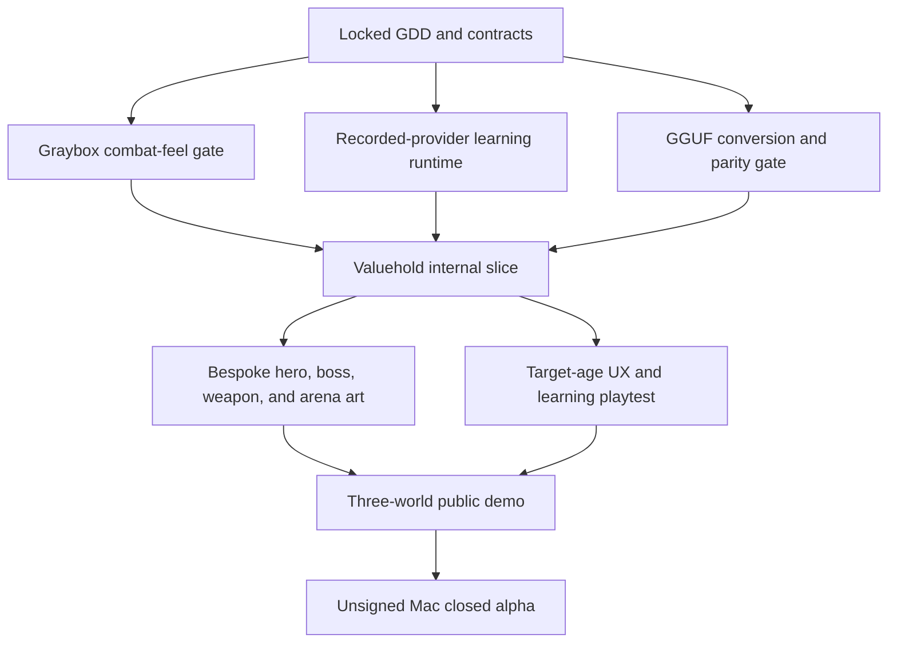

# Wayline Master Product Roadmap

> **For agentic workers:** REQUIRED SUB-SKILL: Use superpowers:subagent-driven-development (recommended) or superpowers:executing-plans to implement this plan task-by-task. Steps use checkbox (`- [ ]`) syntax for tracking.

**Goal:** Build a polished Mac-first three-world demo of an original 2.5D science-fantasy weapon fighter in which the released Qwen distractor SLM powers live, verified, adaptive post-battle mathematics.

**Architecture:** Unity owns combat, presentation, campaign flow, and public UI. A packaged loopback Wayline Forge service owns exact questions, sealed scoring, the local Qwen GGUF worker, strict verification, reviewed fallback, learner evidence, and progression gates; optional Sonnet supplies bounded nonpersonal story wording only. The full campaign map has nine worlds, while the public demo ships Valuehold Reach, Decimara Basin, and Fracture Isles.

**Tech Stack:** Unity `6000.3.11f1`, URP, C#, Input System, Unity Test Framework, Python 3.12, FastAPI, Pydantic v2, SQLite, `llama.cpp` Metal, merged Qwen3-4B `Q4_K_M` GGUF, the released `j2ampn/qwen3-4b-distractor-lora-v7` adapter, Blender/FBX, and optional TrueFoundry/Sonnet.

## Global Constraints

- Target macOS Apple Silicon first; Windows, mobile, and multiplayer are excluded from the demo.
- Preserve the dirty worktree and all legacy Glitch Rally, Counterfeit Protocol, and Kilnline files.
- Do not import `src/buggy_procedures.py` into the product runtime.
- Never show raw or merely plausible model output to a learner.
- Never fabricate a wrong count; allow exactly one whole-batch revision.
- A selected distractor is evidence for a hypothesis, never proof of a child's thinking.
- Quiz lengths are fixed by battle tier: `3 / 4 / 4 / 5 / 8`; final campaign boss `10`.
- Combat is nonlethal E10+/PEGI 7 with no blood, gore, humiliating feedback, or copied game assets.
- Do not place TrueFoundry or Hugging Face credentials in Unity, the app bundle, logs, or source control.
- Do not create a paid GPU service, Apple membership, asset purchase, or other expense without explicit owner approval.
- During implementation, do not stage, commit, or push until the owner separately authorizes those git actions.

---

## Controlling specifications

- `docs/wayline/WAYLINE_MASTER_GDD.md`
- `docs/wayline/WAYLINE_LEARNING_AND_RUNTIME_SPEC.md`
- `docs/wayline/WAYLINE_ART_ANIMATION_ASSET_BIBLE.md`
- `docs/wayline/WAYLINE_HIGGSFIELD_OPENING_BRIEF.md`
- `docs/wayline/SUPERSESSION_INDEX.md`
- `docs/superpowers/plans/2026-07-11-wayline-learning-runtime.md`
- `docs/superpowers/plans/2026-07-11-wayline-unity-vertical-slice.md`
- `docs/superpowers/plans/2026-07-12-wayline-opening-and-living-atlas.md`

## Repository boundaries

```text
contracts/wayline/v1/                Cross-runtime schemas and fixtures
services/wayline_forge/              Packaged learner-safe runtime
data/wayline/                         Product curriculum, references, and cache inputs
unity/Wayline/                        New Unity project
docs/wayline/                         Authoritative product/design specifications
game/                                 Preserved legacy browser prototype
src/                                  Preserved SLM research and offline content tooling
```

## Dependency map



## Milestone 0: Feasibility gates

- [ ] **Freeze the v1 contract set.** Execute Tasks 1–2 of the learning-runtime plan and Task 1 of the Unity plan. Exit only when Python and Unity reject the same invalid fixtures.
- [ ] **Prove local model parity.** Export one pinned merged GGUF, test all six owner-approved encounters plus the 60-prompt product reference set, and reject any artifact that changes an approved procedure mapping or regresses product-gate rates by more than five percentage points.
- [ ] **Prove combat feel in graybox.** Two capsules with untextured humanoid rigs must complete a three-minute splitstaff-versus-lance duel at 60 fps with readable anticipation, contact, recovery, block, parry, dodge, knockout, and no camera-plane loss.
- [ ] **Stop/go review.** Do not commission a hero, bosses, or arenas until both the model and combat gates pass. If local model latency exceeds the ten-second bounded batch deadline, keep the direct local SLM but increase pre-generation/cache coverage rather than displaying unsafe output.

## Milestone 1: Internal Valuehold slice

- [ ] Execute the learning-runtime plan through the complete batch API, evidence reducer, boss gate, local save, recorded provider, live GGUF provider, and reviewed fallback.
- [ ] Execute the Unity plan through title/profile, hero appearance selection, world map, five Valuehold fights, five trial batches, one revision flow, boss gate, Seal Trial, Second Wind, and resume-after-quit.
- [ ] Integrate the starting splitstaff, folding lance, Surveyor-General, Valuehold graybox-to-final arena, first HUD, atlas trial UI, VFX, audio, text scaling, reduced motion, and macOS text-to-speech.
- [ ] Add one Decimara and one Fracture exhibition duel using graybox environments to prove that campaign data, weapon switching, and topic switching are data-driven.
- [ ] Pass a new-profile 45-minute soak with zero soft locks, unverified items, false wrong counts, duplicate revision opportunities, or lost events.

## Milestone 2: Three-world public demo

- [ ] Produce the Tide Marshal, Chain Warden, pivot sabers, counterweight chain, Decimara arena kit, and Fracture arena kit to the asset-bible acceptance rules.
- [ ] Author and validate five fights per world, including 72 normal-world question slots across the three-world path (`24 × 3`) plus Second Wind and Seal Trial fallback pools.
- [ ] Build a reviewed fallback cache with at least 16 distinct verified bundles for each demo launch-core skill plus eight cross-world transfer bundles, no adjacent template repeats, and full frozen-holdout exclusion receipts.
- [ ] Run target-age usability sessions focused on combat readability, confidence wording, the exact-count review concept, feedback comprehension, and fatigue. Record observed behavior rather than asking only whether players “liked it.”
- [ ] Complete privacy, model-license, third-party-asset, accessibility, originality, generation-soak, frame-time, memory, and clean-machine reports.
- [ ] Package an ad-hoc signed/unsigned Apple-Silicon test build and provide explicit Gatekeeper opening instructions. Do not call it a notarized retail release.

## Milestone 3: Nine-world campaign

- [ ] Expand only one world at a time after its launch-core procedures have topic-specific validation and fallback depth.
- [ ] Train/evaluate new data before enabling the 19 thin or zero-row expansion skills listed in the GDD.
- [ ] Require a per-topic reviewed benchmark, not the global 60% aggregate, before a new skill is live.
- [ ] Add the world, boss, weapon, arena, narrative, transfer schedule, and later-session evidence tests as one release unit.
- [ ] Add cloud accounts only through a separate child-privacy and data-migration plan.

## Parallel work after contracts freeze

Four non-overlapping lanes may work concurrently:

| Lane | Owns | Must not edit |
| --- | --- | --- |
| Runtime | `contracts/wayline`, `services/wayline_forge`, `data/wayline/runtime` | Unity scenes/art |
| Combat | Unity combat/input/AI/camera/tests | Runtime Python and final art |
| Learning UI | Unity learning client/UI/save/tests | Combat simulation and Python authority |
| Art/content | `docs/wayline`, Unity Art/Audio/Prefabs/Scenes, reviewed content inputs | Contracts, scoring, evidence rules |

Every lane consumes frozen contract fixtures. Only the integration owner changes shared bootstrap/build files after lane handoff.

## Release acceptance

The demo is accepted only when:

1. Three worlds and fifteen fights are completable from a new local profile.
2. Every initial submission returns the truthful exact count; every nonzero batch permits one and only one revision.
3. All child-facing distractors are either live verified or reviewed-cache verified, with receipts.
4. The SLM is visibly central in the owner-only `Behind the Meridian` audit view without exposing secrets or learner identity.
5. Combat holds 60 fps at 1080p on the owner Mac and model work is absent from active combat frames.
6. The app resumes safely after quit at every battle/trial transition.
7. Target-age players can explain the confidence and review mechanic without the word “gaslight” or a belief that the game lies.
8. Art, animation, UI, audio, title, and move set pass originality review.
9. All shipped assets and models have license/provenance records.
10. The build and its limitations are described honestly: UK Eedi Number ages 10–13, local profiles, Mac Apple Silicon, and unsigned closed-alpha distribution under the current zero-dollar constraint.

## Execution handoff

Recommended execution is subagent-driven after a clean ownership map is agreed. Start with the contract, local-model, and combat-feel gates; review each before authoring production assets. No implementation task in the two detailed plans authorizes a commit, push, paid service, or external publication by itself.
