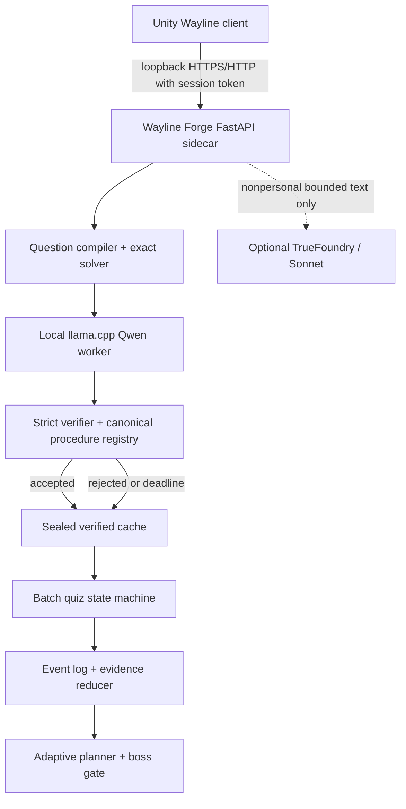

# Wayline Learning and Runtime Specification

**Authority:** Supplements `WAYLINE_MASTER_GDD.md`  
**Runtime target:** macOS Apple Silicon, Unity `6000.3.11f1`, local loopback service, local Qwen GGUF  
**Model:** `j2ampn/qwen3-4b-distractor-lora-v7` over Qwen3-4B  

## Implementation and release status

The deterministic learning runtime, authenticated FastAPI routes, SQLite stores,
fresh assisted route, macOS worker/process safeguards, Unity typed clients/controllers,
Python 3.12 hash lock, PyInstaller specification, and fail-closed package
assembler/auditor are implemented and covered by automated tests. A local arm64
PyInstaller onedir output exists at `services/wayline_forge/dist/WaylineForge/`, but it
is an intermediate build rather than a releasable runtime.

The packaged executable entry point now injects a production composition root, but that
factory validates every immutable artifact and fails closed when the release inputs are
absent. The generic launcher still defaults to `live_runtime_unavailable`. No production
model manifest, GGUF, pinned `llama-server`, artifact-specific descriptor-binding release
receipt, Wayline bundle index, reviewed-cache release, or assembled
`package_manifest_v1.json` exists in the repository. The target topology and
live-generation policies below therefore describe the release design, not a claim that
local live inference is currently enabled.

## Non-negotiable model boundary

The SLM receives a trusted question, trusted correct answer, and topic. It proposes exactly three distractors with misconception labels and computations. It does not create authoritative questions, solve the correct answer, score a learner, confirm a diagnosis, choose progression, or decide what the player studies next.

The final model's aggregate judged consistency is about 60%, so raw output is never learner-facing. A live set must pass an exact product verifier; otherwise the whole set is rejected and a reviewed same-skill fallback is used.

## Authority table

| Concern | Sole authority |
| --- | --- |
| Operands, operation, skill, difficulty | Deterministic question compiler |
| Correct answer and trusted steps | Exact solver |
| Candidate distractors and error wording | Qwen distractor SLM |
| Whether a candidate is safe and mathematically bound | Product procedure registry and verifier |
| First/final correctness and exact wrong count | Server-side sealed answer key |
| Misconception evidence state | Deterministic evidence reducer |
| Next skill/probe slot | Deterministic adaptive planner |
| Boss access and world clear | Deterministic gate service |
| Optional NPC flavor and bounded rewording | Sonnet or authored-template fallback |
| Combat outcome | Unity fixed-tick combat simulation |

## Target runtime topology



Unity never receives the answer key, procedure mapping, raw model output, or misconception evidence before the final reveal. It receives opaque option IDs and public display text.

## TrueFoundry conclusion

Static repository configuration proves a TrueFoundry OpenAI-compatible gateway defaulting to `claude-sonnet-5`. It contains no Qwen deployment identifier, GPU endpoint, worker URL, upload flow, or custom-serving manifest. Therefore the plan does not assume the account can host the SLM.

The public client must never contain `TFY_API_KEY`. Owner showcase builds may let the local Python sidecar read `.env`. A future public Sonnet feature requires a server-side proxy with approved cost, retention, and child-privacy terms. The game remains complete with authored narrative templates when that proxy is absent.

## Trusted question pipeline

### Question blueprint

Every generated question is a sealed typed record:

```text
QuestionBlueprint
  schema_version
  question_id
  world_id
  skill_id
  family_id
  template_id
  template_revision
  operands
  solver_spec
  canonical_answer
  trusted_steps
  allowed_procedure_ids
  difficulty_vector
  context_seed
  holdout_exclusion_receipt
  content_sha256
```

The compiler samples bounded operands from a stable seed, rejects degenerate or ambiguous cases, solves exactly with `Fraction` or `Decimal`, renders one canonical question, and checks its normalized fingerprint and similarity against the frozen 140-item holdout.

`src/buggy_procedures.py` remains training-only. The product procedure registry is a separately versioned, audited implementation. Parity tests may compare overlapping formulas, but shipped runtime code does not import the training engine.

### Sonnet story skin

Sonnet may receive only:

- world and NPC style IDs;
- a bounded reading-level instruction;
- a story-frame ID; and
- symbolic placeholders such as `{A}`, `{B}`, and `{UNIT}`.

It may return a short setting sentence containing exactly the required placeholders. Deterministic code inserts operands after validation. It may not change the operation, numbers, answer, skill, difficulty, or procedure routes. On timeout, logging uncertainty, placeholder mismatch, unsafe wording, or excess length, the authored template is used.

## SLM request and verification

### Pinned request

- Base and adapter use immutable Hugging Face commit SHAs.
- Inference is deterministic with thinking disabled.
- Prompt text and generation parameters are hashed into a receipt.
- The Mac runtime uses a merged, quantized `Q4_K_M` GGUF only after parity tests pass.

### Acceptance algorithm

For every candidate set:

1. Recompute the correct answer from the sealed blueprint.
2. Validate model, adapter, GGUF, prompt, registry, and generator receipts.
3. Strictly parse one JSON object with exactly three distractors and no duplicate keys.
4. Parse each answer with the safe numeric parser; reject unsupported syntax or display text.
5. Reject a correct-key collision, duplicate answer, duplicate procedure, NaN/infinity, unbounded value, or unsafe text.
6. Execute every procedure allowed for the blueprint.
7. Require each proposed answer to match exactly one allowed procedure output.
8. Require the model label to match an audited alias for that procedure.
9. Discard the model's display computation and explanation; render canonical versions from the product registry.
10. Reject the entire set if any answer maps to zero or multiple procedures.
11. Seal the accepted set with content and provenance hashes.
12. After two bounded live attempts or the latency deadline, return a reviewed same-skill cache bundle.

Passing this gate means the displayed option is internally safe for the supported procedure family. It does not prove that it is the most common real student error.

## Live-generation policy and latency

- Generate the next batch after the previous trial has resolved, during world-map, route-briefing, loading, or victory presentation—not during timing-critical combat.
- Keep one local llama.cpp worker and at most one active completion. Unified-memory contention must not compromise combat frame time.
- Target a complete live batch by the end of the route briefing.
- At 8 seconds, fill unresolved slots from the reviewed same-skill cache. At 10 seconds, return the complete fallback batch and cancel remaining work.
- Prefer at least one accepted live SLM item per healthy batch; every fallback item must still carry SLM provenance from its reviewed generation run.
- Never show “AI failed,” a spinner without a bounded exit, or a lower-quality unverified item.

## Public quiz API

```text
POST /v1/profiles
POST /v1/sessions
POST /v1/quiz-batches
GET  /v1/quiz-batches/{batch_id}
POST /v1/quiz-batches/{batch_id}/initial
POST /v1/quiz-batches/{batch_id}/revision
GET  /v1/worlds/{world_id}/gate
POST /v1/worlds/{world_id}/seal-trials
POST /v1/worlds/{world_id}/assisted-routes
POST /v1/worlds/{world_id}/assisted-routes/{route_id}/completion
POST /v1/worlds/{world_id}/battles/{battle_id}/quiz-batches/{batch_id}/completion
POST /v1/worlds/{world_id}/seal-trials/{batch_id}/completion
POST /v1/worlds/{world_id}/battles/{battle_id}/combat-attempts/{combat_attempt_id}/second-winds
POST /v1/second-winds/{second_wind_id}/quiz-batches/{batch_id}/completion
POST /v1/second-winds/{second_wind_id}/combat-attempts/{combat_attempt_id}/completion
POST /v1/worlds/{completed_world_id}/successors/{next_world_id}/activation
GET  /v1/runtime-state
GET  /v1/profiles/{profile_id}/export
DELETE /v1/profiles/{profile_id}
```

World, route, battle, batch, Second Wind, and combat-attempt identities are owned
by the path and authenticated server session; command bodies cannot override
them. The assisted route uses a dedicated private store and serves one fresh
worked example plus two fresh keyless supported MCQs. It never reuses revealed
Seal Trial material, and generic quiz endpoints cannot address its route IDs.

### Atomic batch states

```text
preparing -> ready -> initial_locked -> revision_open -> revealed -> closed
                                  \-> revealed (zero wrong)
```

- A batch cannot be submitted until every item has one selected option and one confidence value.
- `initial` is idempotent by request ID. It stores the first pass before returning anything.
- A nonzero result returns only `wrongCount`, `itemCount`, and `revisionRequired=true`.
- The wrong count cannot be polled after individual changes and is not recalculated live.
- Exactly one complete revision payload is accepted.
- `revision` returns item-level final results and the immutable first-pass record.
- Correct answers and mappings remain server sealed until `revealed`.
- Reloading resumes the exact state; it cannot create another revision.

### Fresh assisted route

- Preparation reveals the worked example's trusted answer and method, but no
  supported-item key, procedure, diagnosis, or trusted steps.
- The two supported MCQs require an answer and confidence, then use one
  server-scored submission with no wrong-count or revision phase.
- Completion reveals canonical feedback and clears the already-won world at
  `0/2`, `1/2`, or `2/2`; the boss is never replayed.
- Assisted answers remain in local answer history, but never change unassisted
  procedure, skill, gate, secure-topic, or mastery evidence.
- Exact preparation/completion replays are idempotent. Cross-session recovery
  authenticates the current session while retaining the original sealed route.

## Confidence

Allowed values are exactly:

- `certain`
- `leaning`
- `guessing`

Nothing is preselected. Confidence may be changed during the single revision. It affects evidence priority, never correctness score, rewards, boss damage, public comparison, or punishment.

## Observation events

Every revealed item appends an immutable local event containing:

- profile, session, world, battle, batch, item, template, and content version IDs;
- first and revised opaque option IDs;
- first and revised confidence;
- first and final correctness;
- whether a choice changed and whether self-correction occurred;
- verified procedure ID for a selected distractor, if any;
- exact batch wrong count returned;
- canonical feedback and optional bounded wording actually shown;
- generator, model, adapter, GGUF, verifier, registry, and cache receipts; and
- timestamps and idempotency identifiers.

The local profile remembers the four owner-requested categories: answers, confidence, misconception hypotheses, and explanations shown.

## Evidence reducer

### State definitions

- **Candidate hypothesis:** one compatible wrong selection. Child-facing copy does not name it as a diagnosis.
- **Suspected misconception:** one `Certain` wrong selection, or the same verified procedure on two distinct questions.
- **Active misconception:** the same procedure on two distinct templates with at least one `Certain`/`Leaning`, or on three distinct templates at any confidence.
- **Fragile skill:** first-pass correct while `Guessing`, wrong-to-correct revision, or correct-to-wrong revision.
- **Secure skill:** three distinct first-pass correct responses, at least two `Certain`/`Leaning`, including one changed-context transfer, with no repeated compatible error route in those three.
- **Resolved hypothesis:** three later first-pass correct targeted transfers across at least two quizzes.
- **Mastery:** at least 80% first-pass accuracy on six transfer items across two later sessions. This is not awarded merely for clearing a world.

Wrong-to-correct records self-correction but does not erase the first signal. Keeping the same wrong answer raises that route's priority. Switching between wrong answers marks the diagnosis ambiguous and schedules discrimination between both routes.

### Next-slot priority

1. Active misconception probe.
2. Fragile-skill changed-context item.
3. Under-sampled current-world core skill.
4. Spaced prior-world transfer.
5. Novel current-world item.

Never repeat the same item, operand tuple, or template in adjacent quizzes. Never let Sonnet select the next intent.

## Truthful feedback copy

Allowed first-pass pattern:

> 2 of 5 answers are incorrect. You have one review pass. We won't mark which ones yet.

Allowed final patterns:

- `This answer can come from lining up the digits by their ends instead of by place value.`
- `A reliable method is to align the decimal points first, then subtract by place.`
- `You changed this answer and corrected it on the review pass.`

Banned patterns include `We know you thought`, `Your brain always`, `You failed`, `Easy`, `Careless`, `Gaslight`, fabricated wrong counts, answer leakage before the final reveal, and any unverified personalized claim.

## Boss gate

The approved deterministic rule is:

```text
lead_in_wins == 4
and valid_world_items >= 16
and first_pass_correct_in_latest_10 >= 7
and every_core_subskill_has_correct_after_two_exposures
```

World clear requires combat victory and `final_correct >= 6` for an eight-item boss batch. The campaign finale requires `final_correct >= 8` of 10. A missed threshold creates a three-item Seal Trial; two missed Seal Trials unlock an assisted route with worked examples and reduced operand complexity. It does not replay a won boss.

## Persistence and accounts

### Version 1

- Local SQLite database stored under the macOS Application Support directory.
- Pseudonymous profile UUID plus optional local display name.
- Atomic migrations and backup-before-migration.
- Export and delete controls.
- No cloud sync and no account requirement.

### Later accounts

Cloud accounts are a separate privacy and architecture project. Before implementation they require parental-consent decisions, identity/data separation, retention limits, deletion/export, encryption, incident response, and a documented provider data-flow review. Existing local records are not uploaded silently.

The current `Settings` object derives `profiles/` and `resources/` beneath an explicit
absolute runtime root. Placement of that root in macOS Application Support, migration
from a clean install, and delete-after-upgrade behavior remain package validation gates.

## Model conversion and distribution

1. Pin base and adapter commit SHAs.
2. Merge the adapter with the base in the provided Colab export notebook.
3. Convert to GGUF and quantize `Q4_K_M`.
4. Record licenses, source revisions, conversion tools, command line, tokenizer assets, file size, and SHA-256.
5. Compare the GGUF against the original adapter on a separate 60-prompt product reference set and all six currently owner-approved encounters.
6. Reject conversion if any approved encounter changes its accepted procedure mapping or if structural/product-gate rates regress by more than five percentage points.
7. Package or first-run-download the exact hashed artifact. Never download `latest` without a revision and digest.

Current artifact boundary:

- Present: the export notebook and 60-prompt reference set, immutable receipt-bound
  export-input bundle, strict model-manifest schema and parser, export-input builder,
  hash-locked Python 3.12 environment, PyInstaller onedir sidecar, reviewed-cache
  build/publish code, validated production runtime factory, exact-child spawn adapter,
  descriptor-receipt parser, and package manifest/permission/archive/secret audit code.
- Missing: the production parity outputs and model manifest, Q4_K_M GGUF, pinned and
  licensed Apple-Silicon `llama-server`, Wayline legacy-bundle index, published
  reviewed-cache generation, artifact-specific descriptor-binding release receipt,
  assembled sidecar package, and clean-Mac live smoke.
- A read-only legacy migration audit currently verifies all six owner approvals but
  accepts zero Wayline cache records: the bundle index and model manifest are absent,
  and each legacy prompt is unrepresentable by the current compiler. No cache mutation
  has occurred.

## Security and privacy

- Bind services to `127.0.0.1`, use an ephemeral per-launch token, require the exact configured Unity origin whenever an `Origin` header is present (native Unity requests may omit it), cap bodies, and reject unknown fields.
- Never deserialize executable types, evaluate raw model text, or pass model computations to a shell.
- Redact prompts, raw responses, answers, confidence, and profile identifiers from normal logs.
- Raw SLM proposals are available only in an owner-only audit build and never combined with learner identity.
- TrueFoundry currently enables provider logging in research configuration; learner-mode calls must contain no learner data. Public use additionally requires an approved logging/retention configuration.
- The app remains usable through authored narrative and reviewed SLM cache when internet access is unavailable.

## Required validation

- Contract fixtures pass identically in Python and Unity.
- Property tests cover exact math, degenerate operands, all allowed procedures, and every rejected ambiguity.
- State-machine tests cover duplicate submission, interruption, reload, zero-wrong, one revision, and stale request IDs.
- Evidence replay produces byte-identical derived state from the same event log.
- Privacy tests assert that Sonnet payloads contain no profile, answer, confidence, evidence, operand, correct answer, or model secret.
- A 1,000-item generation soak displays zero unverified items and always returns a bounded fallback.
- Frozen-holdout hashes remain unchanged and no product question crosses the exclusion threshold.

As of 2026-07-12, focused package/runtime tests cover the export-input builder,
reviewed-cache build/publication/loader, model manifest, launcher, macOS worker, and
package-layout auditor. The recorded-provider 1,000-item soak is complete. Live-GGUF
parity, live generation/privacy soak, final-package audit, Unity-to-packaged-sidecar
smoke, and clean-Mac validation remain owner/artifact gates.
