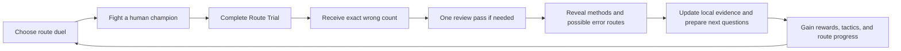

# Wayline: The Broken Meridian — Master Game Design Document

**Status:** Owner decisions locked for planning on 2026-07-11  
**Title:** Working title; complete a trademark and storefront-name check before public release  
**Audience:** Ages 10–13, based on the actual UK Eedi Number corpus rather than a strict US Grade 6 claim  
**Platform:** macOS Apple Silicon first  
**Format:** Single-player, downloadable Unity game; fully 3D assets presented as a side-on 2.5D weapon fighter  

## Product promise

Wayline is a science-fantasy dueling RPG in which an apprentice Routekeeper crosses nine broken territories, defeats their human champions, and reconnects a celestial navigation network. Combat is the fantasy; short post-battle Route Trials are the learning system. The player's own Qwen3-4B distractor SLM creates the tempting wrong choices and candidate misconception routes used by those trials.

The game is not a clone of an existing fighter. It uses original characters, silhouettes, world lore, UI, weapons, timing, progression, and presentation. It also does not claim that one answer reveals a child's thoughts. A selected distractor creates a hypothesis that must be checked on a different question.

## Locked decisions

- Nine-world campaign, launched first as a polished three-world public demo.
- Wayline / Broken Meridian visual direction: believable science fantasy, floating territories, human factions, luminous meridian technology.
- Fully 3D characters and arenas constrained to a readable 2.5D combat plane.
- Five fights per world with quiz sizes `3 / 4 / 4 / 5 / 8`; the final campaign boss uses `10`.
- Four authored Routekeeper appearances on one shared rig, with cosmetic customization.
- E10+/PEGI 7 tone: no blood, gore, lethal finishers, or humiliation.
- Every world introduces a weapon family; any unlocked weapon remains player-selectable.
- Truthful exact wrong-count feedback, one full-batch revision, then item-level feedback.
- Confidence is recorded as `Certain`, `Leaning`, or `Guessing`.
- Local profiles in the first release; accounts are a later project.
- Internet may be required, but the Mac-first SLM runtime is local to avoid a GPU-hosting bill.

## Why a player voluntarily does the mathematics

The Route Trial is not a disconnected worksheet or a punishment for losing. It closes the battle's story and gives the player more control in the next duel.

1. **Competence:** combat teaches readable weapon matchups; trials teach readable reasoning patterns. Improvement is visible in both.
2. **Agency:** every completed trial grants a base reward. Strong or self-corrected reasoning adds capped tactical choices, not raw permanent dominance.
3. **Curiosity:** the exact wrong count creates a brief, honest uncertainty puzzle: “Which choices can I defend?”
4. **Collection:** victories unlock essential weapon families; trials unlock sidegrade techniques, armor dyes, meridian inlays, and optional tactical preparations.
5. **Narrative consequence:** repaired route seals visibly reconnect the world map, arena machinery, and the hero's atlas-bracer.
6. **Respect:** mistakes never remove currency, extend later quizzes, erase streaks, or trigger taunts.

## Core loop

### One world

| Battle tier | Fictional role | Questions | Purpose |
| --- | --- | ---: | --- |
| Fight 1 | Scout | 3 | Introduce two current-world skills plus one prerequisite |
| Fight 2 | Rival | 4 | Current skills, one changed-context item, one review item |
| Fight 3 | Warden | 4 | Current skills plus one misconception-discrimination probe |
| Fight 4 | Lieutenant | 5 | Three current skills, one probe, one spaced-transfer item |
| Boss | Route Champion | 8 | Five world-skill items, up to two unresolved probes, one prior-world transfer |
| Campaign finale | Meridian Regent | 10 | Six campaign skills, two unresolved probes, two cross-world transfers |

Quiz length is determined by battle stakes, never by weakness. Adaptation changes the content of a slot, not how many questions a struggling player must answer.

## Campaign map

The nine worlds cover all 34 configured Eedi Number labels as a long-term map. Only the 15 procedure families with meaningful synthetic `train_v7` coverage are launch-core content. Expansion skills remain locked until new data, topic-specific evaluation, and reviewed fallbacks pass release gates.

| World | Launch-core mathematics | Later expansion after evidence gate | Visual identity | Introduced weapon |
| --- | --- | --- | --- | --- |
| **1. Valuehold Reach** | Place Value; Mental Addition/Subtraction | None required for the initial map | High stone terraces, survey bridges, sunlit coordinate monuments | Folding Lance |
| **2. Decimara Basin** | Decimal Addition/Subtraction | Ordering Decimals | Storm-fed basins, reflective channels, calibrated tide gates | Pivot Sabers |
| **3. Fracture Isles** | Fraction Addition/Subtraction | Equivalent, Simplifying, Ordering, and Mixed/Improper Fractions | Split floating islands, suspended causeways, fractured masonry | Counterweight Chain |
| **4. Roundglass Expanse** | Decimal Multiplication/Division; Rounding to Decimal Places | Nearest-Whole Rounding, Significant Figures, Estimation | Refractive desert observatory, measured light rings | Mirror Buckler |
| **5. Reciprocal Deep** | Fraction Multiplication/Division | Fractions of Amounts, Fraction↔Decimal, Recurring Decimal→Fraction | Inverted caverns, mirrored lifts, reversible bridges | Reversal Glaive |
| **6. Hundredfold Citadel** | Percentages of an Amount; Decimal↔Percentage | Fraction↔Percentage; Percentage Increase/Decrease | Layered market-city, repeated banners, hundred-window towers | Inertia Gauntlets |
| **7. Minus Meridian** | Negative Addition/Subtraction | Ordering and Multiplying/Dividing Negatives | Polar frontier above and below a glowing zero-line | Polarity Shield-Blade |
| **8. Factor Forge** | Mental Multiplication/Division; Factors/HCF | LCM, Squares/Cubes, Roots | Modular volcanic foundry whose parts lock into common rhythms | Modular Hammer-Tonfas |
| **9. Order Spire** | BIDMAS; Laws of Indices | Standard Form | Celestial route machine above the clouds, nested rotating rings | Meridian Routeblade |

Launch-core labels do not imply full curriculum breadth. The first live compiler is deliberately limited to the trained shapes: decimal multiplication begins with `0.p × 0.q`; fraction division is `a/b ÷ integer`; negative-number work begins with `-a + b`; BIDMAS begins with `a + b × c`; rounding begins at one decimal place; and indices begin with same-base multiplication. Broader shapes remain behind the same evidence gate as the listed expansion skills.

### Three-world public demo

The demo contains Valuehold Reach, Decimara Basin, and Fracture Isles. It is delivered in two gates:

1. **Internal vertical slice:** all five Valuehold fights plus one exhibition duel from each later demo world.
2. **Public demo:** all fifteen fights, three bosses, three arenas, four hero appearances, four usable weapon families, local persistence, live SLM generation, and reviewed fallback content.

This sequencing gets a complete, judgeable product loop working before multiplying art and content.

## Story

The Meridian is a continent-scale navigation machine that keeps floating territories connected. Its routes begin rewriting themselves during the hero's first courier crossing. Nine distant route seals fail, trade routes fold, and regional champions isolate their territories rather than risk further collapse. The hero's damaged atlas-bracer retains one stable line and can restore each seal by earning the trust—or defeating the resistance—of its Route Champion.

The antagonist is not “bad at math.” The conflict concerns control of the Meridian, autonomy between territories, and whether one system should dictate every route. Mathematical content stays primarily in the Route Trial layer; world names, mechanisms, and motifs echo each topic without turning arenas into giant worksheets.

## Characters

### Player Routekeeper

- Four authored face/hair/skin-tone appearance sets on one shared humanoid skeleton.
- Player-entered local display name; the protagonist is not forced into a named canon identity.
- Cosmetic choices: mantle cut, two armor-dye channels, meridian inlay color, hair preset, and face preset.
- One animation set works across all appearances and armor combinations.
- The atlas-bracer begins dark and gains a colored route inlay after each world clear.

### Opponents

- Primarily human champions, scouts, rivals, and wardens.
- Every faction has a clear geometric silhouette and fighting philosophy.
- Opponents concede, are disarmed, or are knocked down; they are not killed.
- Bosses demonstrate the weapon family the player earns from that world.

## Combat design

### Presentation

- Perspective 3D camera with fighters constrained to one combat plane.
- Backgrounds retain full depth, parallax, crowds, weather, and route machinery.
- Short camera offsets and up to a controlled 20-degree orbit are allowed during introductions, supers, and victory poses; gameplay returns to the side-on readability plane before control resumes.
- Simulation is fixed at 60 Hz and independent of rendered animation.

### Controls

| Input | Action |
| --- | --- |
| Left / Right | Walk and dash |
| Down | Crouch / low profile |
| Light | Fast weapon chain |
| Heavy | Committed guard-breaking attack |
| Guard | Block; timed press creates a parry |
| Dodge | Short invulnerable reposition with recovery |
| Technique | Weapon-specific sidegrade fueled by earned Focus |

Keyboard and controller are both first-class. Combat never depends on quiz correctness for basic input speed, damage, or enemy health.

### Fairness

- Every dangerous boss action has a distinct anticipation silhouette and audio cue.
- No pay-to-win, ads, loot boxes, energy timers, or premium revive currency.
- Essential weapons unlock through combat victory.
- Trial performance grants capped preparation choices such as one clearer telegraph, a small opening guard, or an alternate technique—not permanent statistical superiority.
- A knockout offers `Retry now` and a three-question `Second Wind` with equal visual weight. Completing Second Wind revives at 35% health regardless of correctness; correct final answers add up to 15% temporary shield. It replaces that fight's normal post-battle trial.

## Route Trial experience

1. The arena quiets and the hero's atlas-bracer unfolds into a full-screen route arc.
2. Every item requires an answer and `Certain`, `Leaning`, or `Guessing`.
3. The first submission is permanently recorded.
4. If all answers are correct, the game says `0 of N answers are incorrect`, reveals solutions, and skips revision.
5. Otherwise it says exactly `N of M answers are incorrect. You have one review pass. We won't mark which ones yet.`
6. Every item remains visually neutral. The player may change any answer and confidence once.
7. The final reveal shows first and revised choices, correctness, a trusted method, and wording such as `This answer can come from...` rather than claiming to know the player's thoughts.
8. The deterministic evidence system chooses later skill and probe slots. Sonnet does not decide adaptation.

## Progression gates

### Boss access

The player must:

- win the four lead-in fights;
- complete at least 16 valid questions in that world;
- answer at least 7 of the latest 10 world items correctly on the first pass; and
- produce at least one first-pass correct response in every core subskill after at least two exposures.

If the threshold is short, the player receives a three-question targeted Seal Trial. Combat victories remain preserved.

### World clear

- Defeat the boss in combat.
- Score at least 6/8 after the single boss revision.
- For the ten-question campaign finale, score at least 8/10 after revision.
- After two unsuccessful Seal Trials, offer one fresh worked example and two reduced-complexity supported MCQs. Completing this one-shot assisted route clears the already-won world at any score without adding mastery evidence. Do not create an infinite lock for an 11–12-year-old player.
- Use `World Cleared`, not `Topic Mastered`. `Topic Secure` and `Mastery` are reserved for stronger longitudinal evidence.

## Rewards and economy

- **Route Marks:** guaranteed battle-completion currency for cosmetics and non-statistical customization.
- **Focus:** capped tactical preparation earned from first-pass correct answers and wrong-to-correct self-corrections. Errors never subtract Focus.
- **Weapon unlocks:** guaranteed by combat victory and world completion.
- **Technique variants:** sidegrades unlocked through world evidence, never mandatory raw-damage upgrades.
- **Cosmetics:** armor dyes, mantle patterns, route inlays, victory poses, and weapon finishes.

## Visual identity

- Signature: one luminous meridian line physically continues through environments, weapons, the world map, selection focus, loading transitions, and quiz progression.
- Palette: night ink `#151B26`, lapis `#253B66`, storm teal `#2D7F83`, oxide `#A5432F`, meridian gold `#E6AF3B`, limestone `#D7D1C2`.
- Type: Big Shoulders Display for chapters, Atkinson Hyperlegible for reading, IBM Plex Mono for mathematics and measurements. Verify and record each font's OFL license before import.
- Armor: travel cloth under curved topographic plates, asymmetrical mantle, colored route inlays, uncovered expressive faces.
- The game never uses black silhouettes as its defining character treatment.

## Safety, privacy, and accessibility

- No blood, dismemberment, lethal finishers, shame, taunts about mistakes, public rankings, or confidence penalties.
- No timers on mathematics by default.
- No generated output reaches the child without deterministic validation or a reviewed-cache fallback.
- A selected distractor is a candidate misconception, not proof of reasoning.
- Local pseudonymous profiles only in v1. No child name, answer history, confidence, profile ID, or IP address is sent to Sonnet.
- Every state has text/icon differentiation; correctness and confidence never rely on color alone.
- Full keyboard/controller navigation, remappable controls, subtitles, text-size options, reduced camera motion, reduced flashes, hit-stop reduction, and macOS text-to-speech for quiz content.

## Release gates

The public demo is not “done” until all are true:

- A complete new profile can clear three worlds and resume after every battle boundary.
- No unverified model output is displayed in 1,000 generated-item soak attempts.
- Exact wrong counts remain correct under interruption, reload, repeated submission, and network/model failure.
- A failed live generation reaches a same-skill reviewed fallback without exposing the failure to the learner.
- Combat holds 60 fps at 1920×1080 on the owner Mac during all playable scenes; model inference never runs during a timing-critical combat phase.
- All attack contact, foot planting, and boss telegraph acceptance tests pass without VFX masking weak poses.
- The demo contains no copied character, UI, arena, audio, move-list, progression, or narrative assets from another game.
- The unsigned no-cost Mac build is clearly labeled for closed testing. A polished notarized public Mac release requires an Apple Developer membership and is not silently promised within the zero-dollar constraint.

## Explicit first-demo exclusions

- Windows, mobile, multiplayer, cloud accounts, social features, open-ended AI chat, voice input, free-response grading, procedural 3D asset generation, all nine finished worlds, and unvalidated thin Eedi topics.
- Sonnet-authored mathematical truth or adaptation decisions.
- A permanent always-online Qwen host.
- Any claim that the SLM is 100% reliable or beats Sonnet overall.
